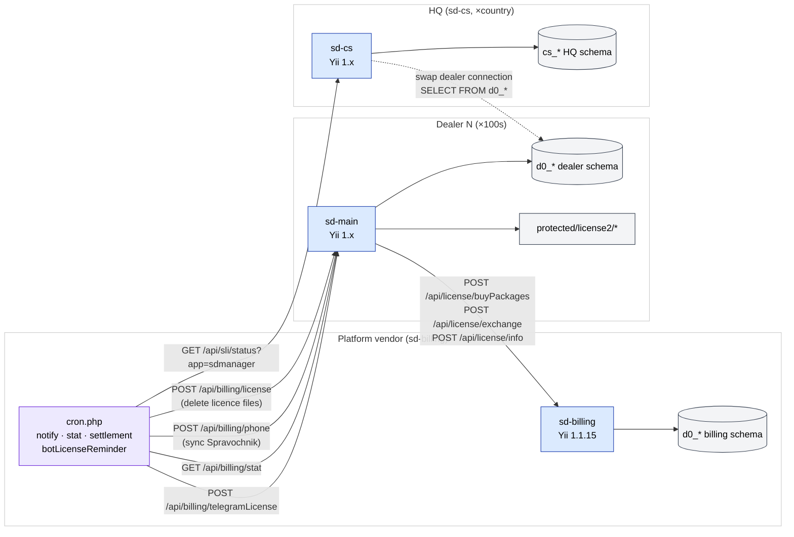
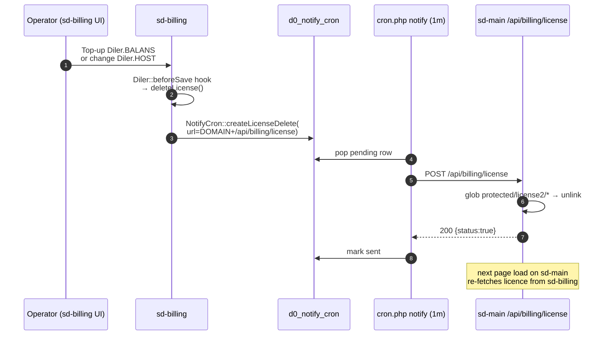
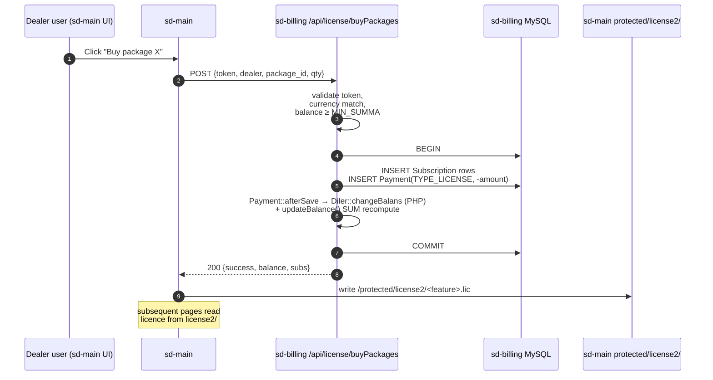
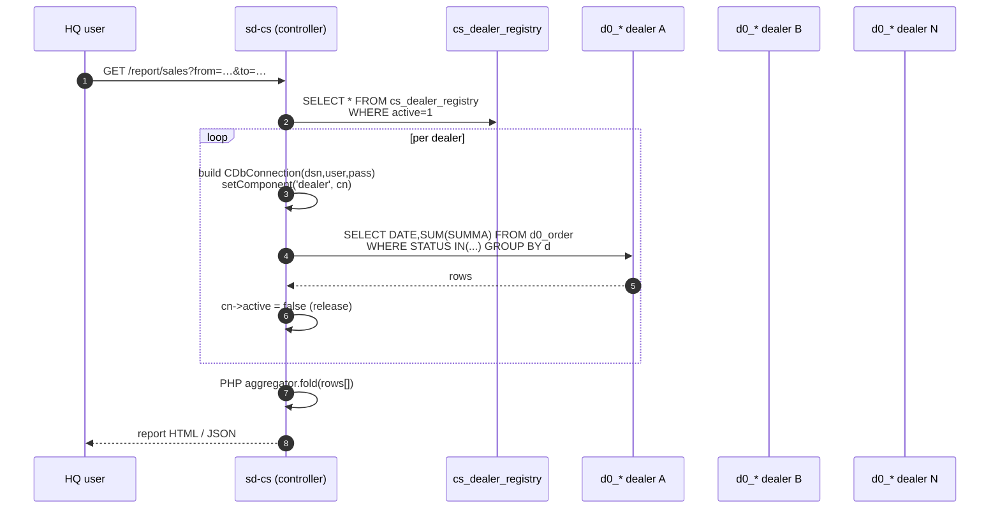
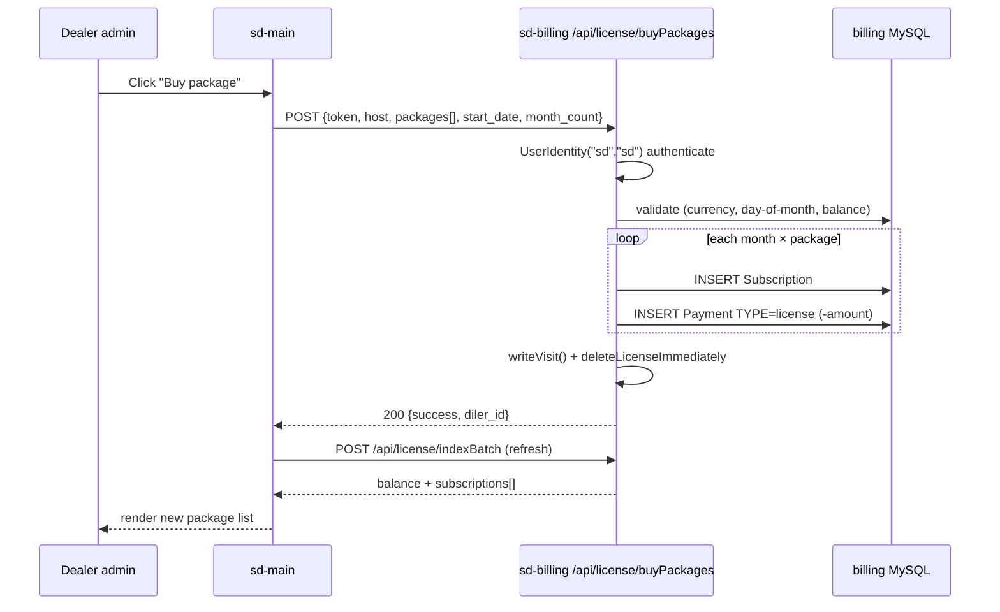
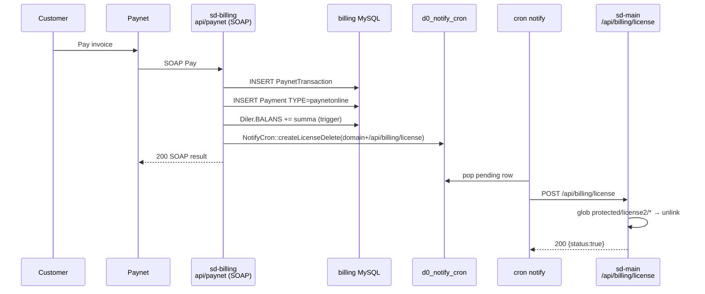
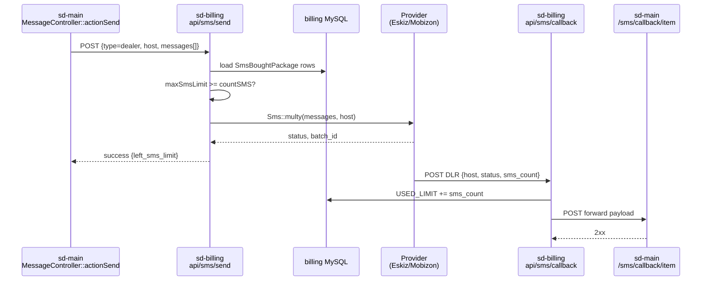

# Cross-project integration

The SalesDoctor platform is three Yii 1.x services that talk to each other
across HTTP and direct MySQL connections. This page is the single source of
truth for **every** wire between them. Anything that involves more than one
project belongs here; per-project specifics live in their own sections.

> Read the [ecosystem overview](../ecosystem.md) first if you don't yet have
> a mental model of who runs what. This page assumes that context.

## 1. Topology



| # | From → To | Channel | Direction | Schedule |
|---|-----------|---------|-----------|----------|
| 1 | sd-billing → sd-main | HTTP `POST` | push | event-driven (cron `notify`, balance change) |
| 2 | sd-billing → sd-main | HTTP `POST /api/billing/phone` | push | manual / on demand |
| 3 | sd-billing → sd-main | HTTP `GET /api/billing/stat` | pull | daily 03:00 (`StatCommand`) |
| 4 | sd-billing → sd-main | HTTP `POST /api/billing/telegramLicense` | push | daily 09:00 (`BotLicenseReminderCommand`) |
| 5 | sd-main → sd-billing | HTTP `POST /api/license/*` | pull | per dealer action (UI / cron in dealer) |
| 6 | sd-cs → sd-main DB | MySQL TCP | read | per HQ report request |
| 7 | sd-billing → sd-cs | HTTP `GET /api/sli/status` | health | polled |

---

## 2. sd-billing → sd-main

The vendor side controls the lifecycle of every dealer's `sd-main`. It does
this by holding a **`Diler` row** with the dealer's `HOST`/`DOMAIN` and
hitting a small surface on that host whenever the subscription state
changes.

### 2.1 Endpoints exposed by sd-main

All under `protected/modules/api/controllers/BillingController.php`:

| Action | Method | What it does | Caller |
|--------|--------|--------------|--------|
| `actionLicense` | `POST /api/billing/license` | Deletes every file under `protected/license2/` — kills the dealer's licence cache so the next page load forces a re-fetch from sd-billing | `Diler::beforeSave` (via `NotifyCron::createLicenseDelete`) |
| `actionPhone` | `POST /api/billing/phone` | Pulls the central Spravochnik via `Report::getSpravochnik()` and overwrites local `User.TEL` for agents/expeditors/partners | sd-billing dashboard / cron |
| `actionStat` | `GET /api/billing/stat?from=…&to=…` | Returns daily totals (orders, agents, clients) for the dealer | sd-billing `StatCommand` |
| `actionTelegram` | `POST /api/billing/telegram` | Registers a Telegram group (`chat_id`, `group_name`, `nick`) for the dealer's report bot | sd-billing |
| `actionTelegramLicense` | `POST /api/billing/telegramLicense` | Tells sd-main which bot features (`bot_order`, `bot_report`) are licence-denied so the bot stops responding | `BotLicenseReminderCommand` (cron, 09:00) |
| `actionStatus` | `GET /api/billing/status` | Health probe | monitoring |
| `actionLicenseInfo` | `GET /api/billing/licenseInfo` | Inspects current cached licence file | dealer-side debug |

> Authentication for these endpoints is **IP allow-list based** in production
> (see `Http::getRemoteAddress()` checks). Migrate to signed tokens — listed
> in [sd-main landmines](../security/sd-main-landmines.md).

### 2.2 sd-billing-side trigger points

| Event in sd-billing | Code path | Resulting call |
|---------------------|-----------|----------------|
| `Diler` host change | `Diler::beforeSave` → `Diler::sendRequest()` → `Server::createServer()` | Provisions a fresh dealer DB on demand |
| Subscription bought / balance change | `Diler::deleteLicense()` → `NotifyCron::createLicenseDelete($this->DOMAIN.'/api/billing/license')` | Queues a delayed `POST` so dealer's cached licence is invalidated |
| Daily 03:00 (`StatCommand`) | `cron.php stat` | `GET /api/billing/stat` for each active dealer |
| Daily 09:00 (`BotLicenseReminderCommand`) | `cron.php botLicenseReminder` | `POST /api/billing/telegramLicense` for dealers nearing/over expiry |

### 2.3 Sequence — licence push (most common)



---

## 3. sd-main → sd-billing

Whenever a dealer needs to verify their licence, buy a package, or exchange
unused subscription days, sd-main calls back into sd-billing. Every call
carries a hard-coded shared token.

### 3.1 Endpoints exposed by sd-billing

All under `protected/modules/api/controllers/LicenseController.php`. Auth:

```php
const TOKEN = "2Mhoba9PjqmBBY7srSrRciAvdbAB3ALG";  // shared, hard-coded
```

> ⚠️ Hard-coded shared secret — see [sd-billing landmines](../sd-billing/security-landmines.md). All endpoints check `$_POST['token']` against this constant and `400` on miss.

| Action | Method | Purpose |
|--------|--------|---------|
| `actionIndex` | `POST /api/license` | Legacy — return balance, min-summa, credit limit. Marked "we should delete it" in code. |
| `actionIndexBatch` | `POST /api/license/indexBatch` | Same as above for multiple dealers. |
| `actionPackages` | `POST /api/license/packages` | List packages available to this dealer (filtered by country, currency, demo flags). |
| `actionBotPackages` | `POST /api/license/botPackages` | Same but only `bot_order`/`bot_report` packages. |
| `actionHalfPackages` | `POST /api/license/halfPackages` | Half-month / partial packages. |
| `actionBuyPackages` | `POST /api/license/buyPackages` | **Charge the dealer's BALANS, create `Subscription` rows + a negative `Payment` of TYPE_LICENSE.** |
| `actionChangePackage` | `POST /api/license/changePackage` | Swap an active subscription for a different package, prorating the days. |
| `actionRevise` | `POST /api/license/revise` | Reconciliation snapshot for a date range. |
| `actionPayments` | `POST /api/license/payments` | Recent payment history for the dealer. |
| `actionCheckMin` | `POST /api/license/checkMin` | Verify dealer balance ≥ MIN_SUMMA. |
| `actionBonusPackages` | `POST /api/license/bonusPackages` | List bonus packages from `DilerBonus`. |
| `actionExchangeable` | `POST /api/license/exchangeable` | Subscriptions eligible for exchange. |
| `actionExchange` | `POST /api/license/exchange` | Exchange unused days from one package to another. |
| `actionDeleteOne` | `POST /api/license/deleteOne` | Delete a single subscription row. |

### 3.2 buyPackages — the canonical path

This is the only money-moving call in the cross-project surface. It runs as
a logged-in `UserIdentity("sd","sd")` session on the sd-billing side.



Failure modes worth knowing:

| Symptom | Cause | Resolution |
|---------|-------|------------|
| 400 token mismatch | sd-main re-deployed without rotating shared secret in sync | Check `LicenseController::TOKEN` on both sides |
| Currency mismatch | `Diler.CURRENCY_ID` doesn't match `Package.CURRENCY` | Reject in UI before calling |
| Insufficient balance | `BALANS < MIN_SUMMA` after charge | Push user to top-up flow first |
| Subscription created but licence file not written | sd-main 5xx after sd-billing committed | Idempotent retry — `actionLicense` (cleanup) then re-buy |

---

## 4. sd-cs ↔ sd-main (read-only multi-DB swap)

This is the **most architecturally distinctive** integration in the whole
platform. sd-cs holds two parallel Yii DB components and swaps the second
one per dealer in a loop to produce HQ reports.

The deep reference is in [sd-cs ↔ sd-main integration](../sd-cs/sd-main-integration.md).
What follows is the cross-project summary; jump there for the loop pattern,
schema-drift handling, and runbooks.

### 4.1 sd-cs DB config

`protected/config/db.php` (sample at `db_sample.php`):

```php
return [
    'db' => [                                    // pinned to HQ schema
        'connectionString' => 'mysql:host=hq;dbname=cs_country',
        'tablePrefix'      => 'cs_',
    ],
    'dealer' => [                                // SWAPPABLE per iteration
        'class'            => 'CDbConnection',
        'connectionString' => 'mysql:host=dealerN;dbname=sd_dealerN',
        'tablePrefix'      => 'd0_',
    ],
];
```

### 4.2 Boundaries

| Property | Rule |
|----------|------|
| Direction | sd-cs reads only — never writes into `d0_*` |
| Connection | Two Yii components, the dealer one is reassigned via `Yii::app()->setComponent('dealer', $cn)` per loop iteration |
| Cross-DB joins | **Disallowed** (different MySQL hosts) — aggregate in PHP after per-dealer queries |
| Concurrency | One dealer at a time per request — fan-out exhausts HQ MySQL pool |
| Cap | Apply hard limit (≈200 dealers per request); if more, paginate or queue |
| MySQL user | Read-only on dealer side (mandated, not enforced by app) |
| Schema drift | Tolerated via per-dealer capability flags in `cs_*.dealer_registry` |

### 4.3 What sd-cs reads from each `d0_*` schema

| Domain | Tables |
|--------|--------|
| Sales | `d0_order`, `d0_order_product`, `d0_defect` |
| Customers | `d0_client`, `d0_client_category` |
| Agents | `d0_agent`, `d0_visit`, `d0_kpi_*` |
| Catalog | `d0_product`, `d0_category`, `d0_price`, `d0_price_type` |
| Stock | `d0_stock`, `d0_warehouse`, `d0_inventory` |
| Audits | `d0_audit`, `d0_audit_result` |
| GPS | `d0_gps_track` |

### 4.4 Sequence — cross-dealer report



---

## 5. sd-billing → sd-cs

A small, mostly-monitoring surface.

| Endpoint (sd-cs side) | Method | Purpose | Caller |
|-----------------------|--------|---------|--------|
| `/api/sli/status?app=sdmanager` | `GET` | Liveness + version probe | sd-billing dashboard / monitoring |

There is **no** dealer-data flow in this direction. sd-billing does not
push to `cs_*`; sd-cs is responsible for sourcing its own data from
`d0_*` reads.

---

## 6. Provisioning a new dealer (end-to-end)

```mermaid
flowchart LR
  A(["Contract signed"]) --> B["sd-billing creates Diler row"]
  B --> C["Diler::sendRequest()<br/>creates Server (status=SENT)"]
  C --> D["Server.createServer<br/>provisions dealer MySQL + sd-main host"]
  D --> E["Server.status=OPENED"]
  E --> F["sd-billing pushes initial licence<br/>POST /api/billing/license"]
  F --> G["Dealer registry row inserted in cs_*<br/>(DSN, capability flags)"]
  G --> H["sd-cs runs smoke report"]
  H --> I(["Dealer live, included in HQ rollups"])

  classDef action  fill:#dbeafe,stroke:#1e40af,color:#000
  classDef success fill:#dcfce7,stroke:#166534,color:#000
  class A,B,C,D,E,F,G,H action
  class I success
```



Pre-prod checklist (the union of what each project requires):

- [ ] sd-billing `Diler.HOST` and `Diler.DOMAIN` resolve.
- [ ] `Server` row reaches `STATUS_OPENED` (provisioning succeeded).
- [ ] Initial licence file present in dealer's `protected/license2/`.
- [ ] Read-only MySQL user on dealer side; HQ can connect from sd-cs.
- [ ] `cs_dealer_registry` row added with DSN + capability flags.
- [ ] Smoke `GET /api/billing/status` returns 200.
- [ ] One-day smoke report against the dealer runs cleanly in sd-cs.

---

## 7. Security boundaries

| Wire | AuthN | AuthZ / scope | Transport |
|------|-------|---------------|-----------|
| sd-main `/api/billing/*` | IP allow-list (`Http::getRemoteAddress()`) | Same — assumes trusted vendor IP | HTTPS |
| sd-billing `/api/license/*` | Hard-coded shared `TOKEN` (`POST` body) + fixed `UserIdentity("sd","sd")` session | Diler scoped by `dealer` field | HTTPS |
| sd-cs → dealer MySQL | MySQL user/pass per dealer in `cs_dealer_registry` | Read-only MySQL user (out-of-band) | TCP, ideally VPN |
| sd-billing cron → sd-main | None on the wire — relies on IP allow-list | n/a | HTTPS |
| sd-billing → sd-cs `/api/sli/status` | None — public liveness | n/a | HTTPS |

Known weak spots (tracked in the per-project landmines pages):

- Shared `LicenseController::TOKEN` is committed to source.
- `Http::getRemoteAddress()` allow-list is short-circuited in some
  controllers (see [sd-main landmines](../security/sd-main-landmines.md)).
- Dealer DSN credentials in `cs_dealer_registry` are not encrypted at rest.

---

## 8. Failure modes & runbook

| Symptom | Likely cause | First check | Action |
|---------|--------------|-------------|--------|
| Dealer sees stale licence after top-up | `notify` cron stuck, licence-delete row queued but not sent | `SELECT * FROM d0_notify_cron WHERE sent=0 ORDER BY id DESC` on sd-billing | Restart cron container; manually `POST /api/billing/license` |
| `buyPackages` returns 400 token mismatch | `LicenseController::TOKEN` differs across deploys | Diff the constant on both sides | Re-sync, redeploy |
| HQ report shows zero for one dealer | Dealer DB unreachable, DSN wrong, or read-only user disabled | `mysql -h <dsn>` from HQ | Update `cs_dealer_registry`; alert dealer ops |
| HQ report times out | Dealer DB slow / missing index on `d0_order(DATE,STATUS)` | Slow log on dealer side | Add index, narrow window, or split cohort |
| HQ MySQL connection exhaustion | Forgot `Yii::app()->dealer->active = false` at end of iteration | `SHOW PROCESSLIST` on HQ | Patch the loop, restart php-fpm |
| Mixed totals after sd-main upgrade | Schema drift between dealer versions | Inspect dealer's `tbl_migration` | Add capability flag in `cs_dealer_registry`, branch the query |
| sd-billing `StatCommand` failing for one dealer | Dealer host down, or sd-main returning HTML error page | `curl https://<host>/api/billing/stat?from=…&to=…` | Confirm sd-main alive; clear HTML error before retry |
| Bot still answers after licence expired | `BotLicenseReminderCommand` hasn't fired or `actionTelegramLicense` 4xxed | sd-billing cron logs | Re-run command manually |

---

## 9. Where the code lives

| Concern | Project | Path |
|---------|---------|------|
| sd-billing → sd-main licence push | sd-billing | `protected/models/Diler.php` (`deleteLicense`, `sendRequest`), `protected/components/NotifyCron.php`, `protected/commands/NotifyCommand.php` |
| sd-billing daily stat pull | sd-billing | `protected/commands/StatCommand.php` |
| sd-billing → sd-main bot licence | sd-billing | `protected/commands/BotLicenseReminderCommand.php` |
| sd-main billing surface | sd-main | `protected/modules/api/controllers/BillingController.php` |
| sd-main → sd-billing license calls | sd-main | `protected/modules/api/controllers/LicenseController.php` |
| sd-billing license API | sd-billing | `protected/modules/api/controllers/LicenseController.php` |
| sd-cs dealer connection | sd-cs | `protected/config/db.php`, `protected/components/DealerRegistry.php` |
| Dealer provisioning | sd-billing | `protected/models/Server.php` |
| Phone Spravochnik sync | sd-main | `BillingController::actionPhone` + `Report::getSpravochnik` |

---

## 9.5 Cross-project user scenarios

### Buy packages (full round-trip)

Dealer admin clicks "Buy packages" in sd-main → `sd-main` proxies to
sd-billing `LicenseController::actionBuyPackages` → sd-billing writes
`Subscription` + negative `Payment(TYPE_LICENSE)` rows in a loop and
calls `deleteLicenseImmediately($diler)` → sd-main re-reads the updated
package list via `api/license/indexBatch` on the next render.



### Online gateway (Paynet) end-to-end

`PaynetController::actionIndex` (sd-billing) accepts the SOAP
callback, the `paynetuz` extension's `PaynetService` writes
`PaynetTransaction` + `Payment(TYPE_PAYNETONLINE)`, DB triggers update
`Diler.BALANS`, and `Diler::deleteLicense()` queues a
`NotifyCron::createLicenseDelete` row pointing at the dealer's
`/api/billing/license`. The `notify` cron drains the row within a
minute and the dealer's sd-main wipes `protected/license2/*`.



### SMS round-trip (sd-main → sd-billing → provider → callback)

A dealer's `sd-main` triggers a send through
`sms/MessageController::actionSend`, forwards to sd-billing
`SmsController::actionSend`, which validates the dealer's
`SmsBoughtPackage` limit and calls `Sms::multy` (Eskiz UZ or Mobizon
KZ). On DLR, the provider posts back to
`SmsController::actionCallback?host=…`, which increments
`USED_LIMIT` and forwards to the dealer's
`/sms/callback/item` so sd-main updates `SmsMessage`.



## 10. See also

- [Ecosystem overview](../ecosystem.md) — start here for the mental model.
- [sd-cs ↔ sd-main integration deep dive](../sd-cs/sd-main-integration.md) — multi-DB swap pattern in detail.
- [sd-billing integration](../sd-billing/integration.md) — sd-billing side of every wire.
- [sd-main API overview](../api/overview.md) — full sd-main API surface (api / api2 / api3 / api4).
- [Multi-tenancy](./multi-tenancy.md) — DB-per-customer model in sd-main.
- [Data Schemes — schema reference](../data/schema-reference.md) — column-level reference for `d0_*` tables sd-cs reads.
