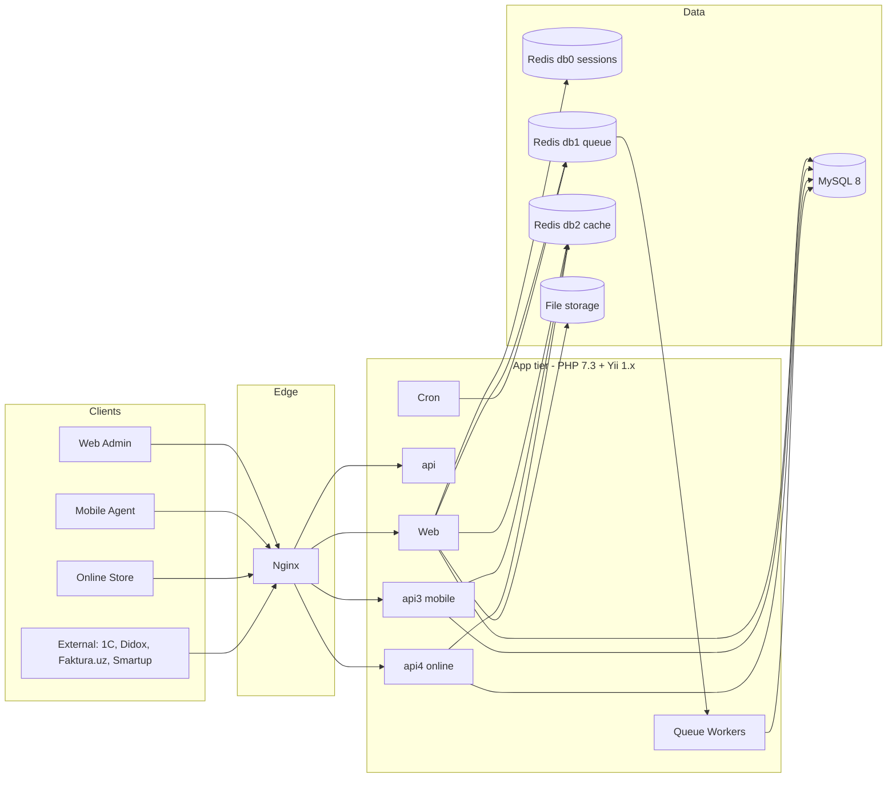

# Architecture overview

SalesDoctor is a classic **server-rendered PHP web application** with a
**REST API** for mobile and integrations. It is deployed as a small set of
stateless app containers behind Nginx, backed by MySQL and Redis.

## High-level diagram

The canonical diagram lives in FigJam — see the
[Diagrams page](./diagrams.md). A locally-rendered Mermaid version:

## Tiers

### Edge

A single **Nginx** acts as TLS terminator, vhost router (one vhost per
tenant subdomain) and static asset server. See
[`nginx.conf`](../project/structure.md) in the repo root and
[Nginx in DevOps](../devops/nginx.md).

### Application

PHP 7.3 + Yii 1.x. The same codebase serves:

- **Web admin** (server-rendered Yii views, jQuery, some Angular and Vue
  islands)
- **API v1, v2, v3, v4** under `protected/modules/api*`
- **Queue workers** running `BaseJob` subclasses pulled from Redis db1
- **Cron** entries triggering scheduled jobs

App containers are **stateless**. Anything stateful goes to MySQL, Redis or
the filesystem mount.

### Data

- **MySQL 8** — one logical database per tenant (multi-tenant DB-per-customer).
  `protected/config/main.php` selects the DB by `HTTP_HOST`. See
  [Multi-tenancy](./multi-tenancy.md).
- **Redis 7** — three logical databases:
  - **db0** sessions (`CCacheHttpSession`)
  - **db1** queue (`Queue` component)
  - **db2** application cache (`ScopedCache` via `TenantContext`)
- **File storage** — uploaded photos, exports, generated docs. Mounted into
  containers as a shared volume.

## Cross-cutting components

| Component | Purpose | Location |
|-----------|---------|----------|
| `TenantContext` | Resolves DB + filial from the request host | `protected/components/TenantContext.php` |
| `DbAuthManager` | Cached RBAC over `authitem`, `authitemchild`, `authassignment` | `protected/components/DbAuthManager.php` |
| `WebUser` | Yii user component with auto-login + filial scoping | `protected/components/WebUser.php` |
| `BaseJob` | Base class for all queue jobs | `protected/components/BaseJob.php` |
| `Queue` | Redis-backed dispatcher | `protected/components/Queue.php` (or framework component) |
| `ScopedCache` | Tenant- and filial-scoped Redis cache wrapper | `protected/components/ScopedCache.php` |

## Why this stack

See [ADR 0001 — keep Yii 1](../adr/yii1-stay.md) and
[ADR 0002 — DB-per-customer](../adr/multi-tenant-db-per-customer.md)
for the historical decisions.
