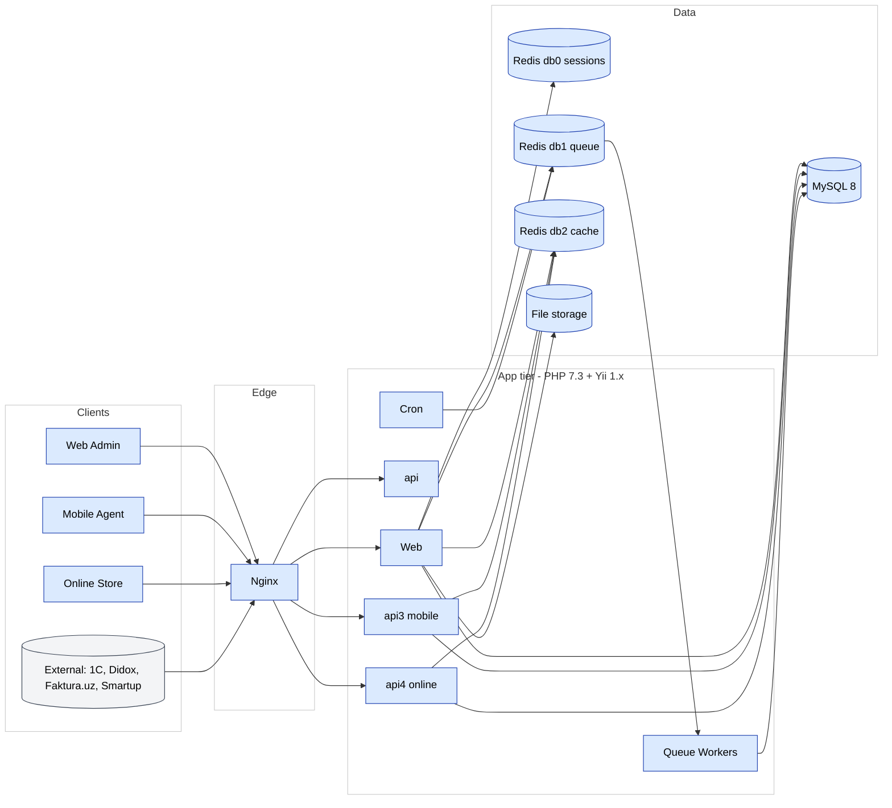

# Architecture overview

SalesDoctor is a classic **server-rendered PHP web application** with a
**REST API** for mobile and integrations. It is deployed as a small set of
stateless app containers behind Nginx, backed by MySQL and Redis.

## High-level diagram

The canonical diagram lives in FigJam — see the
[Diagrams page](./diagrams.md). A locally-rendered Mermaid version:

## Tiers

### Edge

A single **Nginx** acts as TLS terminator, vhost router (one vhost per
tenant subdomain) and static asset server. See
[`nginx.conf`](../project/structure.md) in the repo root and
[Nginx in DevOps](../devops/nginx.md).

### Application

PHP 7.3 + Yii 1.x. The same codebase serves:

- **Web admin** (server-rendered Yii views, jQuery, some Angular and Vue
  islands)
- **API v1, v2, v3, v4** under `protected/modules/api*`
- **Queue workers** running `BaseJob` subclasses pulled from Redis db1
  via `php console.php queue work` (see [`QueueCommand`](../modules/integration.md)
  and `protected/components/jobs/README.md`)
- **Cron** entries triggering scheduled jobs

App containers are **stateless**. Anything stateful goes to MySQL, Redis or
the filesystem mount.

### Module inventory

The committed module list lives in
`protected/config/main_static.php` (lines 22–66). As of the May 2026
audit, the 35 active Yii modules are:

| Group | Modules |
|-------|---------|
| Domain (admin UI) | `agents`, `clients`, `dashboard`, `doctor`, `finans`, `inventory`, `onlineOrder`, `orders`, `partners`, `pay`, `payment`, `planning`, `rating`, `report`, `settings`, `sms`, `staff`, `stock`, `store`, `sync`, `team`, `vs`, `warehouse` |
| Audit & retail audit | `audit`, `adt` |
| Compliance | `markirovka` (CRPT / GTIN) |
| Integrations | `integration` (Didox, Faktura, TraceIQ, Smartup) |
| GPS / tracking | `gps`, `gps2`, `gps3` |
| Platform | `access` (RBAC), `api`, `api2`, `api3`, `api4` |
| Dev | `gii` (Gii code-gen — IP-restricted to `127.0.0.1` and `::1`) |

Three modules are committed-but-commented in `main_static.php` and are
**not loaded**: `neakb`, `manager`. The `aidesign` module exists in
sister projects but is not registered here. Per-module documentation
lives under `/docs/modules/`.

### Data

- **MySQL 8** — one logical database per tenant (multi-tenant DB-per-customer).
  `protected/config/main.php` selects the DB by `HTTP_HOST`. See
  [Multi-tenancy](./multi-tenancy.md).
- **Redis 7** — three logical databases:
  - **db0** sessions (`CCacheHttpSession`)
  - **db1** queue (`Queue` component)
  - **db2** application cache (`ScopedCache` via `TenantContext`)
- **File storage** — uploaded photos, exports, generated docs. Mounted into
  containers as a shared volume.

## Cross-cutting components

All located under `protected/components/`. Confirmed present at audit time:

| Component | Purpose | Location |
|-----------|---------|----------|
| `TenantContext` | Resolves tenant (DB name) by `SELECT DATABASE()`, exposes `tenantCache()` / `filialCache()` scoped wrappers | `protected/components/TenantContext.php` |
| `ScopedCache` | Key-prefixing wrapper around any `ICache` | `protected/components/ScopedCache.php` |
| `FilialComponent` | Resolves and switches active filial | `protected/components/FilialComponent.php` |
| `DbAuthManager` | Cached RBAC over `authitem`, `authitemchild`, `authassignment` (cachingDuration 600s, tenantContextID-aware) | `protected/components/DbAuthManager.php` |
| `WebUser` | Yii user component, `allowAutoLogin=true`, `stateKeyPrefix=salesdoc_user` | `protected/components/WebUser.php` |
| `BaseJob` | Abstract base for all queue jobs (`dispatch()`, `dispatchLater()`, `dispatchAt()`) | `protected/components/BaseJob.php` |
| `Queue` | Redis-backed dispatcher with delayed, reserved, failed lists | `protected/components/Queue.php` |
| `RedisConnection` | Raw Redis socket connection used by `queueRedis` | `protected/components/RedisConnection.php` |
| `FcmV1` | Firebase Cloud Messaging v1 sender for mobile push | `protected/components/FcmV1.php` |
| `BasicFunctions` | Legacy global helpers (formatting, sanitisation) | `protected/components/BasicFunctions.php` |

## Why this stack

See [ADR 0001 — keep Yii 1](../adr/yii1-stay.md) and
[ADR 0002 — DB-per-customer](../adr/multi-tenant-db-per-customer.md)
for the historical decisions.
