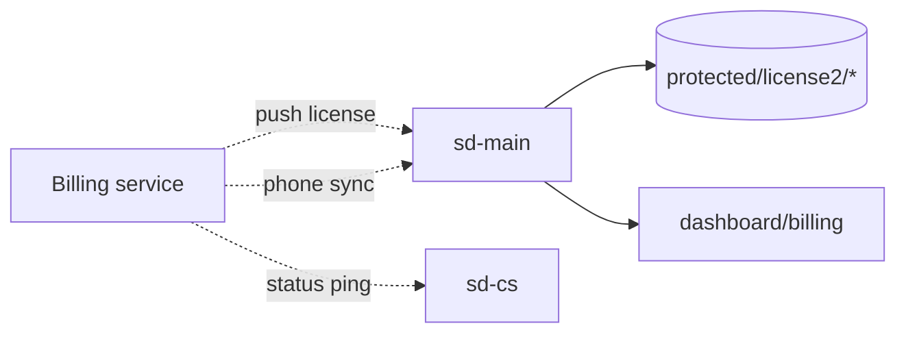

# Billing & subscriptions

A separate **Billing** project (its own repo) handles subscriptions,
invoices and licence keys for every sd-main and sd-cs deployment. This
section documents only the **integration surface** in sd-main and sd-cs.
The Billing project itself will be documented here when its source is
provided.

See **SalesDoctor — Billing / Licensing** in the
[FigJam board](../architecture/diagrams.md).

## What we know today

### sd-main side

| Endpoint | What |
|----------|------|
| `GET /api/billing/license` | Triggered by Billing. Clears `protected/license2/*` so a fresh licence file lands. Restricted by source IP. |
| `POST /api/billing/phone` | Syncs phone numbers for agents and expeditors from the Spravochnik (master) source. |
| `/dashboard/billing` | Internal UI for billing-related ops; uses `H::access('operation.billing.index')`. |

The licence files live at `sd-main/protected/license2/`. `User::hasSystemActive($systemId)` reads them at login.

The IP allowlist `185.22.234.226` (in `BillingController::actionLicense`) is the upstream Billing host. Treat it as configuration, not a hard-coded constant.

### sd-cs side

| Endpoint | What |
|----------|------|
| `GET/POST /api/billing/status?app=sdmanager` | Returns `{ status, url, code, type=countrysale }` so Billing knows the HQ is alive. |

The current implementation logs the request to a file; in production this should go to a structured log instead.

## Subscription model (sketch)

To be filled in when the Billing project is shared. Expected shape:

| Concept | Notes |
|---------|-------|
| Subscription | Per tenant + product (web admin, mobile, audit, online) |
| Plan | Tier of seats + features |
| Seat | One user instance — agents, admins, etc. |
| Bonus seats | Promotional grants |
| Renewal | Manual or automatic; date-bounded |
| Invoice | Generated per renewal or per period |
| Licence file | A signed token deposited into the tenant's `license2/` folder |

`sd-main/protected/config/main.php` already simulates this for local
dev (`simulate_host` block) — the production flow uses real licences.

## Things to capture next time

- Auth method between Billing and sd-main / sd-cs (currently IP-only).
- Webhook for "subscription cancelled" → freeze the tenant.
- Billing's own data model (subscriptions, invoices, payments, refunds).
- Customer-facing Billing UI for tenants to see their own bills.
- Multi-currency handling.

When you share the Billing project we'll produce a sibling section
under `docs/billing/` like the one we have for `docs/sd-cs/`.
