# Real ERD (from declared relations)

This page is the **truth-from-the-code** ERD. Every edge below is
an actual `relations()` declaration in a Yii model — 93 edges across 70 entities.

Compare against [Conceptual ERD](./erd.md) (which shows the intended
domain model) to find the gap — places where columns clearly reference
each other but no `relations()` is declared.

## Top connected entities

| Entity | Edges | Domain |
|--------|-------|--------|
| `Product` | 19 | Catalog |
| `User` | 13 | Auth |
| `Client` | 9 | Clients |
| `ProductCompetitor` | 8 | Catalog |
| `AdtAuditResult` | 6 | Audit ADT |
| `Visit` | 6 | Visit |
| `Diler` | 6 | Diler |
| `FilialMovementRequest` | 6 | Filial |
| `StructureFilial` | 5 | Other |
| `AdtPoll` | 5 | Audit ADT |
| `AdtPollQuestion` | 5 | Audit ADT |
| `AdtAuditResultData` | 4 | Audit ADT |
| `Order` | 4 | Orders |
| `FilialMovementRequestDetail` | 4 | Filial |
| `Tasks` | 4 | Other |
| `AdtAudit` | 3 | Audit ADT |
| `AdtPollResultData` | 3 | Audit ADT |
| `ProductCategory` | 3 | Catalog |
| `OnlineOrder` | 3 | Other |
| `TaskLog` | 3 | Other |

## Mermaid (full graph)

:::tip How to read this diagram
- **90 entities, 92 explicit `relations()` edges** rendered together so you can see the whole shape of the data layer in one view. It is dense by design — for focused study use the per-domain breakdown in [Edges by domain](#edges-by-domain) just below.
- **Edge labels = foreign-key column** (e.g. `AUDIT_ID`, `CLIENT_ID`). The cardinality glyph carries direction and optionality:
  - `||--o{`  one-to-many (parent has many)
  - `}o--||`  many-to-one (child belongs to)
  - `||--o|`  one-to-zero-or-one
- Source-of-truth ordering: the edges below are grouped by **domain** (audit, catalog, clients, sales, dealers, structure, inventory, visits, tasks, other). Mermaid lays out the rendered graph automatically — the source grouping is for maintainers, not the rendered output.
:::

```mermaid
erDiagram
  %% ── Audit & polls ───────────────────────────────────────────
  ADTAUDIT ||--o{ ADTAUDITPRODUCTS : AUDIT_ID
  ADTAUDIT ||--o{ ADTAUDITUSERS : AUDIT_ID
  ADTAUDITPRODUCTS }o--|| PRODUCT : PRODUCT_ID
  ADTAUDITRESULT }o--|| ADTAUDIT : AUDIT_ID
  ADTAUDITRESULT ||--o{ ADTAUDITRESULTDATA : RESULT_ID
  ADTAUDITRESULT }o--|| CLIENT : CLIENT_ID
  ADTAUDITRESULT }o--|| STRUCTUREFILIAL : POSITION_ID
  ADTAUDITRESULT }o--|| VISIT : VISIT_ID
  ADTAUDITRESULTDATA }o--|| ADTAUDITRESULT : RESULT_ID
  ADTAUDITRESULTDATA }o--|| PRODUCT : PRODUCT_ID
  ADTAUDITRESULTDATA }o--|| PRODUCTCOMPETITOR : PRODUCT_ID
  ADTCOMMENTRESULT }o--|| ADTCOMMENT : COMMENT_ID
  ADTCONFIG }o--|| STRUCTUREFILIAL : USER
  ADTPOLL ||--o{ ADTPOLLQUESTION : POLL_ID
  ADTPOLL ||--o{ ADTPOLLBIND : POLL_ID
  ADTPOLL }o--|| USER : CREATE_BY
  ADTPOLLQUESTION }o--|| ADTPOLL : POLL_ID
  ADTPOLLQUESTION ||--o{ ADTPOLLVARIANT : QUES_ID
  ADTPOLLQUESTION ||--o{ ADTPOLLRESULTDATA : QUESTION_ID
  ADTPOLLRESULT }o--|| ADTPOLL : POLL_ID
  ADTPOLLRESULT ||--o{ ADTPOLLRESULTDATA : RESULT_ID
  ADTPOLLRESULTDATA }o--|| ADTPOLLQUESTION : QUESTION_ID

  %% ── Catalog (products + attributes) ─────────────────────────
  PRODUCT }o--|| PRODUCTGROUP : PRODUCT_GROUP_
  PRODUCT }o--|| ADTPACK : PACK
  PRODUCT }o--|| ADTSEGMENT : SEGMENT
  PRODUCT }o--|| ADTBRANDS : BRAND
  PRODUCT }o--|| ADTPRODUCER : PRODUCER
  PRODUCT }o--|| ADTPROPERTY : PROPERTY
  PRODUCT }o--|| USER : CREATE_BY
  PRODUCT }o--|| USER : UPDATE_BY
  PRODUCTCATEGORY }o--|| PRODUCT : PRODUCT_CAT_ID
  PRODUCTCATEGORY }o--|| UNIT : UNIT
  PRODUCTSUBCATEGORY }o--|| PRODUCT : SUB_CAT_ID
  PRODUCTUNIT }o--|| PRODUCT : PRODUCT_ID
  PRODUCTPRICEMARKUP }o--|| PRODUCT : PRODUCT
  PRODUCTCOMPETITOR }o--|| PRODUCTGROUP : PRODUCT_GROUP_
  PRODUCTCOMPETITOR }o--|| ADTPACK : PACK
  PRODUCTCOMPETITOR }o--|| ADTSEGMENT : SEGMENT
  PRODUCTCOMPETITOR }o--|| ADTBRANDS : BRAND
  PRODUCTCOMPETITOR }o--|| ADTPRODUCER : PRODUCER
  PRODUCTCOMPETITOR }o--|| USER : CREATE_BY
  PRODUCTCOMPETITOR }o--|| USER : UPDATE_BY

  %% ── Clients ─────────────────────────────────────────────────
  CLIENT }o--|| CLIENTTYPE : TYPE
  CLIENT }o--|| CLIENTCHANNEL : CHANNEL
  CLIENTPENDING }o--|| REGION : REGION
  CLIENTPENDING }o--|| CITY : CITY
  CONTRAGENT }o--|| CLIENTTYPE : TYPE
  CONTRAGENT }o--|| CLIENTCHANNEL : CHANNEL

  %% ── Sales / orders ──────────────────────────────────────────
  ONLINEORDER }o--|| CONTACT : CONTACT_ID
  ONLINEORDER }o--|| ORDER : ORDER_ID
  ONLINEORDER ||--o{ ONLINEORDERDETAIL : ONLINE_ORDER_I
  ONLINEORDERDETAIL }o--|| PRODUCT : PRODUCT
  ORDERDEFECTDETAIL }o--|| PRODUCT : PRODUCT
  ORDERREPLACEDETAIL }o--|| PRODUCT : PRODUCT
  BONUSORDERDETAIL }o--|| PRODUCT : PRODUCT
  CLIENTKASPITRANSACTION }o--|| ORDER : ORDER_ID
  CLIENTODENGITRANSACTION }o--|| ORDER : ORDER_ID
  CLIENTOPTIMATRANSACTION }o--|| ORDER : ORDER_ID

  %% ── Dealers, users, plans ───────────────────────────────────
  DILER }o--|| USER : DILER_ID
  DILER ||--o{ PLAN : DILER_ID
  DILER ||--o{ CLIENT : DILER_ID
  DILER ||--o{ AGENT : DILER_ID
  DILER ||--o{ PRICETYPE : DILER
  USER }o--|| DILER : DILER_ID
  USER }o--|| AGENT : AGENT_ID

  %% ── Filial / structure / movement ───────────────────────────
  STRUCTUREFILIAL }o--|| USER : USER_ID
  FILIALMOVEMENTREQUEST ||--o{ FILIALMOVEMENTREQUESTDETAIL : REQUEST_ID
  FILIALMOVEMENTREQUEST }o--|| FILIAL : REQUESTER_FILI
  FILIALMOVEMENTREQUEST }o--|| FILIAL : PROVIDER_FILIA
  FILIALMOVEMENTREQUEST }o--|| STORE : STORE_ID
  FILIALMOVEMENTREQUEST }o--|| TRADEDIRECTION : TRADE_ID
  FILIALMOVEMENTREQUESTDETAIL }o--|| FILIALMOVEMENTREQUEST : REQUEST_ID
  FILIALMOVEMENTREQUESTDETAIL }o--|| PRODUCT : PRODUCT_ID
  FILIALMOVEMENTREQUESTDETAIL }o--|| PRODUCTCATEGORY : PRODUCT_CAT_ID

  %% ── Inventory ───────────────────────────────────────────────
  INVENTORYHISTORY }o--|| INVENTORY : INVENTORY_ID
  INVENTORYHISTORY }o--|| INVENTORYTYPE : INV_TYPE_ID
  MUSTBUYRULE ||--o{ MUSTBUYRULEITEM : RULE_ID

  %% ── Visits & field ──────────────────────────────────────────
  VISIT }o--|| CLIENT : CLIENT_ID
  VISIT }o--|| USER : USER_ID
  VISIT }o--|| STRUCTUREFILIAL : POSITION_ID
  VISIT ||--o| ADTNOTERESULT : VISIT_ID
  VISIT ||--o| ADTCOMMENTRESULT : VISIT_ID
  VISITINGAUD }o--|| STRUCTUREFILIAL : AUDITOR_ID
  VISITINGAUD }o--|| CLIENT : CLIENT_ID

  %% ── Tasks ───────────────────────────────────────────────────
  TASKS }o--|| USER : TASK_FROM
  TASKS }o--|| USER : TASK_TO
  TASKS }o--|| CLIENT : CLIENT_ID
  TASKS }o--|| TASKTYPE : TYPE_ID
  TASKLOG }o--|| USER : USER_ID
  TASKLOG }o--|| CLIENT : OLD_VALUE
  TASKLOG }o--|| CLIENT : NEW_VALUE

  %% ── Other ───────────────────────────────────────────────────
  CONSUMPTIONHISTORY }o--|| CONSUMPTION : CONSUMPTION_ID
  TGBOT }o--|| TELEGRAMGROUP : GROUP_ID
```

> **Tip:** if the rendered graph is hard to follow at first sight, that is the data layer telling you something. Use the [Top connected entities](#top-connected-entities) table above to find the hubs (PRODUCT, USER, CLIENT, DILER, FILIAL) and trace outward from there.

## Edges by domain

| Source | Type | Target | Foreign key |
|--------|------|--------|-------------|
| `AdtAudit` | `HAS_MANY` | `AdtAuditProducts` | `AUDIT_ID` |
| `AdtAudit` | `HAS_MANY` | `AdtAuditUsers` | `AUDIT_ID` |
| `AdtAuditProducts` | `BELONGS_TO` | `Product` | `PRODUCT_ID` |
| `AdtAuditResult` | `BELONGS_TO` | `AdtAudit` | `AUDIT_ID` |
| `AdtAuditResult` | `HAS_MANY` | `AdtAuditResultData` | `RESULT_ID` |
| `AdtAuditResult` | `BELONGS_TO` | `Client` | `CLIENT_ID` |
| `AdtAuditResult` | `BELONGS_TO` | `StructureFilial` | `POSITION_ID` |
| `AdtAuditResult` | `BELONGS_TO` | `Visit` | `VISIT_ID` |
| `AdtAuditResultData` | `BELONGS_TO` | `AdtAuditResult` | `RESULT_ID` |
| `AdtAuditResultData` | `BELONGS_TO` | `Product` | `PRODUCT_ID` |
| `AdtAuditResultData` | `BELONGS_TO` | `ProductCompetitor` | `PRODUCT_ID` |
| `AdtCommentResult` | `BELONGS_TO` | `AdtComment` | `COMMENT_ID` |
| `AdtConfig` | `BELONGS_TO` | `StructureFilial` | `USER` |
| `AdtPoll` | `HAS_MANY` | `AdtPollBind` | `POLL_ID` |
| `AdtPoll` | `HAS_MANY` | `AdtPollQuestion` | `POLL_ID` |
| `AdtPoll` | `BELONGS_TO` | `User` | `CREATE_BY` |
| `AdtPollQuestion` | `BELONGS_TO` | `AdtPoll` | `POLL_ID` |
| `AdtPollQuestion` | `HAS_MANY` | `AdtPollResultData` | `QUESTION_ID` |
| `AdtPollQuestion` | `HAS_MANY` | `AdtPollVariant` | `QUES_ID` |
| `AdtPollResult` | `BELONGS_TO` | `AdtPoll` | `POLL_ID` |
| `AdtPollResult` | `HAS_MANY` | `AdtPollResultData` | `RESULT_ID` |
| `AdtPollResultData` | `BELONGS_TO` | `AdtPollQuestion` | `QUESTION_ID` |
| `User` | `BELONGS_TO` | `Agent` | `AGENT_ID` |
| `User` | `BELONGS_TO` | `Diler` | `DILER_ID` |
| `BonusOrderDetail` | `BELONGS_TO` | `Product` | `PRODUCT` |
| `Product` | `BELONGS_TO` | `AdtBrands` | `BRAND` |
| `Product` | `BELONGS_TO` | `AdtPack` | `PACK` |
| `Product` | `BELONGS_TO` | `AdtProducer` | `PRODUCER` |
| `Product` | `BELONGS_TO` | `AdtProperty` | `PROPERTY` |
| `Product` | `BELONGS_TO` | `AdtSegment` | `SEGMENT` |
| `Product` | `BELONGS_TO` | `ProductGroup` | `PRODUCT_GROUP_ID` |
| `Product` | `BELONGS_TO` | `User` | `CREATE_BY` |
| `Product` | `BELONGS_TO` | `User` | `UPDATE_BY` |
| `ProductCategory` | `BELONGS_TO` | `Product` | `PRODUCT_CAT_ID` |
| `ProductCategory` | `BELONGS_TO` | `Unit` | `UNIT` |
| `ProductCompetitor` | `BELONGS_TO` | `AdtBrands` | `BRAND` |
| `ProductCompetitor` | `BELONGS_TO` | `AdtPack` | `PACK` |
| `ProductCompetitor` | `BELONGS_TO` | `AdtProducer` | `PRODUCER` |
| `ProductCompetitor` | `BELONGS_TO` | `AdtSegment` | `SEGMENT` |
| `ProductCompetitor` | `BELONGS_TO` | `ProductGroup` | `PRODUCT_GROUP_ID` |
| `ProductCompetitor` | `BELONGS_TO` | `User` | `CREATE_BY` |
| `ProductCompetitor` | `BELONGS_TO` | `User` | `UPDATE_BY` |
| `ProductPriceMarkup` | `BELONGS_TO` | `Product` | `PRODUCT` |
| `ProductSubCategory` | `BELONGS_TO` | `Product` | `SUB_CAT_ID` |
| `ProductUnit` | `BELONGS_TO` | `Product` | `PRODUCT_ID` |
| `Client` | `BELONGS_TO` | `ClientChannel` | `CHANNEL` |
| `Client` | `BELONGS_TO` | `ClientType` | `TYPE` |
| `ClientKaspiTransaction` | `BELONGS_TO` | `Order` | `ORDER_ID` |
| `ClientOdengiTransaction` | `BELONGS_TO` | `Order` | `ORDER_ID` |
| `ClientOptimaTransaction` | `BELONGS_TO` | `Order` | `ORDER_ID` |
| `ClientPending` | `BELONGS_TO` | `City` | `CITY` |
| `ClientPending` | `BELONGS_TO` | `Region` | `REGION` |
| `Diler` | `HAS_MANY` | `Agent` | `DILER_ID` |
| `Diler` | `HAS_MANY` | `Client` | `DILER_ID` |
| `Diler` | `HAS_MANY` | `Plan` | `DILER_ID` |
| `Diler` | `HAS_MANY` | `PriceType` | `DILER` |
| `Diler` | `BELONGS_TO` | `User` | `DILER_ID` |
| `FilialMovementRequest` | `BELONGS_TO` | `Filial` | `REQUESTER_FILIAL_ID` |
| `FilialMovementRequest` | `BELONGS_TO` | `Filial` | `PROVIDER_FILIAL_ID` |
| `FilialMovementRequest` | `HAS_MANY` | `FilialMovementRequestDetail` | `REQUEST_ID` |
| `FilialMovementRequest` | `BELONGS_TO` | `Store` | `STORE_ID` |
| `FilialMovementRequest` | `BELONGS_TO` | `TradeDirection` | `TRADE_ID` |
| `FilialMovementRequestDetail` | `BELONGS_TO` | `FilialMovementRequest` | `REQUEST_ID` |
| `FilialMovementRequestDetail` | `BELONGS_TO` | `Product` | `PRODUCT_ID` |
| `FilialMovementRequestDetail` | `BELONGS_TO` | `ProductCategory` | `PRODUCT_CAT_ID` |
| `InventoryHistory` | `BELONGS_TO` | `Inventory` | `INVENTORY_ID` |
| `InventoryHistory` | `BELONGS_TO` | `InventoryType` | `INV_TYPE_ID` |
| `OrderDefectDetail` | `BELONGS_TO` | `Product` | `PRODUCT` |
| `OrderReplaceDetail` | `BELONGS_TO` | `Product` | `PRODUCT` |
| `ConsumptionHistory` | `BELONGS_TO` | `Consumption` | `CONSUMPTION_ID` |
| `Contragent` | `BELONGS_TO` | `ClientChannel` | `CHANNEL` |
| `Contragent` | `BELONGS_TO` | `ClientType` | `TYPE` |
| `MustBuyRule` | `HAS_MANY` | `MustBuyRuleItem` | `RULE_ID` |
| `OnlineOrder` | `BELONGS_TO` | `Contact` | `CONTACT_ID` |
| `OnlineOrder` | `HAS_MANY` | `OnlineOrderDetail` | `ONLINE_ORDER_ID` |
| `OnlineOrder` | `BELONGS_TO` | `Order` | `ORDER_ID` |
| `OnlineOrderDetail` | `BELONGS_TO` | `Product` | `PRODUCT` |
| `StructureFilial` | `BELONGS_TO` | `User` | `USER_ID` |
| `TaskLog` | `BELONGS_TO` | `Client` | `OLD_VALUE` |
| `TaskLog` | `BELONGS_TO` | `Client` | `NEW_VALUE` |
| `TaskLog` | `BELONGS_TO` | `User` | `USER_ID` |
| `Tasks` | `BELONGS_TO` | `Client` | `CLIENT_ID` |
| `Tasks` | `BELONGS_TO` | `TaskType` | `TYPE_ID` |
| `Tasks` | `BELONGS_TO` | `User` | `TASK_FROM` |
| `Tasks` | `BELONGS_TO` | `User` | `TASK_TO` |
| `TgBot` | `BELONGS_TO` | `TelegramGroup` | `GROUP_ID` |
| `VisitingAud` | `BELONGS_TO` | `Client` | `CLIENT_ID` |
| `VisitingAud` | `BELONGS_TO` | `StructureFilial` | `AUDITOR_ID` |
| `Visit` | `HAS_ONE` | `AdtCommentResult` | `VISIT_ID` |
| `Visit` | `HAS_ONE` | `AdtNoteResult` | `VISIT_ID` |
| `Visit` | `BELONGS_TO` | `Client` | `CLIENT_ID` |
| `Visit` | `BELONGS_TO` | `StructureFilial` | `POSITION_ID` |
| `Visit` | `BELONGS_TO` | `User` | `USER_ID` |

## What this ERD does NOT show

- **Implicit relations**: a column named `CLIENT_ID` on `Order` clearly references `Client` even when `Order::relations()` doesn't declare it. The conceptual ERD shows those.
- **Polymorphic links**: any column carrying multiple kinds of FK (e.g. `RELATED_TO_ID` + `RELATED_TO_TYPE`) doesn't fit Mermaid's syntax.
- **Cross-DB relations**: sd-cs reads from sd-main DBs but the relation is in PHP code, not a Yii `relations()` declaration.

## Refresh procedure

Re-run the [refresh procedure](./schema-reference.md#refresh-procedure) on the schema-reference page; this ERD is regenerated from the same JSON.
