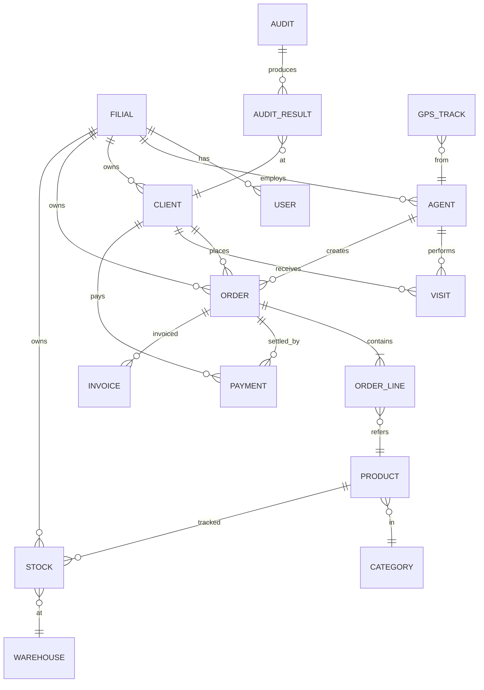

# Entity-relationship diagram

The canonical ERD is the FigJam diagram — open the
[Diagrams page](../architecture/diagrams.md) to access it. A locally
rendered Mermaid version is below.



When you export the FigJam version, drop it at `static/diagrams/erd.png`
and reference it:

```markdown

```
