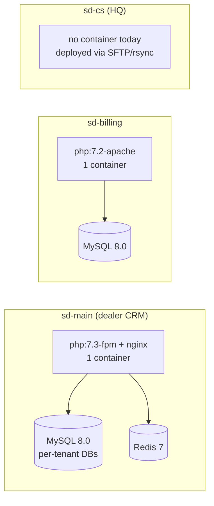

# Deployment

## Topology overview

The three SalesDoctor projects deploy **independently**. Each has its own
container image, its own database, and its own release cadence. There is
no shared registry, no shared pipeline, and no orchestrator coordinating
them.



Note that the two CRM-adjacent projects use different PHP runtimes
(7.3-fpm in sd-main, 7.2-apache in sd-billing) and different web servers.
Treat them as separate products that happen to share a vendor.

## sd-main

The reference project. Most production deploys touch this repo.

### Build

The repo's `Dockerfile` produces a single container running both nginx
and php-fpm:

- Base image: `php:7.3-fpm`
- Adds: nginx, GD (with freetype/jpeg), bcmath, pdo_mysql, mbstring,
  pcntl, sysv*, tidy, xsl, zip, plus the rest listed in `Dockerfile:29-49`.
- Copies `nginx.conf` to `/etc/nginx/sites-available/default`.
- `EXPOSE 80`. Mapped to host `8080` in `docker-compose.yml`.
- `CMD service nginx start && php-fpm` — both services live in one
  container. **No entrypoint script.** Migrations are not run on boot.

```bash
docker build -t registry.example.com/sd-main:$(git rev-parse --short HEAD) .
docker push registry.example.com/sd-main:<tag>
```

A registry is referenced here for documentation only — the repo does not
ship a registry URL. Substitute your own.

### Configuration

sd-main is **not env-driven**. Configuration lives in
`protected/config/main_local.php`, which is gitignored. The committed
`main.php` carries the production-shaped defaults; `main_local.php`
overrides DB credentials, Redis hostnames, and the like:

```php
// protected/config/main_local.php
return [
    'components' => [
        'db' => [
            'connectionString' => 'mysql:host=db;dbname=sd_main',
            'username' => '...',
            'password' => '...',
        ],
        'redis_session' => ['hostname' => 'redis'],
        'queueRedis'    => ['hostname' => 'redis'],
        'redis_app'     => ['hostname' => 'redis'],
    ],
];
```

`main.php` calls `array_replace_recursive($config, require 'main_local.php')`
when the file exists. Provisioning a host therefore means writing a
`main_local.php`, not setting environment variables.

### Database migrations

Yii 1's `yiic migrate` is the only tool. There are currently no
committed migration files in the canonical migrations directory, so most
schema work happens via raw SQL applied out of band; new changes should
be added via `yiic` going forward.

```bash
docker compose exec web php protected/yiic migrate up
```

Migrations target the **default** DB from `main.php`. For the multi-DB
fan-out, see [Multi-tenant fan-out](#multi-tenant-fan-out) below and
[Migrations](../data/migrations.md).

### Rollout

There is no automated rollout. The manual recipe:

```bash
ssh prod 'cd /srv/sd-main && \
  docker compose pull web && \
  docker compose exec web php protected/yiic migrate up && \
  docker compose up -d web'
```

Because nginx and php-fpm share the container, a `compose up -d web`
restart drops in-flight requests. Run during a quiet window.

### Healthcheck

**There is no application healthcheck endpoint.** No `actionHealth`,
`actionPing`, or `/healthz` route exists in `protected/`. The
`docker-compose.yml` declares no `healthcheck` block on the `web`
service. The only healthcheck in the stack is implicit (MySQL exposing
`:3306`).

If you front sd-main with a load balancer, point it at a known cheap
route like `/site/index` and accept HTML content as the success signal,
or add a `location = /healthz { return 200; }` stanza in nginx as
described in [Nginx](./nginx.md).

### Rollback

`docker compose pull web` with the previous image tag, then
`docker compose up -d web`. Schema rollback is not automated — write
migrations to be **forward-compatible** (additive columns, no drops in
the same release as the code that depends on them).

### Smoke tests

There is no `infra/smoke.sh`. After a deploy, hit by hand:

```
GET /                      → 200 (HTML login page)
GET /api3/config/index     → 200 with JSON
GET /api2/auth/login       → 401 with JSON (auth required, signals routing works)
```

## sd-billing

### Build

`docker/Dockerfile` produces a different stack from sd-main:

- Base image: `php:7.2-apache` (Apache, not nginx; PHP 7.2, not 7.3).
- Patches `sources.list` to `archive.debian.org` because Stretch is
  EOL — the build will fail without this.
- Installs `pdo_mysql`, `zip`, enables `mod_rewrite` and `mod_headers`.
- Copies the repo into `/var/www`, then **renames** `_index.php` →
  `index.php` and `_constants.php` → `constants.php`. The committed
  `_constants.php` carries placeholder Paynet credentials — overwrite
  before building, or supply a replacement at build context time.
- `EXPOSE 80`. Mapped to host `3000` in `docker-compose.yml`.
- `ENTRYPOINT ["/entrypoint.sh"]` — see below.

### Configuration

sd-billing **is** env-driven. `protected/config/_db.php` reads
`MYSQL_HOST`, `MYSQL_PORT`, `MYSQL_DATABASE`, `MYSQL_USER`,
`MYSQL_PASSWORD` via `getenv()`. Set these in your orchestrator (or in
the compose file).

### Database migrations

`docker/entrypoint.sh` runs `yiic migrate --interactive=0` on container
start, but only when the schema is unbootstrapped (it greps for
`d0_tariff` and skips if present). 55 migrations live in
`protected/migrations/`.

There is also a dev-only `ENABLE_MOCK_SEED=1` switch that runs
`docker/seed_mock_data.php`. Never set this in production.

### Rollout, healthcheck, rollback

Same shape as sd-main: no automation, no healthcheck endpoint, no
rollback script. The compose file does declare a `healthcheck` on the
**MySQL** service (`mysqladmin ping`), which gates `web` startup via
`depends_on.mysql.condition: service_healthy`. The web container itself
is unchecked.

For developer-facing setup, see [sd-billing local setup](../sd-billing/local-setup.md).

## sd-cs

sd-cs has **no Dockerfile, no docker-compose, and no migrations**
(`protected/migrations/empty.sql` is the only file). It is the legacy HQ
console; deploys are file-level (SFTP / rsync to a PHP host) and out of
scope for the container-based pipeline. Treat any change here as a
manual, supervised release.

## Multi-tenant fan-out

sd-main runs **one MySQL database per tenant** (`sd_<tenant>`). A
release that changes the schema must touch every tenant DB. There is no
built-in fan-out tool; the operator runs the loop:

```bash
for db in $(mysql -uroot -p$ROOT -Nsre 'SHOW DATABASES LIKE "sd\\_%"'); do
  echo "Migrating $db..."
  docker compose exec -e DB_NAME=$db web php protected/yiic migrate up
done
```

The same per-tenant loop pattern applies to any cron-scoped data fix —
see [Background jobs & scheduling](../architecture/jobs-and-scheduling.md)
for `TenantRegistry::all()` and `TenantContext::switchTo()`.

## Failure modes

- **Deploy fails mid-roll** — nginx and php-fpm share a container, so a
  failed `compose up -d web` leaves the previous container running until
  the new one is healthy. There is no canary window; old and new are
  never live simultaneously.
- **Migration fails halfway across tenants** — the loop above stops on
  the first non-zero exit. The tenant where it failed is in a
  partially-migrated state; the rest are untouched. Resume by hand once
  the failing tenant is fixed.
- **`main_local.php` missing on a fresh host** — sd-main will fall back
  to the committed `main.php` defaults, which point at `host=db,
  dbname=sd_main` with hard-coded creds. Either ship `main_local.php` as
  part of provisioning or accept the default.
- **Redis unreachable** — sessions (`CCacheHttpSession`) and the queue
  both fail. The app surface degrades to anonymous-only; in-flight jobs
  back up. There is no graceful fallback — fix Redis, then expect a
  thundering herd of queue replays.

## See also

- [Docker Compose](./docker-compose.md) — production overlay shape.
- [Nginx](./nginx.md) — vhost, healthcheck, rate limiting.
- [Migrations](../data/migrations.md) — `yiic migrate` mechanics.
- [Multi-tenancy](../architecture/multi-tenancy.md) — tenant DB layout.
- [sd-billing local setup](../sd-billing/local-setup.md) — env wiring detail.
