# Other — diagram gallery

Cross-cutting diagrams that don't fit a single project bucket.

All 26 diagrams in this group, drawn inline.

## Index

| # | Title | Kind | Source page |
|---|-------|------|-------------|
| 01 | [Master view](#d-01) | `flowchart` | [quality/clients/index](/docs/quality/clients/index) |
| 02 | [How they're used downstream](#d-02) | `flowchart` | [quality/clients/categorisation](/docs/quality/clients/categorisation) |
| 03 | [Master view](#d-03) | `flowchart` | [quality/settings/index](/docs/quality/settings/index) |
| 04 | [Master view — how the screens fit together](#d-04) | `flowchart` | [quality/payment/index](/docs/quality/payment/index) |
| 05 | [Master view — how the screens build on the same tables](#d-05) | `flowchart` | [quality/payment/index](/docs/quality/payment/index) |
| 06 | [Step by step — recording a supplier payment](#d-06) | `sequence` | [quality/payment/supplier-finance](/docs/quality/payment/supplier-finance) |
| 07 | [How it all hangs together](#d-07) | `flowchart` | [quality/payment/expenses-and-pnl](/docs/quality/payment/expenses-and-pnl) |
| 08 | [Step by step — managing categories](#d-08) | `flowchart` | [quality/payment/expenses-and-pnl](/docs/quality/payment/expenses-and-pnl) |
| 09 | [Step by step — PNL screen](#d-09) | `flowchart` | [quality/payment/expenses-and-pnl](/docs/quality/payment/expenses-and-pnl) |
| 10 | [Step by step — inter-filial transfer](#d-10) | `sequence` | [quality/payment/expenses-and-pnl](/docs/quality/payment/expenses-and-pnl) |
| 11 | [The big picture](#d-11) | `flowchart` | [quality/integrations/index](/docs/quality/integrations/index) |
| 12 | [How the balance is computed](#d-12) | `flowchart` | [quality/finans/cashbox-balance](/docs/quality/finans/cashbox-balance) |
| 13 | [Master view](#d-13) | `flowchart` | [quality/finans/index](/docs/quality/finans/index) |
| 14 | [How they balance](#d-14) | `flowchart` | [quality/finans/transaction-types](/docs/quality/finans/transaction-types) |
| 15 | [How balances split per currency](#d-15) | `flowchart` | [quality/finans/multi-currency](/docs/quality/finans/multi-currency) |
| 16 | [The algorithm in plain words](#d-16) | `flowchart` | [quality/finans/settlement](/docs/quality/finans/settlement) |
| 17 | [How they map onto each other](#d-17) | `flowchart` | [quality/team/index](/docs/quality/team/index) |
| 18 | [Where the agent connects to other modules](#d-18) | `flowchart` | [quality/team/role-agent](/docs/quality/team/role-agent) |
| 19 | [Where the expeditor connects to other modules](#d-19) | `flowchart` | [quality/team/role-expeditor](/docs/quality/team/role-expeditor) |
| 20 | [Where the supervisor connects to other modules](#d-20) | `flowchart` | [quality/team/role-supervisor](/docs/quality/team/role-supervisor) |
| 21 | [The big picture — a typical agent workday on the phone](#d-21) | `sequence` | [quality/mobile/index](/docs/quality/mobile/index) |
| 22 | [The two-system surface](#d-22) | `flowchart` | [quality/markirovka/index](/docs/quality/markirovka/index) |
| 23 | [The big picture — order lifecycle](#d-23) | `state` | [quality/orders/index](/docs/quality/orders/index) |
| 24 | [Master view](#d-24) | `flowchart` | [quality/stock/index](/docs/quality/stock/index) |
| 25 | [What happens on the stock side](#d-25) | `sequence` | [quality/stock/defect-and-van-stock](/docs/quality/stock/defect-and-van-stock) |
| 26 | [Where stock goes](#d-26) | `flowchart` | [quality/stock/defect-and-van-stock](/docs/quality/stock/defect-and-van-stock) |

## 01. Master view {#d-01}

- **Kind**: `flowchart`
- **Source page**: [quality/clients/index](/docs/quality/clients/index)
- **Originating section**: Master view

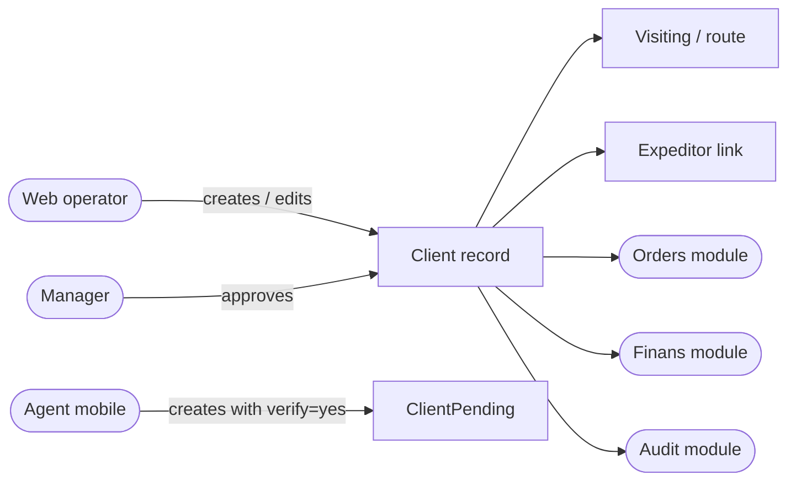

## 02. How they're used downstream {#d-02}

- **Kind**: `flowchart`
- **Source page**: [quality/clients/categorisation](/docs/quality/clients/categorisation)
- **Originating section**: How they're used downstream

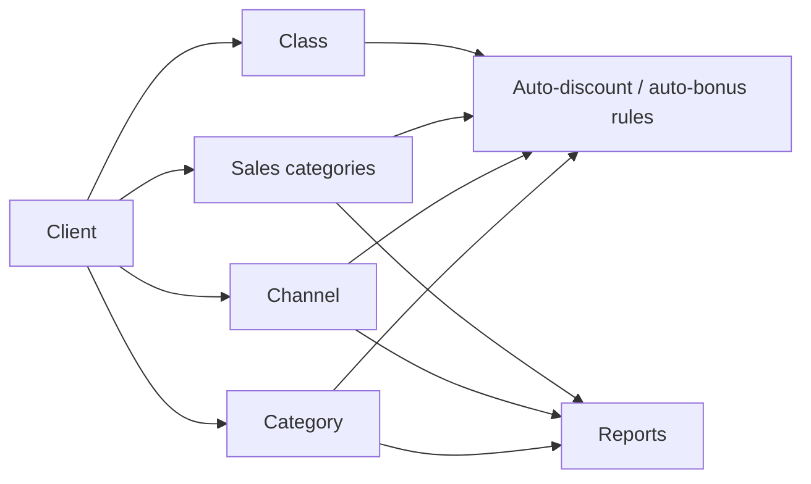

## 03. Master view {#d-03}

- **Kind**: `flowchart`
- **Source page**: [quality/settings/index](/docs/quality/settings/index)
- **Originating section**: Master view

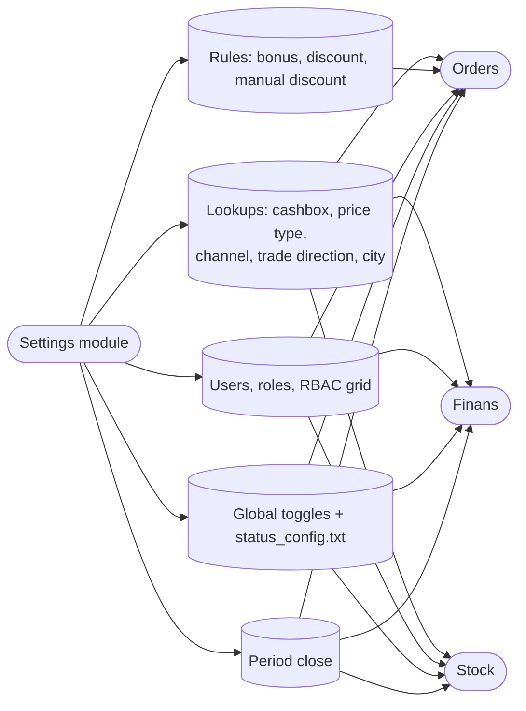

## 04. Master view — how the screens fit together {#d-04}

- **Kind**: `flowchart`
- **Source page**: [quality/payment/index](/docs/quality/payment/index)
- **Originating section**: Master view — how the screens fit together

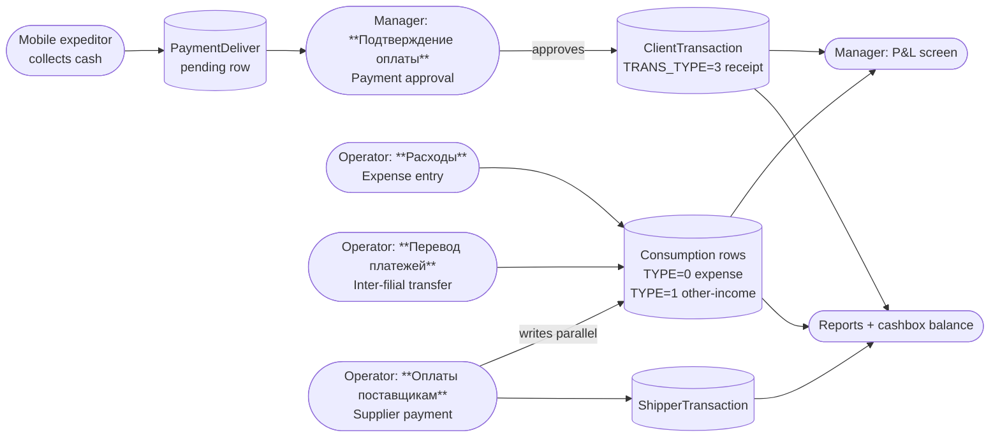

## 05. Master view — how the screens build on the same tables {#d-05}

- **Kind**: `flowchart`
- **Source page**: [quality/payment/index](/docs/quality/payment/index)
- **Originating section**: Master view — how the screens build on the same tables

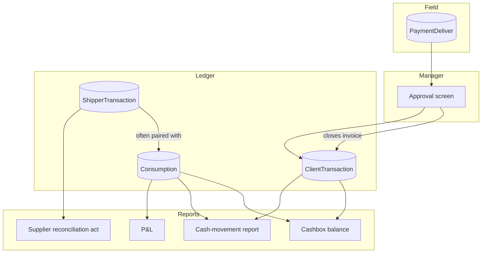

## 06. Step by step — recording a supplier payment {#d-06}

- **Kind**: `sequence`
- **Source page**: [quality/payment/supplier-finance](/docs/quality/payment/supplier-finance)
- **Originating section**: Step by step — recording a supplier payment

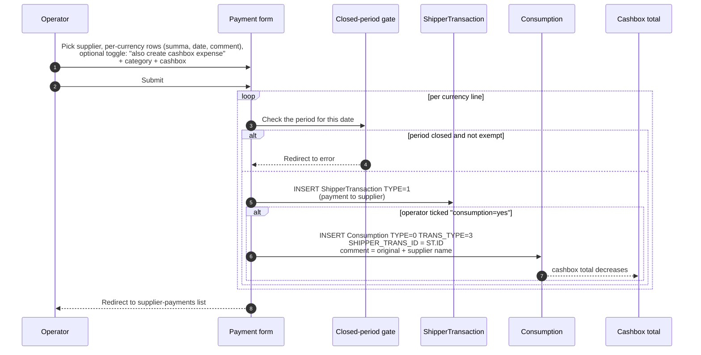

## 07. How it all hangs together {#d-07}

- **Kind**: `flowchart`
- **Source page**: [quality/payment/expenses-and-pnl](/docs/quality/payment/expenses-and-pnl)
- **Originating section**: How it all hangs together

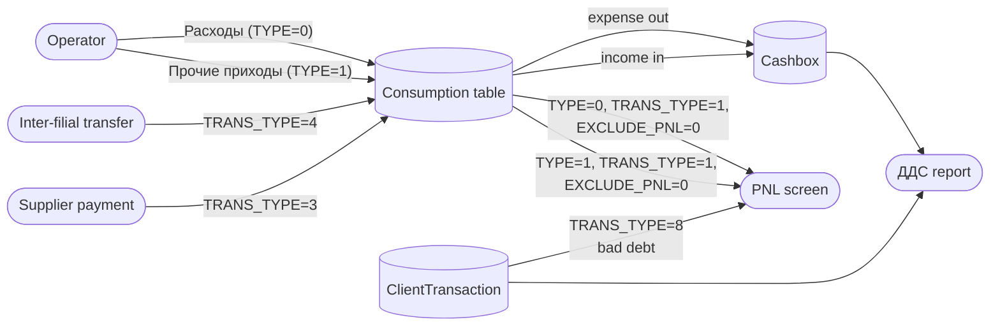

## 08. Step by step — managing categories {#d-08}

- **Kind**: `flowchart`
- **Source page**: [quality/payment/expenses-and-pnl](/docs/quality/payment/expenses-and-pnl)
- **Originating section**: Step by step — managing categories

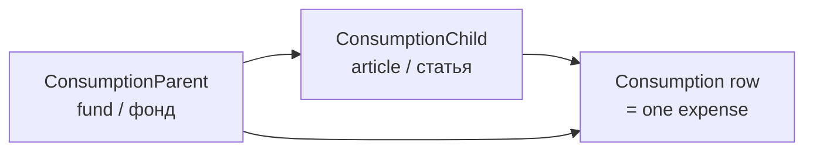

## 09. Step by step — PNL screen {#d-09}

- **Kind**: `flowchart`
- **Source page**: [quality/payment/expenses-and-pnl](/docs/quality/payment/expenses-and-pnl)
- **Originating section**: Step by step — PNL screen

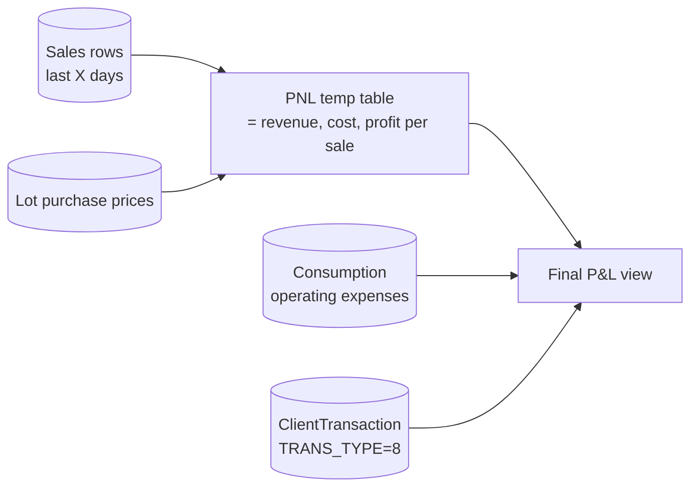

## 10. Step by step — inter-filial transfer {#d-10}

- **Kind**: `sequence`
- **Source page**: [quality/payment/expenses-and-pnl](/docs/quality/payment/expenses-and-pnl)
- **Originating section**: Step by step — inter-filial transfer

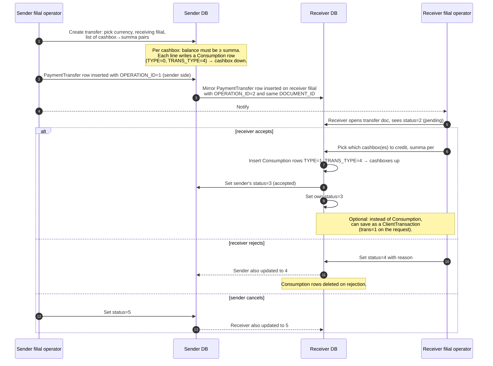

## 11. The big picture {#d-11}

- **Kind**: `flowchart`
- **Source page**: [quality/integrations/index](/docs/quality/integrations/index)
- **Originating section**: The big picture

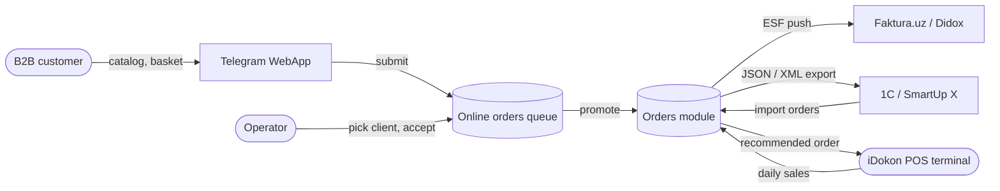

## 12. How the balance is computed {#d-12}

- **Kind**: `flowchart`
- **Source page**: [quality/finans/cashbox-balance](/docs/quality/finans/cashbox-balance)
- **Originating section**: How the balance is computed

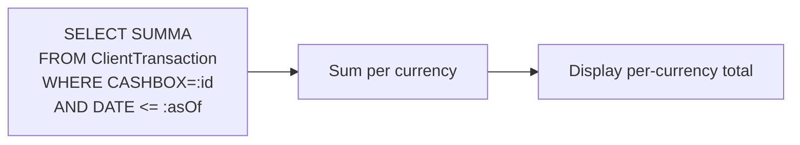

## 13. Master view {#d-13}

- **Kind**: `flowchart`
- **Source page**: [quality/finans/index](/docs/quality/finans/index)
- **Originating section**: Master view

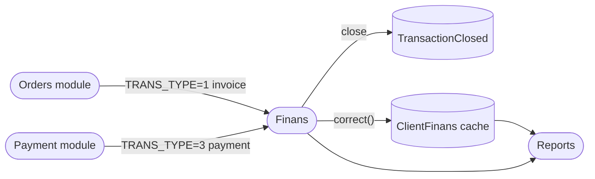

## 14. How they balance {#d-14}

- **Kind**: `flowchart`
- **Source page**: [quality/finans/transaction-types](/docs/quality/finans/transaction-types)
- **Originating section**: How they balance

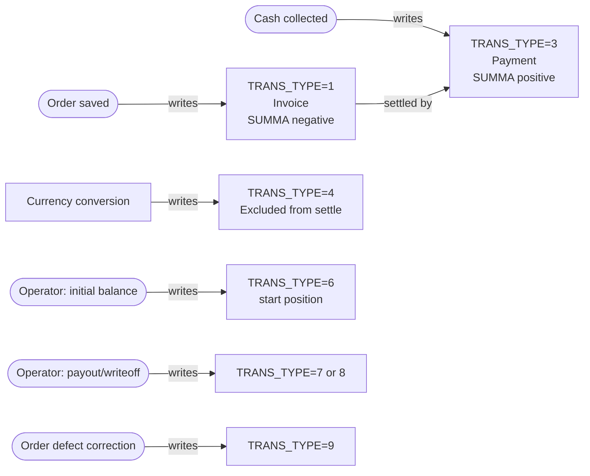

## 15. How balances split per currency {#d-15}

- **Kind**: `flowchart`
- **Source page**: [quality/finans/multi-currency](/docs/quality/finans/multi-currency)
- **Originating section**: How balances split per currency

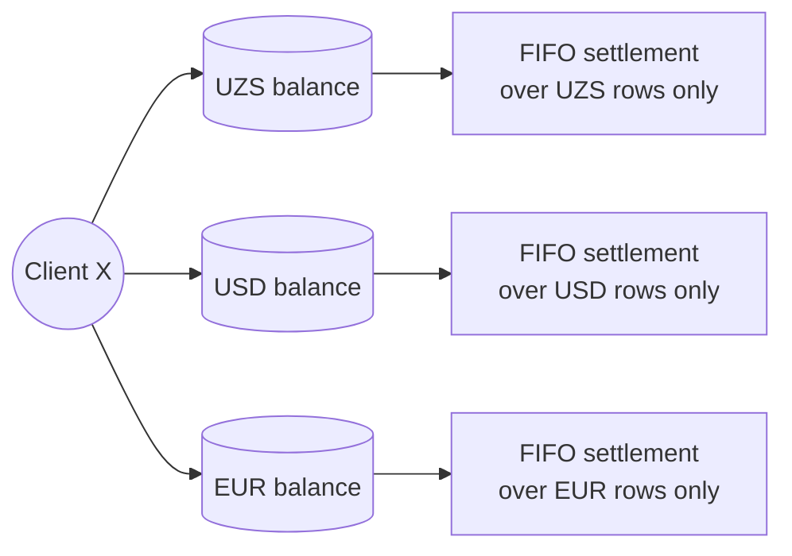

## 16. The algorithm in plain words {#d-16}

- **Kind**: `flowchart`
- **Source page**: [quality/finans/settlement](/docs/quality/finans/settlement)
- **Originating section**: The algorithm in plain words

```mermaid
flowchart TD
    A([New payment saved]) --> B[Load all OPEN invoices for this client + currency<br/>ordered by DATE ASC]
    B --> C[Iterate invoices oldest-first]
    C --> D{Invoice still has open balance?}
    D -- yes --> E{Payment still has unallocated SUMMA?}
    E -- yes --> F[Close min(invoice.open, payment.remaining)]
    F --> G[Insert TransactionClosed row<br/>TR_FROM=payment, TR_TO=invoice, SUMMA=amount]
    G --> H[Update payment.COMPUTATION -= amount<br/>Update invoice.COMPUTATION += amount]
    H --> D
    E -- no --> X([Stop])
    D -- no --> C
```

## 17. How they map onto each other {#d-17}

- **Kind**: `flowchart`
- **Source page**: [quality/team/index](/docs/quality/team/index)
- **Originating section**: How they map onto each other

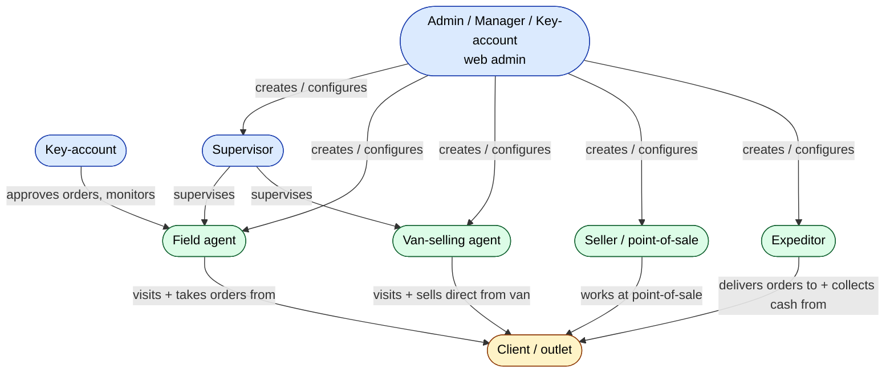

## 18. Where the agent connects to other modules {#d-18}

- **Kind**: `flowchart`
- **Source page**: [quality/team/role-agent](/docs/quality/team/role-agent)
- **Originating section**: Where the agent connects to other modules

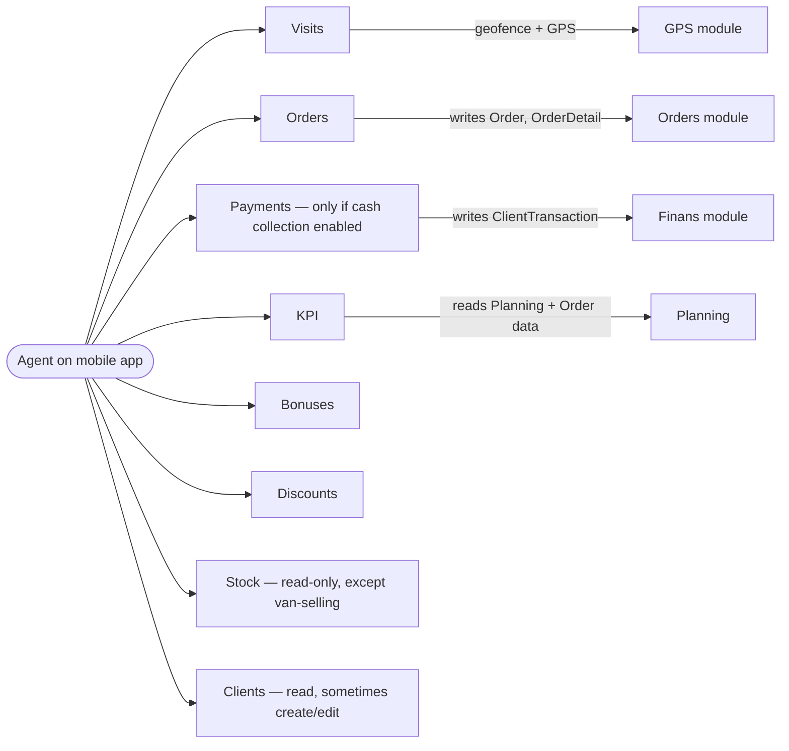

## 19. Where the expeditor connects to other modules {#d-19}

- **Kind**: `flowchart`
- **Source page**: [quality/team/role-expeditor](/docs/quality/team/role-expeditor)
- **Originating section**: Where the expeditor connects to other modules

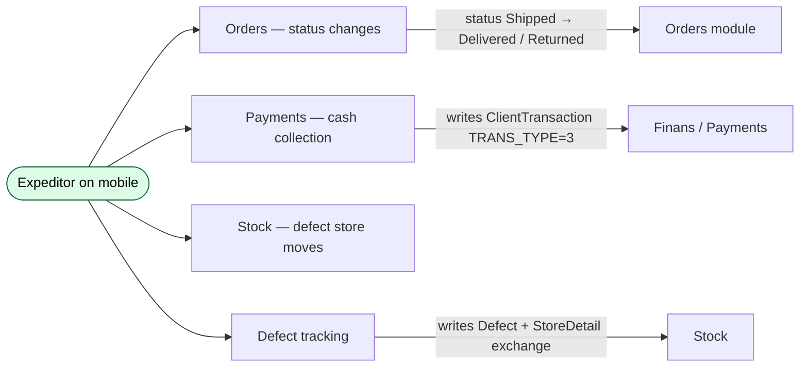

## 20. Where the supervisor connects to other modules {#d-20}

- **Kind**: `flowchart`
- **Source page**: [quality/team/role-supervisor](/docs/quality/team/role-supervisor)
- **Originating section**: Where the supervisor connects to other modules

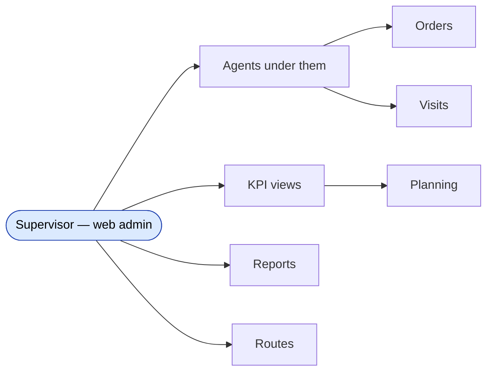

## 21. The big picture — a typical agent workday on the phone {#d-21}

- **Kind**: `sequence`
- **Source page**: [quality/mobile/index](/docs/quality/mobile/index)
- **Originating section**: The big picture — a typical agent workday on the phone

```mermaid
sequenceDiagram
    autonumber
    participant Phone as Agent's phone
    participant API as Server (api3 + api4)
    participant DB as Sales DB
    participant Map as /gps/monitoring (web)

    Phone->>API: 1. POST /login (login, password, deviceId, fcm_token)
    API-->>Phone: token, role, profiles, server time
    Phone->>API: 2. GET /config (packet)
    API-->>Phone: ~100 KB JSON of toggles, plus a sync GPS ping
    Phone->>API: 3. GET clients / clients balances
    API-->>Phone: client list scoped to this agent
    Phone->>API: 4. GET products / prices / warehouses
    API-->>Phone: catalogue scoped to this agent
    Phone->>API: 5. GET visits for today (route)
    API-->>Phone: ordered list of clients to visit

    loop every minute while app is open
        Phone->>API: POST /gps (lat, lon, battery, signal)
        API->>DB: insert GPS row
        API-->>Map: visible in the live map
    end

    loop for each visit during the day
        Phone->>API: check in (visit start) + photos / order / payment
        API->>DB: write visit + order + payment
    end

    Phone->>API: logout (or token expires)
```

## 22. The two-system surface {#d-22}

- **Kind**: `flowchart`
- **Source page**: [quality/markirovka/index](/docs/quality/markirovka/index)
- **Originating section**: The two-system surface

```mermaid
flowchart LR
    SUPP([Supplier]) -- ships goods + ESF --> OP1[(ESF operator<br/>Didox / Faktura)]
    OP1 -- sync incoming --> M[Markirovka module]
    AB[(Aslbelgisi state tracker)] -- CIS validation --> M
    M -- create / sign outgoing ESF --> OP2[(ESF operator<br/>Didox / Faktura)]
    OP2 -- delivers ESF --> CUST([Customer])
    M -- acceptance status --> WH[Warehouse acceptance flow]
```

## 23. The big picture — order lifecycle {#d-23}

- **Kind**: `state`
- **Source page**: [quality/orders/index](/docs/quality/orders/index)
- **Originating section**: The big picture — order lifecycle

```mermaid
stateDiagram-v2
    [*] --> New : Operator or Agent creates the order
    New --> Shipped : Loaded onto the vehicle
    New --> Cancelled : Cancelled before shipment
    Shipped --> Delivered : Handed to client
    Shipped --> New : Pulled back for correction
    Shipped --> Returned : Client refused — full return
    Delivered --> New : Correction (reopens the order)
    Returned --> New : Re-opened for correction
    Cancelled --> New : Re-opened for correction
    Delivered --> [*] : Debt settled — order is done
```

## 24. Master view {#d-24}

- **Kind**: `flowchart`
- **Source page**: [quality/stock/index](/docs/quality/stock/index)
- **Originating section**: Master view

```mermaid
flowchart LR
    Supp([Supplier]) -- Purchase --> S1[(Store A: sale)]
    S1 -- Order sale --> Cust([Customer])
    S1 -- Manual transfer --> S2[(Store B: sale)]
    S1 -- Partial defect --> DEF[(Defect store)]
    S1 -- Van requisition --> VAN[(Van store)]
    VAN -- Van sale --> Cust
    All[All movements] --> Log[(StoreLog audit)]
    style DEF fill:#fee2e2
    style VAN fill:#dcfce7
```

## 25. What happens on the stock side {#d-25}

- **Kind**: `sequence`
- **Source page**: [quality/stock/defect-and-van-stock](/docs/quality/stock/defect-and-van-stock)
- **Originating section**: What happens on the stock side

```mermaid
sequenceDiagram
    autonumber
    participant Triggered as actionPartialDefect / api3 expeditor
    participant SD as StoreDetail
    participant DB as exchange + log

    Triggered->>DB: INSERT exchange (TYPE=3 delivery, OPERATION=-1 decrease)
    loop each defective product
        Triggered->>SD: update_count(-qty, source_store, product, 'Exchange', exchange_id)
        Triggered->>SD: update_count(+qty, defect_store, product, 'Exchange', exchange_id)
        Triggered->>DB: INSERT exchange_detail (product, qty)
    end
```

## 26. Where stock goes {#d-26}

- **Kind**: `flowchart`
- **Source page**: [quality/stock/defect-and-van-stock](/docs/quality/stock/defect-and-van-stock)
- **Originating section**: Where stock goes

```mermaid
flowchart LR
    Main[(Main warehouse)] -- "Exchange TYPE=2<br/>(van requisition)" --> Van[(Van store)]
    Van -- "Order (van sale)" --> Customer
    Customer -- Return --> Van
```

