# sd-billing — diagram gallery

Subscription billing — licensing, payments (Click/Payme/Paynet/MBANK), distributor settlement, dunning.

All 12 diagrams in this group, drawn inline.

## Index

| # | Title | Kind | Source page |
|---|-------|------|-------------|
| 01 | [5. Queue drain — `cron.php notify`](#d-01) | `sequence` | [sd-billing/notifications](/docs/sd-billing/notifications) |
| 02 | [Architecture diagram](#d-02) | `flowchart` | [sd-billing/overview](/docs/sd-billing/overview) |
| 03 | [Integration with sd-main & sd-cs](#d-03) | `sequence` | [sd-billing/integration](/docs/sd-billing/integration) |
| 04 | [sd-billing domain model](#d-04) | `er` | [sd-billing/domain-model](/docs/sd-billing/domain-model) |
| 05 | [Sequence](#d-05) | `sequence` | [sd-billing/balance-and-money-math](/docs/sd-billing/balance-and-money-math) |
| 06 | [After balance changes — license refresh](#d-06) | `flowchart` | [sd-billing/balance-and-money-math](/docs/sd-billing/balance-and-money-math) |
| 07 | [Subscription & licensing](#d-07) | `flowchart` | [sd-billing/subscription-flow](/docs/sd-billing/subscription-flow) |
| 08 | [ERD (shape view)](#d-08) | `er` | [sd-billing/data-scheme](/docs/sd-billing/data-scheme) |
| 09 | [Settlement](#d-09) | `flowchart` | [sd-billing/cron-and-settlement](/docs/sd-billing/cron-and-settlement) |
| 10 | [Notifications cron](#d-10) | `sequence` | [sd-billing/cron-and-settlement](/docs/sd-billing/cron-and-settlement) |
| 11 | [Click flow (canonical)](#d-11) | `sequence` | [sd-billing/payment-gateways](/docs/sd-billing/payment-gateways) |
| 12 | [Payme flow](#d-12) | `sequence` | [sd-billing/payment-gateways](/docs/sd-billing/payment-gateways) |

## 01. 5. Queue drain — `cron.php notify` {#d-01}

- **Kind**: `sequence`
- **Source page**: [sd-billing/notifications](/docs/sd-billing/notifications)
- **Originating section**: 5. Queue drain — `cron.php notify`

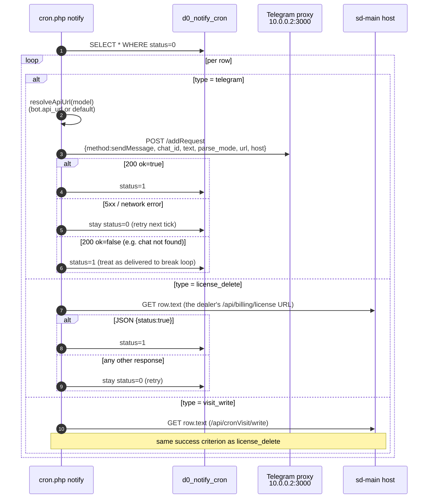

## 02. Architecture diagram {#d-02}

- **Kind**: `flowchart`
- **Source page**: [sd-billing/overview](/docs/sd-billing/overview)
- **Originating section**: Architecture diagram

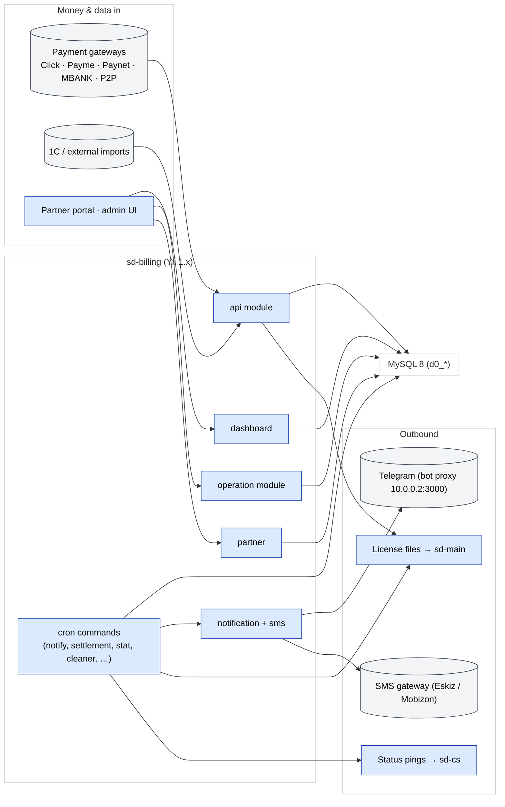

## 03. Integration with sd-main & sd-cs {#d-03}

- **Kind**: `sequence`
- **Source page**: [sd-billing/integration](/docs/sd-billing/integration)
- **Originating section**: Integration with sd-main & sd-cs

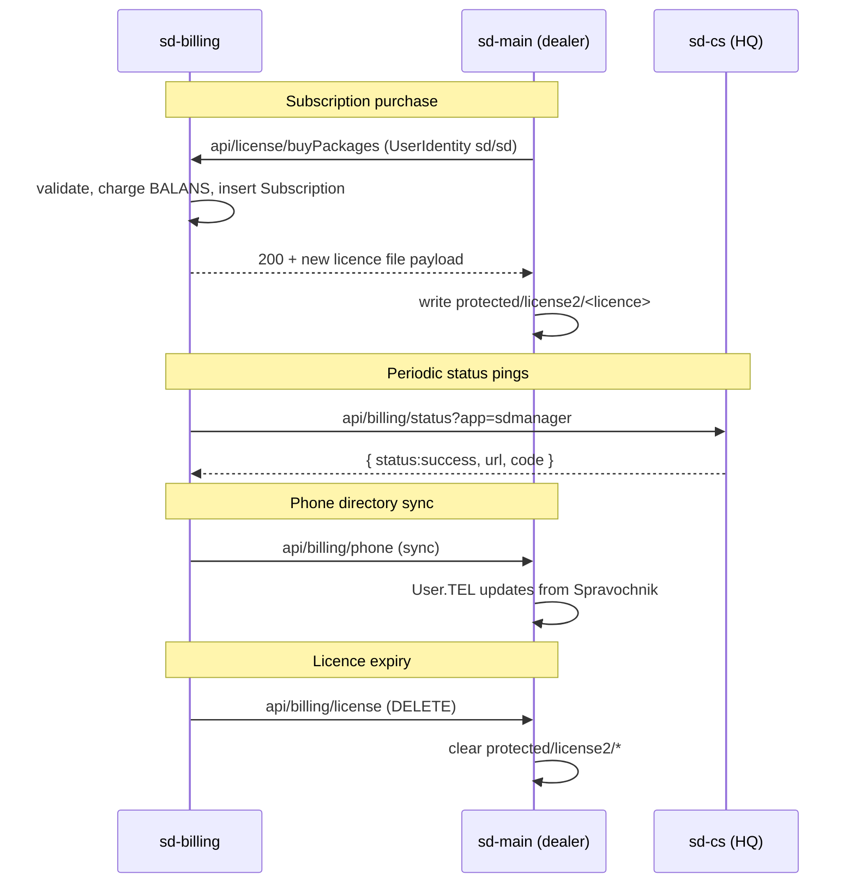

## 04. sd-billing domain model {#d-04}

- **Kind**: `er`
- **Source page**: [sd-billing/domain-model](/docs/sd-billing/domain-model)
- **Originating section**: sd-billing domain model

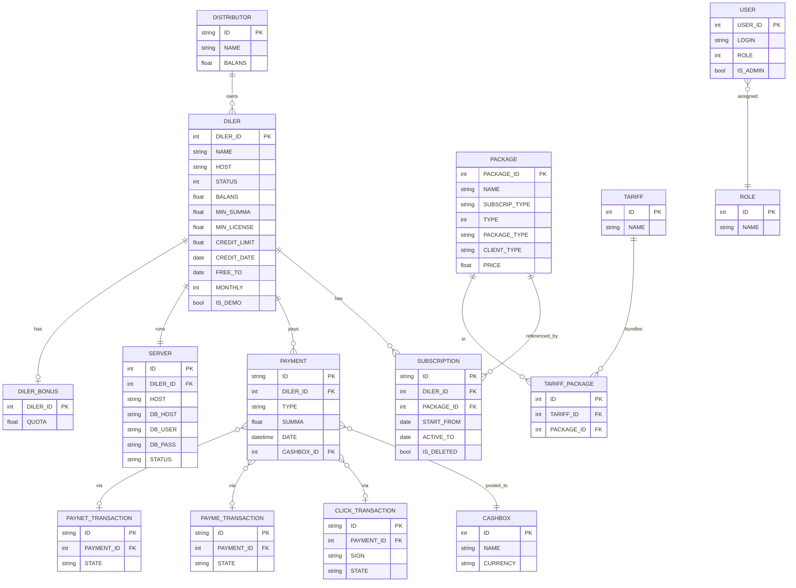

## 05. Sequence {#d-05}

- **Kind**: `sequence`
- **Source page**: [sd-billing/balance-and-money-math](/docs/sd-billing/balance-and-money-math)
- **Originating section**: Sequence

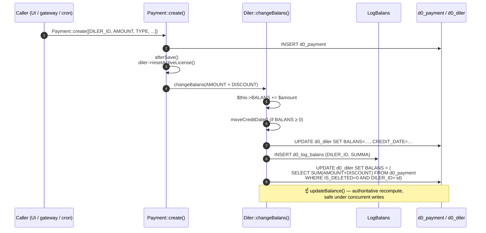

## 06. After balance changes — license refresh {#d-06}

- **Kind**: `flowchart`
- **Source page**: [sd-billing/balance-and-money-math](/docs/sd-billing/balance-and-money-math)
- **Originating section**: After balance changes — license refresh

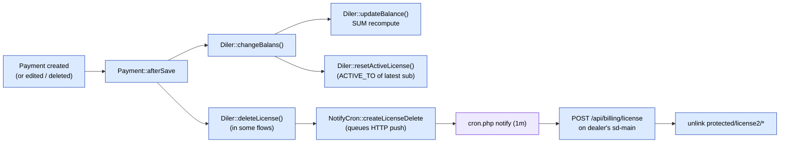

## 07. Subscription & licensing {#d-07}

- **Kind**: `flowchart`
- **Source page**: [sd-billing/subscription-flow](/docs/sd-billing/subscription-flow)
- **Originating section**: Subscription & licensing

## 08. ERD (shape view) {#d-08}

- **Kind**: `er`
- **Source page**: [sd-billing/data-scheme](/docs/sd-billing/data-scheme)
- **Originating section**: ERD (shape view)

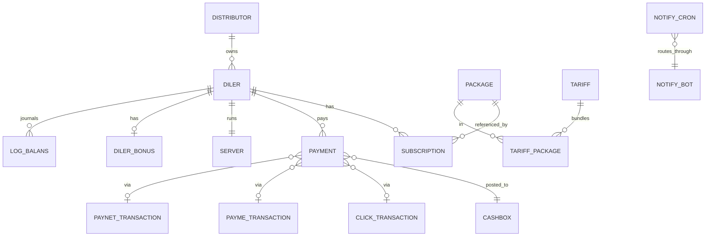

## 09. Settlement {#d-09}

- **Kind**: `flowchart`
- **Source page**: [sd-billing/cron-and-settlement](/docs/sd-billing/cron-and-settlement)
- **Originating section**: Settlement

```mermaid
flowchart LR
  S(["01:00 cron"]) --> READ["Pull last-month payments grouped by Distributor + Diler"]
  READ --> CALC["Compute share % per agreement"]
  CALC --> DEB["Insert Payment TYPE=distribute (debit Distributor)"]
  DEB --> CRE["Insert Payment TYPE=distribute (credit Diler)"]
  CRE --> LOG["LogDistrBalans rolling balance row"]
  LOG --> NOTIF[("Telegram summary to ops")]

  class S cron
  class READ,CALC,DEB,CRE,LOG action
  class NOTIF external
  classDef action   fill:#dbeafe,stroke:#1e40af,color:#000
  classDef approval fill:#fef3c7,stroke:#92400e,color:#000
  classDef success  fill:#dcfce7,stroke:#166534,color:#000
  classDef reject   fill:#fee2e2,stroke:#991b1b,color:#000
  classDef external fill:#f3f4f6,stroke:#374151,color:#000
  classDef cron     fill:#ede9fe,stroke:#6d28d9,color:#000
```

## 10. Notifications cron {#d-10}

- **Kind**: `sequence`
- **Source page**: [sd-billing/cron-and-settlement](/docs/sd-billing/cron-and-settlement)
- **Originating section**: Notifications cron

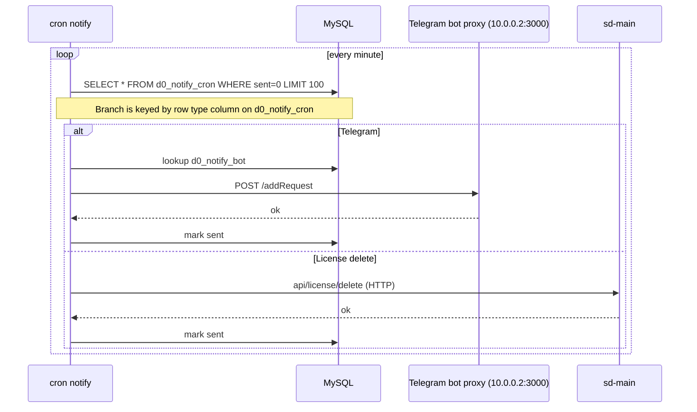

## 11. Click flow (canonical) {#d-11}

- **Kind**: `sequence`
- **Source page**: [sd-billing/payment-gateways](/docs/sd-billing/payment-gateways)
- **Originating section**: Click flow (canonical)

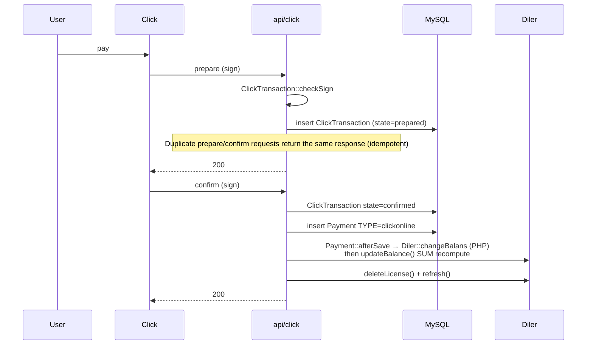

## 12. Payme flow {#d-12}

- **Kind**: `sequence`
- **Source page**: [sd-billing/payment-gateways](/docs/sd-billing/payment-gateways)
- **Originating section**: Payme flow

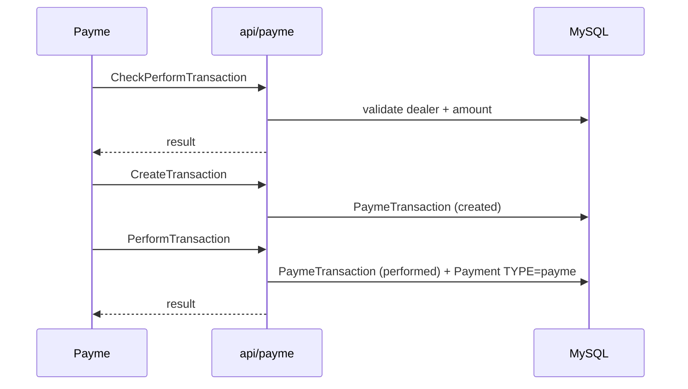

