# sd-billing — diagram gallery

Subscription billing — licensing, payments (Click/Payme/Paynet/MBANK), distributor settlement, dunning.

All 33 diagrams in this group, drawn inline.

## Index

| # | Title | Kind | Source page |
|---|-------|------|-------------|
| 01 | [5. Queue drain — `cron.php notify`](#d-01) | `sequence` | [sd-billing/notifications](/docs/sd-billing/notifications) |
| 02 | [10b. Phone directory sync](#d-02) | `flowchart` | [sd-billing/notifications](/docs/sd-billing/notifications) |
| 03 | [Architecture diagram](#d-03) | `flowchart` | [sd-billing/overview](/docs/sd-billing/overview) |
| 04 | [Integration with sd-main & sd-cs](#d-04) | `sequence` | [sd-billing/integration](/docs/sd-billing/integration) |
| 05 | [SMS package buy](#d-05) | `sequence` | [sd-billing/integration](/docs/sd-billing/integration) |
| 06 | [SMS send + forward](#d-06) | `sequence` | [sd-billing/integration](/docs/sd-billing/integration) |
| 07 | [SMS delivery callback](#d-07) | `sequence` | [sd-billing/integration](/docs/sd-billing/integration) |
| 08 | [sd-billing domain model](#d-08) | `er` | [sd-billing/domain-model](/docs/sd-billing/domain-model) |
| 09 | [Sequence](#d-09) | `sequence` | [sd-billing/balance-and-money-math](/docs/sd-billing/balance-and-money-math) |
| 10 | [After balance changes — license refresh](#d-10) | `flowchart` | [sd-billing/balance-and-money-math](/docs/sd-billing/balance-and-money-math) |
| 11 | [Subscription & licensing](#d-11) | `flowchart` | [sd-billing/subscription-flow](/docs/sd-billing/subscription-flow) |
| 12 | [Buy packages — round-trip sequence](#d-12) | `sequence` | [sd-billing/subscription-flow](/docs/sd-billing/subscription-flow) |
| 13 | [License renewal + expiry notify (flowchart)](#d-13) | `flowchart` | [sd-billing/subscription-flow](/docs/sd-billing/subscription-flow) |
| 14 | [ERD (shape view)](#d-14) | `er` | [sd-billing/data-scheme](/docs/sd-billing/data-scheme) |
| 15 | [Settlement](#d-15) | `flowchart` | [sd-billing/cron-and-settlement](/docs/sd-billing/cron-and-settlement) |
| 16 | [Notifications cron](#d-16) | `sequence` | [sd-billing/cron-and-settlement](/docs/sd-billing/cron-and-settlement) |
| 17 | [botLicenseReminder cron (sequence)](#d-17) | `sequence` | [sd-billing/cron-and-settlement](/docs/sd-billing/cron-and-settlement) |
| 18 | [Operation: manual payment entry](#d-18) | `flowchart` | [sd-billing/cron-and-settlement](/docs/sd-billing/cron-and-settlement) |
| 19 | [Cashbox transfer](#d-19) | `flowchart` | [sd-billing/cron-and-settlement](/docs/sd-billing/cron-and-settlement) |
| 20 | [Click flow (canonical)](#d-20) | `sequence` | [sd-billing/payment-gateways](/docs/sd-billing/payment-gateways) |
| 21 | [Payme flow](#d-21) | `sequence` | [sd-billing/payment-gateways](/docs/sd-billing/payment-gateways) |
| 22 | [Paynet flow](#d-22) | `sequence` | [sd-billing/payment-gateways](/docs/sd-billing/payment-gateways) |
| 23 | [Distributor payment create/update](#d-23) | `flowchart` | [sd-billing/payment-gateways](/docs/sd-billing/payment-gateways) |
| 24 | [Manual payment entry (dashboard variant)](#d-24) | `flowchart` | [sd-billing/payment-gateways](/docs/sd-billing/payment-gateways) |
| 25 | [Write-server (push licence file)](#d-25) | `sequence` | [sd-billing/payment-gateways](/docs/sd-billing/payment-gateways) |
| 26 | [License delete (revoke a subscription)](#d-26) | `sequence` | [sd-billing/api-reference](/docs/sd-billing/api-reference) |
| 27 | [License pay (manual fallback)](#d-27) | `flowchart` | [sd-billing/api-reference](/docs/sd-billing/api-reference) |
| 28 | [License batch buy (read-side variant)](#d-28) | `flowchart` | [sd-billing/api-reference](/docs/sd-billing/api-reference) |
| 29 | [Host status report](#d-29) | `sequence` | [sd-billing/api-reference](/docs/sd-billing/api-reference) |
| 30 | [App auth (sd-main → sd-billing)](#d-30) | `sequence` | [sd-billing/api-reference](/docs/sd-billing/api-reference) |
| 31 | [Workflow](#d-31) | `sequence` | [sd-billing/workflows/api-click](/docs/sd-billing/workflows/api-click) |
| 32 | [4a. Listing payments](#d-32) | `sequence` | [sd-billing/workflows/operation-payment](/docs/sd-billing/workflows/operation-payment) |
| 33 | [4. Workflow](#d-33) | `state` | [sd-billing/workflows/operation-subscription](/docs/sd-billing/workflows/operation-subscription) |

## 01. 5. Queue drain — `cron.php notify` {#d-01}

- **Kind**: `sequence`
- **Source page**: [sd-billing/notifications](/docs/sd-billing/notifications)
- **Originating section**: 5. Queue drain — `cron.php notify`

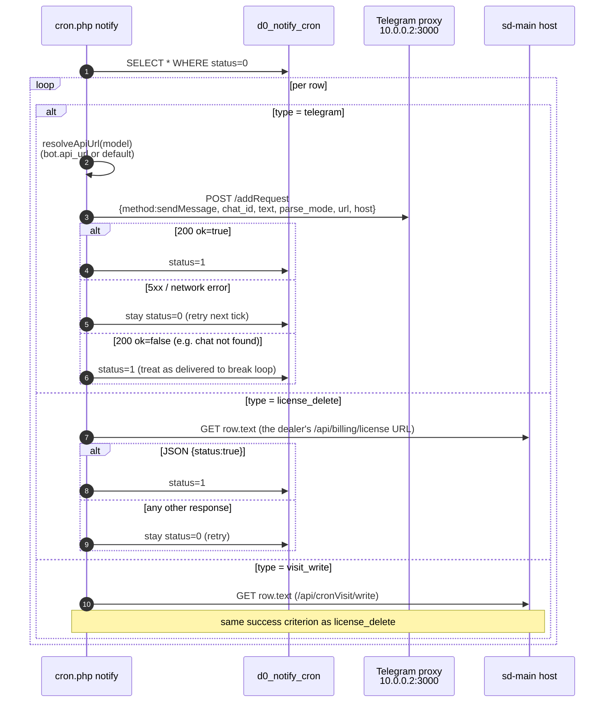

## 02. 10b. Phone directory sync {#d-02}

- **Kind**: `flowchart`
- **Source page**: [sd-billing/notifications](/docs/sd-billing/notifications)
- **Originating section**: 10b. Phone directory sync

```mermaid
flowchart LR
  S(["sd-billing<br/>updates Spravochnik / Diler.PHONE"]) --> ENQ["NotifyCron<br/>(or direct cron call)"]
  ENQ --> CR(["cron drains row"])
  CR --> SM["POST {Diler.DOMAIN}/api/billing/phone"]
  SM --> RG["sd-main: Report::getSpravochnik()"]
  RG --> WR["UPDATE User.TEL<br/>for agents/expeditors/partners"]
  WR --> OK(["next SMS run hits<br/>correct numbers"])

  class S,ENQ,SM,RG,WR action
  class CR cron
  class OK success
  classDef action   fill:#dbeafe,stroke:#1e40af,color:#000
  classDef approval fill:#fef3c7,stroke:#92400e,color:#000
  classDef success  fill:#dcfce7,stroke:#166534,color:#000
  classDef reject   fill:#fee2e2,stroke:#991b1b,color:#000
  classDef external fill:#f3f4f6,stroke:#374151,color:#000
  classDef cron     fill:#ede9fe,stroke:#6d28d9,color:#000
```

## 03. Architecture diagram {#d-03}

- **Kind**: `flowchart`
- **Source page**: [sd-billing/overview](/docs/sd-billing/overview)
- **Originating section**: Architecture diagram

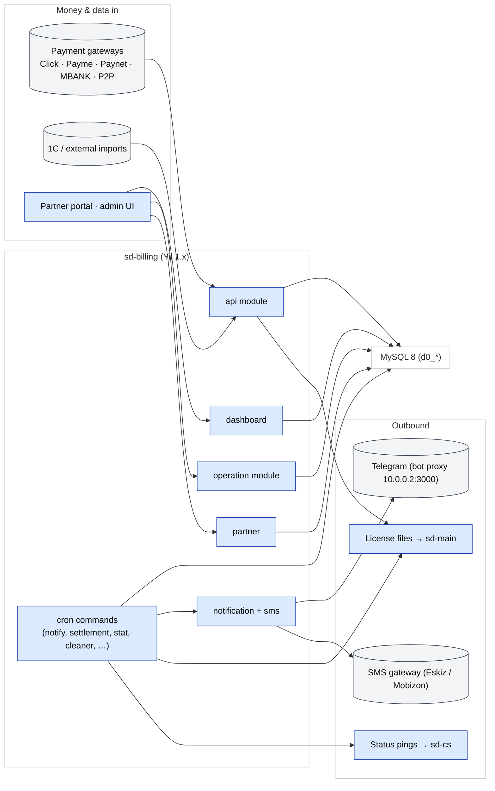

## 04. Integration with sd-main & sd-cs {#d-04}

- **Kind**: `sequence`
- **Source page**: [sd-billing/integration](/docs/sd-billing/integration)
- **Originating section**: Integration with sd-main & sd-cs

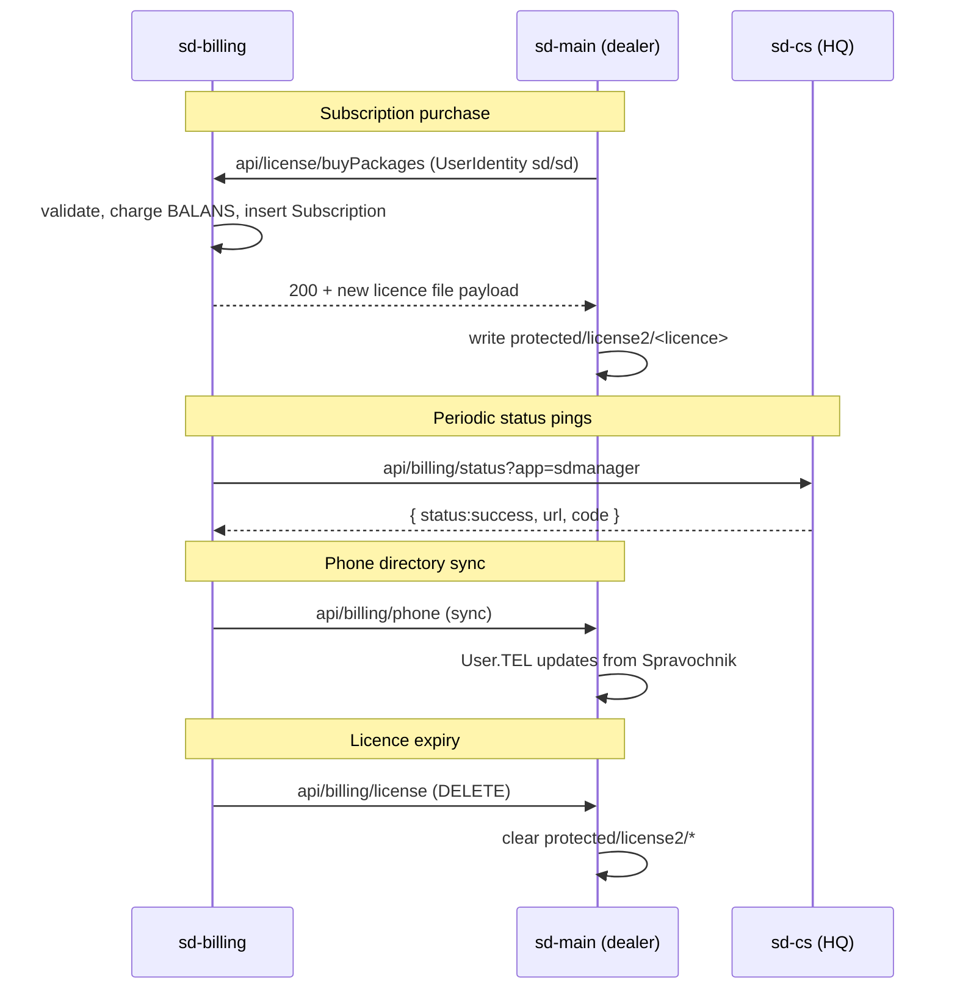

## 05. SMS package buy {#d-05}

- **Kind**: `sequence`
- **Source page**: [sd-billing/integration](/docs/sd-billing/integration)
- **Originating section**: SMS package buy

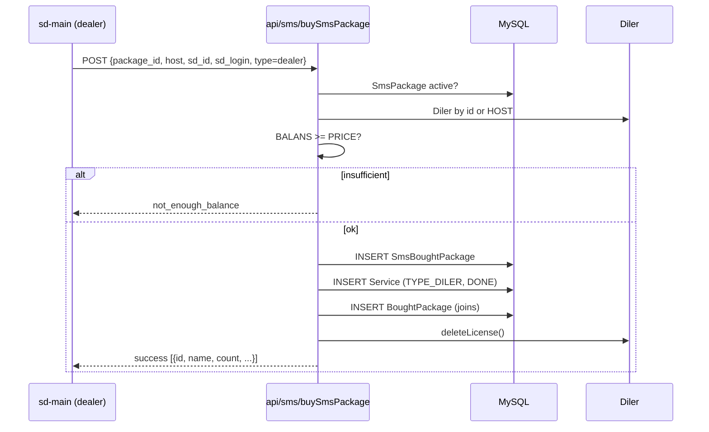

## 06. SMS send + forward {#d-06}

- **Kind**: `sequence`
- **Source page**: [sd-billing/integration](/docs/sd-billing/integration)
- **Originating section**: SMS send + forward

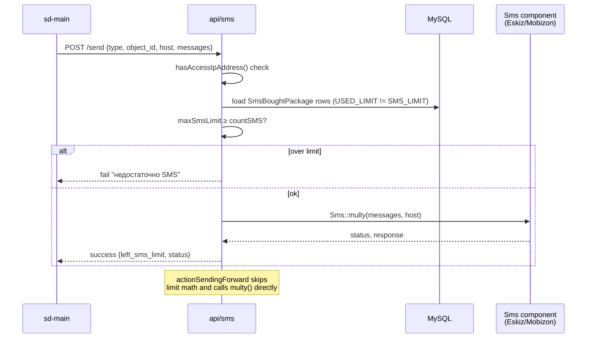

## 07. SMS delivery callback {#d-07}

- **Kind**: `sequence`
- **Source page**: [sd-billing/integration](/docs/sd-billing/integration)
- **Originating section**: SMS delivery callback

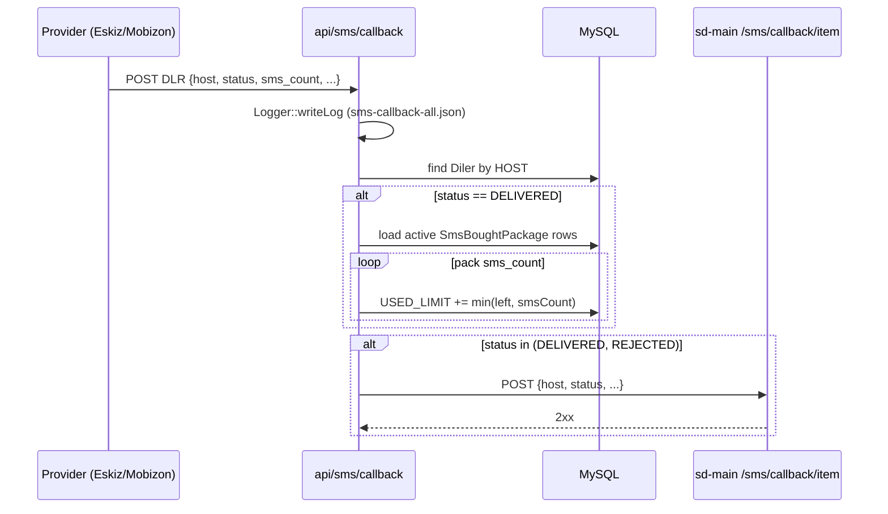

## 08. sd-billing domain model {#d-08}

- **Kind**: `er`
- **Source page**: [sd-billing/domain-model](/docs/sd-billing/domain-model)
- **Originating section**: sd-billing domain model

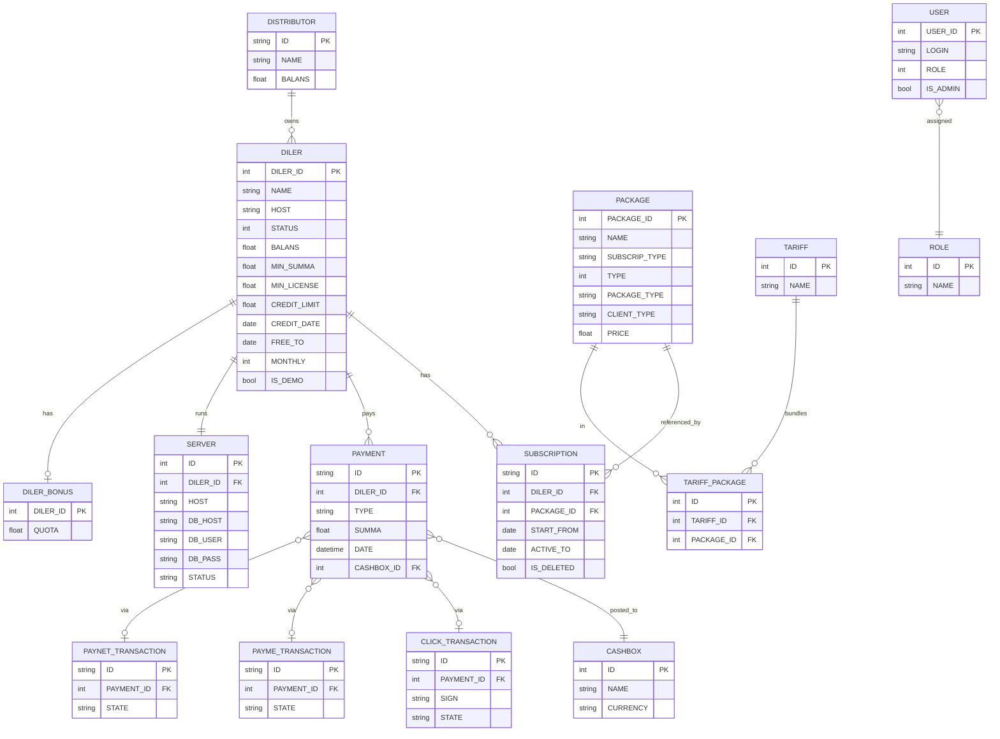

## 09. Sequence {#d-09}

- **Kind**: `sequence`
- **Source page**: [sd-billing/balance-and-money-math](/docs/sd-billing/balance-and-money-math)
- **Originating section**: Sequence

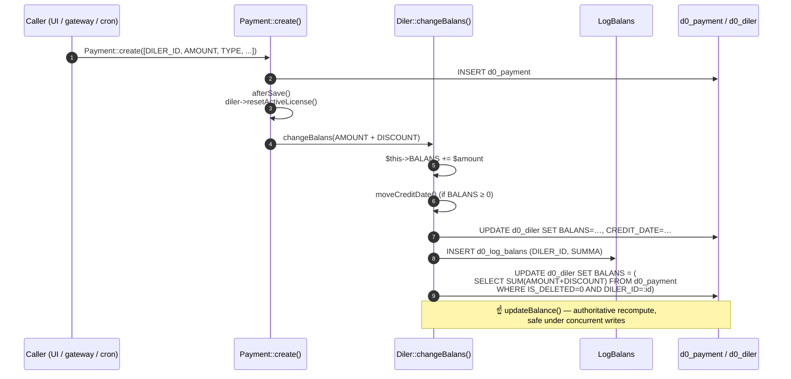

## 10. After balance changes — license refresh {#d-10}

- **Kind**: `flowchart`
- **Source page**: [sd-billing/balance-and-money-math](/docs/sd-billing/balance-and-money-math)
- **Originating section**: After balance changes — license refresh

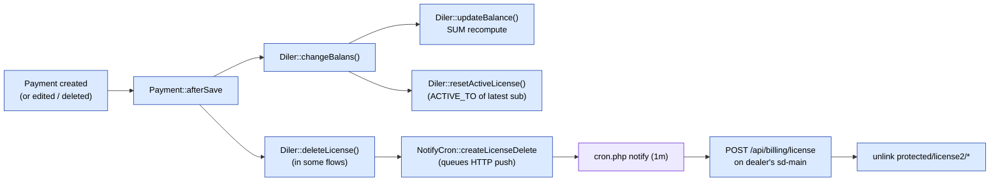

## 11. Subscription & licensing {#d-11}

- **Kind**: `flowchart`
- **Source page**: [sd-billing/subscription-flow](/docs/sd-billing/subscription-flow)
- **Originating section**: Subscription & licensing

```mermaid
flowchart LR
  S(["Dealer signs up"]) --> P["Pay (online or offline)"]
  P --> B["Diler.BALANS += summa"]
  B --> BUY["api/license/buyPackages"]
  BUY --> CHK{"Validation passes?"}
  CHK -- "no" --> ERR(["Reject"])
  CHK -- "yes" --> SUB["Subscription rows<br/>[START_FROM, ACTIVE_TO]"]
  SUB --> NEG["Payment TYPE=license (negative)"]
  NEG --> SET["Diler.refresh() — recompute BALANS, FREE_TO, MONTHLY"]
  SET --> SRV["Diler.HOST → Server.STATUS=SENT → OPENED"]
  SRV --> NOTIF(["Telegram + SMS to dealer"])

  class S action
  class P,B,BUY,SUB,NEG,SET,SRV action
  class CHK approval
  class ERR reject
  class NOTIF success
  classDef action   fill:#dbeafe,stroke:#1e40af,color:#000
  classDef approval fill:#fef3c7,stroke:#92400e,color:#000
  classDef success  fill:#dcfce7,stroke:#166534,color:#000
  classDef reject   fill:#fee2e2,stroke:#991b1b,color:#000
  classDef external fill:#f3f4f6,stroke:#374151,color:#000
  classDef cron     fill:#ede9fe,stroke:#6d28d9,color:#000
```

## 12. Buy packages — round-trip sequence {#d-12}

- **Kind**: `sequence`
- **Source page**: [sd-billing/subscription-flow](/docs/sd-billing/subscription-flow)
- **Originating section**: Buy packages — round-trip sequence

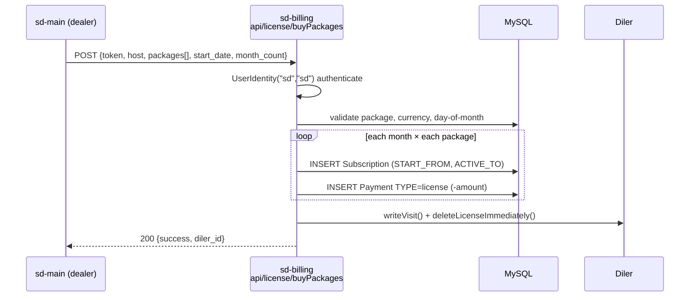

## 13. License renewal + expiry notify (flowchart) {#d-13}

- **Kind**: `flowchart`
- **Source page**: [sd-billing/subscription-flow](/docs/sd-billing/subscription-flow)
- **Originating section**: License renewal + expiry notify (flowchart)

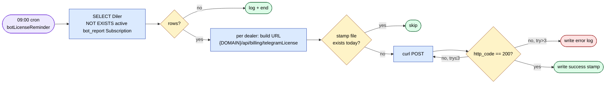

## 14. ERD (shape view) {#d-14}

- **Kind**: `er`
- **Source page**: [sd-billing/data-scheme](/docs/sd-billing/data-scheme)
- **Originating section**: ERD (shape view)

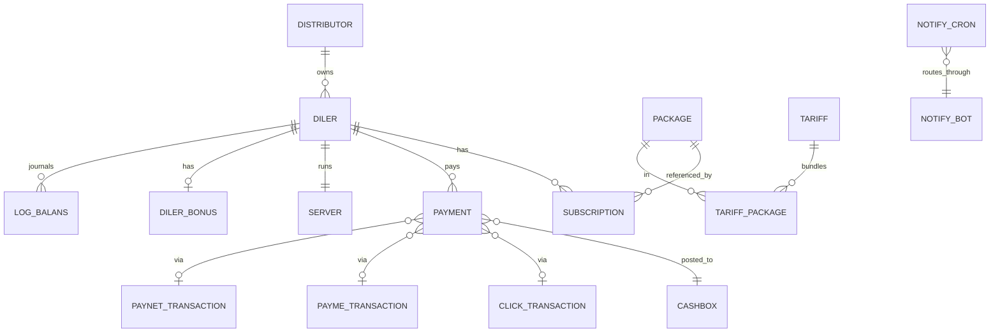

## 15. Settlement {#d-15}

- **Kind**: `flowchart`
- **Source page**: [sd-billing/cron-and-settlement](/docs/sd-billing/cron-and-settlement)
- **Originating section**: Settlement


## 16. Notifications cron {#d-16}

- **Kind**: `sequence`
- **Source page**: [sd-billing/cron-and-settlement](/docs/sd-billing/cron-and-settlement)
- **Originating section**: Notifications cron

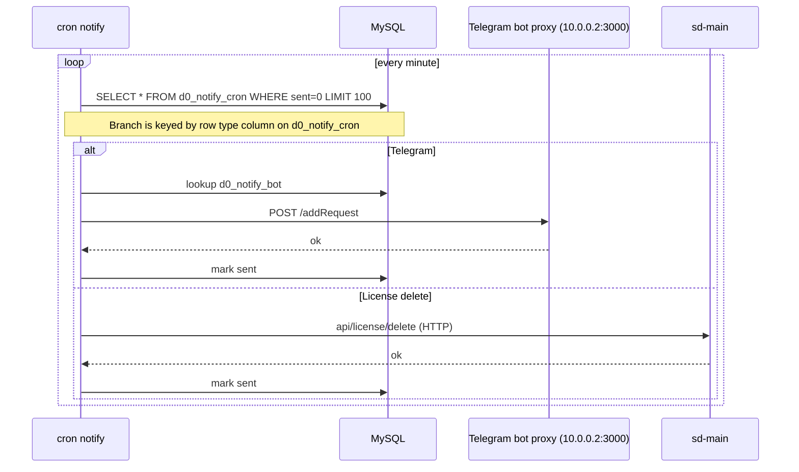

## 17. botLicenseReminder cron (sequence) {#d-17}

- **Kind**: `sequence`
- **Source page**: [sd-billing/cron-and-settlement](/docs/sd-billing/cron-and-settlement)
- **Originating section**: botLicenseReminder cron (sequence)

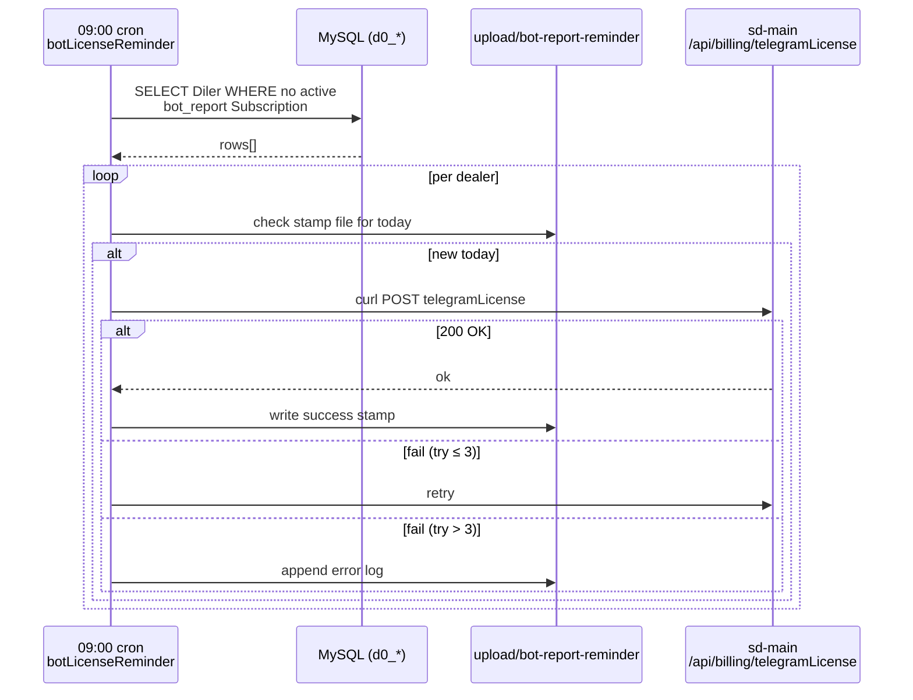

## 18. Operation: manual payment entry {#d-18}

- **Kind**: `flowchart`
- **Source page**: [sd-billing/cron-and-settlement](/docs/sd-billing/cron-and-settlement)
- **Originating section**: Operation: manual payment entry

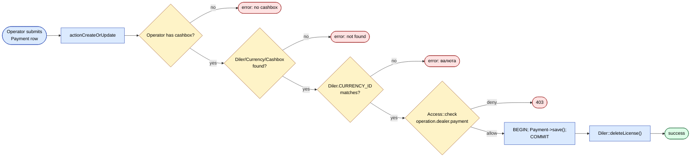

## 19. Cashbox transfer {#d-19}

- **Kind**: `flowchart`
- **Source page**: [sd-billing/cron-and-settlement](/docs/sd-billing/cron-and-settlement)
- **Originating section**: Cashbox transfer

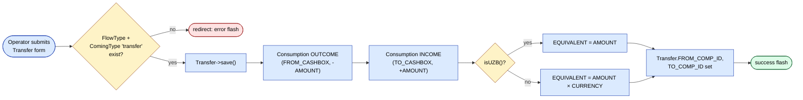

## 20. Click flow (canonical) {#d-20}

- **Kind**: `sequence`
- **Source page**: [sd-billing/payment-gateways](/docs/sd-billing/payment-gateways)
- **Originating section**: Click flow (canonical)

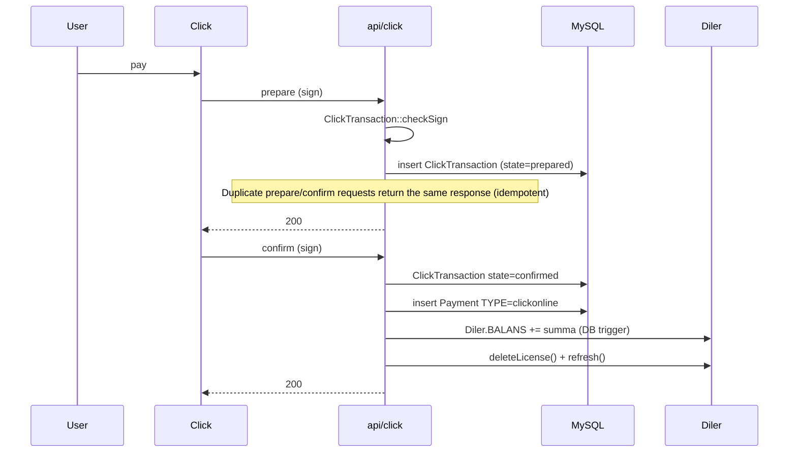

## 21. Payme flow {#d-21}

- **Kind**: `sequence`
- **Source page**: [sd-billing/payment-gateways](/docs/sd-billing/payment-gateways)
- **Originating section**: Payme flow

```mermaid
sequenceDiagram
  participant Pa as Payme
  participant API as api/payme
  participant DB as MySQL
  Pa->>API: CheckPerformTransaction
  API->>DB: validate dealer + amount
  API-->>Pa: result
  Pa->>API: CreateTransaction
  API->>DB: PaymeTransaction (created)
  Pa->>API: PerformTransaction
  API->>DB: PaymeTransaction (performed) + Payment TYPE=payme
  API-->>Pa: result
```

## 22. Paynet flow {#d-22}

- **Kind**: `sequence`
- **Source page**: [sd-billing/payment-gateways](/docs/sd-billing/payment-gateways)
- **Originating section**: Paynet flow

```mermaid
sequenceDiagram
  participant PN as Paynet gateway
  participant API as api/paynet (actionIndex)
  participant SVC as PaynetService<br/>(paynetuz extension)
  participant DB as MySQL
  participant D as Diler

  PN->>API: SOAP POST (XML)
  API->>API: UserIdentity("paynet","paynet")<br/>authenticate
  API->>SVC: SoapServer dispatch
  SVC->>DB: insert/update PaynetTransaction
  SVC->>DB: insert Payment TYPE=paynetonline
  SVC->>D: BALANS += summa (trigger)
  SVC->>D: Diler::deleteLicense() + refresh()
  SVC-->>API: SOAP result
  API-->>PN: 200 text/xml
```

## 23. Distributor payment create/update {#d-23}

- **Kind**: `flowchart`
- **Source page**: [sd-billing/payment-gateways](/docs/sd-billing/payment-gateways)
- **Originating section**: Distributor payment create/update

```mermaid
flowchart LR
  S(["Operator submits<br/>DistrPayment form"]) --> A["actionCreateAjax /<br/>actionUpdateAjax"]
  A --> AC{"Access::check<br/>operation.distr.payment"}
  AC -- "deny" --> R1(["403"])
  AC -- "allow" --> CB{"User has cashbox?"}
  CB -- "none" --> R2(["error: no cashbox"])
  CB -- "ok" --> CUR{"Distr.CURRENCY_ID<br/>== posted CURRENCY_ID?"}
  CUR -- "no" --> R3(["error: валюта неверно"])
  CUR -- "yes" --> SAVE["DistrPayment->save()<br/>(CASHBOX_ID auto-set)"]
  SAVE --> OK(["success"])

  class S,A,SAVE action
  class AC,CB,CUR approval
  class R1,R2,R3 reject
  class OK success
  classDef action   fill:#dbeafe,stroke:#1e40af,color:#000
  classDef approval fill:#fef3c7,stroke:#92400e,color:#000
  classDef success  fill:#dcfce7,stroke:#166534,color:#000
  classDef reject   fill:#fee2e2,stroke:#991b1b,color:#000
  classDef external fill:#f3f4f6,stroke:#374151,color:#000
  classDef cron     fill:#ede9fe,stroke:#6d28d9,color:#000
```

## 24. Manual payment entry (dashboard variant) {#d-24}

- **Kind**: `flowchart`
- **Source page**: [sd-billing/payment-gateways](/docs/sd-billing/payment-gateways)
- **Originating section**: Manual payment entry (dashboard variant)

```mermaid
flowchart LR
  S(["Operator submits<br/>Dealer payment"]) --> A["actionCreateAjax /<br/>actionUpdateAjax"]
  A --> AC{"Access::check<br/>operation.dealer.payment"}
  AC -- "deny" --> R1(["403"])
  AC -- "allow" --> CB{"User has cashbox?"}
  CB -- "none" --> R2(["error: no cashbox"])
  CB -- "ok" --> CUR{"Diler.CURRENCY_ID<br/>== posted CURRENCY_ID?"}
  CUR -- "no" --> R3(["error: валюта неверно"])
  CUR -- "yes" --> SAVE["Payment->save()<br/>(CASHBOX_ID auto-set)"]
  SAVE --> DL["Diler::deleteLicense()<br/>→ NotifyCron license_delete"]
  DL --> OK(["success"])

  class S,A,SAVE,DL action
  class AC,CB,CUR approval
  class R1,R2,R3 reject
  class OK success
  classDef action   fill:#dbeafe,stroke:#1e40af,color:#000
  classDef approval fill:#fef3c7,stroke:#92400e,color:#000
  classDef success  fill:#dcfce7,stroke:#166534,color:#000
  classDef reject   fill:#fee2e2,stroke:#991b1b,color:#000
  classDef external fill:#f3f4f6,stroke:#374151,color:#000
  classDef cron     fill:#ede9fe,stroke:#6d28d9,color:#000
```

## 25. Write-server (push licence file) {#d-25}

- **Kind**: `sequence`
- **Source page**: [sd-billing/payment-gateways](/docs/sd-billing/payment-gateways)
- **Originating section**: Write-server (push licence file)

```mermaid
sequenceDiagram
  participant Adm as Admin
  participant FX as FixController
  participant DLR as Diler (paged 10)
  participant SD as sd-main /api/billing/checkBranch
  participant SRV as Server row

  Adm->>FX: GET writeServer?offset&limit
  loop each Diler in page
    FX->>SD: POST /api/billing/checkBranch
    SD-->>FX: {db_server, web_branch}
    FX->>SRV: save(db_server, web_server, web_branch)
  end
  Adm->>FX: GET checkStatusServer
  FX->>SRV: status = OPENED (or DELETED)<br/>per dealer.isDeleted()
```

## 26. License delete (revoke a subscription) {#d-26}

- **Kind**: `sequence`
- **Source page**: [sd-billing/api-reference](/docs/sd-billing/api-reference)
- **Originating section**: License delete (revoke a subscription)

```mermaid
sequenceDiagram
  participant SM as sd-main / ops UI
  participant API as api/license/deleteOne
  participant DB as MySQL
  participant D as Diler

  SM->>API: POST {token, id, sd_id, sd_login}
  API->>API: auth() + day-of-month <= 5
  API->>DB: load Subscription (IS_DELETED=0)
  alt missing or non-bot type
    API-->>SM: fail
  else day > 5
    API-->>SM: fail "доступ запрещен"
  else allowed
    API->>DB: load siblings (DILER_ID, START_FROM, ACTIVE_TO)
    loop each sibling
      API->>DB: save SD_USER_* + deleteSubscrip()
    end
    API->>D: writeVisit() + deleteLicenseImmediately()
    API-->>SM: success {subscription_id}
  end
```

## 27. License pay (manual fallback) {#d-27}

- **Kind**: `flowchart`
- **Source page**: [sd-billing/api-reference](/docs/sd-billing/api-reference)
- **Originating section**: License pay (manual fallback)

```mermaid
flowchart LR
  S(["Operator receives<br/>off-channel payment"]) --> A["operation/PaymentController<br/>::actionCreateOrUpdate"]
  A --> AC{"Access<br/>operation.dealer.payment"}
  AC -- "deny" --> R1(["403"])
  AC -- "allow" --> SAVE["Payment->save()<br/>(TYPE=cash/p2p/cashless)"]
  SAVE --> DL["Diler::deleteLicense()<br/>(refresh licence on sd-main)"]
  DL --> OK(["success"])

  class S,A,SAVE,DL action
  class AC approval
  class R1 reject
  class OK success
  classDef action   fill:#dbeafe,stroke:#1e40af,color:#000
  classDef approval fill:#fef3c7,stroke:#92400e,color:#000
  classDef success  fill:#dcfce7,stroke:#166534,color:#000
  classDef reject   fill:#fee2e2,stroke:#991b1b,color:#000
  classDef external fill:#f3f4f6,stroke:#374151,color:#000
  classDef cron     fill:#ede9fe,stroke:#6d28d9,color:#000
```

## 28. License batch buy (read-side variant) {#d-28}

- **Kind**: `flowchart`
- **Source page**: [sd-billing/api-reference](/docs/sd-billing/api-reference)
- **Originating section**: License batch buy (read-side variant)

```mermaid
flowchart LR
  S(["sd-main loads<br/>billing screen"]) --> A["actionIndexBatch"]
  A --> AU{"auth() token"}
  AU -- "fail" --> R1(["fail"])
  AU -- "ok" --> D["getDilerWithRelations(host)"]
  D --> BAT["getSubscriptionsBatch(dilerId)<br/>13-month window"]
  BAT --> SQ["one SELECT Subscription<br/>+ one SELECT Payment"]
  SQ --> FOLD["group rows by month"]
  FOLD --> OUT["return balance, types,<br/>bonusLimit, subscriptions"]
  OUT --> OK(["success"])

  class S,A,D,BAT,SQ,FOLD,OUT action
  class AU approval
  class R1 reject
  class OK success
  classDef action   fill:#dbeafe,stroke:#1e40af,color:#000
  classDef approval fill:#fef3c7,stroke:#92400e,color:#000
  classDef success  fill:#dcfce7,stroke:#166534,color:#000
  classDef reject   fill:#fee2e2,stroke:#991b1b,color:#000
  classDef external fill:#f3f4f6,stroke:#374151,color:#000
  classDef cron     fill:#ede9fe,stroke:#6d28d9,color:#000
```

## 29. Host status report {#d-29}

- **Kind**: `sequence`
- **Source page**: [sd-billing/api-reference](/docs/sd-billing/api-reference)
- **Originating section**: Host status report

```mermaid
sequenceDiagram
  participant CL as Caller (ops tool)
  participant H as api/host
  participant U as User
  participant DLR as Diler

  CL->>H: POST /auth {login, password}
  H->>U: findByAttributes(LOGIN)
  H->>U: PASSWORD == md5(password)?
  alt invalid
    H-->>CL: 401
  else valid
    U->>U: generateToken()
    H-->>CL: 200 {token}
  end
  CL->>H: GET /activeHosts<br/>Authorization: Bearer …
  H->>H: checkPeakHours() (08–19 → 403)
  H->>DLR: findAll STATUS=ACTIVE
  DLR-->>H: rows
  H-->>CL: 200 {data:[{host,domain}]}
```

## 30. App auth (sd-main → sd-billing) {#d-30}

- **Kind**: `sequence`
- **Source page**: [sd-billing/api-reference](/docs/sd-billing/api-reference)
- **Originating section**: App auth (sd-main → sd-billing)

```mermaid
sequenceDiagram
  participant APP as sd-main / desktop app
  participant H as api/app
  participant U as User
  participant DB as MySQL

  APP->>H: POST /auth {login, password}
  H->>U: findByAttributes(LOGIN)
  H->>U: md5(password) match? isActive()?
  alt invalid
    H-->>APP: {success:false}
  else valid
    H->>H: UserIdentity::authenticate()
    H->>U: generateToken()
    H-->>APP: {success:true, token}
  end
  APP->>H: POST /execute {sql, token}
  H->>U: findByAttributes(TOKEN)
  alt token invalid or inactive
    H-->>APP: {success:false}
  else ok
    H->>DB: $db->createCommand(sql)->queryAll()
    DB-->>H: rows
    H-->>APP: {success:true, data}
  end
```

## 31. Workflow {#d-31}

- **Kind**: `sequence`
- **Source page**: [sd-billing/workflows/api-click](/docs/sd-billing/workflows/api-click)
- **Originating section**: Workflow

```mermaid
sequenceDiagram
    participant U  as User (Click app)
    participant C  as Click.uz
    participant CC as ClickController
    participant DB as MySQL
    participant D  as Diler (sd-main instance)

    U->>C: initiates payment
    C->>CC: POST /api/click/index  action=0 (prepare)
    CC->>CC: Logger::writeLog2 — raw request persisted
    CC->>CC: ClickTransaction::checkSign (HMAC md5)
    note over CC: returns -1 if sign invalid
    CC->>DB: validate Diler by merchant_trans_id (HOST field)
    note over CC: returns -5 if dealer not found or not UZB country
    CC->>DB: INSERT click_transaction (STATUS=0 / prepare)
    CC-->>C: 200 { error:0, merchant_prepare_id:#ID }
    note over CC: Logger::writeLog2 — response persisted

    C->>CC: POST /api/click/index  action=1 (confirm)
    CC->>CC: ClickTransaction::checkSign (HMAC md5, includes merchant_prepare_id)
    note over CC: returns -1 if sign invalid
    CC->>DB: SELECT click_transaction by merchant_prepare_id
    note over CC: returns -6 if not found
    CC->>CC: amount mismatch check
    note over CC: returns -2 if amounts differ
    CC->>CC: error field check (Click signals user cancellation via error≠0)
    note over CC: sets STATUS=2 (cancelled), returns -9
    CC->>CC: already-completed guard
    note over CC: returns -4 if STATUS already 1
    CC->>DB: BEGIN TRANSACTION
    CC->>DB: UPDATE click_transaction STATUS=1, UPDATE_AT=now()
    CC->>DB: INSERT payment TYPE=13 (clickonline), CASHBOX_ID=cashless
    note over DB: Payment::afterSave calls Diler::changeBalans(AMOUNT+DISCOUNT)
    note over DB: changeBalans increments BALANS, calls updateBalance() SUM recompute, writes LogBalans row
    CC->>D: Diler::deleteLicense() — enqueues HTTP DELETE to dealer's /api/billing/license
    CC->>D: Diler::refresh() — reload model state
    CC->>DB: UPDATE click_transaction PAYMENT_ID=payment.ID
    CC->>DB: COMMIT
    CC->>CC: TLogger::billingLog — structured billing audit log
    CC-->>C: 200 { error:0, merchant_confirm_id:#ID }
    note over CC: Logger::writeLog2 — response persisted
```

## 32. 4a. Listing payments {#d-32}

- **Kind**: `sequence`
- **Source page**: [sd-billing/workflows/operation-payment](/docs/sd-billing/workflows/operation-payment)
- **Originating section**: 4a. Listing payments

```mermaid
sequenceDiagram
  participant U as Operator
  participant FE as Browser (Vue)
  participant C as PaymentController
  participant DB as MySQL

  U->>FE: Opens /operation/payment/index
  FE->>C: GET actionIndex
  C->>DB: Load distributors, dealers, users, cashboxes, currencies, types
  C-->>FE: Render page with bootstrap data
  FE->>C: POST actionGetData {fromDate, toDate, ...filters}
  C->>DB: SELECT Payment JOIN Diler WHERE IS_DEMO=0 AND DATE IN [fromDate,toDate]
  C-->>FE: JSON array (column-first row format)
  FE->>U: Render data table
```

## 33. 4. Workflow {#d-33}

- **Kind**: `state`
- **Source page**: [sd-billing/workflows/operation-subscription](/docs/sd-billing/workflows/operation-subscription)
- **Originating section**: 4. Workflow

```mermaid
stateDiagram-v2
  direction LR
  [*] --> future : create (START_FROM > today)
  [*] --> active : create (START_FROM ≤ today ≤ ACTIVE_TO)
  future --> active : time passes
  active --> expired : time passes (ACTIVE_TO < today)
  future --> deleted : delete action
  active --> deleted : delete action
  expired --> deleted : delete action

  classDef action fill:#dbeafe,stroke:#1e40af,color:#000
  classDef success fill:#dcfce7,stroke:#166534,color:#000
  classDef reject fill:#fee2e2,stroke:#991b1b,color:#000
  classDef cron fill:#ede9fe,stroke:#6d28d9,color:#000
```

