# sd-main · Feature flows — diagram gallery

Per-module feature flows for everyday operations in sd-main.

All 116 diagrams in this group, drawn inline.

## Index

| # | Title | Kind | Source page |
|---|-------|------|-------------|
| 01 | [Approval workflow](#d-01) | `flowchart` | [modules/clients](/docs/modules/clients) |
| 02 | [Field-created client (mobile, api3)](#d-02) | `flowchart` | [modules/clients](/docs/modules/clients) |
| 03 | [Domain entities](#d-03) | `er` | [modules/clients](/docs/modules/clients) |
| 04 | [Workflow 1.1 — Field-created client pending review](#d-04) | `sequence` | [modules/clients](/docs/modules/clients) |
| 05 | [Workflow 1.2 — Agent visit-schedule attachment / detachment](#d-05) | `sequence` | [modules/clients](/docs/modules/clients) |
| 06 | [Workflow 1.3 — Price-type and sales-category assignment](#d-06) | `flowchart` | [modules/clients](/docs/modules/clients) |
| 07 | [Plan setup → recommend → publish](#d-07) | `flowchart` | [modules/planning](/docs/modules/planning) |
| 08 | [Percent-day editor](#d-08) | `sequence` | [modules/planning](/docs/modules/planning) |
| 09 | [Outlet plan / fact](#d-09) | `flowchart` | [modules/planning](/docs/modules/planning) |
| 10 | [Status & stock flow](#d-10) | `flowchart` | [modules/vs](/docs/modules/vs) |
| 11 | [Workflow VS.1 — Van-load creation](#d-11) | `sequence` | [modules/vs](/docs/modules/vs) |
| 12 | [Workflow VS.3 — End-of-day return](#d-12) | `flowchart` | [modules/vs](/docs/modules/vs) |
| 13 | [Role-based landing routing](#d-13) | `flowchart` | [modules/dashboard](/docs/modules/dashboard) |
| 14 | [Tile rendering flow](#d-14) | `flowchart` | [modules/dashboard](/docs/modules/dashboard) |
| 15 | [Expeditor KPI flow](#d-15) | `sequence` | [modules/dashboard](/docs/modules/dashboard) |
| 16 | [Key feature flow — Order export](#d-16) | `flowchart` | [modules/integration](/docs/modules/integration) |
| 17 | [Domain entities](#d-17) | `er` | [modules/integration](/docs/modules/integration) |
| 18 | [Workflow 1.1 — Integration credential configuration (per-user and filial-wide)](#d-18) | `sequence` | [modules/integration](/docs/modules/integration) |
| 19 | [Workflow 1.2 — Inbound order pull from external ERP (Smartup / Ritm 5)](#d-19) | `flowchart` | [modules/integration](/docs/modules/integration) |
| 20 | [Workflow 1.3 — Outbound e-invoice push to Didox](#d-20) | `sequence` | [modules/integration](/docs/modules/integration) |
| 21 | [Workflow 1.4 — Inbound POS registration request lifecycle (iDOKON)](#d-21) | `state` | [modules/integration](/docs/modules/integration) |
| 22 | [Didox e-invoice submit](#d-22) | `sequence` | [modules/integration](/docs/modules/integration) |
| 23 | [Faktura.uz e-VAT submit](#d-23) | `state` | [modules/integration](/docs/modules/integration) |
| 24 | [Generic 1C catalog import](#d-24) | `flowchart` | [modules/integration](/docs/modules/integration) |
| 25 | [Key feature flow — Report run](#d-25) | `flowchart` | [modules/report](/docs/modules/report) |
| 26 | [Approval flow](#d-26) | `flowchart` | [modules/payment](/docs/modules/payment) |
| 27 | [Online-payment callback flow (`pay` module)](#d-27) | `sequence` | [modules/payment](/docs/modules/payment) |
| 28 | [Click web-pay flow](#d-28) | `sequence` | [modules/payment](/docs/modules/payment) |
| 29 | [Payme web-pay flow](#d-29) | `state` | [modules/payment](/docs/modules/payment) |
| 30 | [api4 online-payment flow](#d-30) | `sequence` | [modules/payment](/docs/modules/payment) |
| 31 | [Visit → order → KPI flow](#d-31) | `flowchart` | [modules/doctor](/docs/modules/doctor) |
| 32 | [Target setup → recommend → share-to-agents](#d-32) | `flowchart` | [modules/doctor](/docs/modules/doctor) |
| 33 | [Outlet-plan workflow](#d-33) | `sequence` | [modules/doctor](/docs/modules/doctor) |
| 34 | [Template life-cycle](#d-34) | `state` | [modules/sms](/docs/modules/sms) |
| 35 | [Send flow — ad-hoc mailing](#d-35) | `sequence` | [modules/sms](/docs/modules/sms) |
| 36 | [SMS delivery callback (DLR) — focused view](#d-36) | `sequence` | [modules/sms](/docs/modules/sms) |
| 37 | [SMS delivery callback (DLR) — focused view](#d-37) | `flowchart` | [modules/sms](/docs/modules/sms) |
| 38 | [Key feature flow — Stocktake](#d-38) | `flowchart` | [modules/inventory](/docs/modules/inventory) |
| 39 | [Mobile barcode scan](#d-39) | `flowchart` | [modules/inventory](/docs/modules/inventory) |
| 40 | [Reconciliation — deltas vs current stock](#d-40) | `flowchart` | [modules/inventory](/docs/modules/inventory) |
| 41 | [Approve + post adjustments](#d-41) | `sequence` | [modules/inventory](/docs/modules/inventory) |
| 42 | [Approve + post adjustments](#d-42) | `flowchart` | [modules/inventory](/docs/modules/inventory) |
| 43 | [Domain entities](#d-43) | `er` | [modules/inventory](/docs/modules/inventory) |
| 44 | [Workflow 1.1 — Inventory item lifecycle (creation and status transitions)](#d-44) | `state` | [modules/inventory](/docs/modules/inventory) |
| 45 | [Workflow 1.2 — Mobile scan event (agent scans QR/barcode at client site)](#d-45) | `sequence` | [modules/inventory](/docs/modules/inventory) |
| 46 | [Incoming invoice → stock → outgoing invoice flow](#d-46) | `flowchart` | [modules/markirovka](/docs/modules/markirovka) |
| 47 | [CIS check & validate state machine](#d-47) | `state` | [modules/markirovka](/docs/modules/markirovka) |
| 48 | [Domain entities](#d-48) | `er` | [modules/settings-access-staff](/docs/modules/settings-access-staff) |
| 49 | [Workflow 1.1 — Price type and per-product price setup](#d-49) | `sequence` | [modules/settings-access-staff](/docs/modules/settings-access-staff) |
| 50 | [Workflow 1.2 — Bulk markup recalculation](#d-50) | `flowchart` | [modules/settings-access-staff](/docs/modules/settings-access-staff) |
| 51 | [Workflow 1.3 — Dynamic params configuration](#d-51) | `sequence` | [modules/settings-access-staff](/docs/modules/settings-access-staff) |
| 52 | [Workflow 1.4 — Bind user to role (RBAC)](#d-52) | `flowchart` | [modules/settings-access-staff](/docs/modules/settings-access-staff) |
| 53 | [Key feature flow — Submission](#d-53) | `flowchart` | [modules/audit-adt](/docs/modules/audit-adt) |
| 54 | [Domain entities](#d-54) | `er` | [modules/audit-adt](/docs/modules/audit-adt) |
| 55 | [Workflow 1.1 — Photo-report capture and review](#d-55) | `sequence` | [modules/audit-adt](/docs/modules/audit-adt) |
| 56 | [Workflow 1.2 — Storecheck (MML) compliance check](#d-56) | `flowchart` | [modules/audit-adt](/docs/modules/audit-adt) |
| 57 | [Architecture diagram](#d-57) | `flowchart` | [modules/gps3](/docs/modules/gps3) |
| 58 | [Workflow GPS3.1 — Load the map](#d-58) | `sequence` | [modules/gps3](/docs/modules/gps3) |
| 59 | [Directive issuance flow](#d-59) | `flowchart` | [modules/store](/docs/modules/store) |
| 60 | [Supplier purchase flow](#d-60) | `sequence` | [modules/store](/docs/modules/store) |
| 61 | [Domain entities](#d-61) | `er` | [modules/gps](/docs/modules/gps) |
| 62 | [Workflow 1.1 — Mobile GPS sample ingest](#d-62) | `sequence` | [modules/gps](/docs/modules/gps) |
| 63 | [Workflow 1.2 — Client map load and filter](#d-63) | `sequence` | [modules/gps](/docs/modules/gps) |
| 64 | [Workflow 1.3 — Live agent monitoring](#d-64) | `sequence` | [modules/gps](/docs/modules/gps) |
| 65 | [Workflow 1.4 — Trip playback (route view)](#d-65) | `sequence` | [modules/gps](/docs/modules/gps) |
| 66 | [GPS sample ingest](#d-66) | `sequence` | [modules/gps](/docs/modules/gps) |
| 67 | [Out-of-zone reject flow](#d-67) | `flowchart` | [modules/gps](/docs/modules/gps) |
| 68 | [Mobile sync handshake](#d-68) | `sequence` | [modules/sync](/docs/modules/sync) |
| 69 | [POS bridge — `components/Request.php`](#d-69) | `sequence` | [modules/sync](/docs/modules/sync) |
| 70 | [Key feature flow — Goods receipt](#d-70) | `flowchart` | [modules/warehouse](/docs/modules/warehouse) |
| 71 | [Stock transfer between warehouses (intra-filial)](#d-71) | `flowchart` | [modules/warehouse](/docs/modules/warehouse) |
| 72 | [Inter-filial movement (two-leg)](#d-72) | `flowchart` | [modules/warehouse](/docs/modules/warehouse) |
| 73 | [Domain entities](#d-73) | `er` | [modules/warehouse](/docs/modules/warehouse) |
| 74 | [Workflow 1.1 — Inter-filial stock movement request lifecycle](#d-74) | `sequence` | [modules/warehouse](/docs/modules/warehouse) |
| 75 | [Workflow 1.2 — Purchase draft review and acceptance](#d-75) | `flowchart` | [modules/warehouse](/docs/modules/warehouse) |
| 76 | [Workflow 1.3 — Stock adjustment (StoreCorrector)](#d-76) | `sequence` | [modules/warehouse](/docs/modules/warehouse) |
| 77 | [Architecture diagram](#d-77) | `flowchart` | [modules/gps2](/docs/modules/gps2) |
| 78 | [Workflow GPS2.1 — Load the map](#d-78) | `sequence` | [modules/gps2](/docs/modules/gps2) |
| 79 | [Workflow GPS2.2 — Route playback](#d-79) | `flowchart` | [modules/gps2](/docs/modules/gps2) |
| 80 | [Key feature flow — Online order](#d-80) | `flowchart` | [modules/onlineOrder](/docs/modules/onlineOrder) |
| 81 | [Loyalty-bonus payment flow](#d-81) | `sequence` | [modules/onlineOrder](/docs/modules/onlineOrder) |
| 82 | [Online payment redirect (Click / Payme / Paynet handoff)](#d-82) | `sequence` | [modules/onlineOrder](/docs/modules/onlineOrder) |
| 83 | [Online payment redirect (Click / Payme / Paynet handoff)](#d-83) | `flowchart` | [modules/onlineOrder](/docs/modules/onlineOrder) |
| 84 | [Partner CRUD flow](#d-84) | `flowchart` | [modules/partners](/docs/modules/partners) |
| 85 | [Status machine](#d-85) | `state` | [modules/orders](/docs/modules/orders) |
| 86 | [Key feature flow — Create order](#d-86) | `sequence` | [modules/orders](/docs/modules/orders) |
| 87 | [Order create — mobile (api3) with geofence + limits + reserve](#d-87) | `sequence` | [modules/orders](/docs/modules/orders) |
| 88 | [Order create — mobile (api3) with geofence + limits + reserve](#d-88) | `flowchart` | [modules/orders](/docs/modules/orders) |
| 89 | [Domain entities](#d-89) | `er` | [modules/orders](/docs/modules/orders) |
| 90 | [Workflow 1.1 — Web order creation](#d-90) | `sequence` | [modules/orders](/docs/modules/orders) |
| 91 | [Workflow 1.2 — Order lifecycle (status transitions)](#d-91) | `state` | [modules/orders](/docs/modules/orders) |
| 92 | [Workflow 1.3 — Mobile order creation via api3 and debt accumulation](#d-92) | `sequence` | [modules/orders](/docs/modules/orders) |
| 93 | [Workflow 1.4 — Partial defect declaration and stock return](#d-93) | `flowchart` | [modules/orders](/docs/modules/orders) |
| 94 | [Key feature flow — Visit & GPS](#d-94) | `flowchart` | [modules/agents](/docs/modules/agents) |
| 95 | [Visit post-check (server-side recheck of synced visits)](#d-95) | `flowchart` | [modules/agents](/docs/modules/agents) |
| 96 | [Limit enforcement (agent product / credit caps)](#d-96) | `flowchart` | [modules/agents](/docs/modules/agents) |
| 97 | [Domain entities](#d-97) | `er` | [modules/agents](/docs/modules/agents) |
| 98 | [Workflow 1.1 — Agent creation with subscription check](#d-98) | `sequence` | [modules/agents](/docs/modules/agents) |
| 99 | [Workflow 1.2 — Day-of-week route assignment](#d-99) | `sequence` | [modules/agents](/docs/modules/agents) |
| 100 | [Workflow 1.3 — KPI v2 monthly plan assignment](#d-100) | `flowchart` | [modules/agents](/docs/modules/agents) |
| 101 | [Workflow 1.4 — Product-quantity limit enforcement at order time](#d-101) | `flowchart` | [modules/agents](/docs/modules/agents) |
| 102 | [Stock reservation atomic op](#d-102) | `sequence` | [modules/stock](/docs/modules/stock) |
| 103 | [Stock reservation atomic op](#d-103) | `flowchart` | [modules/stock](/docs/modules/stock) |
| 104 | [Key feature flow — Defect & Return](#d-104) | `flowchart` | [modules/stock](/docs/modules/stock) |
| 105 | [Key feature flow — Daily remainder reconciliation](#d-105) | `flowchart` | [modules/stock](/docs/modules/stock) |
| 106 | [Auditor CRUD flow](#d-106) | `sequence` | [modules/team](/docs/modules/team) |
| 107 | [Team CRUD pattern](#d-107) | `flowchart` | [modules/team](/docs/modules/team) |
| 108 | [Rating publish & vote flow](#d-108) | `flowchart` | [modules/rating](/docs/modules/rating) |
| 109 | [Workflow RATING.1 — Build a rating](#d-109) | `sequence` | [modules/rating](/docs/modules/rating) |
| 110 | [Workflow RATING.2 — Publish hashed URL and collect votes](#d-110) | `flowchart` | [modules/rating](/docs/modules/rating) |
| 111 | [Domain entities](#d-111) | `er` | [modules/finans](/docs/modules/finans) |
| 112 | [Workflow 1.1 — Cashbox displacement (internal transfer between cashboxes)](#d-112) | `sequence` | [modules/finans](/docs/modules/finans) |
| 113 | [Workflow 1.2 — Inter-filial payment transfer (send → receive lifecycle)](#d-113) | `flowchart` | [modules/finans](/docs/modules/finans) |
| 114 | [Workflow 1.3 — Expense / income recording and P&L inclusion](#d-114) | `sequence` | [modules/finans](/docs/modules/finans) |
| 115 | [Cashbox displacement (move money)](#d-115) | `flowchart` | [modules/finans](/docs/modules/finans) |
| 116 | [Payment transfer (reassign across filial)](#d-116) | `flowchart` | [modules/finans](/docs/modules/finans) |

## 01. Approval workflow {#d-01}

- **Kind**: `flowchart`
- **Source page**: [modules/clients](/docs/modules/clients)
- **Originating section**: Approval workflow

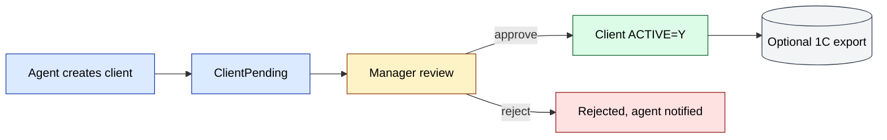

## 02. Field-created client (mobile, api3) {#d-02}

- **Kind**: `flowchart`
- **Source page**: [modules/clients](/docs/modules/clients)
- **Originating section**: Field-created client (mobile, api3)

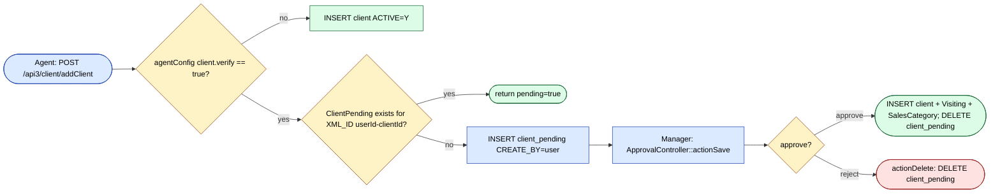

## 03. Domain entities {#d-03}

- **Kind**: `er`
- **Source page**: [modules/clients](/docs/modules/clients)
- **Originating section**: Domain entities

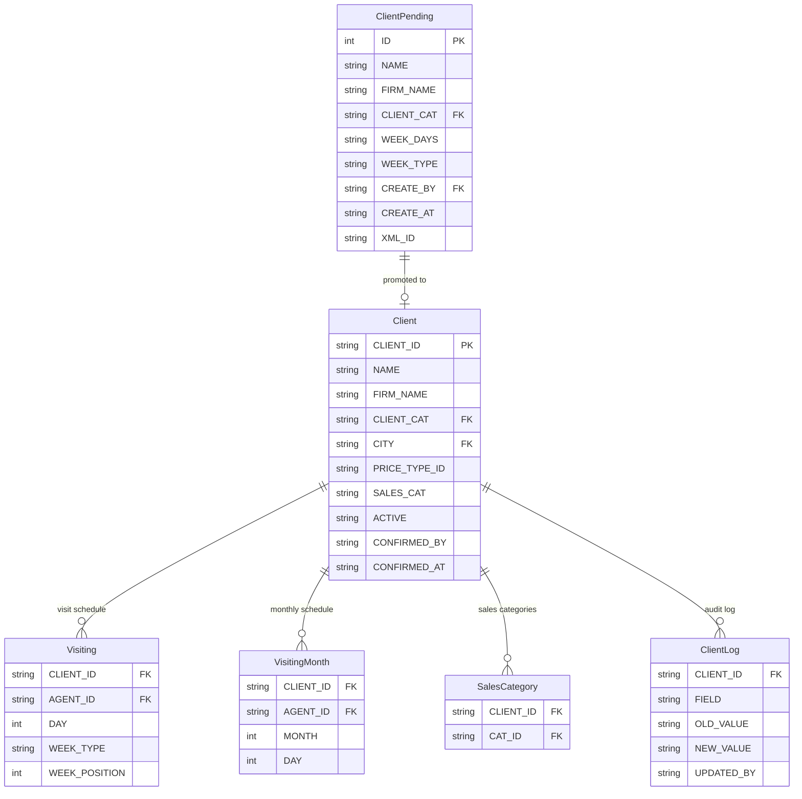

## 04. Workflow 1.1 — Field-created client pending review {#d-04}

- **Kind**: `sequence`
- **Source page**: [modules/clients](/docs/modules/clients)
- **Originating section**: Workflow 1.1 — Field-created client pending review

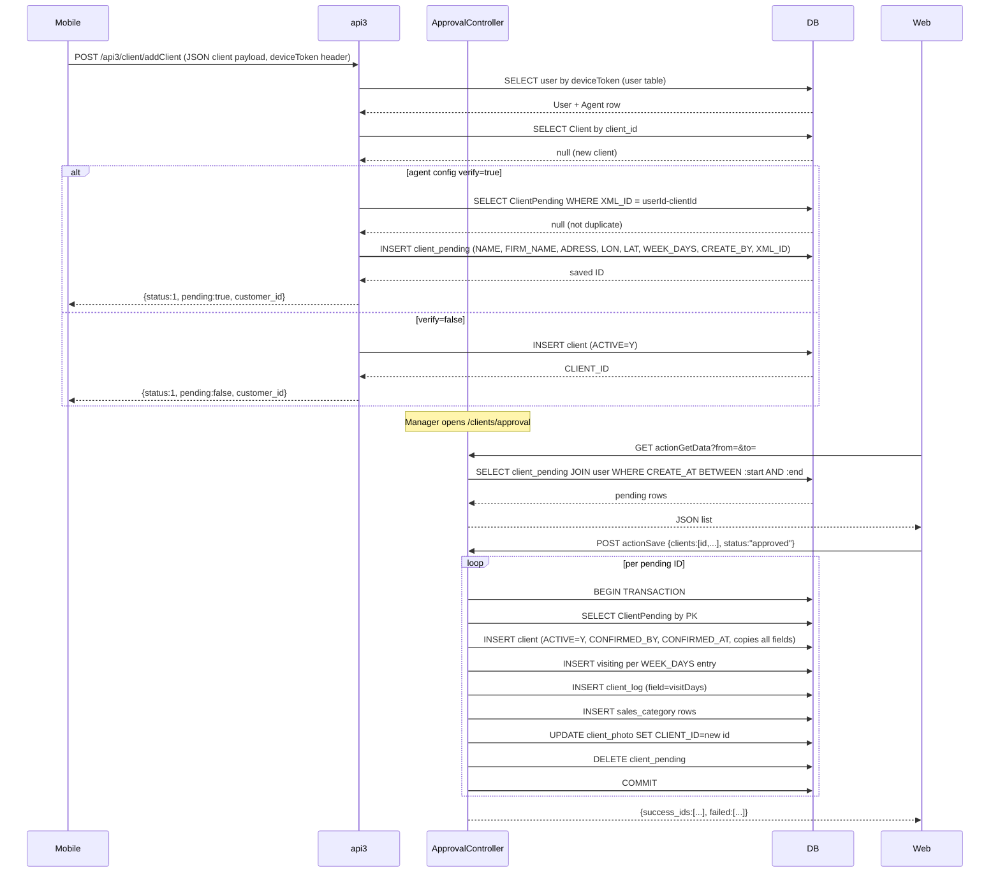

## 05. Workflow 1.2 — Agent visit-schedule attachment / detachment {#d-05}

- **Kind**: `sequence`
- **Source page**: [modules/clients](/docs/modules/clients)
- **Originating section**: Workflow 1.2 — Agent visit-schedule attachment / detachment

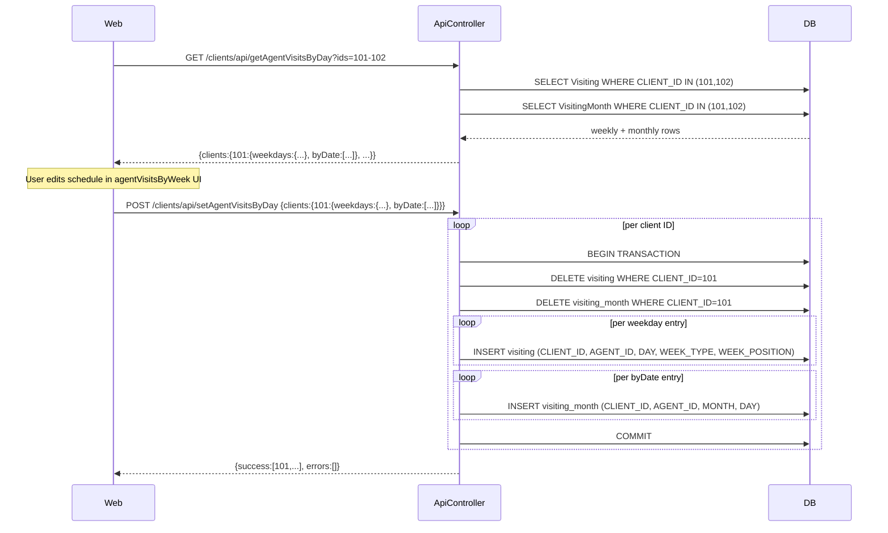

## 06. Workflow 1.3 — Price-type and sales-category assignment {#d-06}

- **Kind**: `flowchart`
- **Source page**: [modules/clients](/docs/modules/clients)
- **Originating section**: Workflow 1.3 — Price-type and sales-category assignment

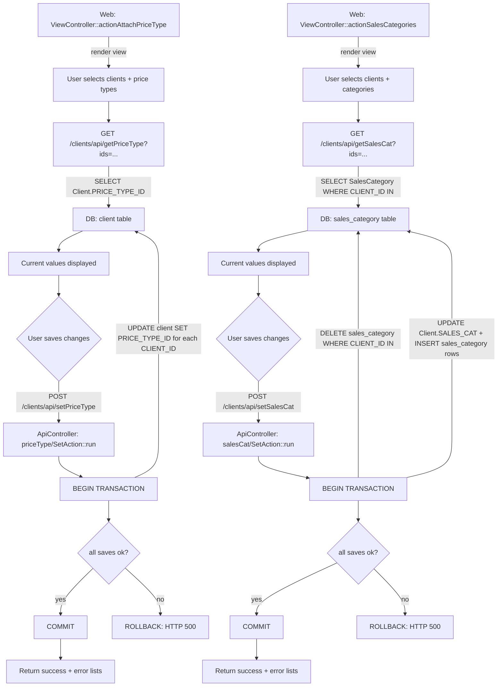

## 07. Plan setup → recommend → publish {#d-07}

- **Kind**: `flowchart`
- **Source page**: [modules/planning](/docs/modules/planning)
- **Originating section**: Plan setup → recommend → publish

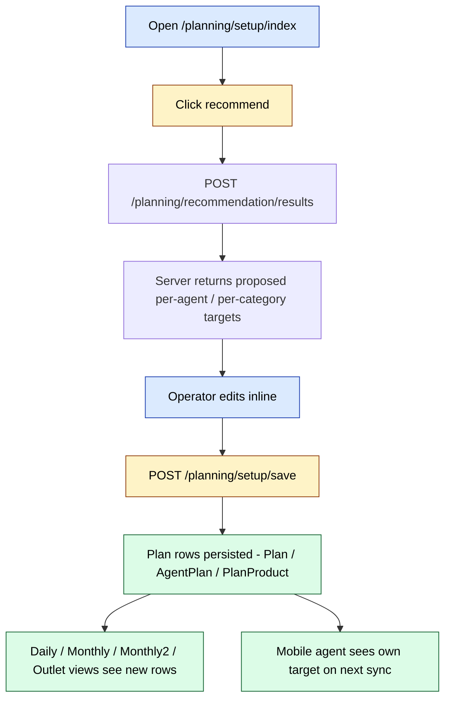

## 08. Percent-day editor {#d-08}

- **Kind**: `sequence`
- **Source page**: [modules/planning](/docs/modules/planning)
- **Originating section**: Percent-day editor

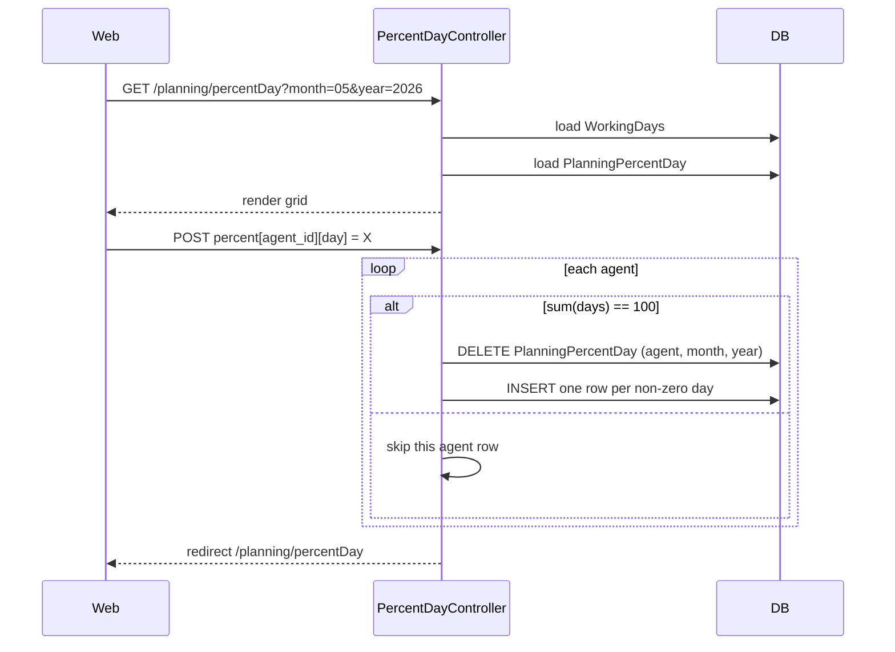

## 09. Outlet plan / fact {#d-09}

- **Kind**: `flowchart`
- **Source page**: [modules/planning](/docs/modules/planning)
- **Originating section**: Outlet plan / fact

```mermaid
flowchart LR
  SETUP[POST /planning/outlet/setup] --> SAVE[POST /planning/outlet/save]
  SAVE --> OP[(OutletPlan)]
  OP --> DATA[/planning/outlet/data: JSON for grid]
  DATA --> AGENT[/planning/outlet/agent: per-agent slice]
  DATA --> CAT[/planning/outlet/agentCategory: per-category slice]
  DATA --> TOTAL[/planning/outlet/total: total slice]
  AKB[/planning/outlet/agentAkbTotal] --> DATA

  classDef action   fill:#dbeafe,stroke:#1e40af,color:#000
  classDef success  fill:#dcfce7,stroke:#166534,color:#000

  class SETUP,SAVE action
  class OP,DATA,AGENT,CAT,TOTAL,AKB success
```

## 10. Status & stock flow {#d-10}

- **Kind**: `flowchart`
- **Source page**: [modules/vs](/docs/modules/vs)
- **Originating section**: Status & stock flow

```mermaid
flowchart LR
  WH["Warehouse<br/>FROM_STORE_ID"]:::external
  OP[Operator builds<br/>van-load]:::action
  VS[VsExchange<br/>STATUS draft]:::action
  VAV[VsExchange<br/>STATUS >= vsAvailableStatus]:::approval
  VAN["Van warehouse<br/>TO_STORE_ID"]:::external
  EXP[Expeditor sells<br/>door-to-door via api3]:::success
  RET[VsReturn<br/>created on dock]:::action
  WHB["Warehouse<br/>residual returned"]:::success

  WH --> OP --> VS --> VAV --> VAN --> EXP
  EXP --> RET --> WHB

  classDef action   fill:#dbeafe,stroke:#1e40af,color:#000
  classDef approval fill:#fef3c7,stroke:#92400e,color:#000
  classDef success  fill:#dcfce7,stroke:#166534,color:#000
  classDef reject   fill:#fee2e2,stroke:#991b1b,color:#000
  classDef external fill:#f3f4f6,stroke:#374151,color:#000
  classDef cron     fill:#ede9fe,stroke:#6d28d9,color:#000
```

## 11. Workflow VS.1 — Van-load creation {#d-11}

- **Kind**: `sequence`
- **Source page**: [modules/vs](/docs/modules/vs)
- **Originating section**: Workflow VS.1 — Van-load creation

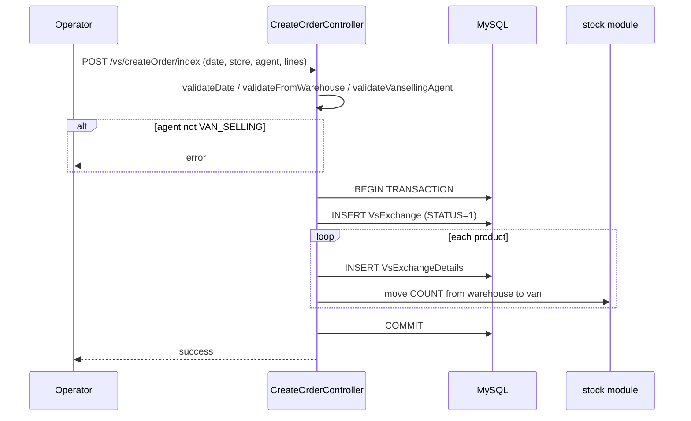

## 12. Workflow VS.3 — End-of-day return {#d-12}

- **Kind**: `flowchart`
- **Source page**: [modules/vs](/docs/modules/vs)
- **Originating section**: Workflow VS.3 — End-of-day return

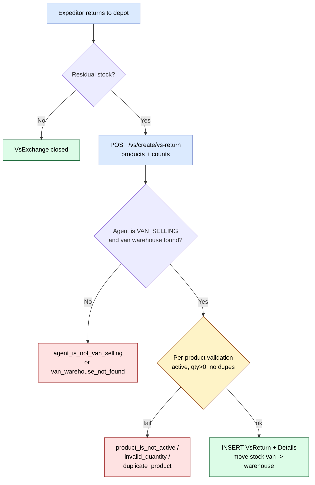

## 13. Role-based landing routing {#d-13}

- **Kind**: `flowchart`
- **Source page**: [modules/dashboard](/docs/modules/dashboard)
- **Originating section**: Role-based landing routing

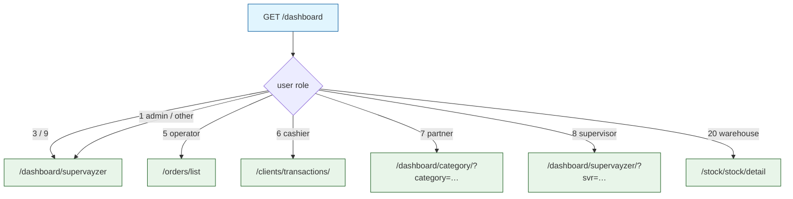

## 14. Tile rendering flow {#d-14}

- **Kind**: `flowchart`
- **Source page**: [modules/dashboard](/docs/modules/dashboard)
- **Originating section**: Tile rendering flow

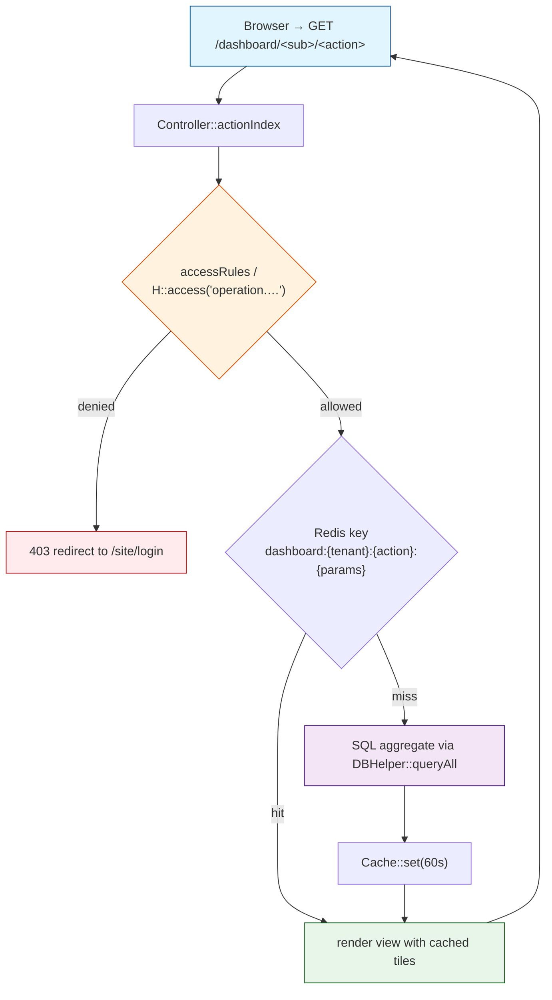

## 15. Expeditor KPI flow {#d-15}

- **Kind**: `sequence`
- **Source page**: [modules/dashboard](/docs/modules/dashboard)
- **Originating section**: Expeditor KPI flow

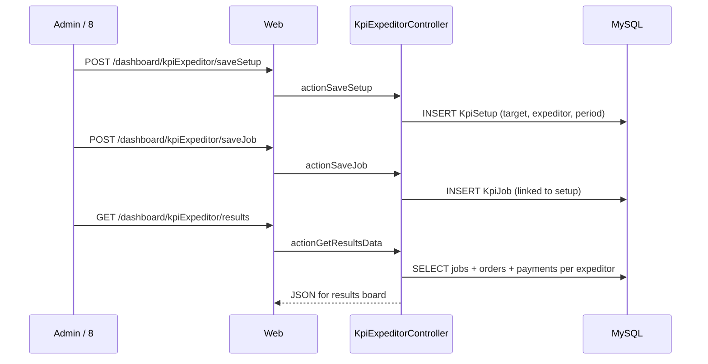

## 16. Key feature flow — Order export {#d-16}

- **Kind**: `flowchart`
- **Source page**: [modules/integration](/docs/modules/integration)
- **Originating section**: Key feature flow — Order export

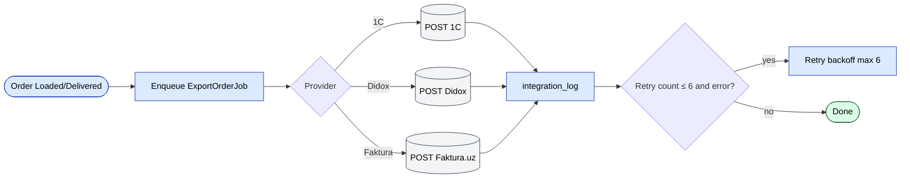

## 17. Domain entities {#d-17}

- **Kind**: `er`
- **Source page**: [modules/integration](/docs/modules/integration)
- **Originating section**: Domain entities

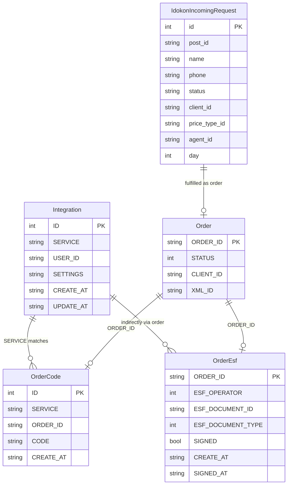

## 18. Workflow 1.1 — Integration credential configuration (per-user and filial-wide) {#d-18}

- **Kind**: `sequence`
- **Source page**: [modules/integration](/docs/modules/integration)
- **Originating section**: Workflow 1.1 — Integration credential configuration (per-user and filial-wide)

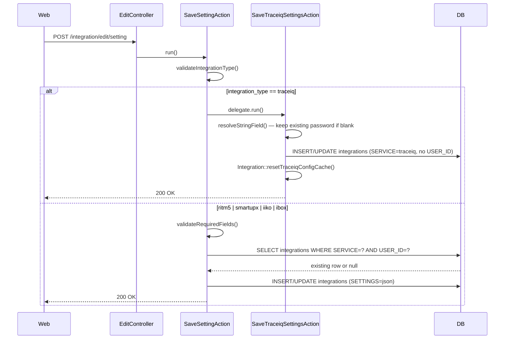

## 19. Workflow 1.2 — Inbound order pull from external ERP (Smartup / Ritm 5) {#d-19}

- **Kind**: `flowchart`
- **Source page**: [modules/integration](/docs/modules/integration)
- **Originating section**: Workflow 1.2 — Inbound order pull from external ERP (Smartup / Ritm 5)

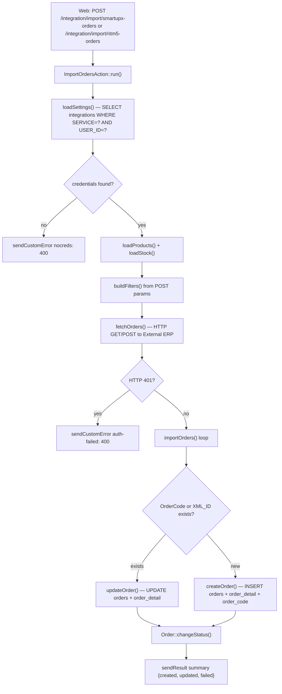

## 20. Workflow 1.3 — Outbound e-invoice push to Didox {#d-20}

- **Kind**: `sequence`
- **Source page**: [modules/integration](/docs/modules/integration)
- **Originating section**: Workflow 1.3 — Outbound e-invoice push to Didox

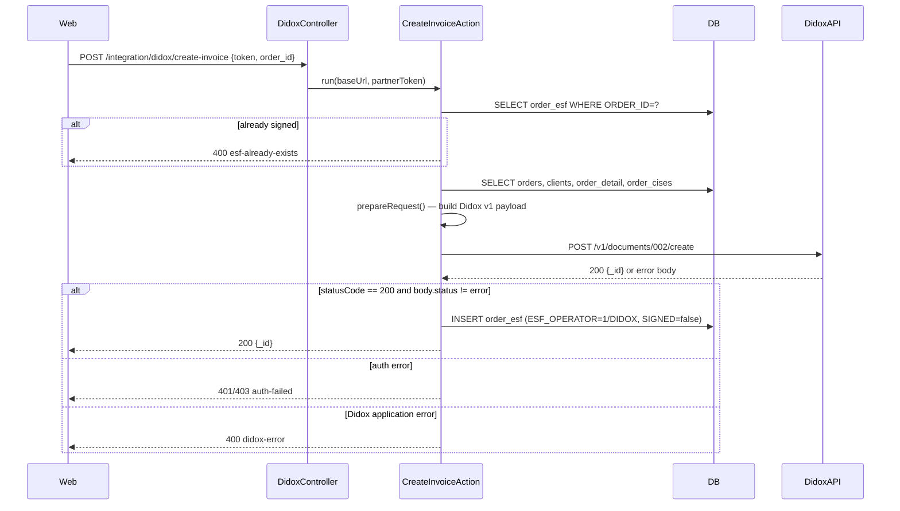

## 21. Workflow 1.4 — Inbound POS registration request lifecycle (iDOKON) {#d-21}

- **Kind**: `state`
- **Source page**: [modules/integration](/docs/modules/integration)
- **Originating section**: Workflow 1.4 — Inbound POS registration request lifecycle (iDOKON)

```mermaid
stateDiagram-v2
    [*] --> pending : iDOKON POS submits request
    pending --> attached : EditIdokonAttachRequestAction — operator links client_id, agent_id, price_type_id, day
    pending --> rejected : EditIdokonDetachRequestAction — operator rejects
    rejected --> pending : EditIdokonPendingOrdersAction — operator re-opens
    attached --> [*] : order fulfilled
```

## 22. Didox e-invoice submit {#d-22}

- **Kind**: `sequence`
- **Source page**: [modules/integration](/docs/modules/integration)
- **Originating section**: Didox e-invoice submit

```mermaid
sequenceDiagram
  participant UI as Operator UI
  participant EIMZO as EIMZO client (browser)
  participant Action as didox/CreateInvoiceAction
  participant Didox as api-partners.didox.uz
  participant DB as OrderEsf (d0_order_esf)

  UI->>EIMZO: sign(invoice xml)
  EIMZO-->>UI: token
  UI->>Action: POST order_id + token
  Action->>Action: loadOrder + OrderEsf existing-check (if SIGNED -> error)
  Action->>Action: prepareRequest (HasMarking, getOrderCises if needed)
  Action->>Didox: POST /v1/documents/002/create (user-key=token, Partner-Authorization)
  alt 200 + status=error
    Didox-->>Action: error body
    Action-->>UI: didox-error
  else 200 + ok
    Didox-->>Action: {_id: uniqueId}
    Action->>DB: INSERT OrderEsf ESF_DOCUMENT_ID=uniqueId SIGNED=false
    Action-->>UI: uniqueId
  else 401/403
    Action-->>UI: ERROR_CODE_AUTH_FAILED
  end
```

## 23. Faktura.uz e-VAT submit {#d-23}

- **Kind**: `state`
- **Source page**: [modules/integration](/docs/modules/integration)
- **Originating section**: Faktura.uz e-VAT submit

```mermaid
stateDiagram-v2
  [*] --> Draft: CreateInvoiceAction (INSERT OrderEsf SIGNED=false)
  Draft --> Submitted: Faktura accepts ImportDocumentRegister
  Submitted --> AwaitingSign: EIMZO sign performed client-side
  AwaitingSign --> Signed: CheckInvoiceAction polls and flips SIGNED=true
  Submitted --> Rejected: Faktura rejects
  Signed --> Cancelled: DeleteInvoiceAction (pre-counterparty)
  Draft --> [*]: DeleteInvoiceAction (drop pre-submit)
```

## 24. Generic 1C catalog import {#d-24}

- **Kind**: `flowchart`
- **Source page**: [modules/integration](/docs/modules/integration)
- **Originating section**: Generic 1C catalog import

```mermaid
flowchart LR
  A(["POST /integration/import/ritm5-import-orders"]) --> B["authenticate + authorize integration.ritm5.import.orders"]
  B --> C{"price_type + warehouse valid?"}
  C -->|no| R["sendError NOT_FOUND"]
  C -->|yes| D["loadStock + loadProducts (cache catalog)"]
  D --> E["buildFilters + fetchOrders from remote 1C"]
  E --> F{"per deal"}
  F --> G["findClient by XML_ID / INN (optional create)"]
  F --> H["upsert Order + OrderDetail (Order->save, OrderDetail->save)"]
  H --> S(["sendResult — per-row outcome"])

  classDef action   fill:#dbeafe,stroke:#1e40af,color:#000
  classDef approval fill:#fef3c7,stroke:#92400e,color:#000
  classDef success  fill:#dcfce7,stroke:#166534,color:#000
  classDef reject   fill:#fee2e2,stroke:#991b1b,color:#000
  classDef external fill:#f3f4f6,stroke:#374151,color:#000
  classDef cron     fill:#ede9fe,stroke:#6d28d9,color:#000

  class A,B,D,E,G,H action
  class C,F approval
  class S success
  class R reject
```

## 25. Key feature flow — Report run {#d-25}

- **Kind**: `flowchart`
- **Source page**: [modules/report](/docs/modules/report)
- **Originating section**: Key feature flow — Report run

```mermaid
flowchart LR
  U(["Open /report/<name>/index"]) --> F["Set filters"]
  F --> SQL["BaseReport::getSqlAndParams"]
  SQL --> CHK{"Cache hit on redis_app?"}
  CHK -->|yes| R["Render rows"]
  CHK -->|no| RUN["Aggregate SQL"]
  RUN --> CACHE[("redis_app TTL 300s")]
  CACHE --> R
  R --> EX{"Export?"}
  EX -->|JSON| J(["exportJson"])
  EX -->|Excel| XLS(["exportExcel via xlsxwriter"])

  classDef action   fill:#dbeafe,stroke:#1e40af,color:#000
  classDef approval fill:#fef3c7,stroke:#92400e,color:#000
  classDef success  fill:#dcfce7,stroke:#166534,color:#000
  classDef reject   fill:#fee2e2,stroke:#991b1b,color:#000
  classDef external fill:#f3f4f6,stroke:#374151,color:#000
  classDef cron     fill:#ede9fe,stroke:#6d28d9,color:#000

  class U,F,SQL,CHK,R,RUN,EX action
  class CACHE external
  class J,XLS success
```

## 26. Approval flow {#d-26}

- **Kind**: `flowchart`
- **Source page**: [modules/payment](/docs/modules/payment)
- **Originating section**: Approval flow

```mermaid
flowchart LR
  A(["Agent / expeditor collects cash"]) --> B["api3 writes PaymentDeliver CONFIRM=0"]
  B --> C(["Cashier opens /payment/approval"])
  C --> D{"Verify amount + cashbox + currency"}
  D --> E["actionSave per-row transaction"]
  E --> F["TRANS_TYPE=3 row inserted"]
  F --> G["Cashbox credited"]
  F --> H["ClientFinans::correct - debt drops"]

  classDef action   fill:#dbeafe,stroke:#1e40af,color:#000
  classDef approval fill:#fef3c7,stroke:#92400e,color:#000
  classDef success  fill:#dcfce7,stroke:#166534,color:#000
  classDef reject   fill:#fee2e2,stroke:#991b1b,color:#000
  classDef external fill:#f3f4f6,stroke:#374151,color:#000
  classDef cron     fill:#ede9fe,stroke:#6d28d9,color:#000

  class A,B,C action
  class D approval
  class G,H success
  class E action
  class F success
```

## 27. Online-payment callback flow (`pay` module) {#d-27}

- **Kind**: `sequence`
- **Source page**: [modules/payment](/docs/modules/payment)
- **Originating section**: Online-payment callback flow (`pay` module)

```mermaid
sequenceDiagram
  participant Provider as Click / Payme / Apelsin
  participant Endpoint as /pay/{provider}/index
  participant Log as LogHelper + Distr
  participant Tx as *Transaction model
  participant Order as OnlineOrder

  Provider->>Endpoint: POST callback JSON
  Endpoint->>Log: mirror payload to Telegram + file
  Endpoint->>Endpoint: log in as service user (LOGIN=click etc.)
  Endpoint->>Tx: checkSign / verify amount
  alt prepare
    Endpoint->>Tx: INSERT row STATUS=PREPARE
    Endpoint-->>Provider: ack code 0
  else complete
    Endpoint->>Tx: UPDATE row STATUS=COMPLETE
    Endpoint->>Order: PAY = provider name + createTransaction()
    Endpoint-->>Provider: ack code 0
  else error
    Endpoint-->>Provider: negative error code
  end
```

## 28. Click web-pay flow {#d-28}

- **Kind**: `sequence`
- **Source page**: [modules/payment](/docs/modules/payment)
- **Originating section**: Click web-pay flow

```mermaid
sequenceDiagram
  participant Click as Click gateway
  participant Endpoint as /pay/click/index
  participant Tx as ClickTransaction (d0_click_transactions)
  participant Order as OnlineOrder
  participant CT as ClientTransaction

  Click->>Endpoint: POST action=PREPARE + sign_string
  Endpoint->>Tx: checkSign($data, null)
  alt bad signature
    Endpoint-->>Click: error -1
  else amount mismatch
    Endpoint-->>Click: error -2
  else order not found
    Endpoint-->>Click: error -5
  else ok
    Endpoint->>Tx: INSERT STATUS=ACTION_PREPARE
    Endpoint-->>Click: error 0 (merchant_prepare_id)
    Click->>Endpoint: POST action=COMPLETE + merchant_prepare_id
    Endpoint->>Tx: UPDATE STATUS=ACTION_COMPLETE
    Endpoint->>Order: PAY=click + createTransaction()
    Order->>CT: INSERT TRANS_TYPE=3 (ONLINE_PAYMENT_ID)
    Endpoint-->>Click: error 0
  end
```

## 29. Payme web-pay flow {#d-29}

- **Kind**: `state`
- **Source page**: [modules/payment](/docs/modules/payment)
- **Originating section**: Payme web-pay flow

```mermaid
stateDiagram-v2
  [*] --> Created: CheckPerformTransaction (validate order + amount)
  Created --> Pending: CreateTransaction (INSERT PAYME_STATE=1)
  Pending --> Paid: PerformTransaction (PAYME_STATE=2, PAYME_PAY_TIME)
  Pending --> Cancelled: CancelTransaction (PAYME_STATE=-1)
  Paid --> Refunded: CancelTransaction post-pay (PAYME_STATE=-2)
  Created --> [*]: CheckTransaction (read-only probe)
  Paid --> [*]: GetStatement (range read)
```

## 30. api4 online-payment flow {#d-30}

- **Kind**: `sequence`
- **Source page**: [modules/payment](/docs/modules/payment)
- **Originating section**: api4 online-payment flow

```mermaid
sequenceDiagram
  participant Portal as B2B portal / api4
  participant Action as PaymeGoPayAction
  participant Paycom as checkout.paycom.uz
  participant DB as Local DB

  Portal->>Action: POST token + order_id + amount + items
  Action->>Action: loadOrder + checkOrderPaymentStatus
  Action->>Action: prepareFiscalItems + checkAmount
  Action->>Paycom: receipts.create (X-Auth merchantId:Key)
  Paycom-->>Action: receipt {_id, state}
  Action->>DB: INSERT ClientPaymeTransaction PAYME_STATE=1
  Action->>Paycom: receipts.pay (id + token)
  Paycom-->>Action: receipt state=PAYME_STATE_PAID
  Action->>DB: UPDATE PAYME_STATE=2, PAYME_PAY_TIME
  Action->>DB: INSERT OnlinePayment + ClientTransaction TRANS_TYPE=3
  Action->>DB: TransactionClosed::closeTransaction(invoice, payment)
  Action-->>Portal: {id, fiscal_items}
```

## 31. Visit → order → KPI flow {#d-31}

- **Kind**: `flowchart`
- **Source page**: [modules/doctor](/docs/modules/doctor)
- **Originating section**: Visit → order → KPI flow

```mermaid
flowchart LR
  A[Agent visits pharmacy] --> B{Order placed?}
  B -- Yes --> C[Order row]
  B -- No --> D[Visit only]
  C --> E[Strike-rate counter]
  C --> F[AKB / SKU coverage]
  C --> G[Outlet fact]
  E --> H[Doctor dashboard]
  F --> H
  G --> I[Forecast]
  H --> J[Target vs actual]
  I --> J

  classDef action   fill:#dbeafe,stroke:#1e40af,color:#000
  classDef approval fill:#fef3c7,stroke:#92400e,color:#000
  classDef success  fill:#dcfce7,stroke:#166534,color:#000
  classDef reject   fill:#fee2e2,stroke:#991b1b,color:#000
  classDef external fill:#f3f4f6,stroke:#374151,color:#000
  classDef cron     fill:#ede9fe,stroke:#6d28d9,color:#000

  class A,D action
  class C,E,F,G success
  class B approval
  class H,I,J external
```

## 32. Target setup → recommend → share-to-agents {#d-32}

- **Kind**: `flowchart`
- **Source page**: [modules/doctor](/docs/modules/doctor)
- **Originating section**: Target setup → recommend → share-to-agents

```mermaid
flowchart TD
  S[Open /doctor/coverage/index] --> R[Click 'recommend']
  R --> RA[POST recommend - server proposes per-supervisor and per-agent targets]
  RA --> EDIT[Operator edits the proposed values inline]
  EDIT --> SAVE[POST index - delete TargetCoverage for month/year and re-insert]
  SAVE --> SHARE[Click 'shareToAgents']
  SHARE --> AG[POST shareToAgents - fan out per-agent rows]
  AG --> MOB[Mobile app sees own target on next sync]

  classDef action   fill:#dbeafe,stroke:#1e40af,color:#000
  classDef approval fill:#fef3c7,stroke:#92400e,color:#000
  classDef success  fill:#dcfce7,stroke:#166534,color:#000

  class S,EDIT action
  class R,SHARE approval
  class SAVE,AG,MOB success
```

## 33. Outlet-plan workflow {#d-33}

- **Kind**: `sequence`
- **Source page**: [modules/doctor](/docs/modules/doctor)
- **Originating section**: Outlet-plan workflow

```mermaid
sequenceDiagram
  participant Web
  participant OutletPlanController
  participant Excel
  participant DB

  Web->>OutletPlanController: GET /doctor/outletPlan/index
  OutletPlanController->>DB: load OutletPlan rows for month/year
  OutletPlanController-->>Web: grid

  alt manual edit
    Web->>OutletPlanController: POST writeOutletPlan / writeAjaxFact
    OutletPlanController->>DB: upsert OutletPlan
  else excel import
    Web->>OutletPlanController: POST importExcel (file)
    OutletPlanController->>Excel: excelToJson
    Excel-->>OutletPlanController: rows
    OutletPlanController->>DB: bulk upsert OutletPlan
  else calculate
    Web->>OutletPlanController: POST calculatePlan
    OutletPlanController->>DB: derive plan from history
    OutletPlanController->>DB: bulk upsert OutletPlan
  end
```

## 34. Template life-cycle {#d-34}

- **Kind**: `state`
- **Source page**: [modules/sms](/docs/modules/sms)
- **Originating section**: Template life-cycle

```mermaid
stateDiagram-v2
  [*] --> moderation: actionCreate (POST)
  moderation --> ready: provider returned reklama/service
  moderation --> rejected: provider returned rejected
  moderation --> rejected: 2 days passed (auto-reject)
  ready --> ready: send mailings (cannot delete)
  rejected --> [*]: actionDelete (DELETE)
  moderation --> [*]: actionDelete (DELETE)
  seeded: default — seeded by tenant init, cannot delete
```

## 35. Send flow — ad-hoc mailing {#d-35}

- **Kind**: `sequence`
- **Source page**: [modules/sms](/docs/modules/sms)
- **Originating section**: Send flow — ad-hoc mailing

```mermaid
sequenceDiagram
  participant U as Operator
  participant W as Web (/sms/view/list)
  participant M as MessageController
  participant DB as MySQL
  participant B as Billing gateway
  participant P as Provider (e.g. Eskiz)
  participant CB as CallbackController
  U->>W: POST /sms/message/send (template_id, messages[])
  W->>M: actionSend
  M->>DB: validate template + phone format
  M->>DB: BEGIN tx, INSERT SmsMessage, INSERT N SmsMessageItem
  M->>B: POST billing/api/sms/send (type=dealer, host, messages[])
  B->>P: relay
  B-->>M: 200 {left_sms_limit, statuses}
  M->>DB: COMMIT
  M-->>W: {left_limit, response}
  Note over P: ... time passes ...
  P->>CB: POST /sms/callback/item {user_sms_id, status}
  alt status == DELIVERED
    CB->>DB: SmsMessageItem.status = sent
  else status == REJECTED
    CB->>DB: SmsMessageItem.status = rejected
  end
  CB-->>P: 200 {"ok": true}
```

## 36. SMS delivery callback (DLR) — focused view {#d-36}

- **Kind**: `sequence`
- **Source page**: [modules/sms](/docs/modules/sms)
- **Originating section**: SMS delivery callback (DLR) — focused view

```mermaid
sequenceDiagram
  participant P as Provider
  participant CB as /sms/callback/item
  participant SI as SmsMessageItem
  participant M as Metrics view

  P->>CB: POST {user_sms_id, status}
  CB->>SI: findByPk(user_sms_id)
  alt row not found
    CB-->>P: HTTP 400
  else status == DELIVERED
    CB->>SI: status = STATUS_SENT, save
    CB-->>P: 200 {"ok":true}
  else status == REJECTED
    CB->>SI: status = STATUS_REJECTED, save
    CB-->>P: 200 {"ok":true}
  end
  M->>SI: SELECT COUNT(*) GROUP BY status WHERE message_id=...
```

## 37. SMS delivery callback (DLR) — focused view {#d-37}

- **Kind**: `flowchart`
- **Source page**: [modules/sms](/docs/modules/sms)
- **Originating section**: SMS delivery callback (DLR) — focused view

```mermaid
flowchart LR
  P[(Provider DLR)] --> CB[/sms/callback/item/]
  CB --> S([SmsMessageItem.status = sent])
  CB --> R([SmsMessageItem.status = rejected])

  classDef action   fill:#dbeafe,stroke:#1e40af,color:#000
  classDef approval fill:#fef3c7,stroke:#92400e,color:#000
  classDef success  fill:#dcfce7,stroke:#166534,color:#000
  classDef reject   fill:#fee2e2,stroke:#991b1b,color:#000
  classDef external fill:#f3f4f6,stroke:#374151,color:#000
  classDef cron     fill:#ede9fe,stroke:#6d28d9,color:#000

  class P external
  class CB action
  class S success
  class R reject
```

## 38. Key feature flow — Stocktake {#d-38}

- **Kind**: `flowchart`
- **Source page**: [modules/inventory](/docs/modules/inventory)
- **Originating section**: Key feature flow — Stocktake

```mermaid
flowchart LR
  M(["Manager creates doc"]) --> SC["Operators scan"]
  SC --> CALC["Compute deltas vs Stock"]
  CALC --> REV{"Manager approves?"}
  REV -->|approve| POST(["Post adjustments"])
  REV -->|adjust| SC

  classDef action   fill:#dbeafe,stroke:#1e40af,color:#000
  classDef approval fill:#fef3c7,stroke:#92400e,color:#000
  classDef success  fill:#dcfce7,stroke:#166534,color:#000
  classDef reject   fill:#fee2e2,stroke:#991b1b,color:#000
  classDef external fill:#f3f4f6,stroke:#374151,color:#000
  classDef cron     fill:#ede9fe,stroke:#6d28d9,color:#000

  class M,SC,CALC action
  class REV approval
  class POST success
```

## 39. Mobile barcode scan {#d-39}

- **Kind**: `flowchart`
- **Source page**: [modules/inventory](/docs/modules/inventory)
- **Originating section**: Mobile barcode scan

```mermaid
flowchart LR
  S(["Operator scans SKU"]) --> POST["POST /api3/inventory/set (deviceToken, name, INV_TYPE_ID, serialNo)"]
  POST --> IC["INSERT inventory (NAME, INV_NO, SERIAL_NUM, DATE_PRODUCTION)"]
  IC --> IH["INSERT inventory_history (INVENTORY_ID, CLIENT_ID, STATUS=2, ACTIVE=Y, DATE_FROM)"]
  IH --> P{"photo attached?"}
  P -- "yes" --> PH["ScanController::actionPhoto save to upload/inventoryScanning"]
  P -- "no" --> R(["respond {createAt, id, status:ok}"])
  PH --> R

  classDef action   fill:#dbeafe,stroke:#1e40af,color:#000
  classDef approval fill:#fef3c7,stroke:#92400e,color:#000
  classDef success  fill:#dcfce7,stroke:#166534,color:#000
  classDef reject   fill:#fee2e2,stroke:#991b1b,color:#000
  classDef external fill:#f3f4f6,stroke:#374151,color:#000
  classDef cron     fill:#ede9fe,stroke:#6d28d9,color:#000

  class S,POST,IC,IH,PH action
  class P approval
  class R success
```

## 40. Reconciliation — deltas vs current stock {#d-40}

- **Kind**: `flowchart`
- **Source page**: [modules/inventory](/docs/modules/inventory)
- **Originating section**: Reconciliation — deltas vs current stock

```mermaid
flowchart TB
  Q(["Open inventory doc"]) --> SC["Sum scanned counts per PRODUCT_ID"]
  SC --> ST["SELECT StoreDetail.COUNT WHERE STORE_ID=doc.STORE_ID"]
  ST --> DD["delta = scanned - StoreDetail.COUNT"]
  DD --> Z{"delta == 0?"}
  Z -- "yes" --> SK(["row skipped (no adjustment)"])
  Z -- "no" --> A["UPSERT inventory_history row with delta + ACTIVE=Y"]
  A --> H{"more SKUs?"}
  H -- "yes" --> SC
  H -- "no" --> O(["doc ready for approval"])

  classDef action   fill:#dbeafe,stroke:#1e40af,color:#000
  classDef approval fill:#fef3c7,stroke:#92400e,color:#000
  classDef success  fill:#dcfce7,stroke:#166534,color:#000
  classDef reject   fill:#fee2e2,stroke:#991b1b,color:#000
  classDef external fill:#f3f4f6,stroke:#374151,color:#000
  classDef cron     fill:#ede9fe,stroke:#6d28d9,color:#000

  class Q,SC,ST,DD,A action
  class Z,H approval
  class O success
  class SK reject
```

## 41. Approve + post adjustments {#d-41}

- **Kind**: `sequence`
- **Source page**: [modules/inventory](/docs/modules/inventory)
- **Originating section**: Approve + post adjustments

```mermaid
sequenceDiagram
  participant Web
  participant SC as StatusController
  participant IS as InventoryService
  participant DB as inventory_history + StoreDetail
  participant TX as DB transaction

  Web->>SC: POST actionEdit (or actionBulkEdit) {ids, status, client_id}
  SC->>TX: BEGIN
  SC->>DB: SELECT current STATUS per inventory_history ACTIVE=Y
  SC->>IS: CAN_CHANGE_STATUS_TO[prev][next]?
  alt not allowed
    SC->>TX: ROLLBACK
    SC-->>Web: failure {invalid transition}
  else allowed
    SC->>DB: UPDATE prev row ACTIVE=N, DATE_TO=now
    SC->>DB: INSERT new inventory_history STATUS=next
    SC->>DB: post delta to StoreDetail.COUNT
    SC->>TX: COMMIT
    SC-->>Web: success
  end
```

## 42. Approve + post adjustments {#d-42}

- **Kind**: `flowchart`
- **Source page**: [modules/inventory](/docs/modules/inventory)
- **Originating section**: Approve + post adjustments

```mermaid
flowchart LR
  W[Web: approve doc] --> S[StatusController::actionEdit / actionBulkEdit]
  S --> OK([deltas posted to StoreDetail])
  S --> RJ([rollback on invalid transition])

  classDef action   fill:#dbeafe,stroke:#1e40af,color:#000
  classDef approval fill:#fef3c7,stroke:#92400e,color:#000
  classDef success  fill:#dcfce7,stroke:#166534,color:#000
  classDef reject   fill:#fee2e2,stroke:#991b1b,color:#000
  classDef external fill:#f3f4f6,stroke:#374151,color:#000
  classDef cron     fill:#ede9fe,stroke:#6d28d9,color:#000

  class W,S action
  class OK success
  class RJ reject
```

## 43. Domain entities {#d-43}

- **Kind**: `er`
- **Source page**: [modules/inventory](/docs/modules/inventory)
- **Originating section**: Domain entities

```mermaid
erDiagram
    Inventory {
        string INVENTORY_ID PK
        string INV_TYPE_ID FK
        string NAME
        string SERIAL_NUM
        string INV_NO
        string DATE_PRODUCTION
        string ACTIVE
        string XML_ID
    }
    InventoryType {
        string INV_TYPE_ID PK
        string NAME
    }
    InventoryHistory {
        string INVENTORY_HIST_ID PK
        string INVENTORY_ID FK
        string CLIENT_ID FK
        string STATUS
        string CONDITION
        string DATE_FROM
        string DATE_TO
        string ACTIVE
    }
    InventoryCheck {
        int ID PK
        string INVENTORY_ID FK
        string INVENTORY_HIST_ID FK
        string CLIENT_ID
        double LAT
        double LON
        string SCANNED_AT
    }
    InventoryCheckPhoto {
        int ID PK
        int INVENTORY_CHECK_ID FK
        string FILE_NAME
    }
    PhotoInventory {
        int ID PK
        string INV_ID FK
        string PHOTO
    }

    Inventory ||--o{ InventoryHistory : "has history rows"
    InventoryType ||--o{ Inventory : "classifies"
    Inventory ||--o{ InventoryCheck : "scanned as"
    InventoryHistory ||--o{ InventoryCheck : "active at scan time"
    InventoryCheck ||--o{ InventoryCheckPhoto : "has scan photos"
    Inventory ||--o{ PhotoInventory : "has item photos"
```

## 44. Workflow 1.1 — Inventory item lifecycle (creation and status transitions) {#d-44}

- **Kind**: `state`
- **Source page**: [modules/inventory](/docs/modules/inventory)
- **Originating section**: Workflow 1.1 — Inventory item lifecycle (creation and status transitions)

```mermaid
stateDiagram-v2
    [*] --> Available : AddController insert inventory + history STATUS=1
    Available --> InUse : StatusController status=2 attach to client
    Available --> InRepair : StatusController status=3
    Available --> WrittenOff : StatusController status=4
    Available --> Deleted : StatusController status=5
    InUse --> Available : StatusController status=1 detach from client
    InUse --> InUse : StatusController status=2 reassign client
    InUse --> InRepair : StatusController status=3
    InUse --> Deleted : StatusController status=5
    InRepair --> Available : StatusController status=1
    InRepair --> InUse : StatusController status=2
    InRepair --> Deleted : StatusController status=5
    WrittenOff --> Available : StatusController status=1
    WrittenOff --> InRepair : StatusController status=3
    WrittenOff --> Deleted : StatusController status=5
    Deleted --> Available : StatusController status=1
    Deleted --> InUse : StatusController status=2
    Deleted --> InRepair : StatusController status=3
    Deleted --> WrittenOff : StatusController status=4
```

## 45. Workflow 1.2 — Mobile scan event (agent scans QR/barcode at client site) {#d-45}

- **Kind**: `sequence`
- **Source page**: [modules/inventory](/docs/modules/inventory)
- **Originating section**: Workflow 1.2 — Mobile scan event (agent scans QR/barcode at client site)

```mermaid
sequenceDiagram
    participant Mobile
    participant api4
    participant DB

    Mobile->>api4: POST api4/inventory/scanning {inventory_id, client_id, scanned_at, latitude, longitude, photos[]}
    api4->>DB: SELECT inventory WHERE INVENTORY_ID=:id
    DB-->>api4: Inventory row (or 404)
    api4->>DB: SELECT client WHERE CLIENT_ID=:id
    DB-->>api4: Client row (or 404)
    api4->>DB: SELECT inventory_history WHERE INVENTORY_ID=:id AND active
    DB-->>api4: Current InventoryHistory row
    api4->>DB: INSERT inventory_check (INVENTORY_ID, CLIENT_ID, INVENTORY_HIST_ID, SCANNED_AT, LAT, LON)
    DB-->>api4: new check ID
    api4->>DB: INSERT inventory_check_photo per base64 image (INVENTORY_CHECK_ID, FILE_NAME)
    DB-->>api4: photo IDs
    api4->>DB: UPDATE visit SET VISITED=1, CHECK_IN_TIME, CHECK_OUT_TIME (only if agent config inventory_qr_report=true)
    DB-->>api4: ok
    api4-->>Mobile: {status:true, result:{id, photos[]}}
    Note over Mobile,DB: Web report: ScanController::actionList SELECT inventory_check JOIN inventory_history JOIN inventory_check_photo
```

## 46. Incoming invoice → stock → outgoing invoice flow {#d-46}

- **Kind**: `flowchart`
- **Source page**: [modules/markirovka](/docs/modules/markirovka)
- **Originating section**: Incoming invoice → stock → outgoing invoice flow

```mermaid
flowchart LR
  S[Supplier ESF document] --> A[Incoming invoices list]
  A --> B[Open detail]
  B --> SCAN[Scan CIS codes]
  SCAN --> ACC[Set waiting acceptance]
  ACC --> BK[Book to stock]
  BK --> O[Order created in orders module]
  O --> OUT[Outgoing ESF for order]
  OUT --> VAL[Validate CIS payload]
  VAL --> VERIFY[Verify and send to ESF operator]
  VERIFY --> REG[CRPT / Asl Belgisi registry]

  classDef action   fill:#dbeafe,stroke:#1e40af,color:#000
  classDef approval fill:#fef3c7,stroke:#92400e,color:#000
  classDef success  fill:#dcfce7,stroke:#166534,color:#000
  classDef external fill:#f3f4f6,stroke:#374151,color:#000

  class A,B,SCAN,O,OUT action
  class ACC,VAL,VERIFY approval
  class BK success
  class S,REG external
```

## 47. CIS check & validate state machine {#d-47}

- **Kind**: `state`
- **Source page**: [modules/markirovka](/docs/modules/markirovka)
- **Originating section**: CIS check & validate state machine

```mermaid
stateDiagram-v2
  [*] --> Idle
  Idle --> Checking : POST check-order-cises
  Checking --> Checking : poll order-cises-status
  Checking --> CheckOK : status = ok
  Checking --> CheckErr : status = error
  Checking --> Cancelled : POST cancel-order-cises
  CheckOK --> ValidatingInvoice : POST validate-invoice-cises (on shipment)
  ValidatingInvoice --> ValidatingInvoice : poll invoice-cises-status
  ValidatingInvoice --> ValidateOK : status = ok
  ValidatingInvoice --> ValidateErr : status = error
  ValidateOK --> Verified : POST verify-invoice-cises
  Verified --> [*]
  CheckErr --> Idle : fix and retry
  ValidateErr --> Idle : fix and retry
```

## 48. Domain entities {#d-48}

- **Kind**: `er`
- **Source page**: [modules/settings-access-staff](/docs/modules/settings-access-staff)
- **Originating section**: Domain entities

```mermaid
erDiagram
    PriceType {
        string PRICE_TYPE_ID PK
        string NAME
        int TYPE
        int HAND_EDIT
        string DEALER_PRICE
        string CURRENCY
        string ACTIVE
        string OLD_PRICE_TYPE FK
    }
    OldPriceType {
        string OLD_PRICE_TYPE_ID PK
        string PRICE_TYPE_ID FK
        string NAME
        string CURRENCY
    }
    Price {
        string PRICE_ID PK
        string PRICE_TYPE_ID FK
        string PRODUCT_ID FK
        float PRICE
        string CURRENCY
        string ACTIVE
    }
    OldPrice {
        string OLD_PRICE_ID PK
        string OLD_PRICE_TYPE_ID FK
        string PRICE_TYPE_ID FK
        string PRODUCT_ID FK
        float PRICE
    }
    PriceTypeFilial {
        int id PK
        string PRICE_TYPE_ID FK
        int FILIAL_ID
    }
    Currency {
        string CURRENCY_ID PK
        string NAME
        string CODE
        string TITLE
        string ACTIVE
    }
    PriceType ||--o{ Price : "has many"
    PriceType ||--|| OldPriceType : "shadows as"
    OldPriceType ||--o{ OldPrice : "has many"
    Price }o--|| Currency : "denominated in"
    PriceType }o--o{ PriceTypeFilial : "scoped to filial"
```

## 49. Workflow 1.1 — Price type and per-product price setup {#d-49}

- **Kind**: `sequence`
- **Source page**: [modules/settings-access-staff](/docs/modules/settings-access-staff)
- **Originating section**: Workflow 1.1 — Price type and per-product price setup

```mermaid
sequenceDiagram
    participant Web
    participant PriceTypeController
    participant PricesController
    participant ProductPrice
    participant DB

    Web->>PriceTypeController: POST actionCreateAjax PriceType NAME TYPE HAND_EDIT
    PriceTypeController->>DB: INSERT price_type
    alt HAND_EDIT is truthy
        PriceTypeController->>DB: INSERT old_price_type shadow copy
        PriceTypeController->>DB: UPDATE price_type SET OLD_PRICE_TYPE
    end
    PriceTypeController-->>Web: json success id

    Web->>PricesController: POST actionSave price_type_id items
    PricesController->>PricesController: H::access operation.settings.changePrice
    PricesController->>ProductPrice: savePrices postData
    loop each product-price pair
        ProductPrice->>DB: UPSERT price price_type + product
        ProductPrice->>DB: UPSERT old_price old_price_type + product
    end
    ProductPrice-->>PricesController: ok true
    PricesController-->>Web: success

    Note over DB: price and old_price now readable by orders/api4/vs modules
```

## 50. Workflow 1.2 — Bulk markup recalculation {#d-50}

- **Kind**: `flowchart`
- **Source page**: [modules/settings-access-staff](/docs/modules/settings-access-staff)
- **Originating section**: Workflow 1.2 — Bulk markup recalculation

```mermaid
flowchart TD
    A[Web: POST PricesController::actionMarkup] --> B{H::access changePrice}
    B -- denied --> Z[fail 403]
    B -- allowed --> C[Load source PriceType realPriceType]
    C --> D{PriceType found?}
    D -- no --> Z2[fail: type not found]
    D -- yes --> E[Load target PriceType]
    E --> F{target found?}
    F -- no --> Z3[fail: real type not found]
    F -- yes --> G[Compute multiplication factor percent or coefficient]
    G --> H{multiplication gt 0?}
    H -- no --> Z4[fail: invalid factor]
    H -- yes --> I[PriceType::saveOldPriceType INSERT old_price_type snapshot]
    I --> J[SELECT prices from price WHERE PRICE_TYPE_ID = source]
    J --> K[loop: calculate rounded price via Distr round]
    K --> L[UPSERT price on target price_type]
    L --> M[Price::createOldPrice UPSERT old_price]
    M --> N{more products?}
    N -- yes --> K
    N -- no --> O[Snapshot remaining target prices]
    O --> P[commit transaction]
    P --> Q[success: count of updated prices]
```

## 51. Workflow 1.3 — Dynamic params configuration {#d-51}

- **Kind**: `sequence`
- **Source page**: [modules/settings-access-staff](/docs/modules/settings-access-staff)
- **Originating section**: Workflow 1.3 — Dynamic params configuration

```mermaid
sequenceDiagram
    participant Web
    participant ApiController
    participant SaveDynamicParamAction
    participant ParamStoreService
    participant FS as FileSystem
    participant ServerSettings

    Web->>ApiController: POST /settings/api/saveDynamicParam login password params
    ApiController->>SaveDynamicParamAction: run
    SaveDynamicParamAction->>SaveDynamicParamAction: ParamAuthService::auth login password
    alt auth failed
        SaveDynamicParamAction-->>Web: 403 Access denied
    end
    SaveDynamicParamAction->>ParamStoreService: save params
    ParamStoreService->>ParamStoreService: validate params against DEFAULT_PARAMS schema
    alt validation errors
        ParamStoreService-->>SaveDynamicParamAction: errors
        SaveDynamicParamAction-->>Web: invalid_params error
    end
    ParamStoreService->>FS: file_put_contents protected/config/params.json
    ParamStoreService->>FS: patch main.php array_merge_recursive to array_replace_recursive
    ParamStoreService-->>SaveDynamicParamAction: ok
    SaveDynamicParamAction-->>Web: success

    Note over FS,ServerSettings: On next request boot: params.php reads params.json into Yii::app()->params

    Web->>ServerSettings: ServerSettings::roundingDecimalsMoney
    ServerSettings->>ServerSettings: read Yii::app()->params roundingDecimalsMoney
    ServerSettings-->>Web: int precision

    Web->>ServerSettings: ServerSettings::hasAccessToDeleteOrders
    ServerSettings->>ServerSettings: read Yii::app()->params enableDeleteOrders
    ServerSettings-->>Web: bool
```

## 52. Workflow 1.4 — Bind user to role (RBAC) {#d-52}

- **Kind**: `flowchart`
- **Source page**: [modules/settings-access-staff](/docs/modules/settings-access-staff)
- **Originating section**: Workflow 1.4 — Bind user to role (RBAC)

```mermaid
flowchart LR
  S(["Admin: assign group to user"]) --> A["BackendController::actionBindUser"]
  A --> AC{"H::access<br/>operation.rbac.users"}
  AC -- "deny" --> R1(["403"])
  AC -- "allow" --> SAVE["Access::BindUser(data)<br/>(insert auth_assignment)"]
  SAVE --> CASC["BackendController::actionBindAssignments<br/>Access::BindAssignments(...)"]
  CASC --> RELOAD["actionReloadAssignments<br/>H::setAllUsersRole()"]
  RELOAD --> CACHE(["authitem cache rebuilt<br/>(next H::access(...) sees new rights)"])

  class S,A,SAVE,CASC,RELOAD action
  class AC approval
  class R1 reject
  class CACHE success
  classDef action   fill:#dbeafe,stroke:#1e40af,color:#000
  classDef approval fill:#fef3c7,stroke:#92400e,color:#000
  classDef success  fill:#dcfce7,stroke:#166534,color:#000
  classDef reject   fill:#fee2e2,stroke:#991b1b,color:#000
  classDef external fill:#f3f4f6,stroke:#374151,color:#000
  classDef cron     fill:#ede9fe,stroke:#6d28d9,color:#000
```

## 53. Key feature flow — Submission {#d-53}

- **Kind**: `flowchart`
- **Source page**: [modules/audit-adt](/docs/modules/audit-adt)
- **Originating section**: Key feature flow — Submission

```mermaid
flowchart LR
  V(["At client"]) --> Q["Answer poll"]
  Q --> F["Mark facing"]
  F --> P["Photos"]
  P --> SUB["POST /api3/auditor/index"]
  SUB --> AR["AuditResult rows"]
  AR --> RV["Supervisor review"]
  RV --> KPI(["Compliance KPI"])

  classDef action   fill:#dbeafe,stroke:#1e40af,color:#000
  classDef approval fill:#fef3c7,stroke:#92400e,color:#000
  classDef success  fill:#dcfce7,stroke:#166534,color:#000
  classDef reject   fill:#fee2e2,stroke:#991b1b,color:#000
  classDef external fill:#f3f4f6,stroke:#374151,color:#000
  classDef cron     fill:#ede9fe,stroke:#6d28d9,color:#000

  class V,Q,F,P,SUB,AR action
  class RV approval
  class KPI success
```

## 54. Domain entities {#d-54}

- **Kind**: `er`
- **Source page**: [modules/audit-adt](/docs/modules/audit-adt)
- **Originating section**: Domain entities

```mermaid
erDiagram
    PhotoReport {
        string CLIENT_ID FK
        string AGENT_ID FK
        string USER_ID FK
        string PARENT
        string URL
        string DATE
        string RATING
        string STATUS
    }
    AudCategory {
        int ID PK
        string NAME
        int PARENT
        int BRAND
        int SORT
        int ACTIVE
        int FACING_CHECK
        int MIN
        int MAX
    }
    AudProduct {
        int ID PK
        int CAT_ID FK
    }
    AuditStorchekCat {
        string CAT_ID FK
        int TOTAL_INDEX
        string MML_PRODUCT
    }
    AudSku {
        string CLIENT_ID FK
        string USER_ID FK
        int CAT_ID FK
        int PRODUCT_ID FK
        decimal PRICE
        string DATE
    }
    Client {
        string CLIENT_ID PK
    }

    PhotoReport }o--|| Client : "CLIENT_ID"
    AudSku }o--|| Client : "CLIENT_ID"
    AudSku }o--|| AudCategory : "CAT_ID"
    AudSku }o--|| AudProduct : "PRODUCT_ID"
    AuditStorchekCat }o--|| AudCategory : "CAT_ID"
    AudProduct }o--|| AudCategory : "CAT_ID"
```

## 55. Workflow 1.1 — Photo-report capture and review {#d-55}

- **Kind**: `sequence`
- **Source page**: [modules/audit-adt](/docs/modules/audit-adt)
- **Originating section**: Workflow 1.1 — Photo-report capture and review

```mermaid
sequenceDiagram
    participant Mobile
    participant api3
    participant DB
    participant Web
    participant PhotoReportController

    Mobile->>api3: POST /api3/auditor/setphoto (photo file + CLIENT_ID + PARENT)
    api3->>api3: api3/AuditorController::actionSetphoto — validate + build PhotoReport
    api3->>DB: INSERT photo_report (URL, CLIENT_ID, AGENT_ID, DATE, STATUS)
    api3-->>Mobile: 200 OK (saved record ID)

    Web->>PhotoReportController: GET /audit/photo-report (date range + CLIENT_ID filter)
    PhotoReportController->>DB: SELECT photo_report WHERE CLIENT_ID, DATE (PhotoReportController::actionAjax)
    DB-->>PhotoReportController: photo_report rows with URL, RATING, STATUS
    PhotoReportController-->>Web: JSON photo record list
    Web->>PhotoReportController: POST rating update (RATING field)
    PhotoReportController->>DB: UPDATE photo_report SET RATING
    PhotoReportController-->>Web: 200 OK
```

## 56. Workflow 1.2 — Storecheck (MML) compliance check {#d-56}

- **Kind**: `flowchart`
- **Source page**: [modules/audit-adt](/docs/modules/audit-adt)
- **Originating section**: Workflow 1.2 — Storecheck (MML) compliance check

```mermaid
flowchart TD
    A[Web requests storecheck matrix\nStorecheckController::actionIndex]
    A -- fetch configs --> B[Load all AuditStorchekCat rows\nReport::getSpravochnikResult]
    B -- fetch categories --> C[Load all AudCategory configs\nAudCategory::model]
    C -- loop clients --> D[For each client row]
    D -- loop categories --> E[For each AuditStorchekCat config]
    E --> F{MML_PRODUCT\nnon-empty?}
    F -- No --> G[Mark category: N/A]
    F -- Yes --> H[json_decode MML_PRODUCT\ninto product ID list]
    H -- query SKUs --> I[SELECT aud_sku WHERE CLIENT_ID\nAND CAT_ID AND DATE range]
    I -- evaluate --> J{All MML product IDs\nfound in aud_sku?}
    J -- Yes --> K[Mark category: Compliant]
    J -- No --> L[Mark category: Missing — list absent IDs]
    K -- join orders --> M[JOIN orders.OrderDetail ON CLIENT_ID\nget MAX order date]
    L -- join orders --> M
    G -- join orders --> M
    M -- update row --> N[Append last-order date to client row]
    N --> O{More categories?}
    O -- Yes --> E
    O -- No --> P{More clients?}
    P -- Yes --> D
    P -- No --> Q[Render compliance matrix to Web]
```

## 57. Architecture diagram {#d-57}

- **Kind**: `flowchart`
- **Source page**: [modules/gps3](/docs/modules/gps3)
- **Originating section**: Architecture diagram

```mermaid
flowchart LR
  M["Mobile<br/>(api3)"]:::external
  W["Web user<br/>(supervisor)"]:::action
  WV["Mobile webview<br/>(deviceToken)"]:::external
  API[api3 GPS endpoints]:::action
  DB[(d0_gps)]:::approval
  GPS3[gps3 controllers]:::action
  NG[AngularJS UI<br/>ya-map 2.1]:::success

  M -- "POST coords" --> API
  API --> DB
  W -- "GET /gps3" --> GPS3
  WV -- "GET /gps3?deviceToken=..." --> GPS3
  GPS3 -- "Gps::FetchClients /<br/>FetchVisits" --> DB
  GPS3 --> NG

  classDef action   fill:#dbeafe,stroke:#1e40af,color:#000
  classDef approval fill:#fef3c7,stroke:#92400e,color:#000
  classDef success  fill:#dcfce7,stroke:#166534,color:#000
  classDef reject   fill:#fee2e2,stroke:#991b1b,color:#000
  classDef external fill:#f3f4f6,stroke:#374151,color:#000
  classDef cron     fill:#ede9fe,stroke:#6d28d9,color:#000
```

## 58. Workflow GPS3.1 — Load the map {#d-58}

- **Kind**: `sequence`
- **Source page**: [modules/gps3](/docs/modules/gps3)
- **Originating section**: Workflow GPS3.1 — Load the map

```mermaid
sequenceDiagram
  participant U as User
  participant Mod as Gps3Module
  participant CC as ClientController
  participant DB as MySQL

  U->>Mod: GET /gps3
  alt deviceToken present
    Mod->>Mod: AuditorController::auth(...)
  else web user
    Mod->>Mod: H::access('operation.other.gps')
  end
  Mod->>CC: actionIndex
  CC-->>U: HTML shell + Angular bundle
  U->>CC: GET /gps3/client/fetchAgents
  CC->>DB: Gps::FetchAgents(params)
  CC-->>U: JSON
  U->>CC: GET /gps3/client/fetchClients?day=2025-11-15
  CC->>DB: Gps::FetchClients(params)
  CC-->>U: JSON
```

## 59. Directive issuance flow {#d-59}

- **Kind**: `flowchart`
- **Source page**: [modules/store](/docs/modules/store)
- **Originating section**: Directive issuance flow

```mermaid
flowchart TD
  S["Operator opens /store/list/index"] --> M["Modal trigger: directive needed"]
  M --> P1["GET /store/directive/directivePreloader<br/>(renders _preloader)"]
  P1 --> P2["GET /store/directive/directiveModal<br/>(renders _modal)"]
  P2 --> A{"User confirms?"}
  A -- yes --> W["Write directive payload to backend"]
  A -- no --> X["Dismiss"]
  W --> N["Notify device via push / SD-integration"]
  N --> END["Modal closes"]
  X --> END
  class S action
  class W success
  class X reject
  class N external
  classDef action fill:#e1f5fe,stroke:#01579b
  classDef success fill:#e8f5e9,stroke:#1b5e20
  classDef reject fill:#ffebee,stroke:#b71c1c
  classDef external fill:#f3e5f5,stroke:#4a148c
```

## 60. Supplier purchase flow {#d-60}

- **Kind**: `sequence`
- **Source page**: [modules/store](/docs/modules/store)
- **Originating section**: Supplier purchase flow

```mermaid
sequenceDiagram
  participant U as Operator
  participant W as Web (/store/purchase)
  participant P as PurchaseController
  participant SP as StorePurchase (model)
  participant DB as MySQL
  U->>W: open /store/purchase/index
  W->>P: actionIndex → render('index')
  W->>P: GET fetchStores / fetchShippers / fetchPriceTypes / fetchProducts
  P->>SP: FetchStores / FetchShippers / FetchPriceTypes / FetchProducts
  SP->>DB: SELECT … FROM d0_store / d0_shipper / d0_price_type / d0_product
  SP-->>W: JSON for dropdowns
  U->>W: POST line items
  W->>P: actionSavePurchase
  P->>SP: SavePurchase(post)
  SP->>DB: BEGIN; INSERT Purchase header; INSERT PurchaseDetail x N; UPDATE StoreDetail; INSERT StoreLog; COMMIT
  SP-->>W: {ok: true, purchase_id}
```

## 61. Domain entities {#d-61}

- **Kind**: `er`
- **Source page**: [modules/gps](/docs/modules/gps)
- **Originating section**: Domain entities

```mermaid
erDiagram
    Gps {
        int ID PK
        string AGENT_ID
        string TYPE
        double LAT
        double LON
        int BATTERY
        int GPS_STATUS
        string DATE
        string DAY
        string USER_ID
    }
    VisitingAud {
        int VISIT_ID PK
        string CLIENT_ID
        string AUDITOR_ID
        string DAY
    }
    Visit {
        int ID PK
        string CLIENT_ID
        string USER_ID
        string VISITED
        double LAT
        double LON
        double C_LAT
        double C_LON
        string GPS_STATUS
        string PLANED
        string DAY
        string DATE
    }
    Client {
        string CLIENT_ID PK
        string NAME
        double LAT
        double LON
        string CITY
        string CLIENT_CAT
        string ACTIVE
    }
    StructureFilial {
        int ID PK
        string NAME
        int ROLE
    }
    VisitingAud }|--|| Client : "CLIENT_ID"
    VisitingAud }|--|| StructureFilial : "AUDITOR_ID"
    Visit }|--|| Client : "CLIENT_ID"
    Gps }|--|| StructureFilial : "AGENT_ID (via User)"
```

## 62. Workflow 1.1 — Mobile GPS sample ingest {#d-62}

- **Kind**: `sequence`
- **Source page**: [modules/gps](/docs/modules/gps)
- **Originating section**: Workflow 1.1 — Mobile GPS sample ingest

```mermaid
sequenceDiagram
    Mobile->>api3: POST /api3/gps/index (HTTP_DEVICETOKEN, JSON batch)
    api3->>DB: SELECT user by deviceToken (d0_user)
    DB-->>api3: User record
    api3->>api3: GpsController::checkLatestQueryTime — read log/{userId}.json
    alt last write < 10 s ago (single-sample batch)
        api3-->>Mobile: HTTP 429 Too Many Requests
    else batch > 1 sample or checkCurrentLocation=true
        api3->>api3: skip rate-limit check
    end
    loop each sample in batch
        api3->>api3: filter hour (gdate < 8 or > 20 → skip, or domain=="dena" → skip)
        api3->>DB: INSERT {{gps}} (LAT, LON, BATTERY, GPS_STATUS, TYPE, DATE, DAY)
        DB-->>api3: save result
    end
    api3->>api3: write log/{userId}.json (server_timestamp)
    api3-->>Mobile: JSON [{timestamp: "success"}, …]
```

## 63. Workflow 1.2 — Client map load and filter {#d-63}

- **Kind**: `sequence`
- **Source page**: [modules/gps](/docs/modules/gps)
- **Originating section**: Workflow 1.2 — Client map load and filter

```mermaid
sequenceDiagram
    Web->>ClientController: GET /gps3/client/index
    ClientController-->>Web: HTML shell (AngularJS app bootstrapped)
    Web->>ClientController: GET /gps3/client/fetchAgents
    ClientController->>DB: SELECT StructureFilial WHERE ROLE=11
    DB-->>ClientController: agent list
    ClientController-->>Web: JSON agents
    Web->>ClientController: GET /gps3/client/fetchRegions
    ClientController->>DB: SELECT City JOIN Region
    DB-->>ClientController: region list
    ClientController-->>Web: JSON regions
    Web->>ClientController: GET /gps3/client/fetchClients?active=Y
    ClientController->>DB: SELECT Client JOIN VisitingAud JOIN StructureFilial (Gps::FetchClients)
    DB-->>ClientController: client rows (LAT, LON, AGENTS, DAYS)
    ClientController-->>Web: JSON clients
    Web->>ClientController: GET /gps3/client/fetchVisits?active=Y
    ClientController->>DB: SELECT VisitingAud JOIN Client (Gps::FetchVisits)
    DB-->>ClientController: visit schedule rows
    ClientController-->>Web: JSON visits
    Web->>Web: AngularJS builds visitsTree (agent→day→client) and pins to Yandex Maps
    Web->>ClientController: GET /gps3/client/fetchSummary (background)
    ClientController->>DB: subquery VisitingAud + Client + ClientCategory (Gps::FetchSummary)
    DB-->>ClientController: category totals
    ClientController-->>Web: JSON summary
```

## 64. Workflow 1.3 — Live agent monitoring {#d-64}

- **Kind**: `sequence`
- **Source page**: [modules/gps](/docs/modules/gps)
- **Originating section**: Workflow 1.3 — Live agent monitoring

```mermaid
sequenceDiagram
    Web->>MonitoringController: GET /gps3/monitoring/fetchSupervayzers
    MonitoringController->>DB: SELECT Supervayzer JOIN User WHERE ACTIVE='Y'
    DB-->>MonitoringController: supervisor list
    MonitoringController-->>Web: JSON supervisors
    loop every 10 minutes (client $interval)
        Web->>MonitoringController: GET /gps3/monitoring/fetchData?date=YYYY-MM-DD H:mm:ss
        MonitoringController->>DB: SELECT Agent LEFT JOIN Gps (max DATE <= :date) — Monitoring::FetchData
        DB-->>MonitoringController: agents with LAT, LON, BATTERY, GPS_STATUS, DATE
        MonitoringController-->>Web: JSON agent positions
        Web->>Web: Monitoring.agentsToGeoObjects — paint colored pins by status threshold (10 min = online/offline)
    end
```

## 65. Workflow 1.4 — Trip playback (route view) {#d-65}

- **Kind**: `sequence`
- **Source page**: [modules/gps](/docs/modules/gps)
- **Originating section**: Workflow 1.4 — Trip playback (route view)

```mermaid
sequenceDiagram
    Web->>RouteController: GET /gps3/route/fetchUsers
    RouteController->>DB: SELECT User WHERE ACTIVE='Y' AND AGENT_ID != '' — Route::FetchUsers
    DB-->>RouteController: user list
    RouteController-->>Web: JSON users
    Web->>Web: supervisor picks user + date
    Web->>RouteController: GET /gps3/route/fetchData?user=X&date=YYYY-MM-DD H:mm:ss
    RouteController->>DB: SELECT Visit JOIN Client JOIN Order (G_LAT/LON, C_LAT/LON, VISITED, GPS_CHANGED, VISIT_DISTANCE) — Route::FetchData
    DB-->>RouteController: visit rows with GPS coords and outcomes
    RouteController-->>Web: JSON visits
    Web->>RouteController: GET /gps3/route/fetchRoutes?user=X&date=…
    RouteController->>DB: SELECT gps rows for agent on date — Route::FetchRoutes
    DB-->>RouteController: GPS track points
    RouteController-->>Web: JSON route points
    Web->>Web: Route.routesToGeoObjects — draw polyline on Yandex Maps
    Web->>Web: Route.onGetDistance computes ymaps distance and flags out-of-zone visits
```

## 66. GPS sample ingest {#d-66}

- **Kind**: `sequence`
- **Source page**: [modules/gps](/docs/modules/gps)
- **Originating section**: GPS sample ingest

```mermaid
sequenceDiagram
  participant Mobile as Mobile app
  participant Api as POST /api3/gps/index
  participant DB as Gps (d0_gps)
  participant Web as gps/BackendController::actionLast

  Mobile->>Api: POST batch (latitude, longitude, batteryLevel, timestamp)
  Api->>Api: User::userByDeviceToken(HTTP_DEVICETOKEN)
  Api->>Api: checkLatestQueryTime (rate limit)
  loop per sample
    Api->>Api: filter hours 08..20 (else ack-only)
    Api->>DB: INSERT Gps LAT LON AGENT_ID USER_ID TYPE=track DATE
  end
  Api-->>Mobile: [{timestamp: success}, ...]
  Web->>DB: SELECT latest per AGENT_ID since c_datetime
  DB-->>Web: live track for map
```

## 67. Out-of-zone reject flow {#d-67}

- **Kind**: `flowchart`
- **Source page**: [modules/gps](/docs/modules/gps)
- **Originating section**: Out-of-zone reject flow

```mermaid
flowchart LR
  A(["Visit GPS lat/lng"]) --> B{"Within Client radius?"}
  B -->|yes| S(["Visit kept — geofence OK"])
  B -->|no| F["Visit flagged out-of-zone"]
  F --> R(["Supervisor opens /gps/backend/reject"])
  R --> D{"type=reject?"}
  D -->|yes| G["Gps::Reject — SELECT RejectClient + Reject dictionary"]
  D -->|order| H["SELECT Order + OrderDetail join Client"]
  G --> V["Supervisor decides: reassign or write-off"]
  H --> V

  classDef action   fill:#dbeafe,stroke:#1e40af,color:#000
  classDef approval fill:#fef3c7,stroke:#92400e,color:#000
  classDef success  fill:#dcfce7,stroke:#166534,color:#000
  classDef reject   fill:#fee2e2,stroke:#991b1b,color:#000
  classDef external fill:#f3f4f6,stroke:#374151,color:#000
  classDef cron     fill:#ede9fe,stroke:#6d28d9,color:#000

  class A,R,G,H action
  class B,D approval
  class S success
  class F reject
  class V approval
```

## 68. Mobile sync handshake {#d-68}

- **Kind**: `sequence`
- **Source page**: [modules/sync](/docs/modules/sync)
- **Originating section**: Mobile sync handshake

```mermaid
sequenceDiagram
  participant M as Mobile
  participant API as api3
  participant DB as MySQL
  M->>API: POST /api3/login/login (auth)
  API-->>M: session token + device_token
  M->>API: GET /api3/auditor/config?from=&lt;cursor&gt;
  API->>DB: SELECT config rows WHERE TIMESTAMP_X &gt; cursor
  API-->>M: rows + new cursor
  M->>API: GET /api3/auditor/clientsV3?from=&lt;cursor&gt;
  API-->>M: rows + new cursor
  M->>API: GET /api3/priceType/all
  API-->>M: rows
  Note over M,API: many parallel pulls — one per resource
  M->>API: POST /api3/orders/create/order (guid, items[])
  API->>DB: check ModelLog for duplicate guid
  alt duplicate
    API-->>M: ERROR_CODE_ORDER_IS_IN_PROCESS (client treats as success)
  end
  API->>DB: INSERT Order + OrderDetail + SyncLog row
  API-->>M: {order_id, server_id}
```

## 69. POS bridge — `components/Request.php` {#d-69}

- **Kind**: `sequence`
- **Source page**: [modules/sync](/docs/modules/sync)
- **Originating section**: POS bridge — `components/Request.php`

```mermaid
sequenceDiagram
  participant J as Cron / Script
  participant R as Request
  participant POS as POS HTTP API
  J->>R: new Request(config_path)
  R->>POS: GET /resto/api/auth (login, pass)
  POS-->>R: 36-char session key
  J->>R: productList()
  R->>POS: GET /resto/api/v2/entities/products/list (key)
  POS-->>R: JSON product list
  R-->>J: array
```

## 70. Key feature flow — Goods receipt {#d-70}

- **Kind**: `flowchart`
- **Source page**: [modules/warehouse](/docs/modules/warehouse)
- **Originating section**: Key feature flow — Goods receipt

```mermaid
flowchart LR
  S(["Open Add doc"]) --> WT["Pick warehouse + type"]
  WT --> ADD["Scan/pick lines"]
  ADD --> SAV["Save doc"]
  SAV --> POST["Stock += count"]
  POST --> SYNC[("Optional 1C sync")]

  classDef action   fill:#dbeafe,stroke:#1e40af,color:#000
  classDef approval fill:#fef3c7,stroke:#92400e,color:#000
  classDef success  fill:#dcfce7,stroke:#166534,color:#000
  classDef reject   fill:#fee2e2,stroke:#991b1b,color:#000
  classDef external fill:#f3f4f6,stroke:#374151,color:#000
  classDef cron     fill:#ede9fe,stroke:#6d28d9,color:#000

  class S,WT,ADD,SAV,POST action
  class SYNC external
```

## 71. Stock transfer between warehouses (intra-filial) {#d-71}

- **Kind**: `flowchart`
- **Source page**: [modules/warehouse](/docs/modules/warehouse)
- **Originating section**: Stock transfer between warehouses (intra-filial)

```mermaid
flowchart LR
  W(["POST /warehouse/exchange/create (from, to, items[])"]) --> EC[ExchangeController::actionCreate]
  EC --> V{"both Store rows ACTIVE? source COUNT >= req?"}
  V -- "no" --> RJ([error: invalid store or shortage])
  V -- "yes" --> TX[BEGIN transaction]
  TX --> HD["INSERT exchange (FROM_STORE, TO_STORE, AGENT, DATE)"]
  HD --> LN["INSERT exchange_detail x N"]
  LN --> DEC["UPDATE StoreDetail SET COUNT -= req WHERE STORE_ID=from"]
  DEC --> INC["UPDATE StoreDetail SET COUNT += req WHERE STORE_ID=to"]
  INC --> CM[COMMIT]
  CM --> OK(["respond exchange_id"])

  classDef action   fill:#dbeafe,stroke:#1e40af,color:#000
  classDef approval fill:#fef3c7,stroke:#92400e,color:#000
  classDef success  fill:#dcfce7,stroke:#166534,color:#000
  classDef reject   fill:#fee2e2,stroke:#991b1b,color:#000
  classDef external fill:#f3f4f6,stroke:#374151,color:#000
  classDef cron     fill:#ede9fe,stroke:#6d28d9,color:#000

  class W,EC,TX,HD,LN,DEC,INC,CM action
  class V approval
  class OK success
  class RJ reject
```

## 72. Inter-filial movement (two-leg) {#d-72}

- **Kind**: `flowchart`
- **Source page**: [modules/warehouse](/docs/modules/warehouse)
- **Originating section**: Inter-filial movement (two-leg)

```mermaid
flowchart TB
  R(["Requester filial: POST create-request"]) --> CR[CreateRequest action]
  CR --> RD["INSERT filial_movement_request STATUS=1 (draft)"]
  RD --> CS[ChangeStatus: draft -> pending]
  CS --> P(["Provider filial: POST approve-request"])
  P --> AR[ApproveRequest action]
  AR --> SB{"WarehouseService.getStockBalance OK?"}
  SB -- "no" --> RJ([reject: STATUS=4])
  SB -- "yes" --> T{"request TYPE?"}
  T -- "1 movement" --> OUT["INSERT purchase_refund + purchase_refund_detail (out leg) + FilialOrder::createMovement (in leg)"]
  T -- "2 primary" --> ORD["INSERT order + order_detail via FilialClient virtual client"]
  OUT --> OK([UPDATE request STATUS=3 approved, RESULT_DOC_ID])
  ORD --> OK

  classDef action   fill:#dbeafe,stroke:#1e40af,color:#000
  classDef approval fill:#fef3c7,stroke:#92400e,color:#000
  classDef success  fill:#dcfce7,stroke:#166534,color:#000
  classDef reject   fill:#fee2e2,stroke:#991b1b,color:#000
  classDef external fill:#f3f4f6,stroke:#374151,color:#000
  classDef cron     fill:#ede9fe,stroke:#6d28d9,color:#000

  class R,CR,RD,CS,P,AR,OUT,ORD action
  class SB,T approval
  class OK success
  class RJ reject
```

## 73. Domain entities {#d-73}

- **Kind**: `er`
- **Source page**: [modules/warehouse](/docs/modules/warehouse)
- **Originating section**: Domain entities

```mermaid
erDiagram
    FilialMovementRequest {
        int ID PK
        int REQUESTER_FILIAL_ID FK
        int PROVIDER_FILIAL_ID FK
        int TYPE "1=movement 2=primary"
        int STATUS "1=draft 2=pending 3=approved 4=rejected 5=cancelled"
        string RESULT_DOC_ID FK
        int STORE_ID FK
        int TRADE_ID FK
    }
    FilialMovementRequestDetail {
        int ID PK
        int REQUEST_ID FK
        string PRODUCT_ID FK
        float QUANTITY
        float APPROVED_QUANTITY
        float PRICE
    }
    PurchaseDraft {
        int ID PK
        int STORE_ID FK
        int SHIPPER_ID FK
        int PRICE_TYPE_ID FK
        int STATUS "1=pending 2=confirmed 3=rejected 4=deleted"
        json DETAILS
    }
    Purchase {
        string PURCHASE_ID PK
        int STORE_ID FK
        int SHIPPER_ID FK
        int STATUS
        float SUMMA
    }
    StoreCorrector {
        string CORRECTOR_ID PK
        string STORE_ID FK
        string PRODUCT_ID FK
        float COUNT
        int TYPE "1=inventory 2=adjustment"
        string PARENT "0 = header row"
    }
    FilialMovementRequest ||--o{ FilialMovementRequestDetail : "has lines"
    PurchaseDraft ||--|| Purchase : "accepted into"
    StoreCorrector ||--o{ StoreCorrector : "parent/child lines"
```

## 74. Workflow 1.1 — Inter-filial stock movement request lifecycle {#d-74}

- **Kind**: `sequence`
- **Source page**: [modules/warehouse](/docs/modules/warehouse)
- **Originating section**: Workflow 1.1 — Inter-filial stock movement request lifecycle

```mermaid
sequenceDiagram
    participant Web
    participant FilialMovementController
    participant CreateRequest
    participant ChangeStatus
    participant ApproveRequest
    participant WarehouseService
    participant DB

    Web->>FilialMovementController: POST /warehouse/filial-movement/create-request
    FilialMovementController->>CreateRequest: run()
    CreateRequest->>CreateRequest: validateProviderFilialId()
    CreateRequest->>CreateRequest: validateAndConvertType()
    CreateRequest->>CreateRequest: validateItems() — lookup Product, TradeDirection
    CreateRequest->>DB: INSERT filial_movement_request STATUS=1 (draft)
    CreateRequest->>DB: INSERT filial_movement_request_detail x N
    CreateRequest-->>Web: {request_id}

    Web->>FilialMovementController: POST /warehouse/filial-movement/change-status {status:"pending"}
    FilialMovementController->>ChangeStatus: run()
    ChangeStatus->>ChangeStatus: validateStatusChange() draft to pending
    ChangeStatus->>ChangeStatus: validateAccess() requester filial only
    ChangeStatus->>DB: UPDATE filial_movement_request STATUS=2

    Web->>FilialMovementController: POST /warehouse/filial-movement/approve-request
    FilialMovementController->>ApproveRequest: run()
    ApproveRequest->>ApproveRequest: validateProviderAccess() provider filial only
    ApproveRequest->>WarehouseService: getStockBalance(store_id)
    ApproveRequest->>ApproveRequest: validateStockAvailability()
    alt TYPE_MOVEMENT
        ApproveRequest->>DB: INSERT purchase_refund TYPE=movement
        ApproveRequest->>DB: INSERT purchase_refund_detail x N
        ApproveRequest->>DB: INSERT filial_order via FilialOrder::createMovement()
    else TYPE_PRIMARY
        ApproveRequest->>DB: INSERT order via FilialClient virtual client
        ApproveRequest->>DB: INSERT order_detail x N
    end
    ApproveRequest->>DB: UPDATE filial_movement_request STATUS=3, RESULT_DOC_ID
    ApproveRequest-->>Web: {request_id, result_doc_id}
```

## 75. Workflow 1.2 — Purchase draft review and acceptance {#d-75}

- **Kind**: `flowchart`
- **Source page**: [modules/warehouse](/docs/modules/warehouse)
- **Originating section**: Workflow 1.2 — Purchase draft review and acceptance

```mermaid
flowchart TD
    A(["Web: POST /warehouse/api/create-purchase-draft"]) --> B[CreatePurchaseDraftAction::run]
    B --> C{Date within close date?}
    C -- No --> ERR1[send ERROR_CODE_OUT_OF_CLOSE_DATE]
    C -- Yes --> D["setPriceType — validate PriceType.TYPE=1"]
    D --> E["setWarehouse — Store.ACTIVE=Y, VAN_SELLING=0, STORE_TYPE in 1/5"]
    E --> F["setSupplier — Shipper.ACTIVE=Y"]
    F --> G[preparePurchaseItems — aggregate by product/lot/price]
    G --> H[INSERT purchase_draft STATUS=1 DETAILS=json_encode items]

    H --> I(["Web: POST /warehouse/api/accept-purchase-draft ids"])
    I --> J[AcceptPurchaseDraftAction::run]
    J --> K[PurchaseDraftService::createPurchase per draft]
    K --> L[INSERT purchase STATUS=3]
    K --> M[INSERT purchase_detail x N]
    K --> N[INSERT shipper_transaction SUMMA negative]
    K --> O["PriceService::setPrices purchase price_type"]
    O --> P{selling_price_type_id set?}
    P -- Yes --> Q["PriceService::setPrices selling price_type"]
    P -- No --> R[UPDATE purchase_draft STATUS=2 confirmed]
    Q --> R

    H --> S(["Web: POST /warehouse/api/reject-purchase-draft ids"])
    S --> T[RejectPurchaseDraftAction::run]
    T --> U[UPDATE purchase_draft STATUS=3 rejected]
```

## 76. Workflow 1.3 — Stock adjustment (StoreCorrector) {#d-76}

- **Kind**: `sequence`
- **Source page**: [modules/warehouse](/docs/modules/warehouse)
- **Originating section**: Workflow 1.3 — Stock adjustment (StoreCorrector)

```mermaid
sequenceDiagram
    participant Web
    participant ApiController
    participant CreateAdjustmentAction
    participant DB

    Web->>ApiController: POST /warehouse/api/create-adjustment
    ApiController->>CreateAdjustmentAction: run()
    CreateAdjustmentAction->>CreateAdjustmentAction: authenticate() authorize(operation.stock.corrector)
    CreateAdjustmentAction->>DB: SELECT store WHERE STORE_ID — validate warehouse exists
    CreateAdjustmentAction->>DB: INSERT store_corrector PARENT=0 TYPE header row
    loop each product line
        CreateAdjustmentAction->>DB: INSERT store_corrector PARENT=corrector_id detail line
    end
    CreateAdjustmentAction-->>Web: {corrector_id}

    Web->>ApiController: GET /warehouse/api/list-adjustments?from=&to=
    ApiController->>CreateAdjustmentAction: ListAdjustmentsAction::run()
    Note over CreateAdjustmentAction,DB: JOIN store_corrector header + detail rows, GROUP BY CORRECTOR_ID
    CreateAdjustmentAction->>DB: SELECT store_corrector AS doc JOIN store_corrector AS det
    DB-->>Web: [{id, warehouse_id, date, quantity, summa}]
```

## 77. Architecture diagram {#d-77}

- **Kind**: `flowchart`
- **Source page**: [modules/gps2](/docs/modules/gps2)
- **Originating section**: Architecture diagram

```mermaid
flowchart LR
  M["Mobile<br/>(api3)"]:::external
  W["Web user<br/>(supervisor)"]:::action
  WV["Mobile webview<br/>(deviceToken)"]:::external
  API[api3 GPS endpoints]:::action
  DB[(d0_gps /<br/>d0_gps_adt)]:::approval
  GPS2[gps2 controllers]:::action
  NG[AngularJS UI<br/>ya-map 2.1]:::success

  M -- "POST coords every ~30s" --> API
  API --> DB
  W -- "GET /gps2" --> GPS2
  WV -- "GET /gps2?deviceToken=..." --> GPS2
  GPS2 -- "Gps / Monitoring / Route<br/>FetchX queries" --> DB
  GPS2 --> NG

  classDef action   fill:#dbeafe,stroke:#1e40af,color:#000
  classDef approval fill:#fef3c7,stroke:#92400e,color:#000
  classDef success  fill:#dcfce7,stroke:#166534,color:#000
  classDef reject   fill:#fee2e2,stroke:#991b1b,color:#000
  classDef external fill:#f3f4f6,stroke:#374151,color:#000
  classDef cron     fill:#ede9fe,stroke:#6d28d9,color:#000
```

## 78. Workflow GPS2.1 — Load the map {#d-78}

- **Kind**: `sequence`
- **Source page**: [modules/gps2](/docs/modules/gps2)
- **Originating section**: Workflow GPS2.1 — Load the map

```mermaid
sequenceDiagram
  participant U as User
  participant Mod as Gps2Module
  participant CC as ClientController
  participant DB as MySQL

  U->>Mod: GET /gps2
  alt deviceToken present
    Mod->>Mod: AuditorController::auth(...)
  else web user
    Mod->>Mod: H::access('operation.other.gps')
  end
  Mod->>CC: actionIndex
  CC-->>U: HTML shell + Angular bundle
  U->>CC: GET /gps2/client/fetchClients?day=...
  CC->>DB: Gps::FetchClients(params)
  CC-->>U: JSON
  U->>CC: GET /gps2/client/fetchVisits?client_id=...
  CC->>DB: Gps::FetchVisits(params)
  CC-->>U: JSON
```

## 79. Workflow GPS2.2 — Route playback {#d-79}

- **Kind**: `flowchart`
- **Source page**: [modules/gps2](/docs/modules/gps2)
- **Originating section**: Workflow GPS2.2 — Route playback

```mermaid
flowchart TD
  A[Supervisor picks agent + day]:::action --> B[GET /gps2/route]
  B --> C[fetchUsers]:::action
  B --> D[fetchData]:::action
  B --> E[fetchRoutes]:::action
  B --> F[fetchPhotos]:::action
  B --> G[fetchReport]:::action
  C --> H[Render map with markers + polyline]:::success
  D --> H
  E --> H
  F --> H
  G --> H

  classDef action   fill:#dbeafe,stroke:#1e40af,color:#000
  classDef approval fill:#fef3c7,stroke:#92400e,color:#000
  classDef success  fill:#dcfce7,stroke:#166534,color:#000
  classDef reject   fill:#fee2e2,stroke:#991b1b,color:#000
  classDef external fill:#f3f4f6,stroke:#374151,color:#000
  classDef cron     fill:#ede9fe,stroke:#6d28d9,color:#000
```

## 80. Key feature flow — Online order {#d-80}

- **Kind**: `flowchart`
- **Source page**: [modules/onlineOrder](/docs/modules/onlineOrder)
- **Originating section**: Key feature flow — Online order

```mermaid
flowchart LR
  C(["Customer opens WebApp / portal"]) --> CAT["Browse catalog"]
  CAT --> CRT["Add to basket"]
  CRT --> SUB(["saveOrder / api4 create"])
  SUB --> ORD["OnlineOrder STATUS=New + OnlineOrderDetail x N"]
  ORD --> PAY{"Pay now?"}
  PAY -->|yes| RDR[("Redirect to Click / Payme / Apelsin")]
  RDR --> CB["/pay/{provider}/index callback"]
  CB --> AP(["Order PAY=provider, ClientTransaction TRANS_TYPE=3"])
  PAY -->|later| LATER["Routed to standard Order pipeline at delivery time"]

  classDef action   fill:#dbeafe,stroke:#1e40af,color:#000
  classDef approval fill:#fef3c7,stroke:#92400e,color:#000
  classDef success  fill:#dcfce7,stroke:#166534,color:#000
  classDef reject   fill:#fee2e2,stroke:#991b1b,color:#000
  classDef external fill:#f3f4f6,stroke:#374151,color:#000
  classDef cron     fill:#ede9fe,stroke:#6d28d9,color:#000

  class C,CAT,CRT,SUB,ORD,PAY,LATER action
  class RDR external
  class AP,CB success
```

## 81. Loyalty-bonus payment flow {#d-81}

- **Kind**: `sequence`
- **Source page**: [modules/onlineOrder](/docs/modules/onlineOrder)
- **Originating section**: Loyalty-bonus payment flow

```mermaid
sequenceDiagram
  participant Op as Operator
  participant PC as onlineOrder/payment/create
  participant Loy as LoyaltyTransaction
  participant CT as ClientTransaction
  participant CF as ClientFinans

  Op->>PC: POST amount, client_id, cashbox, date
  PC->>PC: Closed::check_update('finans', date)
  PC->>PC: OnlineOrder::getContactBonus()
  alt bonus >= amount
    PC->>Loy: INSERT TYPE=2 BONUS=-amount
    PC->>CT: INSERT TRANS_TYPE=3 SUMMA=amount CASHBOX=...
    PC->>CF: ClientFinans::correct (or ClientTransaction::correct in contragent mode)
  else not enough bonus
    PC-->>Op: flash error
  end
```

## 82. Online payment redirect (Click / Payme / Paynet handoff) {#d-82}

- **Kind**: `sequence`
- **Source page**: [modules/onlineOrder](/docs/modules/onlineOrder)
- **Originating section**: Online payment redirect (Click / Payme / Paynet handoff)

```mermaid
sequenceDiagram
  participant C as Customer (WebApp)
  participant OO as OnlineOrder
  participant GW as Click / Payme / Paynet
  participant CB as /pay/{provider}/index
  participant DB as OnlinePayment + ClientTransaction
  participant TG as Telegram Contact

  C->>OO: saveOrder (basket, provider)
  OO->>DB: INSERT OnlineOrder STATUS=New, OnlineOrderDetail x N
  OO-->>C: redirect URL for provider
  C->>GW: open redirect URL, complete payment
  GW->>CB: callback (ClickTransaction / PaymeTransaction / OnlinePayment)
  CB->>DB: verify signature, UPSERT transaction row
  CB->>DB: UPDATE OnlineOrder SET PAY=provider
  CB->>DB: INSERT ClientTransaction TRANS_TYPE=3 (createTransaction)
  CB->>TG: sendMessage "payment successful" + hide inline keyboard
  CB-->>GW: 200 OK / JSON-RPC result

  Note over OO,DB: pay-later orders skip this block and join the standard Order pipeline at delivery time
```

## 83. Online payment redirect (Click / Payme / Paynet handoff) {#d-83}

- **Kind**: `flowchart`
- **Source page**: [modules/onlineOrder](/docs/modules/onlineOrder)
- **Originating section**: Online payment redirect (Click / Payme / Paynet handoff)

```mermaid
flowchart LR
  A[saveOrder / verify] --> EXT[(Click / Payme / Paynet)]
  EXT --> S([OnlineOrder.PAY = provider])

  classDef action   fill:#dbeafe,stroke:#1e40af,color:#000
  classDef approval fill:#fef3c7,stroke:#92400e,color:#000
  classDef success  fill:#dcfce7,stroke:#166534,color:#000
  classDef reject   fill:#fee2e2,stroke:#991b1b,color:#000
  classDef external fill:#f3f4f6,stroke:#374151,color:#000
  classDef cron     fill:#ede9fe,stroke:#6d28d9,color:#000

  class A action
  class EXT external
  class S success
```

## 84. Partner CRUD flow {#d-84}

- **Kind**: `flowchart`
- **Source page**: [modules/partners](/docs/modules/partners)
- **Originating section**: Partner CRUD flow

```mermaid
flowchart LR
  L[GET /partners/list/index] -->|new| F[returnAjaxForm modal]
  L -->|edit| F
  L -->|delete| DEL[deleteAjax]
  F -->|submit new| C[createAjax]
  F -->|submit edit| U[updateAjax]
  C --> SAVE[INSERT Partner]
  U --> UPD[UPDATE Partner]
  DEL --> DELP[soft-delete Partner]
  SAVE --> L
  UPD --> L
  DELP --> L
  L -->|view txns| T[transaction]
  T -->|drill in| D[detail]

  classDef action   fill:#dbeafe,stroke:#1e40af,color:#000
  classDef success  fill:#dcfce7,stroke:#166534,color:#000

  class L,F,T,D action
  class C,U,DEL,SAVE,UPD,DELP success
```

## 85. Status machine {#d-85}

- **Kind**: `state`
- **Source page**: [modules/orders](/docs/modules/orders)
- **Originating section**: Status machine

```mermaid
stateDiagram-v2
  [*] --> Draft
  Draft --> New
  New --> Reserved
  Reserved --> Loaded
  Loaded --> Delivered
  Delivered --> Paid
  Paid --> Closed
  New --> Cancelled
  Reserved --> Cancelled
  Delivered --> Defect
  Defect --> Returned
  Returned --> Closed
  Cancelled --> [*]
  Closed --> [*]
  note right of Closed
    SUB_STATUS carries fine-grained reasons
    (e.g. "awaiting cashier").
  end note
```

## 86. Key feature flow — Create order {#d-86}

- **Kind**: `sequence`
- **Source page**: [modules/orders](/docs/modules/orders)
- **Originating section**: Key feature flow — Create order

```mermaid
sequenceDiagram
  participant A as Agent
  participant API as api3
  participant DB as MySQL
  participant Q as Queue
  A->>API: POST /api3/order/create
  API->>DB: validate client / limit / stock
  alt valid
    API->>DB: Insert Order STATUS=New
    API->>Q: enqueue StockReserveJob
    API-->>A: success
  else invalid
    API-->>A: error code
  end
```

## 87. Order create — mobile (api3) with geofence + limits + reserve {#d-87}

- **Kind**: `sequence`
- **Source page**: [modules/orders](/docs/modules/orders)
- **Originating section**: Order create — mobile (api3) with geofence + limits + reserve

```mermaid
sequenceDiagram
  participant M as Mobile
  participant API as api3/OrderController::actionPost
  participant SL as SyncLog
  participant GPS as GpsService
  participant WD as WarehouseDetail
  participant SD as StoreDetail
  participant DB as Order + OrderDetail

  M->>API: POST /api3/order (deviceToken, items, clientId)
  API->>SL: SELECT by (DEVICE_TOKEN, MOBILE_ORDER_ID)
  alt already success
    API-->>M: status=success (replay)
  else first attempt
    API->>GPS: isRequiredRadiusVisit(Client, Visit, radius_visit)
    API->>WD: Check / Sale (AGENT_ID, PRODUCT_ID, STORE_ID)
    API->>SD: BEGIN tx, verify COUNT vs req, increment RESERVE_COUNT
    API->>DB: INSERT Order STATUS=1, INSERT OrderDetail x N, then COMMIT
    API->>SL: UPDATE STATUS=success, ORDER_ID
    API-->>M: status=success, orderId
  end
```

## 88. Order create — mobile (api3) with geofence + limits + reserve {#d-88}

- **Kind**: `flowchart`
- **Source page**: [modules/orders](/docs/modules/orders)
- **Originating section**: Order create — mobile (api3) with geofence + limits + reserve

```mermaid
flowchart LR
  V[Validate geofence + limit] --> R([RESERVE_COUNT += req])
  V --> ER([reject: out of zone / limit / stock])

  classDef action   fill:#dbeafe,stroke:#1e40af,color:#000
  classDef approval fill:#fef3c7,stroke:#92400e,color:#000
  classDef success  fill:#dcfce7,stroke:#166534,color:#000
  classDef reject   fill:#fee2e2,stroke:#991b1b,color:#000
  classDef external fill:#f3f4f6,stroke:#374151,color:#000
  classDef cron     fill:#ede9fe,stroke:#6d28d9,color:#000

  class V action
  class R success
  class ER reject
```

## 89. Domain entities {#d-89}

- **Kind**: `er`
- **Source page**: [modules/orders](/docs/modules/orders)
- **Originating section**: Domain entities

```mermaid
erDiagram
    Order {
        string ORDER_ID PK
        int STATUS
        int SUB_STATUS
        int TYPE
        string CLIENT_ID FK
        string AGENT_ID FK
        string STORE_ID FK
        string PRICE_TYPE FK
        float SUMMA
        float DEBT
        float DISCOUNT
        string BONUS_ORDER_ID FK
        string DEFECT_ID FK
        int RELATED_TO_TYPE
        datetime DATE
        datetime DATE_LOAD
        datetime DATE_DELIVERED
    }
    OrderDetail {
        string ORDER_DET_ID PK
        string ORDER_ID FK
        string PRODUCT FK
        float COUNT
        float PRICE
        float SUMMA
        float DEFECT
        float DISCOUNT
    }
    OrderStatusHistory {
        string ID PK
        string ORDER_ID FK
        int OLD_STATUS
        int NEW_STATUS
        string ACTOR
        datetime TIMESTAMP_X
    }
    ClientTransaction {
        string CLIENT_TRANS_ID PK
        string IDEN
        int TRANS_TYPE
        float SUMMA
        float COMPUTATION
        string CLIENT_ID FK
        string CURRENCY
    }
    Order ||--o{ OrderDetail : "has"
    Order ||--o{ OrderStatusHistory : "audited by"
    Order ||--o| ClientTransaction : "invoiced in (TRANS_TYPE=1)"
```

## 90. Workflow 1.1 — Web order creation {#d-90}

- **Kind**: `sequence`
- **Source page**: [modules/orders](/docs/modules/orders)
- **Originating section**: Workflow 1.1 — Web order creation

```mermaid
sequenceDiagram
    participant Web
    participant AddOrderController
    participant DB
    participant Bonus
    participant TelegramReport

    Web->>AddOrderController: POST /orders/addOrder/create (products, priceType, discount)
    AddOrderController->>DB: validate Client, Agent, Store, TradeDirection
    alt validation fails
        AddOrderController-->>Web: error (client/agent/store not found)
    end
    AddOrderController->>DB: BEGIN TRANSACTION
    AddOrderController->>DB: INSERT order (STATUS=1, SUMMA=0)
    loop each product line
        AddOrderController->>DB: check StoreDetail.COUNT >= requested
        alt out of stock
            AddOrderController->>DB: ROLLBACK
            AddOrderController-->>Web: error outDatedProducts[]
        end
        AddOrderController->>DB: INSERT OrderDetail (COUNT, PRICE, SUMMA, DISCOUNT)
        AddOrderController->>DB: UPDATE Order.COUNT, Order.SUMMA
    end
    AddOrderController->>DB: UPDATE Order (final totals)
    AddOrderController->>DB: COMMIT
    AddOrderController->>Bonus: findBonus / autoSaveBonus
    AddOrderController->>TelegramReport: newOrder (deferred via AfterResponse)
    AddOrderController-->>Web: success
```

## 91. Workflow 1.2 — Order lifecycle (status transitions) {#d-91}

- **Kind**: `state`
- **Source page**: [modules/orders](/docs/modules/orders)
- **Originating section**: Workflow 1.2 — Order lifecycle (status transitions)

```mermaid
stateDiagram-v2
    [*] --> New : create (STATUS=1)
    New --> Shipped : actionStatus 2 — Expeditor assigned
    New --> Cancelled : actionStatus 5
    Shipped --> New : actionStatus 1 (edit)
    Shipped --> Delivered : actionStatus 3 — DATE_DELIVERED set
    Shipped --> Returned : actionStatus 4 — full return
    Delivered --> New : actionStatus 1 (correction)
    Returned --> New : actionStatus 1 (re-open)
    Cancelled --> New : actionStatus 1 (re-open)
    Delivered --> [*] : debt settled
```

## 92. Workflow 1.3 — Mobile order creation via api3 and debt accumulation {#d-92}

- **Kind**: `sequence`
- **Source page**: [modules/orders](/docs/modules/orders)
- **Originating section**: Workflow 1.3 — Mobile order creation via api3 and debt accumulation

```mermaid
sequenceDiagram
    participant Mobile
    participant api3
    participant CreateOrderAction
    participant DB
    participant AfterResponse
    participant SDIntegration

    Mobile->>api3: POST /orders/create/order (guid, client_id, items[])
    api3->>CreateOrderAction: run()
    CreateOrderAction->>DB: check ModelLog for duplicate guid
    alt duplicate
        CreateOrderAction-->>Mobile: ERROR_CODE_ORDER_IS_IN_PROCESS
    end
    CreateOrderAction->>DB: validate Client, Agent, Store, PriceType
    CreateOrderAction->>DB: check WarehouseService.getStockBalance
    alt out of stock
        CreateOrderAction-->>Mobile: ERROR_CODE_OUT_OF_STOCK [items]
    end
    CreateOrderAction->>DB: BEGIN TRANSACTION
    CreateOrderAction->>DB: INSERT Order (STATUS=1)
    CreateOrderAction->>DB: INSERT OrderDetail x N
    CreateOrderAction->>DB: COMMIT
    CreateOrderAction->>DB: applyAutoBonus / applyAutoDiscount
    Note over CreateOrderAction,DB: Order::afterSave fires
    CreateOrderAction->>DB: INSERT ClientTransaction (TRANS_TYPE=1, SUMMA=order.SUMMA)
    CreateOrderAction->>AfterResponse: defer SDIntegration.sendOrder + TelegramReport
    CreateOrderAction-->>Mobile: {order_id, bonus_order_id, applied_auto_bonus}
    AfterResponse->>SDIntegration: sendOrder(order_id)
```

## 93. Workflow 1.4 — Partial defect declaration and stock return {#d-93}

- **Kind**: `flowchart`
- **Source page**: [modules/orders](/docs/modules/orders)
- **Originating section**: Workflow 1.4 — Partial defect declaration and stock return

```mermaid
flowchart TD
    A["Web: POST /orders/edit/partialDefect"] --> B{Order.STATUS == 2 or 3?}
    B -- No --> ERR1[ERROR_INVALID_STATUS_TRANSITION]
    B -- Yes --> C{FilialOrder.isEditableOrder?}
    C -- No --> ERR2[ERROR_ACCESS_DENIED]
    C -- Yes --> D{OrderService.checkCloseDate?}
    D -- No --> ERR3[ERROR_DENIED_BY_CLOSE_DATE]
    D -- Yes --> E[Load OrderDetail rows]
    E --> F[BEGIN TRANSACTION]
    F --> G{"StoreDetail.COUNT sufficient for revised qty?"}
    G -- No --> ERR4["stockoutItems error, ROLLBACK"]
    G -- Yes --> H[UPDATE OrderDetail.DEFECT per line]
    H --> I[UPDATE Order.DEFECT total]
    I --> J{Expeditor has DEFECT_STORE?}
    J -- Yes --> K["StoreDetail::exchange_expeditor — move defect qty to DEFECT_STORE"]
    J -- No --> L[skip stock move]
    K --> M[COMMIT]
    L --> M
    M --> N["Order::afterSave — ClientTransaction::orderTransaction — revised SUMMA updates debt row"]
    N --> O[Return updated order detail to Web]
```

## 94. Key feature flow — Visit & GPS {#d-94}

- **Kind**: `flowchart`
- **Source page**: [modules/agents](/docs/modules/agents)
- **Originating section**: Key feature flow — Visit & GPS

```mermaid
flowchart LR
  CK(["Tap Check-in"]) --> POS["Read GPS"]
  POS --> POST["POST /api3/visit"]
  POST --> RAD{"Distance to client ≤ geofence radius?"}
  RAD -->|yes| OK["Visit OK"]
  RAD -->|no| WARN["Flagged out_of_zone"]
  OK --> WORK["Audits, orders, payments"]
  WARN --> WORK
  WORK --> CO(["Check-out"])
classDef action   fill:#dbeafe,stroke:#1e40af,color:#000
classDef approval fill:#fef3c7,stroke:#92400e,color:#000
classDef success  fill:#dcfce7,stroke:#166534,color:#000
classDef reject   fill:#fee2e2,stroke:#991b1b,color:#000
classDef external fill:#f3f4f6,stroke:#374151,color:#000
classDef cron     fill:#ede9fe,stroke:#6d28d9,color:#000
class CK,POS,POST,WORK,CO action
class OK success
class WARN reject
```

## 95. Visit post-check (server-side recheck of synced visits) {#d-95}

- **Kind**: `flowchart`
- **Source page**: [modules/agents](/docs/modules/agents)
- **Originating section**: Visit post-check (server-side recheck of synced visits)

```mermaid
flowchart LR
  M(["Mobile: POST /api3/visit/postCheck"]) --> ITER["foreach visit in payload"]
  ITER --> SK{"clientId starts with new_ ?"}
  SK -- "yes" --> SKIP(["skip - unresolved client"])
  SK -- "no" --> LK["Visit::return_model AGENT_ID, clientId, day"]
  LK --> UP["UPDATE visit SET VISITED=1, CHECK_IN_TIME, CHECK_OUT_TIME"]
  UP --> RSP["append {id, clientId, status:1, ok:true}"]
  RSP --> END{more visits?}
  END -- "yes" --> ITER
  END -- "no" --> SYNC["Visit::sync_end_method AGENT_ID"]
  SYNC --> OK(["respond JSON"])

  classDef action   fill:#dbeafe,stroke:#1e40af,color:#000
  classDef approval fill:#fef3c7,stroke:#92400e,color:#000
  classDef success  fill:#dcfce7,stroke:#166534,color:#000
  classDef reject   fill:#fee2e2,stroke:#991b1b,color:#000
  classDef external fill:#f3f4f6,stroke:#374151,color:#000
  classDef cron     fill:#ede9fe,stroke:#6d28d9,color:#000

  class M,ITER,LK,UP,RSP,SYNC action
  class SK,END approval
  class OK success
  class SKIP reject
```

## 96. Limit enforcement (agent product / credit caps) {#d-96}

- **Kind**: `flowchart`
- **Source page**: [modules/agents](/docs/modules/agents)
- **Originating section**: Limit enforcement (agent product / credit caps)

```mermaid
flowchart LR
  E(["Admin: POST /agents/limit/edit"]) --> EC["LimitController::actionEdit"]
  EC --> WH["UPSERT Warehouse IDEN=agent, TYPE_LIMIT"]
  WH --> WD["INSERT/UPDATE WarehouseDetail per PRODUCT_ID, STORE_ID"]
  WD --> RPT["LimitReportController: read remaining COUNT"]
  O(["Mobile: POST /api3/order"]) --> WS["WarehouseDetail::Check by AGENT_ID + PRODUCT_ID + STORE_ID"]
  WS --> CK{"remaining COUNT >= order COUNT?"}
  CK -- "yes" --> SALE["WarehouseDetail::Sale: COUNT -= order COUNT"]
  SALE --> OK(["Order accepted"])
  CK -- "no" --> ERR(["error: limit exceeded"])

  classDef action   fill:#dbeafe,stroke:#1e40af,color:#000
  classDef approval fill:#fef3c7,stroke:#92400e,color:#000
  classDef success  fill:#dcfce7,stroke:#166534,color:#000
  classDef reject   fill:#fee2e2,stroke:#991b1b,color:#000
  classDef external fill:#f3f4f6,stroke:#374151,color:#000
  classDef cron     fill:#ede9fe,stroke:#6d28d9,color:#000

  class E,EC,WH,WD,RPT,O,WS,SALE action
  class CK approval
  class OK success
  class ERR reject
```

## 97. Domain entities {#d-97}

- **Kind**: `er`
- **Source page**: [modules/agents](/docs/modules/agents)
- **Originating section**: Domain entities

```mermaid
erDiagram
    Agent {
        string AGENT_ID PK
        string FIO
        string ACTIVE
        int    VAN_SELLING
        int    DILER_ID
    }
    AgentSettings {
        string AGENT_ID PK
        string SETTINGS
    }
    AgentPlan {
        string AGENT_PLAN_ID PK
        string AGENT_ID FK
        string TYPE
        string PLAN
        int    MONTH
        int    YEAR
    }
    Visiting {
        string CLIENT_ID PK
        int    AGENT_ID FK
        string DAY
        int    SORT
        int    WEEK_TYPE
        int    WEEK_POSITION
    }
    Kpi {
        string KPI_ID PK
        string TEAM
        string TEAM_TYPE
        int    MONTH
        int    YEAR
        string KPI_TYPE
    }
    KpiTask {
        string KPI_TASK_ID PK
        string KPI_ID FK
        string TEMPLATE_ID FK
        float  VALUE
        string TASK_TYPE
    }
    KpiTaskTemplate {
        string ID PK
        string NAME
        string TASK_TYPE
        string ACTIVE
        int    SUPERVISER
    }
    Warehouse {
        string WAREHOUSE_ID PK
        string IDEN
        string TYPE
        string TYPE_LIMIT
        int    DILER_ID
    }
    WarehouseDetail {
        string WAREHOUSE_DETAIL_ID PK
        string WAREHOUSE_ID FK
        string IDEN
        string PRODUCT_ID
        string STORE_ID
        int    COUNT
    }

    Agent ||--o{ AgentSettings : "has"
    Agent ||--o{ AgentPlan : "has"
    Agent ||--o{ Visiting : "visits"
    Kpi ||--o{ KpiTask : "contains"
    KpiTask }o--|| KpiTaskTemplate : "based on"
    Warehouse ||--o{ WarehouseDetail : "details"
```

## 98. Workflow 1.1 — Agent creation with subscription check {#d-98}

- **Kind**: `sequence`
- **Source page**: [modules/agents](/docs/modules/agents)
- **Originating section**: Workflow 1.1 — Agent creation with subscription check

```mermaid
sequenceDiagram
    participant Web
    participant AgentController
    participant DB

    Web->>AgentController: POST /agents/agent/createAjax (Agent[], User[], agent_type, warehouse)
    AgentController->>DB: SELECT Agent WHERE VAN_SELLING=type AND ACTIVE='Y'
    DB-->>AgentController: current agent count
    alt count >= subscription limit
        AgentController-->>Web: json {success:false, message:"limit reached"}
    else
        AgentController->>DB: INSERT agent (Agent table)
        AgentController->>DB: INSERT user (User table, ROLE=4, AGENT_ID=new id)
        alt agent_type == TYPE_VANSEL and warehouse == "0"
            AgentController->>DB: INSERT store (Store table, VAN_SELLING=1)
            AgentController->>DB: INSERT CreatedStores (AGENT_ID)
        end
        AgentController-->>Web: json {success:true, id:AGENT_ID}
    end
```

## 99. Workflow 1.2 — Day-of-week route assignment {#d-99}

- **Kind**: `sequence`
- **Source page**: [modules/agents](/docs/modules/agents)
- **Originating section**: Workflow 1.2 — Day-of-week route assignment

```mermaid
sequenceDiagram
    participant Web
    participant VisitingController
    participant DB
    participant Mobile
    participant api3

    Web->>VisitingController: GET /agents/visiting/getAgents?agent_id=X
    VisitingController->>DB: SELECT DAY, COUNT(CLIENT_ID) FROM visiting WHERE AGENT_ID=X
    DB-->>VisitingController: days summary
    VisitingController-->>Web: json {days, follow_sequence}

    Web->>VisitingController: GET /agents/visiting/getClients?agent_id=X&day=3
    VisitingController->>DB: SELECT CLIENT_ID, WEEK_TYPE, SORT FROM visiting WHERE AGENT_ID=X AND DAY=3
    DB-->>VisitingController: client rows
    VisitingController-->>Web: json client list

    Web->>VisitingController: POST /agents/visiting/saveOrder (visits[], follow_sequence)
    VisitingController->>DB: UPDATE visiting SET SORT, WEEK_TYPE WHERE AGENT_ID AND CLIENT_ID AND DAY
    VisitingController->>DB: UPDATE AgentPaket.SETTINGS (follow_sequence flag)
    VisitingController-->>Web: json {success:true}

    Mobile->>api3: GET /api3/visit (deviceToken)
    api3->>DB: SELECT visiting WHERE AGENT_ID=X AND DAY=today ORDER BY SORT
    DB-->>api3: ordered client list
    api3-->>Mobile: json route
```

## 100. Workflow 1.3 — KPI v2 monthly plan assignment {#d-100}

- **Kind**: `flowchart`
- **Source page**: [modules/agents](/docs/modules/agents)
- **Originating section**: Workflow 1.3 — KPI v2 monthly plan assignment

```mermaid
flowchart TD
    A(["Web: POST /agents/kpiNew/setting"]) -- agent + month + year + fields --> B[KpiNewController::actionSetting]
    B -- all fields zero? --> C{unset_agent?}
    C -- yes --> D[DELETE KpiTask WHERE KPI_ID]
    D -- last task deleted --> E[DELETE Kpi row]
    C -- no --> F{Kpi row exists?}
    F -- no --> G[INSERT Kpi: TEAM=agent_id, MONTH, YEAR, TEAM_TYPE=agent]
    F -- yes --> H[UPDATE Kpi.FIX_SALARY]
    G -- saved --> I[Upsert KpiTask per template_id]
    H -- saved --> I
    I -- "template COPY=1 && isMain?" --> J[Loop filials: BaseFilial::setFilial]
    J -- each filial --> K["INSERT/UPDATE KpiTask in filial DB"]
    K -- done --> L[BaseFilial::setFilial main]
    I -- no filials --> M(["Redirect /agents/kpiNew/"])
    L --> M
    E --> M
```

## 101. Workflow 1.4 — Product-quantity limit enforcement at order time {#d-101}

- **Kind**: `flowchart`
- **Source page**: [modules/agents](/docs/modules/agents)
- **Originating section**: Workflow 1.4 — Product-quantity limit enforcement at order time

```mermaid
flowchart TD
    A(["Web: POST /agents/limit/edit"]) -- agent, products, counts --> B[LimitController::actionEdit]
    B -- Warehouse missing? --> C[INSERT Warehouse: IDEN=agent_id, TYPE=agent, TYPE_LIMIT]
    B -- Warehouse exists --> D[UPDATE Warehouse.COUNT = 0]
    C -- saved --> E[INSERT WarehouseDetail per product]
    D -- saved --> E
    E --> F(["Redirect /agents/limit/"])
    G(["Mobile: POST /api3/order"]) -- order payload --> H["api3/OrderController::actionIndex"]
    H -- foreach order detail --> I["WarehouseDetail::Check: find row by AGENT_ID + PRODUCT_ID + STORE_ID"]
    I -- row found --> J{"remaining COUNT >= order COUNT?"}
    J -- yes --> K[WarehouseDetail::Sale: COUNT -= order COUNT]
    K -- saved --> L([Order saved to DB])
    J -- no --> M([Return error: limit exceeded])
    I -- no row --> L
```

## 102. Stock reservation atomic op {#d-102}

- **Kind**: `sequence`
- **Source page**: [modules/stock](/docs/modules/stock)
- **Originating section**: Stock reservation atomic op

```mermaid
sequenceDiagram
  participant O as Order pipeline
  participant SS as StockService::reserveForOrder
  participant TX as DB transaction
  participant SD as StoreDetail
  participant L as StoreLog

  O->>SS: reserveForOrder(orderId, lines[])
  SS->>TX: BEGIN
  loop each line
    SS->>SD: SELECT COUNT, RESERVE_COUNT WHERE STORE_ID, PRODUCT FOR UPDATE
    alt COUNT >= req
      SS->>SD: UPDATE COUNT = COUNT - req, RESERVE_COUNT = RESERVE_COUNT + req
      SS->>L: INSERT StoreLog (action=reserve, ORDER_ID)
    else shortage
      SS->>TX: ROLLBACK
      SS-->>O: ERROR_OUT_OF_STOCK + items
    end
  end
  SS->>TX: COMMIT
  SS-->>O: ok (Order STATUS=Reserved)
```

## 103. Stock reservation atomic op {#d-103}

- **Kind**: `flowchart`
- **Source page**: [modules/stock](/docs/modules/stock)
- **Originating section**: Stock reservation atomic op

```mermaid
flowchart LR
  C[Order pipeline calls reserveForOrder] --> R[StockService]
  R --> OK([COUNT -= req; RESERVE_COUNT += req committed])
  R --> RJ([rollback on shortage])

  classDef action   fill:#dbeafe,stroke:#1e40af,color:#000
  classDef approval fill:#fef3c7,stroke:#92400e,color:#000
  classDef success  fill:#dcfce7,stroke:#166534,color:#000
  classDef reject   fill:#fee2e2,stroke:#991b1b,color:#000
  classDef external fill:#f3f4f6,stroke:#374151,color:#000
  classDef cron     fill:#ede9fe,stroke:#6d28d9,color:#000

  class C,R action
  class OK success
  class RJ reject
```

## 104. Key feature flow — Defect & Return {#d-104}

- **Kind**: `flowchart`
- **Source page**: [modules/stock](/docs/modules/stock)
- **Originating section**: Key feature flow — Defect & Return

```mermaid
flowchart LR
  D(["Order delivered"]) --> CHK{"All lines accepted?"}
  CHK -->|yes| OK(["STATUS=Delivered"])
  CHK -->|no| DEF["Order.DEFECT lines recorded"]
  DEF --> RTS["StoreDetail::exchange_expeditor to DEFECT_STORE"]
  RTS --> AR["/stock/addReturn/create restocks sellable lines"]
  AR --> EXC["/stock/excretion/create writes off unsellable"]
  EXC --> RPT(["Defect KPI / Excretion report"])

  classDef action   fill:#dbeafe,stroke:#1e40af,color:#000
  classDef approval fill:#fef3c7,stroke:#92400e,color:#000
  classDef success  fill:#dcfce7,stroke:#166534,color:#000
  classDef reject   fill:#fee2e2,stroke:#991b1b,color:#000
  classDef external fill:#f3f4f6,stroke:#374151,color:#000
  classDef cron     fill:#ede9fe,stroke:#6d28d9,color:#000

  class D,DEF,RTS,AR,EXC action
  class OK,RPT success
```

## 105. Key feature flow — Daily remainder reconciliation {#d-105}

- **Kind**: `flowchart`
- **Source page**: [modules/stock](/docs/modules/stock)
- **Originating section**: Key feature flow — Daily remainder reconciliation

```mermaid
flowchart LR
  EOD(["End-of-day cron"]) --> SNAP["Snapshot StoreDetail.COUNT per store"]
  SNAP --> DELTA{"Snapshot delta == sum(purchase + return - sale - excretion - exchange)?"}
  DELTA -->|yes| OK(["Daily remainder OK"])
  DELTA -->|no| MISS["Variance row"]
  MISS --> COR["/stock/storeCorrector/edit"]

  classDef action   fill:#dbeafe,stroke:#1e40af,color:#000
  classDef approval fill:#fef3c7,stroke:#92400e,color:#000
  classDef success  fill:#dcfce7,stroke:#166534,color:#000
  classDef reject   fill:#fee2e2,stroke:#991b1b,color:#000
  classDef external fill:#f3f4f6,stroke:#374151,color:#000
  classDef cron     fill:#ede9fe,stroke:#6d28d9,color:#000

  class EOD cron
  class SNAP,DELTA,MISS,COR action
  class OK success
```

## 106. Auditor CRUD flow {#d-106}

- **Kind**: `sequence`
- **Source page**: [modules/team](/docs/modules/team)
- **Originating section**: Auditor CRUD flow

```mermaid
sequenceDiagram
  participant Admin
  participant AuditorController
  participant DB

  Admin->>AuditorController: GET /team/auditor/index
  AuditorController->>DB: load StructureFilial where ROLE = 11
  AuditorController->>DB: load AdtConfig where USER = 'company'
  AuditorController->>DB: load AdtConfig where USER != 'company'
  AuditorController-->>Admin: render index with auditors + config trees

  Admin->>AuditorController: POST userConfig.userId = 'company' or user-id
  AuditorController->>DB: BEGIN TRANSACTION
  loop each config key
    alt existing row
      AuditorController->>DB: UPDATE AdtConfig.VALUE
    else new row
      AuditorController->>DB: INSERT AdtConfig
    end
  end
  AuditorController->>DB: COMMIT
  AuditorController-->>Admin: redirect index

  Admin->>AuditorController: POST createAjax (new auditor)
  AuditorController->>DB: INSERT StructureFilial (ROLE=11)
  AuditorController-->>Admin: JSON success
```

## 107. Team CRUD pattern {#d-107}

- **Kind**: `flowchart`
- **Source page**: [modules/team](/docs/modules/team)
- **Originating section**: Team CRUD pattern

```mermaid
flowchart LR
  L[index - list] -->|new| F[returnAjaxForm modal]
  L -->|edit| F
  F -->|submit| C[createAjax / updateAjax]
  C --> SAVE[INSERT / UPDATE model]
  SAVE --> L
  L -->|deactivate| ACT[active toggle]
  ACT --> SAVE2[UPDATE active flag]
  SAVE2 --> L

  classDef action   fill:#dbeafe,stroke:#1e40af,color:#000
  classDef success  fill:#dcfce7,stroke:#166534,color:#000

  class L,F action
  class C,SAVE,SAVE2,ACT success
```

## 108. Rating publish & vote flow {#d-108}

- **Kind**: `flowchart`
- **Source page**: [modules/rating](/docs/modules/rating)
- **Originating section**: Rating publish & vote flow

```mermaid
flowchart LR
  OP[Marketing operator]:::action
  R[Create/update rating<br/>+ questions]:::action
  HC[Mint hashed URL<br/>per client]:::approval
  SMS["Send link via<br/>SMS / Telegram"]:::external
  EC[End customer]:::external
  POLL["/rating/poll?hash=..."]:::action
  V[Vote + comment]:::action
  AGG[Aggregate views<br/>fetchRating / fetchTotal]:::success

  OP --> R --> HC --> SMS --> EC --> POLL --> V --> AGG

  classDef action   fill:#dbeafe,stroke:#1e40af,color:#000
  classDef approval fill:#fef3c7,stroke:#92400e,color:#000
  classDef success  fill:#dcfce7,stroke:#166534,color:#000
  classDef reject   fill:#fee2e2,stroke:#991b1b,color:#000
  classDef external fill:#f3f4f6,stroke:#374151,color:#000
  classDef cron     fill:#ede9fe,stroke:#6d28d9,color:#000
```

## 109. Workflow RATING.1 — Build a rating {#d-109}

- **Kind**: `sequence`
- **Source page**: [modules/rating](/docs/modules/rating)
- **Originating section**: Workflow RATING.1 — Build a rating

```mermaid
sequenceDiagram
  participant Op as Operator
  participant IX as IndexController
  participant R as Rating model
  participant Q as Question model

  Op->>IX: POST /rating/index/createUpdateRating
  IX->>R: Rating::CreateUpdateRating(payload)
  alt validation fails
    R-->>IX: 422 + errors
    IX-->>Op: JSON errors
  end
  R-->>IX: saved attributes
  IX-->>Op: 200 JSON

  loop add questions
    Op->>IX: POST /rating/index/createUpdateQuestion
    IX->>Q: Question::CreateUpdateQuestion(payload)
    Q-->>IX: saved
  end
```

## 110. Workflow RATING.2 — Publish hashed URL and collect votes {#d-110}

- **Kind**: `flowchart`
- **Source page**: [modules/rating](/docs/modules/rating)
- **Originating section**: Workflow RATING.2 — Publish hashed URL and collect votes

```mermaid
flowchart TD
  A["Operator picks client"]:::action --> B["GET /rating/index/hashClient"]:::action
  B --> C["Result: /rating/poll?hash=..."]:::approval
  C --> D["Send via SMS / Telegram"]:::external
  D --> E["Customer opens /rating/poll?hash=..."]:::action
  E --> F["PollController::actionIndex<br/>blank layout"]:::action
  F --> G["GET /rating/poll/fetchRating?hash=..."]:::action
  G --> H["POST /rating/poll/vote?hash=...<br/>per question"]:::action
  H --> I["POST /rating/poll/comment?hash=..."]:::action
  I --> J["Operator: viewVoters / fetchTotal"]:::success

  classDef action   fill:#dbeafe,stroke:#1e40af,color:#000
  classDef approval fill:#fef3c7,stroke:#92400e,color:#000
  classDef success  fill:#dcfce7,stroke:#166534,color:#000
  classDef reject   fill:#fee2e2,stroke:#991b1b,color:#000
  classDef external fill:#f3f4f6,stroke:#374151,color:#000
  classDef cron     fill:#ede9fe,stroke:#6d28d9,color:#000
```

## 111. Domain entities {#d-111}

- **Kind**: `er`
- **Source page**: [modules/finans](/docs/modules/finans)
- **Originating section**: Domain entities

```mermaid
erDiagram
    CashboxDisplacement {
        int ID PK
        int CB_FROM FK
        int CB_TO FK
        decimal SUMMA
        int TO_CURRENCY FK
        string CURRENCY FK
        decimal CO_SUMMA
        decimal RATE
        tinyint STATUS
        datetime DATE
    }
    PaymentTransfer {
        int PAYMENT_TRANSFER_ID PK
        int DOCUMENT_ID
        tinyint OPERATION_ID
        int FILIAL_ID FK
        int CURRENCY_ID FK
        decimal SUMMA
        tinyint STATUS
        string COMMENT
    }
    Consumption {
        int ID PK
        int CAT_PARENT FK
        int CAT_CHILD FK
        decimal SUMMA
        int CURRENCY FK
        int CASHBOX FK
        tinyint TYPE
        tinyint TRANS_TYPE
        int IDEN
        datetime DATE
        tinyint EXCLUDE_PNL
    }
    ConsumptionParent {
        int ID PK
        string NAME
        string XML_ID
        tinyint SYSTEM
    }
    ConsumptionChild {
        int ID PK
        int PARENT FK
        string NAME
        string XML_ID
        tinyint SYSTEM
    }
    Cashbox {
        int ID PK
        string NAME
        int KASSIR FK
        string ACTIVE
    }
    ClientTransaction {
        int CLIENT_TRANS_ID PK
        int CLIENT_ID FK
        int CASHBOX FK
        int CURRENCY FK
        decimal SUMMA
        tinyint TRANS_TYPE
        tinyint TYPE
        datetime DATE
    }

    CashboxDisplacement ||--|| Cashbox : "CB_FROM"
    CashboxDisplacement ||--|| Cashbox : "CB_TO"
    CashboxDisplacement ||--o{ Consumption : "IDEN / TRANS_TYPE=2"
    PaymentTransfer ||--o{ Consumption : "IDEN / TRANS_TYPE=4"
    Consumption }o--|| ConsumptionParent : "CAT_PARENT"
    Consumption }o--|| ConsumptionChild : "CAT_CHILD"
    Consumption }o--|| Cashbox : "CASHBOX"
    ConsumptionChild }o--|| ConsumptionParent : "PARENT"
```

## 112. Workflow 1.1 — Cashbox displacement (internal transfer between cashboxes) {#d-112}

- **Kind**: `sequence`
- **Source page**: [modules/finans](/docs/modules/finans)
- **Originating section**: Workflow 1.1 — Cashbox displacement (internal transfer between cashboxes)

```mermaid
sequenceDiagram
    participant Web
    participant CashboxDisplacementController
    participant DB

    Web->>CashboxDisplacementController: POST /finans/cashboxDisplacement/save
    CashboxDisplacementController->>DB: SELECT Cashbox WHERE ID=transferFrom
    DB-->>CashboxDisplacementController: Cashbox record
    CashboxDisplacementController->>DB: SELECT Cashbox WHERE ID=transferTo
    DB-->>CashboxDisplacementController: Cashbox record
    CashboxDisplacementController->>DB: BEGIN TRANSACTION
    CashboxDisplacementController->>DB: INSERT cashbox_displacement
    DB-->>CashboxDisplacementController: new displacement ID
    CashboxDisplacementController->>DB: INSERT consumption TYPE=0 TRANS_TYPE=2 CASHBOX=CB_FROM
    CashboxDisplacementController->>DB: INSERT consumption TYPE=1 TRANS_TYPE=2 CASHBOX=CB_TO
    CashboxDisplacementController->>DB: COMMIT
    DB-->>CashboxDisplacementController: ok
    CashboxDisplacementController-->>Web: JSON success
```

## 113. Workflow 1.2 — Inter-filial payment transfer (send → receive lifecycle) {#d-113}

- **Kind**: `flowchart`
- **Source page**: [modules/finans](/docs/modules/finans)
- **Originating section**: Workflow 1.2 — Inter-filial payment transfer (send → receive lifecycle)

```mermaid
flowchart TD
    A[Web: POST /finans/paymentTransfer/create] --> B[PaymentTransferController::actionCreate]
    B --> C{Currency + Filial active?}
    C -- No --> ERR1[fail: reload_page]
    C -- Yes --> D{Cashbox balance sufficient?}
    D -- No --> ERR2[fail: insufficient funds]
    D -- Yes --> E[INSERT payment_transfer STATUS=2 OPERATION_ID=1 sender filial]
    E --> F[INSERT consumption TYPE=0 TRANS_TYPE=4 per payment item]
    F --> G[switchFilialAndSaveTransfer: INSERT payment_transfer STATUS=1 OPERATION_ID=2 receiver filial]
    G --> H[COMMIT - DOCUMENT_ID returned]

    H --> I[Web: POST /finans/paymentTransfer/changeStatus]
    I --> J{status requested?}
    J -- CANCELLED=5 or REJECTED=4 --> K[DELETE consumption WHERE IDEN=DOCUMENT_ID AND TRANS_TYPE=4]
    K --> L[UPDATE payment_transfer STATUS=4 or 5]
    J -- ACCEPTED=3 --> M{trans=1?}
    M -- Yes --> N[INSERT client_transaction TRANS_TYPE=3 then ClientFinans::correct]
    M -- No --> O[INSERT consumption TYPE=1 TRANS_TYPE=4]
    N --> P[UPDATE payment_transfer STATUS=3]
    O --> P
    L --> Q[COMMIT]
    P --> Q
```

## 114. Workflow 1.3 — Expense / income recording and P&L inclusion {#d-114}

- **Kind**: `sequence`
- **Source page**: [modules/finans](/docs/modules/finans)
- **Originating section**: Workflow 1.3 — Expense / income recording and P&L inclusion

```mermaid
sequenceDiagram
    participant Web
    participant ConsumptionController
    participant PnlController
    participant DB

    Web->>ConsumptionController: POST /finans/consumption/index (name=consum_add)
    ConsumptionController->>DB: CHECK Closed::check_update finans date
    DB-->>ConsumptionController: period open
    ConsumptionController->>DB: INSERT consumption TYPE=0 TRANS_TYPE=1 EXCLUDE_PNL=0
    DB-->>ConsumptionController: saved ID
    ConsumptionController->>DB: TelegramReport::newConsumption async notify
    ConsumptionController-->>Web: redirect GET

    Web->>PnlController: GET /finans/pnl/index with date range
    PnlController->>DB: Finans::pnlTempTable creates pnl temp table
    DB-->>PnlController: pnl temp table ready
    PnlController->>DB: SELECT SUM SUMMA FROM consumption TRANS_TYPE=1 TYPE=0 EXCLUDE_PNL=0
    DB-->>PnlController: rasxod total
    PnlController->>DB: SELECT SUM SUMMA FROM consumption TRANS_TYPE=1 TYPE=1 EXCLUDE_PNL=0
    DB-->>PnlController: prixod total
    PnlController->>DB: SELECT SUM SUMMA FROM client_transaction TRANS_TYPE=8 TYPE=1
    DB-->>PnlController: bad_debt total
    PnlController-->>Web: render pnl/index with aggregated P&L result
```

## 115. Cashbox displacement (move money) {#d-115}

- **Kind**: `flowchart`
- **Source page**: [modules/finans](/docs/modules/finans)
- **Originating section**: Cashbox displacement (move money)

```mermaid
flowchart LR
  A(["POST /finans/cashboxDisplacement/save"]) --> B{"Validate transferFrom + transferTo + currency"}
  B -->|invalid| R["fail() — Invalid Cashbox"]
  B -->|ok| C["beginTransaction"]
  C --> D["INSERT CashboxDisplacement CB_FROM CB_TO SUMMA CO_SUMMA RATE"]
  D --> E["INSERT Consumption TYPE=0 TRANS_TYPE=2 CASHBOX=CB_FROM (debit)"]
  D --> F["INSERT Consumption TYPE=1 TRANS_TYPE=2 CASHBOX=CB_TO (credit)"]
  E --> G["commit"]
  F --> G
  G --> S(["success — done"])

  classDef action   fill:#dbeafe,stroke:#1e40af,color:#000
  classDef approval fill:#fef3c7,stroke:#92400e,color:#000
  classDef success  fill:#dcfce7,stroke:#166534,color:#000
  classDef reject   fill:#fee2e2,stroke:#991b1b,color:#000
  classDef external fill:#f3f4f6,stroke:#374151,color:#000
  classDef cron     fill:#ede9fe,stroke:#6d28d9,color:#000

  class A,C,D,E,F action
  class B approval
  class G,S success
  class R reject
```

## 116. Payment transfer (reassign across filial) {#d-116}

- **Kind**: `flowchart`
- **Source page**: [modules/finans](/docs/modules/finans)
- **Originating section**: Payment transfer (reassign across filial)

```mermaid
flowchart TB
  A(["POST /finans/paymentTransfer/create"]) --> B{"Currency + Filial active + cashbox balance ok?"}
  B -->|no| R1["fail — reload_page / insufficient funds"]
  B -->|yes| C["beginTransaction"]
  C --> D["savePaymentTransfer STATUS=2 OPERATION_ID=1 (sender)"]
  D --> E["INSERT Consumption TYPE=0 TRANS_TYPE=4 per item"]
  E --> F["switchFilialAndSaveTransfer (receiver filial, STATUS=1 OPERATION_ID=2)"]
  F --> G["commit"]
  G --> H(["receiver opens /paymentTransfer/changeStatus"])
  H --> I{"status?"}
  I -->|"ACCEPTED=3, trans=1"| J["INSERT ClientTransaction TRANS_TYPE=3 + ClientFinans::correct"]
  I -->|"ACCEPTED=3, trans=0"| K["INSERT Consumption TYPE=1 TRANS_TYPE=4"]
  I -->|"REJECTED=4 / CANCELLED=5"| L["DELETE Consumption IDEN=DOCUMENT_ID TRANS_TYPE=4"]

  classDef action   fill:#dbeafe,stroke:#1e40af,color:#000
  classDef approval fill:#fef3c7,stroke:#92400e,color:#000
  classDef success  fill:#dcfce7,stroke:#166534,color:#000
  classDef reject   fill:#fee2e2,stroke:#991b1b,color:#000
  classDef external fill:#f3f4f6,stroke:#374151,color:#000
  classDef cron     fill:#ede9fe,stroke:#6d28d9,color:#000

  class A,C,D,E,F,H action
  class B,I approval
  class G,J,K success
  class R1,L reject
```

