# Process workflows — diagram gallery

Operating-process diagrams that aren't app-feature flows.

All 64 diagrams in this group, drawn inline.

## Index

| # | Title | Kind | Source page |
|---|-------|------|-------------|
| 01 | [The merge workflow](#d-01) | `sequence` | [quality/clients/duplicate-merge](/docs/quality/clients/duplicate-merge) |
| 02 | [The workflow](#d-02) | `sequence` | [quality/clients/bulk-import](/docs/quality/clients/bulk-import) |
| 03 | [The workflow](#d-03) | `sequence` | [quality/clients/create-edit-client](/docs/quality/clients/create-edit-client) |
| 04 | [The workflow](#d-04) | `sequence` | [quality/clients/verification](/docs/quality/clients/verification) |
| 05 | [The workflow](#d-05) | `sequence` | [quality/clients/mobile-client-creation](/docs/quality/clients/mobile-client-creation) |
| 06 | [The workflow](#d-06) | `flowchart` | [quality/settings/trade-and-channel](/docs/quality/settings/trade-and-channel) |
| 07 | [The workflow](#d-07) | `flowchart` | [quality/settings/price-types](/docs/quality/settings/price-types) |
| 08 | [The workflow](#d-08) | `flowchart` | [quality/settings/discount-rules](/docs/quality/settings/discount-rules) |
| 09 | [The workflow](#d-09) | `sequence` | [quality/settings/rbac-and-users](/docs/quality/settings/rbac-and-users) |
| 10 | [The workflow](#d-10) | `flowchart` | [quality/settings/server-toggles-and-period-close](/docs/quality/settings/server-toggles-and-period-close) |
| 11 | [The workflow](#d-11) | `flowchart` | [quality/settings/cashbox-management](/docs/quality/settings/cashbox-management) |
| 12 | [The workflow](#d-12) | `flowchart` | [quality/settings/bonus-rules](/docs/quality/settings/bonus-rules) |
| 13 | [The full workflow](#d-13) | `flowchart` | [quality/payment/supplier-finance](/docs/quality/payment/supplier-finance) |
| 14 | [The workflow](#d-14) | `sequence` | [quality/payment/payment-approval](/docs/quality/payment/payment-approval) |
| 15 | [The workflow — at a glance](#d-15) | `sequence` | [quality/integrations/faktura-uz](/docs/quality/integrations/faktura-uz) |
| 16 | [The workflow — at a glance](#d-16) | `sequence` | [quality/integrations/online-orders](/docs/quality/integrations/online-orders) |
| 17 | [The workflow — at a glance](#d-17) | `sequence` | [quality/integrations/idokon-pos](/docs/quality/integrations/idokon-pos) |
| 18 | [The workflow — at a glance](#d-18) | `sequence` | [quality/integrations/online-contacts](/docs/quality/integrations/online-contacts) |
| 19 | [The workflow](#d-19) | `sequence` | [quality/finans/client-debt-view](/docs/quality/finans/client-debt-view) |
| 20 | [The workflow](#d-20) | `sequence` | [quality/finans/manual-correction](/docs/quality/finans/manual-correction) |
| 21 | [The workflow — at a glance](#d-21) | `flowchart` | [quality/audit/facing-and-sku](/docs/quality/audit/facing-and-sku) |
| 22 | [The workflow — at a glance](#d-22) | `sequence` | [quality/audit/photo-reports](/docs/quality/audit/photo-reports) |
| 23 | [The workflow — at a glance](#d-23) | `flowchart` | [quality/audit/audit-settings](/docs/quality/audit/audit-settings) |
| 24 | [Who does what — the workflow at a glance](#d-24) | `flowchart` | [quality/audit/index](/docs/quality/audit/index) |
| 25 | [The workflow — at a glance](#d-25) | `sequence` | [quality/audit/visit-audit](/docs/quality/audit/visit-audit) |
| 26 | [The workflow — at a glance](#d-26) | `sequence` | [quality/team/agents-packet](/docs/quality/team/agents-packet) |
| 27 | [The workflow — at a glance](#d-27) | `sequence` | [quality/team/kpi-setup-and-views](/docs/quality/team/kpi-setup-and-views) |
| 28 | [The workflow — at a glance](#d-28) | `sequence` | [quality/team/expeditor-packet](/docs/quality/team/expeditor-packet) |
| 29 | [The workflow — at a glance](#d-29) | `sequence` | [quality/team/create-edit-agent](/docs/quality/team/create-edit-agent) |
| 30 | [The workflow — at a glance](#d-30) | `sequence` | [quality/team/create-edit-expeditor](/docs/quality/team/create-edit-expeditor) |
| 31 | [The workflow — at a glance](#d-31) | `sequence` | [quality/team/product-distribution](/docs/quality/team/product-distribution) |
| 32 | [The workflow — at a glance](#d-32) | `sequence` | [quality/team/tasks](/docs/quality/team/tasks) |
| 33 | [The workflow — at a glance](#d-33) | `sequence` | [quality/team/create-edit-supervisor](/docs/quality/team/create-edit-supervisor) |
| 34 | [The workflow](#d-34) | `sequence` | [quality/mobile/sms-broadcast](/docs/quality/mobile/sms-broadcast) |
| 35 | [The workflow](#d-35) | `sequence` | [quality/mobile/notifications](/docs/quality/mobile/notifications) |
| 36 | [The workflow](#d-36) | `sequence` | [quality/mobile/gps-tracking](/docs/quality/mobile/gps-tracking) |
| 37 | [The workflow](#d-37) | `sequence` | [quality/mobile/sync-flow](/docs/quality/mobile/sync-flow) |
| 38 | [The workflow](#d-38) | `sequence` | [quality/markirovka/incoming-invoices](/docs/quality/markirovka/incoming-invoices) |
| 39 | [The workflow](#d-39) | `sequence` | [quality/markirovka/outgoing-invoices](/docs/quality/markirovka/outgoing-invoices) |
| 40 | [The workflow](#d-40) | `flowchart` | [quality/report/report-customer](/docs/quality/report/report-customer) |
| 41 | [The workflow](#d-41) | `flowchart` | [quality/report/report-agent](/docs/quality/report/report-agent) |
| 42 | [The workflow](#d-42) | `flowchart` | [quality/report/report-volume-sku](/docs/quality/report/report-volume-sku) |
| 43 | [The workflow](#d-43) | `flowchart` | [quality/report/report-expeditor](/docs/quality/report/report-expeditor) |
| 44 | [The workflow](#d-44) | `flowchart` | [quality/report/report-visit](/docs/quality/report/report-visit) |
| 45 | [The workflow — at a glance](#d-45) | `sequence` | [quality/orders/whole-return](/docs/quality/orders/whole-return) |
| 46 | [The workflow — at a glance](#d-46) | `state` | [quality/orders/status-transitions](/docs/quality/orders/status-transitions) |
| 47 | [The workflow — what happens on the wire](#d-47) | `sequence` | [quality/orders/status-transitions](/docs/quality/orders/status-transitions) |
| 48 | [The workflow — at a glance](#d-48) | `sequence` | [quality/orders/edit-order](/docs/quality/orders/edit-order) |
| 49 | [The workflow — at a glance](#d-49) | `sequence` | [quality/orders/order-list-and-history](/docs/quality/orders/order-list-and-history) |
| 50 | [The workflow — at a glance](#d-50) | `sequence` | [quality/orders/create-order-web](/docs/quality/orders/create-order-web) |
| 51 | [The workflow — at a glance](#d-51) | `flowchart` | [quality/orders/cis-code-check](/docs/quality/orders/cis-code-check) |
| 52 | [The workflow — at a glance](#d-52) | `flowchart` | [quality/orders/partial-defect](/docs/quality/orders/partial-defect) |
| 53 | [The workflow — at a glance](#d-53) | `sequence` | [quality/orders/mobile-payment](/docs/quality/orders/mobile-payment) |
| 54 | [The workflow — at a glance](#d-54) | `flowchart` | [quality/orders/bonuses](/docs/quality/orders/bonuses) |
| 55 | [The workflow — at a glance](#d-55) | `sequence` | [quality/orders/discounts](/docs/quality/orders/discounts) |
| 56 | [The workflow — at a glance](#d-56) | `sequence` | [quality/orders/create-order-mobile](/docs/quality/orders/create-order-mobile) |
| 57 | [The workflow](#d-57) | `sequence` | [quality/stock/stock-receipt](/docs/quality/stock/stock-receipt) |
| 58 | [The workflow](#d-58) | `sequence` | [quality/stock/stock-balance-view](/docs/quality/stock/stock-balance-view) |
| 59 | [The workflow](#d-59) | `sequence` | [quality/stock/stock-transfer](/docs/quality/stock/stock-transfer) |
| 60 | [The workflow](#d-60) | `sequence` | [quality/stock/store-crud](/docs/quality/stock/store-crud) |
| 61 | [The workflow](#d-61) | `sequence` | [quality/stock/inventory-and-correction](/docs/quality/stock/inventory-and-correction) |
| 62 | [Before / after — payment approval flow](#d-62) | `flowchart` | [team/workflow-design](/docs/team/workflow-design) |
| 63 | [Swimlane recipe](#d-63) | `flowchart` | [team/workflow-design](/docs/team/workflow-design) |
| 64 | [Ingestion pipeline (high level)](#d-64) | `flowchart` | [team/rag-indexing](/docs/team/rag-indexing) |

## 01. The merge workflow {#d-01}

- **Kind**: `sequence`
- **Source page**: [quality/clients/duplicate-merge](/docs/quality/clients/duplicate-merge)
- **Originating section**: The merge workflow

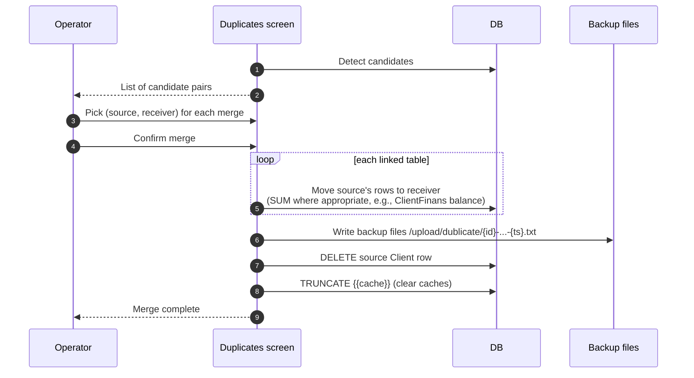

## 02. The workflow {#d-02}

- **Kind**: `sequence`
- **Source page**: [quality/clients/bulk-import](/docs/quality/clients/bulk-import)
- **Originating section**: The workflow

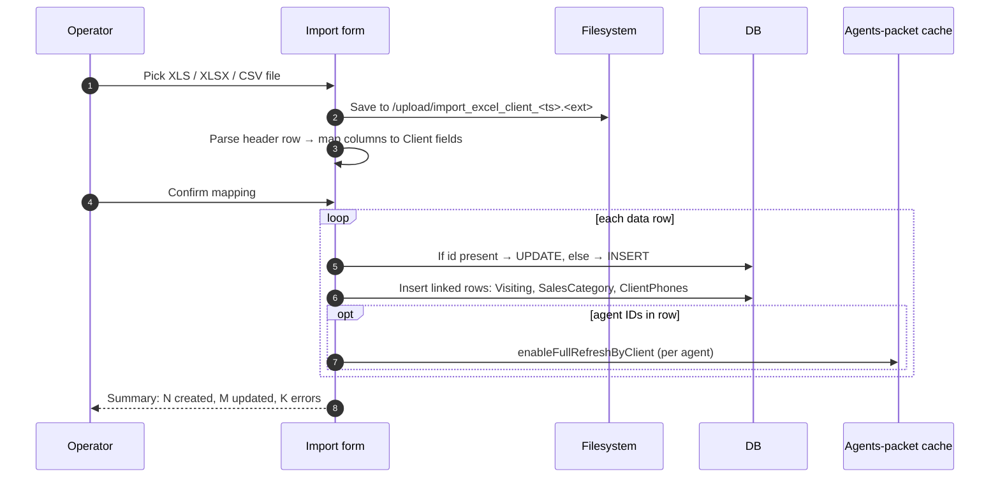

## 03. The workflow {#d-03}

- **Kind**: `sequence`
- **Source page**: [quality/clients/create-edit-client](/docs/quality/clients/create-edit-client)
- **Originating section**: The workflow

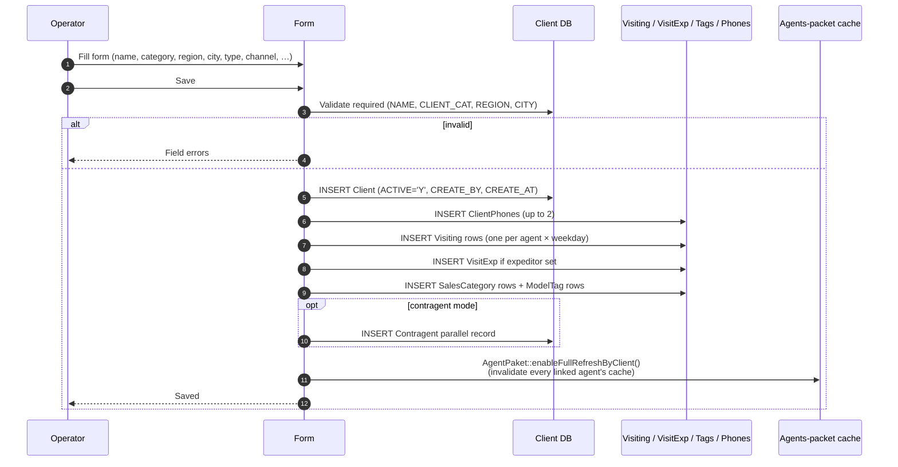

## 04. The workflow {#d-04}

- **Kind**: `sequence`
- **Source page**: [quality/clients/verification](/docs/quality/clients/verification)
- **Originating section**: The workflow

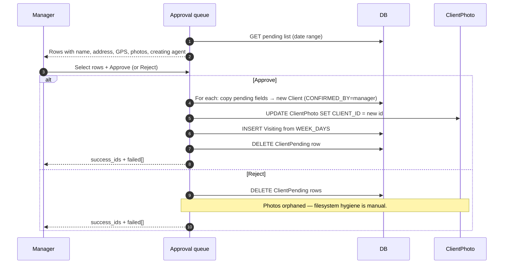

## 05. The workflow {#d-05}

- **Kind**: `sequence`
- **Source page**: [quality/clients/mobile-client-creation](/docs/quality/clients/mobile-client-creation)
- **Originating section**: The workflow

```mermaid
sequenceDiagram
    autonumber
    participant Ag as Agent on mobile
    participant App as sd-agents app
    participant API as Server (api3 / api4)
    participant DB as DB
    participant Mgr as Manager (web)

    Ag->>App: Tap Add outlet
    App->>App: Capture name, category, address, GPS, photos
    App->>API: Submit (with deviceToken)
    API->>API: Read agent's packet — client.verify?
    alt verify=1
        API->>DB: INSERT ClientPending (+ ClientPhoto rows)
        API-->>App: "Submitted for approval"
        Note over App,Mgr: Outlet does NOT appear on agent's route yet
        Mgr->>DB: Open Pending list; Approve
        DB->>DB: Copy to Client, link photos to new id
        DB->>DB: Insert Visiting from pending WEEK_DAYS
    else verify=0
        API->>DB: INSERT Client directly
        API-->>App: Saved (active, on route)
    end
```

## 06. The workflow {#d-06}

- **Kind**: `flowchart`
- **Source page**: [quality/settings/trade-and-channel](/docs/quality/settings/trade-and-channel)
- **Originating section**: The workflow

```mermaid
flowchart LR
    A[Admin opens Trade direction] --> B[Add or edit row]
    B --> C{Has rows already used?}
    C -->|No order, finans, product references row| D[Row is fully editable;<br/>Delete button available]
    C -->|Row used somewhere| E[Row is editable but the system<br/>blocks Delete with an error<br/>and offers the deps screen]
    Note over C,E: QA-relevant: the system checks Order, ClientTransaction<br/>and Product before allowing delete. Test the message.
    A2[Admin opens Channel list] --> B2[Add or edit row]
    B2 --> F{ACTIVE Y/N}
    F -->|N| F1[Channel hidden from new-client form<br/>and from rule-matching pickers]
    F -->|Y| F2[Channel offered everywhere]
    B & B2 --> G[Save]
    G --> H[Bonus and discount rule pickers refresh.<br/>Rules referencing this row keep working.]
```

## 07. The workflow {#d-07}

- **Kind**: `flowchart`
- **Source page**: [quality/settings/price-types](/docs/quality/settings/price-types)
- **Originating section**: The workflow

```mermaid
flowchart LR
    A[Admin opens price type list] --> B[Add or edit row]
    B --> C{Kind}
    C -->|Purchase| C1[Row joins purchase-side<br/>price book, fed by goods-receipt]
    C -->|Sell| C2[Row joins sell-side price book,<br/>picked by orders]
    B --> D{Hand-edit allowed?}
    D -->|Yes| D1[On the order line the salesperson<br/>can type any number — manual price]
    D -->|No| D2[The order line is read-only,<br/>numbers come from the price book]
    B --> E{Currency}
    E --> E1[Orders priced in that currency<br/>only — multi-currency dealers<br/>maintain one price type per currency]
    B --> F{Active}
    F -->|N| F1[Hidden from new-order pickers,<br/>old orders still readable]
    F -->|Y| F2[Visible on every price picker]
    Note over D,D2: QA-relevant: hand-edit on a sell price-type<br/>is the gate for the "manual price" workflow<br/>tested in the orders module.
```

## 08. The workflow {#d-08}

- **Kind**: `flowchart`
- **Source page**: [quality/settings/discount-rules](/docs/quality/settings/discount-rules)
- **Originating section**: The workflow

```mermaid
flowchart LR
    A[Admin opens Discount tab] --> B[New rule]
    B --> C[Pick name, date window,<br/>discount type, tier table,<br/>products, client / agent /<br/>city / price-type filters,<br/>currency, only-one-time]
    C --> D[Save — parent + tier children<br/>in one transaction]
    Note over C,D: For per-SKU discount type the form<br/>uses a separate set of fields, but<br/>the engine still writes parent + children.
    D --> E{Used by any order?}
    E -->|Yes & not configured to allow updates| E1[Edit blocked,<br/>only Extend period available]
    E -->|No or override on| E2[Free editing]
    F[Admin opens Manual discount tab] --> G[New row]
    G --> H[Pick name, discount value,<br/>agents, products, price types]
    H --> I[Save — row + per-agent rows<br/>in side table]
    Note over G,I: QA-relevant: manual discount has no<br/>date window; it is on or off via ACTIVE.
    J[Order saved or edited] --> K[Auto engine: walk active rules,<br/>match filters and date, fire]
    J --> L[Manual line: agent's typed<br/>discount is clamped by their<br/>most-specific manual rule]
```

## 09. The workflow {#d-09}

- **Kind**: `sequence`
- **Source page**: [quality/settings/rbac-and-users](/docs/quality/settings/rbac-and-users)
- **Originating section**: The workflow

```mermaid
sequenceDiagram
    autonumber
    participant U as Admin
    participant Form as User form
    participant Lic as Licence check
    participant DB as User table
    participant RBAC as Permission grid
    participant Cash as Cashbox catalogue

    U->>Form: Open Users → New
    U->>Form: Fill name, login, password, role, optional cashboxes
    Note over Form: Login must be free of spaces;<br/>password must be set;<br/>role must be picked.
    Form->>DB: Login unique?
    alt taken
        Form-->>U: "Этот логин уже занят"
    else free
        Form->>DB: Phone unique?
        alt taken
            Form-->>U: "Этот телефон уже есть в базе"
        else free
            Form->>Lic: Active count of this role +1 ≤ cap?
            Note over Form,Lic: QA-relevant: the cap is enforced per role-type<br/>(admin, agent, supervisor, merchant, dastavchik,<br/>vansel, seller, bot_order, bot_report).
            alt cap exceeded
                Form-->>U: License-blocked error
            else within cap
                Form->>DB: INSERT user (role, active, password hash)
                Form->>RBAC: Apply default role grants
                opt role = cashier
                    Form->>Cash: Bind selected cashboxes to this user
                end
                Form-->>U: Success
            end
        end
    end
```

## 10. The workflow {#d-10}

- **Kind**: `flowchart`
- **Source page**: [quality/settings/server-toggles-and-period-close](/docs/quality/settings/server-toggles-and-period-close)
- **Originating section**: The workflow

```mermaid
flowchart LR
    A[Admin opens Parameters] --> B[Tabs: Financial, Features,<br/>Mobile, Visit, Integration, …]
    B --> C[Edit a flag — boolean, integer,<br/>selection, datetime, array]
    C --> D[Save → params.json updated]
    Note over C,D: QA-relevant: changes apply on the next request<br/>across every other module. No service restart needed.
    E[Admin opens /upload/status_config.txt<br/>via the status-config screen] --> F[Edit JSON]
    F --> G[Save — sub-status dropdown<br/>on the order screen refreshes]
    H[Admin opens Close day] --> I[Pick a data model<br/>Order, Finans, Purchase,<br/>Exchange, Corrector, Excretion,<br/>Purchase refund]
    I --> J{Lock by absolute date<br/>or by rolling day count?}
    J --> K[Optionally name the roles<br/>allowed to bypass the lock]
    K --> L[Save → Closed table updated.<br/>Edits on rows before the lock<br/>are blocked from the next request.]
```

## 11. The workflow {#d-11}

- **Kind**: `flowchart`
- **Source page**: [quality/settings/cashbox-management](/docs/quality/settings/cashbox-management)
- **Originating section**: The workflow

```mermaid
flowchart LR
    A[Admin opens cashbox list] --> B[Add or edit row]
    B --> C{Currency picked?}
    C -->|empty| C1[Row saves, all-currency cashbox<br/>fed by every payment]
    C -->|fixed| C2[Row saves, currency-scoped<br/>only same-currency payments]
    B --> D{Cashier picked?}
    D -->|empty| D1[Open till — every role with cashbox<br/>access can post against it]
    D -->|user X| D2[Locked till — role-6 X sees it,<br/>other cashiers do not]
    Note over B,D2: QA-relevant: the cashier field<br/>controls cashbox scoping everywhere<br/>downstream — finans, mobile expeditor, reports.
    C1 & C2 & D1 & D2 --> E[Save]
    E --> F[Catalogue dropdowns in Finans,<br/>Orders, mobile app refresh]
```

## 12. The workflow {#d-12}

- **Kind**: `flowchart`
- **Source page**: [quality/settings/bonus-rules](/docs/quality/settings/bonus-rules)
- **Originating section**: The workflow

```mermaid
flowchart LR
    A[Admin opens Bonuses tab] --> B[New rule]
    B --> C[Pick name, date window,<br/>products, bonus products,<br/>tier table, client filters,<br/>agent / city / trade /<br/>price-type filters, MANUAL Y/N]
    C --> D[Save — parent and child rows<br/>are created in the same transaction]
    Note over C,D: A bonus rule is a parent row plus one or<br/>more child rows. Each child row is one<br/>threshold tier (Min, Max, Value, Bonus).
    D --> E{Used by any non-cancelled order?}
    E -->|No| E1[Free editing]
    E -->|Yes| E2[Edit blocked with banner<br/>except for period-extension]
    F[Order saved or edited] --> G[Engine reads active rules]
    G --> H{Match conditions all hold?<br/>Date inside window? ACTIVE=Y?}
    H -->|Yes| H1[Bonus written onto the order line<br/>and into the bonus-detail table]
    H -->|No| H2[Skip rule, try next]
    Note over G,H: QA-relevant: the most common bug<br/>is a rule that "should fire" missing<br/>one condition or being outside the date.
```

## 13. The full workflow {#d-13}

- **Kind**: `flowchart`
- **Source page**: [quality/payment/supplier-finance](/docs/quality/payment/supplier-finance)
- **Originating section**: The full workflow

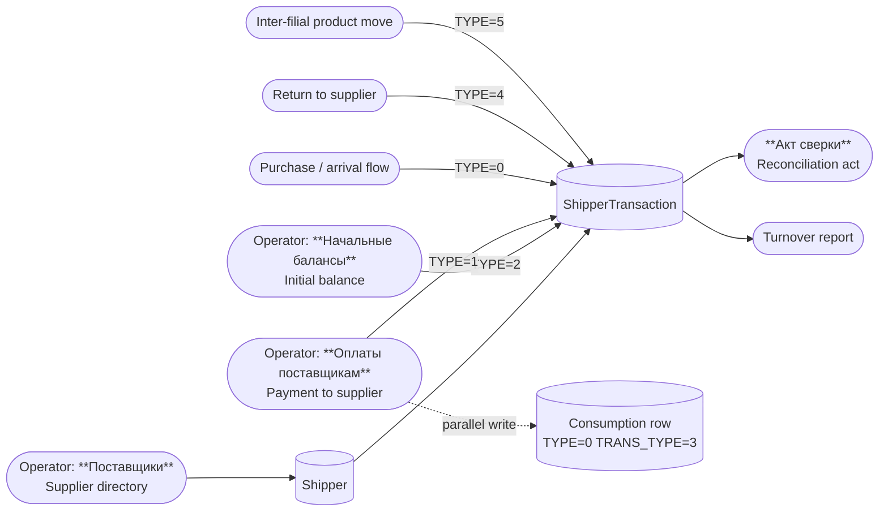

## 14. The workflow {#d-14}

- **Kind**: `sequence`
- **Source page**: [quality/payment/payment-approval](/docs/quality/payment/payment-approval)
- **Originating section**: The workflow

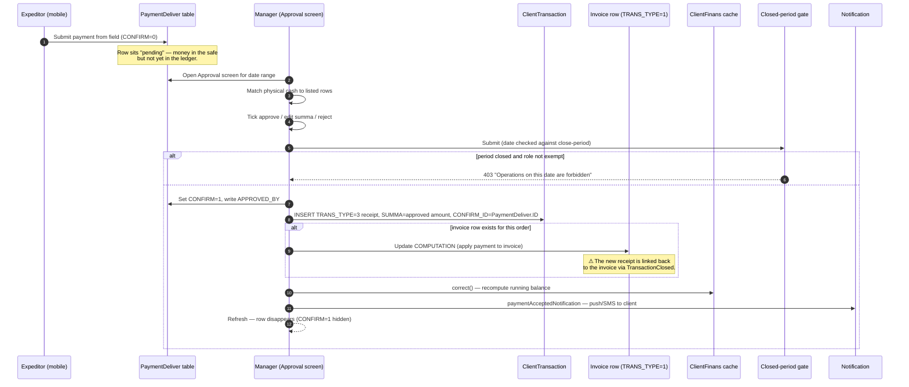

## 15. The workflow — at a glance {#d-15}

- **Kind**: `sequence`
- **Source page**: [quality/integrations/faktura-uz](/docs/quality/integrations/faktura-uz)
- **Originating section**: The workflow — at a glance

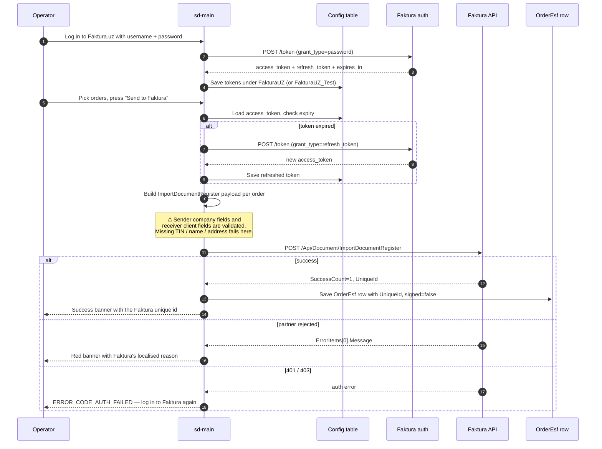

## 16. The workflow — at a glance {#d-16}

- **Kind**: `sequence`
- **Source page**: [quality/integrations/online-orders](/docs/quality/integrations/online-orders)
- **Originating section**: The workflow — at a glance

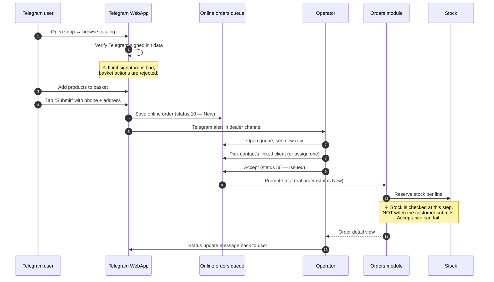

## 17. The workflow — at a glance {#d-17}

- **Kind**: `sequence`
- **Source page**: [quality/integrations/idokon-pos](/docs/quality/integrations/idokon-pos)
- **Originating section**: The workflow — at a glance

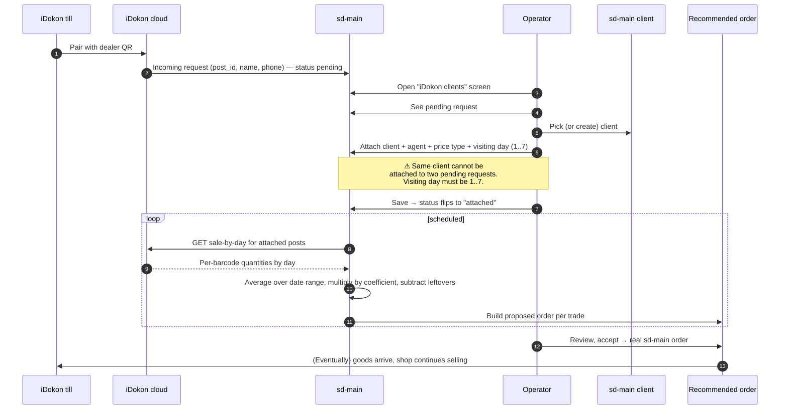

## 18. The workflow — at a glance {#d-18}

- **Kind**: `sequence`
- **Source page**: [quality/integrations/online-contacts](/docs/quality/integrations/online-contacts)
- **Originating section**: The workflow — at a glance

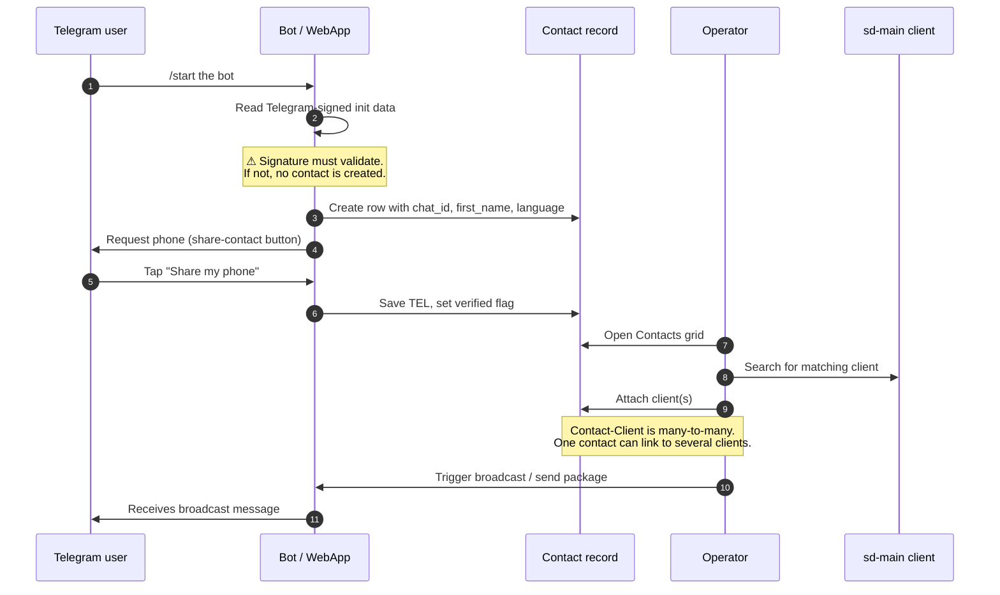

## 19. The workflow {#d-19}

- **Kind**: `sequence`
- **Source page**: [quality/finans/client-debt-view](/docs/quality/finans/client-debt-view)
- **Originating section**: The workflow

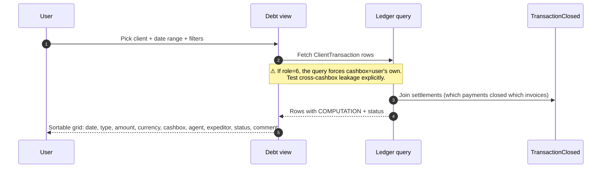

## 20. The workflow {#d-20}

- **Kind**: `sequence`
- **Source page**: [quality/finans/manual-correction](/docs/quality/finans/manual-correction)
- **Originating section**: The workflow

```mermaid
sequenceDiagram
    autonumber
    participant U as Operator
    participant F as Form
    participant Closed as Closed-period gate
    participant DB as ClientTransaction
    participant CF as ClientFinans

    U->>F: Pick client, currency, cashbox, type, amount, date, comment
    U->>F: Save
    F->>Closed: Is date < closed period? If yes, is role in exception list?
    alt period closed and role not exempt
        Closed-->>U: Redirect to "period closed" error
    else allowed
        F->>DB: INSERT ClientTransaction (SUMMA=abs(amount), STATUS='Y', IDEN=0)
        Note over F,DB: ⚠ SUMMA always positive; the sign comes<br/>from TRANS_TYPE. Test that the displayed sign<br/>matches what the user expected.
        F->>CF: correct() — recompute running balance
        F->>F: notifyClient() + TelegramReport
        F-->>U: Saved
    end
```

## 21. The workflow — at a glance {#d-21}

- **Kind**: `flowchart`
- **Source page**: [quality/audit/facing-and-sku](/docs/quality/audit/facing-and-sku)
- **Originating section**: The workflow — at a glance

```mermaid
flowchart TB
    Mob[Mobile audit form<br/>agent counts facings<br/>agent ticks SKU presence] -->|submit| F[(aud_facing rows)]
    Mob -->|submit| S[(aud_sku rows)]

    subgraph "Facing report — /audit/facing"
      F --> FQ[Filter by date / city / category / agent]
      FQ --> FR1[Per-outlet:<br/>category COUNT, AVG]
      FR1 --> FR2[Per (parent-category × city):<br/>share % = sum within / sum across]
      FR1 --> FR3[Per client-category:<br/>same share calc]
    end

    subgraph "SKU report — /audit/sku"
      S --> SQ[Filter by date / city / category / product / agent + min-max SKU count]
      SQ --> SR1[Per-outlet:<br/>SKU COUNT in each category]
      SR1 --> SR2[Per (parent-category × city):<br/>SKU count + active-clients АКБ]
      SR1 --> SR3[Per category × city:<br/>avg SKUs and total clients]
    end
```

## 22. The workflow — at a glance {#d-22}

- **Kind**: `sequence`
- **Source page**: [quality/audit/photo-reports](/docs/quality/audit/photo-reports)
- **Originating section**: The workflow — at a glance

```mermaid
sequenceDiagram
    autonumber
    participant U as Field user (agent/merch/exp)
    participant Mob as Mobile app
    participant DB as photo_report
    participant Web as /audit/photoReport
    participant Op as Operator

    U->>Mob: Open visit, switch to photo tab
    U->>Mob: Pick a photo category (e.g. "Cooler before")
    U->>Mob: Take photo(s)
    Mob->>DB: Upload with category, client, agent, date, URL
    Note over DB: One photo_report row per photo.<br/>RATING starts at 0 until office rates it.
    Op->>Web: Open /audit/photoReport
    Web-->>Op: Filter form: date, user, category, city
    Op->>Web: Apply filters
    Web->>DB: Query — exclude deleted rows
    DB-->>Web: Photo metadata (count + rating)
    Web-->>Op: Two tables —<br/>per (date × client × user) and<br/>per agent (aggregated)
    Op->>Web: Click count cell → see thumbnails
    Op->>Web: Click "rate 1-5" on a set
    Web->>DB: Update RATING on those rows
    DB-->>Web: Refresh — average rating recomputed
```

## 23. The workflow — at a glance {#d-23}

- **Kind**: `flowchart`
- **Source page**: [quality/audit/audit-settings](/docs/quality/audit/audit-settings)
- **Originating section**: The workflow — at a glance

```mermaid
flowchart LR
    subgraph "v1 — /audit/settings"
      V1B[Brand list<br/>name, sort, owner Y/N, active] --> V1C[Audit-categories<br/>parent + children<br/>min/max, facing-check Y/N]
      V1C --> V1P[Audit-products<br/>link to brand + category]
      V1B --> V1Pl[Place types<br/>cooler, shelf, promo zone]
      V1P --> V1S[Sort screen<br/>display order on the phone]
    end
    subgraph "v2 — /adt/settings"
      V2B[Brand list — same shape as v1] --> V2Seg[Segments]
      V2B --> V2Pack[Packs]
      V2B --> V2Prod[Producers]
      V2B --> V2Pr[Properties]
      V2T[Audit templates<br/>name + product list +<br/>face/price/sold/store flags +<br/>required flags + assigned positions]
      V2P[Parameters<br/>PROPERTY1/2, PARAM1/2<br/>for the scoring formula]
      V2T -.flows back to.- DT[/adt/adtAudit/fullReport/]
      V2P -.feeds.- DT
    end
```

## 24. Who does what — the workflow at a glance {#d-24}

- **Kind**: `flowchart`
- **Source page**: [quality/audit/index](/docs/quality/audit/index)
- **Originating section**: Who does what — the workflow at a glance

```mermaid
flowchart LR
    A[Field agent or merchandiser<br/>in the outlet]
    A -->|opens visit on phone| B[Mobile audit form]
    B -->|count facings| F[Facing data]
    B -->|tick SKUs| S[SKU presence data]
    B -->|enter prices| P[Price data]
    B -->|answer poll| Q[Poll answers]
    B -->|take photos| Ph[Photo evidence]
    F & S & P & Q & Ph --> DB[(Audit storage)]
    DB --> R1[Web — per-visit review<br/>v1: /audit/audits<br/>v2: /adt/adtAudit/fullReport]
    DB --> R2[Web — facing & SKU reports<br/>v1: /audit/facing, /audit/sku]
    DB --> R3[Web — photo rating<br/>/audit/photoReport]
    R3 --> Score[Agent's audit score]
```

## 25. The workflow — at a glance {#d-25}

- **Kind**: `sequence`
- **Source page**: [quality/audit/visit-audit](/docs/quality/audit/visit-audit)
- **Originating section**: The workflow — at a glance

```mermaid
sequenceDiagram
    autonumber
    participant Ag as Field agent
    participant Mob as Mobile app
    participant DB as Audit storage
    participant Web as Web review grid
    participant Op as Operator

    Ag->>Mob: Open visit at the outlet
    Ag->>Mob: Count facings per brand × category
    Ag->>Mob: Tick SKUs present
    Ag->>Mob: Type the shelf prices
    Ag->>Mob: Answer the poll questions
    Ag->>Mob: Take the required photos
    Mob->>DB: Submit (one row per measure)
    Note over Mob,DB: ⚠ Each concept lands in a different table —<br/>partial submissions are normal. Test what<br/>happens when only facing was captured but not SKU.
    Op->>Web: Open Проверки / Ритейл аудит, pick date range
    Web->>DB: Aggregate per date × client × measure
    Web-->>Op: One row per (date, client) with sub-totals
    Op->>Web: Click row → detail view
    Web->>DB: Pull all values for that visit
    Web-->>Op: Show facing / SKU / price / poll / photos
    Op->>Web: Correct a wrong price, delete a duplicate row
    Web->>DB: Save the correction
```

## 26. The workflow — at a glance {#d-26}

- **Kind**: `sequence`
- **Source page**: [quality/team/agents-packet](/docs/quality/team/agents-packet)
- **Originating section**: The workflow — at a glance

```mermaid
sequenceDiagram
    autonumber
    participant U as Admin
    participant Form as Settings UI
    participant Server as Server
    participant Agent as Agent's AgentPaket
    participant Comp as company_config.txt
    participant Phone as Mobile app

    U->>Form: Open settings; pick scope (company / agent / group)
    U->>Form: Toggle some setting
    U->>Form: Save
    Form->>Server: POST EditAgentConfig with scope + full blob
    alt scope = company
        Server->>Comp: Overwrite company_config.txt
    else scope = by-agent
        Server->>Agent: Replace AgentPaket.SETTINGS for one agent
        Note over Server,Agent: ⚠ Full-blob replace.<br/>Two admins editing different keys<br/>at the same time can clobber each other.
    else scope = by-group
        loop each selected agent
            Server->>Agent: Replace AgentPaket.SETTINGS for that agent
        end
    end
    Server-->>U: Saved

    Note over Phone: Phone has whatever it last fetched.<br/>It does NOT push-receive changes.
    Phone->>Server: On next login or manual sync — fetch config
    Server->>Server: Merge company defaults + agent override
    Server-->>Phone: Full JSON
    Phone->>Phone: Apply new toggles to the UI
```

## 27. The workflow — at a glance {#d-27}

- **Kind**: `sequence`
- **Source page**: [quality/team/kpi-setup-and-views](/docs/quality/team/kpi-setup-and-views)
- **Originating section**: The workflow — at a glance

```mermaid
sequenceDiagram
    autonumber
    participant U as Admin
    participant Tmpl as KpiTaskTemplate
    participant Setup as KPI setup screen
    participant DB as Kpi + KpiTask
    participant Phone as Agent app

    U->>Tmpl: Define / edit templates
    Note over U,Tmpl: ⚠ Templates are soft-deleted via ACTIVE='N' —<br/>orphaned KpiTask rows can accumulate.
    U->>Setup: Pick role (agent / supervisor / expeditor)
    U->>Setup: Pick month + year
    U->>Setup: Enter target values per person × template
    U->>Setup: Save
    Setup->>DB: For each person:<br/>upsert Kpi row,<br/>upsert/insert/delete KpiTask rows
    alt all values for one person are zero
        Setup->>DB: Delete this person's KpiTask rows + Kpi row
    end
    Setup-->>U: Saved

    Phone->>DB: Mobile fetches KPI tile (current month)
    DB-->>Phone: planned numbers + actual rolled up from Order + Planning
```

## 28. The workflow — at a glance {#d-28}

- **Kind**: `sequence`
- **Source page**: [quality/team/expeditor-packet](/docs/quality/team/expeditor-packet)
- **Originating section**: The workflow — at a glance

```mermaid
sequenceDiagram
    autonumber
    participant U as Admin
    participant Form as Settings UI
    participant Server as Server
    participant EP as ExpeditorPaket
    participant Comp as company_expeditor_config.txt
    participant Phone as Driver app

    U->>Form: Pick scope (company / by-expeditor / by-group)
    U->>Form: Toggle settings, Save
    alt company
        Server->>Comp: Overwrite file
    else by-expeditor
        Server->>EP: Replace SETTINGS for one expeditor
        Note over Server,EP: ⚠ Same read-modify-write landmine<br/>as agents-packet.
    else by-group
        loop each expeditor
            Server->>EP: Replace SETTINGS
        end
    end
    Server-->>U: Saved

    Phone->>Server: Next login / sync — fetch config
    Server->>Server: Merge company + expeditor override
    Server-->>Phone: Full JSON
```

## 29. The workflow — at a glance {#d-29}

- **Kind**: `sequence`
- **Source page**: [quality/team/create-edit-agent](/docs/quality/team/create-edit-agent)
- **Originating section**: The workflow — at a glance

```mermaid
sequenceDiagram
    autonumber
    participant U as Admin
    participant Form as Agent form
    participant Sub as Subscription / licence
    participant DB as Agents DB
    participant User as User table
    participant Stock as Stock

    U->>Form: Open Agents → New
    U->>Form: Fill FIO, login, password, type, supervisor, etc.
    U->>Form: Submit
    Form->>Sub: How many active agents of this type now?
    Note over Form,Sub: ⚠ Subscription cap check — the most<br/>common test failure when the dealer<br/>is near their licence limit.
    alt cap exceeded
        Form-->>U: Red error: "Limit reached"
    else within cap
        Form->>DB: Check username unique
        alt username taken
            Form-->>U: Field error: "Login already exists"
        else
            Form->>DB: INSERT Agent (ACTIVE='Y', type, supervisor link, dealer)
            Form->>User: INSERT User (role=4, password hash, link to Agent)
            opt type == Van-selling
                Form->>Stock: Create or attach van's warehouse
                Note over Form,Stock: ⚠ Van-selling auto-creates a warehouse<br/>unless one is provided. Verify the<br/>warehouse afterward.
            end
            Form-->>U: Success — agent appears in the list
        end
    end
```

## 30. The workflow — at a glance {#d-30}

- **Kind**: `sequence`
- **Source page**: [quality/team/create-edit-expeditor](/docs/quality/team/create-edit-expeditor)
- **Originating section**: The workflow — at a glance

```mermaid
sequenceDiagram
    autonumber
    participant U as Admin
    participant Form as Expeditor form
    participant DB as DB
    participant Stock as Stock / Warehouses
    participant Cash as Cashbox config

    U->>Form: Open Expeditors → New
    U->>Form: Fill FIO, login, password, defect store, cashbox
    U->>Form: Submit
    Form->>DB: Validate fullname / login / password present and clean
    alt validation fails
        Form-->>U: Field error
    else
        Form->>DB: INSERT User (role=10, password hash)
        Form->>DB: INSERT Agent row (with expeditor flag)
        opt defect store picked
            Form->>Stock: Verify the warehouse is of return-type
            Note over Form,Stock: ⚠ Common failure point — the warehouse<br/>must be a return-type warehouse and<br/>must not be attached to another expeditor.
            alt wrong type / already attached
                Form-->>U: Error: warehouse not return type / already attached
            else
                Form->>Stock: Link the defect store to this expeditor
            end
        end
        opt cashbox picked
            Form->>Cash: Link cashbox to this expeditor
        end
        Form-->>U: Success — expeditor appears in the list
    end
```

## 31. The workflow — at a glance {#d-31}

- **Kind**: `sequence`
- **Source page**: [quality/team/product-distribution](/docs/quality/team/product-distribution)
- **Originating section**: The workflow — at a glance

```mermaid
sequenceDiagram
    autonumber
    participant U as Admin
    participant Form as Product distribution screen
    participant DB as AgentPaket
    participant Phone as Agent app

    U->>Form: Pick agent(s) and the products / prices to add or remove
    U->>Form: Save
    alt full replace (Create action)
        Form->>DB: Overwrite AgentPaket.PRODUCT_ID, PRICE_TYPE, VS_PRICE_TYPE
        Note over Form,DB: ⚠ Full replace — products NOT in the<br/>current selection are removed.
    else partial (CreatePartial action)
        Form->>DB: Add the selected items to the existing list (no removal)
    else delete partial (DeletePartial)
        Form->>DB: Remove the selected items from the existing list
    end
    Form-->>U: Saved

    Phone->>Form: Next sync — fetch product/price lookups
    Form-->>Phone: Only products/prices in the agent's lists
```

## 32. The workflow — at a glance {#d-32}

- **Kind**: `sequence`
- **Source page**: [quality/team/tasks](/docs/quality/team/tasks)
- **Originating section**: The workflow — at a glance

```mermaid
sequenceDiagram
    autonumber
    participant U as Admin
    participant Web as Tasks editor
    participant DB as Tasks DB
    participant Phone as Agent app
    participant Result as Task results / report

    U->>Web: Create task — name, type, window, agents, client filter
    Web->>DB: INSERT task definition + assignment rows
    Web-->>U: Saved
    Note over Phone: Phone has not heard about this yet.
    Phone->>DB: Next sync — fetch open tasks
    DB-->>Phone: Tasks for this agent in this window
    Phone->>Phone: Show "open tasks" list on Today screen
    Phone->>Phone: Agent completes task during a visit
    Phone->>DB: Upload result (photo, comment, answer)
    DB->>DB: Mark completion row
    Result->>DB: Admin's reports query results by date / agent / client
```

## 33. The workflow — at a glance {#d-33}

- **Kind**: `sequence`
- **Source page**: [quality/team/create-edit-supervisor](/docs/quality/team/create-edit-supervisor)
- **Originating section**: The workflow — at a glance

```mermaid
sequenceDiagram
    autonumber
    participant U as Admin
    participant Form as Supervisor form
    participant DB as DB
    participant Link as Supervayzer table

    U->>Form: Open Supervisors → New
    U->>Form: Fill FIO, login, password
    U->>Form: Submit
    Form->>DB: Check 'fullname' present
    Form->>DB: Check 'login' present + unique + no spaces
    Form->>DB: Check 'password' present
    alt validation fails
        Form-->>U: Field error naming which check failed
    else
        Form->>DB: INSERT User (role=8, password hash)
        Note over Form,Link: ⚠ Agents are linked to the supervisor<br/>via the Supervayzer table — separate step<br/>after create. Verify the link exists.
        Form-->>U: Success — supervisor appears in the list
    end
    U->>Form: Edit agents under this supervisor
    Form->>Link: INSERT / DELETE Supervayzer rows<br/>(SV_AGENT_ID, AGENT_ID)
    Form-->>U: Saved
```

## 34. The workflow {#d-34}

- **Kind**: `sequence`
- **Source page**: [quality/mobile/sms-broadcast](/docs/quality/mobile/sms-broadcast)
- **Originating section**: The workflow

```mermaid
sequenceDiagram
    autonumber
    participant Op as Operator
    participant Web as /sms/view/list
    participant Tpl as /sms/template/list
    participant Send as /sms/message/send
    participant Bill as SalesDoctor billing
    participant Eskiz as Eskiz.uz gateway
    participant Phone as Client's phone

    Op->>Web: Opens the broadcast page
    Web->>Tpl: Load templates
    Tpl-->>Web: System + custom templates (status: ready / moderation / rejected)

    Op->>Web: Pick template, pick clients (filters: city, debt, etc.)
    Op->>Web: Optionally edit phone numbers (UZ format only: +998 NN XXX-XX-XX)
    Op->>Web: Tap Send
    
    Web->>Send: POST { template_id, messages: [{phone, txt, client_id}…] }
    Note over Send: ⚠ Validates each message:<br/>- phone matches ^998\d{9}$<br/>- text non-empty<br/>- client_id exists<br/>If any line invalid, the WHOLE batch fails.

    Send->>Bill: POST /api/sms/send (type:dealer, host, messages)
    Bill->>Eskiz: Forward to Eskiz.uz
    Eskiz-->>Bill: Per-recipient delivery acknowledgement
    Bill-->>Send: { left_sms_limit, status array }
    Send-->>Web: { left_limit }
    Eskiz-->>Phone: SMS delivered

    Note over Web,Send: A row is written to sms_message<br/>(the broadcast header) and one row per<br/>recipient in sms_message_item.

    Op->>Web: Refresh the archive table — see history
```

## 35. The workflow {#d-35}

- **Kind**: `sequence`
- **Source page**: [quality/mobile/notifications](/docs/quality/mobile/notifications)
- **Originating section**: The workflow

```mermaid
sequenceDiagram
    autonumber
    participant Trig as Triggering module<br/>(orders / payments / clients / stock…)
    participant TgRep as Telegram report layer
    participant InOut as Inout report responder
    participant Tg as Telegram API
    participant Job as Notification job queue
    participant Fcm as Firebase
    participant Sms as Eskiz.uz / billing
    participant Recip as Recipient

    Trig->>TgRep: After the business event saves, build a message
    Note over TgRep: ⚠ Notifications fire AFTER the response<br/>to the user has been sent.<br/>If Telegram is slow, the user is not blocked.

    TgRep->>Tg: Group chat message (dispatch / operations / warehouse)
    TgRep->>InOut: Per-client / per-agent direct message
    InOut->>Tg: One Telegram DM per bound chat id

    Trig->>Job: Queue a push job (for FCM)
    Job->>Fcm: Send message to a device token
    Fcm-->>Recip: Push to the right mobile app

    Trig->>Sms: For UZ clients with phone + matching auto-rule
    Sms-->>Recip: SMS via Eskiz.uz

    Note over Trig,Recip: Each channel is best-effort and independent.<br/>A Telegram failure does not stop the push.<br/>A push failure does not stop the SMS.
```

## 36. The workflow {#d-36}

- **Kind**: `sequence`
- **Source page**: [quality/mobile/gps-tracking](/docs/quality/mobile/gps-tracking)
- **Originating section**: The workflow

```mermaid
sequenceDiagram
    autonumber
    participant Ag as Agent's phone
    participant API as Server
    participant Gps as gps table
    participant Vis as visit table
    participant Map as /gps/monitoring (live)
    participant Route as /gps2/route (replay)

    loop every ~60 s while app is open
        Ag->>API: POST GPS sample (lat, lon, battery, signal, gps_status, network)
        Note over API,Gps: ⚠ Rate-limited.<br/>Two single-sample pings closer than 10 s<br/>are rejected with HTTP 429.<br/>Multi-sample batches (offline replay) are accepted.
        API->>Gps: insert row with TYPE='track'
    end

    Note over Ag: agent opens a client and checks in

    Ag->>API: POST visit check-in (with current lat, lon)
    API->>Vis: visit row stores G_LAT, G_LON (phone) + C_LAT, C_LON (client master)
    API->>Gps: insert separate row with TYPE='current' or 'order'

    Note over Ag,API: GPS at the moment of check-in is the<br/>one compared against the client's saved<br/>coordinates by the monitoring screens.

    Map->>API: every 60 s, fetch last position per agent
    API-->>Map: latest sample joined with agent FIO

    Route->>API: replay one agent for one day
    API-->>Route: visits + GPS trail + photos + orders
    Note over Route: ⚠ The "out of zone" flag is computed<br/>in JavaScript on the route screen,<br/>NOT on the server, NOT at submit time.
```

## 37. The workflow {#d-37}

- **Kind**: `sequence`
- **Source page**: [quality/mobile/sync-flow](/docs/quality/mobile/sync-flow)
- **Originating section**: The workflow

```mermaid
sequenceDiagram
    autonumber
    participant App as sd-agents app
    participant Auth as /login
    participant Cfg as /config
    participant Cli as /clients
    participant Cat as /catalog/products etc.
    participant Pr as /catalog/prices
    participant Vis as /visits
    participant DB as Sales DB

    App->>Auth: POST { login, password, deviceId, deviceModel, fcm_token, app:'agent' }
    Note over Auth: ⚠ Verifies password, license,<br/>role == 4, optional device-limit (3).<br/>Returns a device token.
    Auth->>DB: read User; write Device + DEVICE_TOKEN
    Auth-->>App: token, role, server_time, support phone

    App->>Cfg: GET /config (with deviceToken)
    Note over Cfg: ⚠ api3 also writes a GPS row<br/>(TYPE='sync') as a side effect.<br/>api4 does not.
    Cfg-->>App: ~100 KB JSON: packet + bonuses + visit operations + features

    App->>Cli: GET /clients (visiting-scoped)
    Cli-->>App: array of clients with balance, coordinates, phone, photo

    App->>Cat: GET /catalog/products, /trades, /warehouses, /unit, /tara…
    Cat-->>App: full catalogue arrays

    App->>Pr: GET /catalog/prices (allowed price types only)
    Pr-->>App: { product_id → price by price_type }

    App->>Vis: GET /visits for today (route)
    Vis-->>App: ordered list of clients to visit today

    Note over App: Now the agent can open a visit and take an order.

    rect rgb(230, 240, 250)
        Note over App,DB: When the agent submits an order:<br/>1. App generates a GUID (api4) or mobile_order_id (api3)<br/>2. Server checks for duplicate FIRST<br/>3. If new — validate, save, return.<br/>4. If duplicate — short-circuit.
    end
```

## 38. The workflow {#d-38}

- **Kind**: `sequence`
- **Source page**: [quality/markirovka/incoming-invoices](/docs/quality/markirovka/incoming-invoices)
- **Originating section**: The workflow

```mermaid
sequenceDiagram
    participant U as Dealer user
    participant W as Web page (Приёмка)
    participant SD as sd-main backend
    participant OP as ESF operator<br/>(Didox / Faktura.uz)
    participant AB as Aslbelgisi tracker

    Note over U,W: 1. Page load
    U->>W: Open Маркировка → Приёмка
    W->>SD: GET incoming invoices (today's range)
    SD-->>W: rows from local database

    Note over U,OP: 2. Sync from operator
    U->>W: Click "Синхронизация",<br/>pick date range
    W->>OP: Fetch incoming docs for range<br/>(client-side, using stored login)
    OP-->>W: List of invoices
    W->>SD: Upsert each invoice<br/>(create/update/skip)
    SD-->>W: summary (created/updated/synced/failed)
    W->>SD: Reload rows

    Note over U,AB: 3. Validate CIS codes
    U->>W: On a row, click "Проверить коды"
    W->>SD: POST /validate-invoice-cises
    SD->>SD: Set status to "Waiting for check"<br/>+ queue background job
    SD-->>W: status = waiting
    W->>W: Poll for status<br/>(spinner on chip)
    SD->>AB: (background) verify each code
    AB-->>SD: per-code results
    SD->>SD: Set status = Verified or Error

    Note over U,SD: 4. Release to warehouse
    U->>W: Click "Отправить на приёмку"
    W->>SD: GET /set-waiting-acceptance-status
    SD-->>W: acceptance status = Awaiting acceptance
```

## 39. The workflow {#d-39}

- **Kind**: `sequence`
- **Source page**: [quality/markirovka/outgoing-invoices](/docs/quality/markirovka/outgoing-invoices)
- **Originating section**: The workflow

```mermaid
sequenceDiagram
    participant U as Dealer user
    participant W as Web page (Реализация)
    participant SD as sd-main backend
    participant AB as Aslbelgisi tracker
    participant OP as ESF operator<br/>(Didox / Faktura.uz)

    Note over U,W: 1. Page load — list orders with CIS codes
    U->>W: Open Маркировка → Реализация
    W->>SD: GET outgoing invoices (today's range)
    SD-->>W: orders + CIS status + ESF status

    Note over U,AB: 2. Check CIS codes for one order
    U->>W: Row menu → "Проверить КИ"
    W->>SD: POST /check-order-cises
    SD->>SD: Mark order CIS status = Processing<br/>+ queue background job
    W->>W: Chip spinner shown; page stays interactive
    SD->>AB: Verify each code (in background)
    AB-->>SD: per-code results
    SD->>SD: Set CIS status = OK / Codes-error /<br/>Quantity-mismatch
    W->>W: Poll completes; row reloads

    Note over U,OP: 3. Create ESF on operator
    U->>W: ESF chip → "Сформировать ЭСФ"
    W->>OP: Build & submit invoice<br/>(via stored login)
    OP-->>W: ESF document ID
    W->>SD: persist ESF link to order

    Note over U,OP: 4. Sign ESF (EIMZO)
    U->>W: Sign action (browser plugin)
    W->>OP: send signed payload
    OP-->>W: status = Signed
    W->>SD: refresh row

    Note over U,W: 5. Bulk variants
    U->>W: Tick rows + Групповая обработка → action
    W->>W: Loop with progress dialog<br/>(per-row success/failure)
```

## 40. The workflow {#d-40}

- **Kind**: `flowchart`
- **Source page**: [quality/report/report-customer](/docs/quality/report/report-customer)
- **Originating section**: The workflow

```mermaid
flowchart TD
    A[User opens the page] --> B[Filter bar pre-filled<br/>date = this month,<br/>status = Shipped + Delivered,<br/>by-date = load date]
    B --> C{Which tab?}
    C -->|Pivot view| D[Same screen renders<br/>AKB/OKB + by-category +<br/>by-city + top-customer]
    C -->|Client list view| E[Empty grid<br/>waits for AJAX]
    E --> F[User picks filters and Apply]
    F --> G[AJAX call runs server-side query<br/>on orders + visits + clients]
    G --> H[Grid filled in via DataTables]
    D --> I[Render done]
    H --> I
    I --> J{User presses Excel?}
    J -->|Yes| K[Server re-runs query<br/>and streams .xls]
    J -->|No| L[Done]
```

## 41. The workflow {#d-41}

- **Kind**: `flowchart`
- **Source page**: [quality/report/report-agent](/docs/quality/report/report-agent)
- **Originating section**: The workflow

```mermaid
flowchart TD
    A[User opens the page] --> B[Filter bar pre-filled<br/>date = this month,<br/>status = Shipped + Delivered]
    B --> C{User changes filters?}
    C -->|Yes| D[User picks date range,<br/>by-date mode, agents,<br/>cities, categories, products,<br/>currency, price type]
    C -->|No| E
    D --> E[User presses Apply]
    E --> F{Supervisor?}
    F -->|Yes| G[Agent list is forced to<br/>this supervisor's agents only]
    F -->|No| H[Agent list is taken as-is]
    G --> I
    H --> I[Server runs the big query:<br/>orders + lines + deliveries +<br/>client transactions in one pass]
    I --> J[Per-agent rows rendered:<br/>orders, units, volume, summa,<br/>delivered, debt, unconfirmed cash]
    J --> K{User presses Excel?}
    K -->|Yes| L[Server re-runs query<br/>+ writes .xls download]
    K -->|No| M[Done]
```

## 42. The workflow {#d-42}

- **Kind**: `flowchart`
- **Source page**: [quality/report/report-volume-sku](/docs/quality/report/report-volume-sku)
- **Originating section**: The workflow

```mermaid
flowchart TD
    A[User opens V1 or V2] --> B[Filter bar pre-filled<br/>date = this month,<br/>status = Shipped + Delivered,<br/>by-date = load date]
    B --> C{V1 or V2?}
    C -->|V1| D[User picks filters]
    C -->|V2| E[Empty grid until<br/>agent AND product chosen]
    D --> F[Server runs aggregation<br/>on orders + lines]
    E --> G{agent + product chosen?}
    G -->|No| H[Empty table, AKB / OKB blank]
    G -->|Yes| I[Server runs SKU × client query]
    F --> J[Pivot rendered: category &gt; product]
    I --> K[Flat grid: one row per client<br/>columns = chosen SKUs]
    K --> L{User presses Excel?}
    L -->|Yes| M[Server re-runs and streams .xls]
    L -->|No| N[Done]
    J --> N
    H --> N
```

## 43. The workflow {#d-43}

- **Kind**: `flowchart`
- **Source page**: [quality/report/report-expeditor](/docs/quality/report/report-expeditor)
- **Originating section**: The workflow

```mermaid
flowchart TD
    A[User opens one of the four pages] --> B{Which page?}
    B -->|Развоз| C[Picks date + status<br/>+ expeditor + category]
    B -->|Отчёт экспедитора| D[Picks date range + agent +<br/>expeditor + category + status + territory]
    B -->|Долги| E[Picks date range + by-date]
    B -->|Брак| F[Picks date range +<br/>agent + expeditor + status +<br/>order type — sale/return/replace]
    C --> G[Server aggregates orders + lines]
    D --> H[Server aggregates orders + lines + defects + replacements + bonus orders]
    E --> I[Server aggregates client transactions + payment deliveries]
    F --> J[Server unions normal lines + defect lines + replacement lines]
    G --> K[Pivot rendered]
    H --> K
    I --> K
    J --> L[Pivot rendered with configurable fields]
    K --> M{User exports?}
    L --> M
    M -->|Yes| N[Server streams .xls]
    M -->|No| O[Done]
```

## 44. The workflow {#d-44}

- **Kind**: `flowchart`
- **Source page**: [quality/report/report-visit](/docs/quality/report/report-visit)
- **Originating section**: The workflow

```mermaid
flowchart TD
    A[User opens one of the pages] --> B{Which page?}
    B -->|По визитам| C[Picks date range + agent +<br/>supervisor + category + city +<br/>day-of-week + active-client]
    B -->|По визитам 2.0| D[Picks month + year +<br/>agent + planned/unplanned +<br/>outcome type]
    B -->|Маршрут| E[Picks date range + agent +<br/>category + city +<br/>type — in route / out of route /<br/>not visited / results]
    C --> F[Server aggregates visits +<br/>orders + clients + photos + refusals]
    D --> G[Server aggregates visits<br/>by agent × day-of-month]
    E --> H[Server segments clients<br/>into route outcome buckets]
    F --> I[Per-agent table renders<br/>OKB / AKB / visits / photos / refusals]
    G --> J[Calendar grid renders<br/>agent rows × day columns]
    H --> K[Client list renders<br/>with agent, last-order, city]
    I --> L{Excel?}
    J --> L
    K --> L
    L -->|Yes| M[Server streams .xls]
    L -->|No| N[Done]
```

## 45. The workflow — at a glance {#d-45}

- **Kind**: `sequence`
- **Source page**: [quality/orders/whole-return](/docs/quality/orders/whole-return)
- **Originating section**: The workflow — at a glance

```mermaid
sequenceDiagram
    autonumber
    participant Op as Operator
    participant Page as Order detail page
    participant Sales as Sales DB
    participant Stock as Stock
    participant Debt as Debt ledger
    participant TG as Telegram bot

    Op->>Page: Pick status = Returned, press Save
    Page->>Sales: Allowed transition? (must be Shipped → Returned)
    alt not Shipped
        Sales-->>Op: Error 'Cannot change order status'
    else Shipped
        Page->>Sales: Check close date
        Sales->>Sales: Save status = Returned + status date
        Note over Sales,Stock: ⚠ Crucial step — every line's defective<br/>quantity is set to its full quantity.<br/>Nothing of this order is sold anymore.
        Sales->>Sales: For each line: defect = count, sellable = 0
        Sales->>Stock: Return every product to the order's warehouse
        Sales->>Debt: Recompute debt — this order contributes 0 now
        Sales->>Sales: Append order history row 'status changed to Returned'
        Sales-->>Op: Success — order is now Returned
        Sales->>TG: Status-change notification (deferred)
    end
```

## 46. The workflow — at a glance {#d-46}

- **Kind**: `state`
- **Source page**: [quality/orders/status-transitions](/docs/quality/orders/status-transitions)
- **Originating section**: The workflow — at a glance

```mermaid
stateDiagram-v2
    [*] --> New
    New --> Shipped : Operator loads onto vehicle
    New --> Cancelled : Operator cancels before shipping
    Shipped --> Delivered : Operator confirms delivery
    Shipped --> Returned : Operator marks client refusal
    Shipped --> New : Operator pulls back to correct
    Delivered --> New : Operator re-opens to correct
    Returned --> New : Re-opened to correct
    Cancelled --> New : Re-opened to undo cancel
```

## 47. The workflow — what happens on the wire {#d-47}

- **Kind**: `sequence`
- **Source page**: [quality/orders/status-transitions](/docs/quality/orders/status-transitions)
- **Originating section**: The workflow — what happens on the wire

```mermaid
sequenceDiagram
    autonumber
    participant Op as Operator
    participant Page as Order detail page
    participant Sales as Sales DB
    participant Stock as Stock
    participant Debt as Debt ledger
    participant TG as Telegram bot

    Op->>Page: Pick new status from dropdown + press Save
    Page->>Sales: Validate transition (from → to allowed?)
    Note over Page,Sales: ⚠ First gate. If transition is not allowed,<br/>error returns and nothing changes.
    Page->>Sales: Validate dates (load date >= order date,<br/>gap within limit)
    Page->>Sales: Check close date — old orders are read-only
    alt moving to Shipped
        Page->>Stock: Check stock balance again
        Note over Page,Stock: ⚠ Stock is re-checked here.<br/>An order made yesterday on stock<br/>that has since been sold elsewhere<br/>fails this check today.
    end
    alt validation fails
        Page-->>Op: Red error explaining which check failed
    else all good
        Page->>Sales: Save the new status + status date
        Page->>Sales: Set load date / delivered date if appropriate
        alt moving to Returned or Cancelled
            Page->>Stock: Restore stock from the order back to the warehouse
            Page->>Debt: Recalculate debt — defect / cancel amount is removed
        end
        Page->>Sales: Append a row to the order history
        Page->>TG: Send status-change notification (deferred)
        Page-->>Op: Success — refreshed order detail page
    end
```

## 48. The workflow — at a glance {#d-48}

- **Kind**: `sequence`
- **Source page**: [quality/orders/edit-order](/docs/quality/orders/edit-order)
- **Originating section**: The workflow — at a glance

```mermaid
sequenceDiagram
    autonumber
    participant Op as Operator
    participant Page as Order edit page
    participant Sales as Sales DB
    participant Stock as Stock
    participant Bonus as Bonus engine
    participant Debt as Debt ledger

    Op->>Page: Open order, click Edit
    Page->>Sales: Load order + lines + bonuses + discounts
    Page-->>Op: Pre-filled form
    Op->>Page: Change fields, add/remove lines, press Save
    Page->>Sales: Verify status / config / close date allow this edit
    Note over Page,Sales: ⚠ Multi-gate validation. The same checks<br/>as create plus per-field locks based on status.
    alt edit not allowed
        Page-->>Op: Error explaining which field or status blocks the save
    else
        Page->>Stock: Re-check stock if line quantities increased
        alt insufficient
            Page-->>Op: Out-of-stock list
        else
            Page->>Sales: Save header + line changes
            Page->>Bonus: Recompute auto-bonus
            Note over Page,Bonus: ⚠ If line totals changed, the bonus order's<br/>contents may shrink or expand.<br/>Test that the bonus matches after the edit.
            Page->>Debt: Recompute debt (changed order total)
            Page->>Sales: Write one history row per changed field
            Page-->>Op: Saved, refreshed view
        end
    end
```

## 49. The workflow — at a glance {#d-49}

- **Kind**: `sequence`
- **Source page**: [quality/orders/order-list-and-history](/docs/quality/orders/order-list-and-history)
- **Originating section**: The workflow — at a glance

```mermaid
sequenceDiagram
    autonumber
    participant U as User
    participant Page as Orders page
    participant Sales as Sales DB

    U->>Page: Open Orders page
    Page->>Page: Default date range (e.g. current month)
    Page->>Sales: Fetch orders for this filial + date range
    Note over Page,Sales: ⚠ Server only narrows by date + filial.<br/>Other filters are applied in the browser.
    Sales-->>Page: Orders + lines + bonuses + returns + defects + royalties
    Page-->>U: Render grid (with currently-selected filters applied client-side)
    U->>Page: Change status filter
    Page->>Page: Hide rows not matching (no server call)
    U->>Page: Change date range
    Page->>Sales: Re-fetch for the new range
    Sales-->>Page: New data
    Page-->>U: Re-render grid
```

## 50. The workflow — at a glance {#d-50}

- **Kind**: `sequence`
- **Source page**: [quality/orders/create-order-web](/docs/quality/orders/create-order-web)
- **Originating section**: The workflow — at a glance

```mermaid
sequenceDiagram
    autonumber
    participant Op as Operator
    participant Form as Web order form
    participant Sales as Sales DB
    participant Stock as Stock
    participant Bonus as Bonus engine
    participant TG as Telegram bot

    Op->>Form: Open Orders → New order
    Form->>Sales: Load lookups (clients, agents, price types, trades, bonuses)
    Form-->>Op: Show empty order form
    Op->>Form: Pick client, agent, warehouse, price type, trade direction
    Op->>Form: Add product lines (quantity, price, optional discount)
    Op->>Form: Press Save
    Note over Form,Stock: ⚠ Stock is checked here — this is the<br/>most common failure point. QA must test<br/>insufficient stock per line.
    Form->>Sales: Validate header (client active, agent active, warehouse active, etc.)
    Form->>Stock: Check stock balance per product line
    alt validation fails
        Form-->>Op: Red error banner + which line failed
    else all good
        Form->>Sales: Save order as New + save each product line
        Sales->>Bonus: Apply auto-bonus + auto-discount rules
        Note over Sales,Bonus: ⚠ Auto-bonus may add a free-of-charge<br/>sister order — verify it appears<br/>and check its products and quantities.
        Sales->>Sales: Recalculate order totals and client debt
        Sales-->>Form: Saved (order id)
        Form-->>Op: Success — opens order detail view
        Form->>TG: Send "new order" alert (deferred — happens after page response)
    end
```

## 51. The workflow — at a glance {#d-51}

- **Kind**: `flowchart`
- **Source page**: [quality/orders/cis-code-check](/docs/quality/orders/cis-code-check)
- **Originating section**: The workflow — at a glance

```mermaid
flowchart TD
    A([Order saved with CIS codes]) --> B[CIS status = Waiting for check]
    B --> C[Background job picks up the order]
    C --> D{Can the job<br/>reach XTrace?}
    D -- No --> E{Retries left?}
    E -- Yes --> F[Wait, retry]
    F --> C
    E -- No --> G[Status stays at Waiting for check<br/>or flips to error]
    D -- Yes --> H[For each code:<br/>check it exists at XTrace,<br/>check the product matches,<br/>check the owner matches]
    H --> I{All codes valid?}
    I -- No --> J([Status = Checked — codes invalid])
    I -- Yes --> K{Count of codes<br/>matches product quantities?}
    K -- No --> L([Status = Checked — quantity mismatch])
    K -- Yes --> M([Status = Checked — OK])
    style J fill:#fcc
    style L fill:#fcc
    style M fill:#cfc
    style G fill:#fcc
```

## 52. The workflow — at a glance {#d-52}

- **Kind**: `flowchart`
- **Source page**: [quality/orders/partial-defect](/docs/quality/orders/partial-defect)
- **Originating section**: The workflow — at a glance

```mermaid
flowchart TD
    A([Operator opens order detail]) --> B{Status is Shipped or Delivered?}
    B -- No --> ERR1[Error: 'Operation not available for this status']
    B -- Yes --> C{Order is type Sale?}
    C -- No --> ERR2[Error: 'Operation not available for this order type']
    C -- Yes --> D{Order is past close date?}
    D -- Yes --> ERR3[Error: 'Order date past close date']
    D -- No --> E{Order is waiting for filial decision?}
    E -- Yes --> ERR4[Error: 'Order waiting for dealer acceptance']
    E -- No --> F[Operator enters defective quantity per line]
    F --> G{New count would be negative?}
    G -- Yes --> ERR5[Error: 'Negative count not allowed']
    G -- No --> H{Defect count went DOWN?<br/>(operator removes some defect)}
    H -- Yes --> I{Enough stock to re-stock the items?}
    I -- No --> ERR6[Error: 'Insufficient stock to undo defect']
    I -- Yes --> J[Update lines, totals, debt]
    H -- No --> J
    J --> K{Expeditor has a defect store?}
    K -- Yes --> L[Move defective qty<br/>from order's warehouse<br/>to defect store]
    K -- No --> M[Skip the store move<br/>⚠ stock is not moved anywhere]
    L --> N[Append order history]
    M --> N
    N --> O([Done — refresh order view])
```

## 53. The workflow — at a glance {#d-53}

- **Kind**: `sequence`
- **Source page**: [quality/orders/mobile-payment](/docs/quality/orders/mobile-payment)
- **Originating section**: The workflow — at a glance

```mermaid
sequenceDiagram
    autonumber
    participant Ex as Expeditor on phone
    participant App as Mobile app
    participant API as Server (api3)
    participant Sales as Sales DB
    participant Ledger as Client ledger
    participant Notif as SMS / push to client

    Ex->>App: After delivery, open Payment screen for the order
    Ex->>App: Enter amount per currency, pick cashbox, pick date
    App->>API: Submit payment(s)
    Note over API,Sales: ⚠ Each currency is its own payment row.<br/>Multiple currencies in one submission<br/>create multiple rows.
    API->>Sales: Find the invoice row for this order
    alt invoice missing
        API-->>App: Error — order does not have an invoice
    else
        loop for each currency
            API->>Ledger: Reduce the amount owed on the invoice by this payment
            API->>Ledger: Insert a new payment row (type = payment)
            API->>Ledger: Link the payment to the invoice (settlement)
            API->>Ledger: Adjust the client's running balance
        end
        API->>Notif: Send SMS / push to the client
        API-->>App: Success
        App-->>Ex: 'Payment saved' + receipt screen
    end
```

## 54. The workflow — at a glance {#d-54}

- **Kind**: `flowchart`
- **Source page**: [quality/orders/bonuses](/docs/quality/orders/bonuses)
- **Originating section**: The workflow — at a glance

```mermaid
flowchart TD
    A([Order is being saved]) --> B{Which bonus path?}
    B -- auto --> C[System finds matching bonus rule]
    C --> D{Match found?}
    D -- No --> Z1[No bonus order is created]
    D -- Yes --> E[System resolves which products to give]
    E --> F{Bonus products in stock?}
    F -- No --> G[System downgrades bonus to none]
    F -- Partially --> H[System includes only available items]
    F -- Fully --> I[System creates linked bonus order]
    B -- retro --> J[Take user's hand-picked items]
    J --> K{Items in stock?}
    K -- No --> L[Items dropped from bonus]
    K -- Yes --> I
    I --> M[Stock deducted for bonus items]
    M --> N[Main order is linked to bonus order]
    B -- none --> Z2[No bonus on this order]
    style I fill:#cfc
    style G fill:#fcc
    style L fill:#fcc
    style Z1 fill:#eee
    style Z2 fill:#eee
```

## 55. The workflow — at a glance {#d-55}

- **Kind**: `sequence`
- **Source page**: [quality/orders/discounts](/docs/quality/orders/discounts)
- **Originating section**: The workflow — at a glance

```mermaid
sequenceDiagram
    autonumber
    participant U as Operator or Agent
    participant Form as Order form
    participant Sales as Sales DB
    participant Skidka as Discount rules engine

    U->>Form: Build order
    opt user picks a per-line discount rule
        U->>Form: Pick discount on line X
        Form->>Skidka: Is this rule active? Is this agent allowed?
        alt rule invalid
            Form-->>U: Field error
        else
            Form->>Form: Apply the rule's percentage to that line's total
        end
    end
    opt user types a per-line amount (price-type permitting)
        U->>Form: Type per-unit discount amount on line Y
        Form->>Form: Multiply by line quantity → stored as line discount
    end
    U->>Form: Press Save
    Form->>Sales: Save order + lines (line discounts inline)
    Note over Sales,Skidka: ⚠ Auto-discount runs AFTER save.<br/>The order is already written; this adds<br/>a link record between the order and the rule.
    Sales->>Skidka: Find any auto-discount rule that matches the order
    alt match found
        Skidka->>Sales: Insert link record between order and rule
        Sales->>Sales: Update the auto-discount-related totals
    else no match
        Skidka-->>Sales: Nothing happens
    end
    Sales-->>U: Saved (with whatever combination of discount paths applied)
```

## 56. The workflow — at a glance {#d-56}

- **Kind**: `sequence`
- **Source page**: [quality/orders/create-order-mobile](/docs/quality/orders/create-order-mobile)
- **Originating section**: The workflow — at a glance

```mermaid
sequenceDiagram
    autonumber
    participant Ag as Agent on phone
    participant App as Mobile app
    participant API as Server (api3 or api4)
    participant Sales as Sales DB
    participant Stock as Stock
    participant Bonus as Bonus engine
    participant TG as Telegram bot

    Ag->>App: Pick client, add products, tap Submit
    App->>App: Generate a unique GUID for this order
    App->>API: Submit (client, agent, warehouse, price type, items, GUID)
    Note over API,Sales: ⚠ Duplicate-check happens FIRST.<br/>If the same GUID (api4) or the same<br/>device+order id (api3) is already<br/>in flight, the second call short-circuits.
    API->>Sales: Has this GUID been seen?
    alt duplicate detected
        API-->>App: "Order is in process" (api4) OR cached success (api3)
        App-->>Ag: Show that the order is already saved
    else first-time submit
        API->>Sales: Validate header (client active, agent active, warehouse active…)
        API->>Stock: Check stock per line
        alt validation fails
            API-->>App: Error code + offending fields
            App-->>Ag: Modal alert
        else all good
            API->>Sales: Save order + lines + reduce stock
            API->>Bonus: Apply auto-bonus / retro-bonus / discount
            Note over API,Bonus: ⚠ Three different bonus paths can fire.<br/>QA must test all three.
            API->>Sales: Write client debt row
            API-->>App: Success (order id, bonus id, applied_auto_bonus)
            App-->>Ag: "Order saved" + sync next
            API->>TG: Send "new order" alert (deferred)
        end
    end
```

## 57. The workflow {#d-57}

- **Kind**: `sequence`
- **Source page**: [quality/stock/stock-receipt](/docs/quality/stock/stock-receipt)
- **Originating section**: The workflow

```mermaid
sequenceDiagram
    autonumber
    participant U as Stockman
    participant F as Receipt form
    participant DB as DB
    participant SD as StoreDetail
    participant Ship as Shipper ledger

    U->>F: Pick supplier, warehouse, scan/add product lines (qty, price)
    F->>DB: Validate: store ACTIVE=Y, VAN_SELLING=0, date in open period
    alt validation fails
        F-->>U: Error (out of close date / van-store rejection / supplier inactive)
    else
        F->>DB: INSERT purchase row (STATUS=3 posted)
        F->>DB: INSERT purchase_detail rows
        loop each product line
            F->>SD: update_count(+qty, store, product, 'Purchase', purchase_id, date)
        end
        SD->>DB: UPDATE store_detail.COUNT (or INSERT new row)
        SD->>DB: INSERT store_log (MODEL='Purchase', COUNT signed)
        F->>Ship: INSERT shipper_transaction (debt to supplier)
        opt prices changed
            F->>DB: PriceService::setPrices
        end
        F-->>U: Posted
    end
```

## 58. The workflow {#d-58}

- **Kind**: `sequence`
- **Source page**: [quality/stock/stock-balance-view](/docs/quality/stock/stock-balance-view)
- **Originating section**: The workflow

```mermaid
sequenceDiagram
    autonumber
    participant U as User
    participant Page as Stock view
    participant SD as StoreDetail
    participant SL as StoreLog

    U->>Page: Pick store + product filters
    Page->>SD: SELECT product, COUNT FROM store_detail WHERE STORE_ID=:id
    SD-->>Page: per-product balance
    Page-->>U: Grid grouped by product category
    U->>Page: Click product → drill into history
    Page->>SL: SELECT movements WHERE STORE_ID + PRODUCT_ID
    SL-->>Page: Sorted-by-date list (MODEL, MODEL_ID, COUNT, USER)
    Page-->>U: History table
```

## 59. The workflow {#d-59}

- **Kind**: `sequence`
- **Source page**: [quality/stock/stock-transfer](/docs/quality/stock/stock-transfer)
- **Originating section**: The workflow

```mermaid
sequenceDiagram
    autonumber
    participant U as Operator
    participant F as Transfer form
    participant SD as StoreDetail
    participant DB as exchange + log

    U->>F: Pick storeFrom, storeTo, product[qty] array, date
    F->>SD: Check storeFrom.COUNT >= requested per product
    alt insufficient and DISABLE_STOCK_CHECK=0
        F-->>U: notEnaughtProducts list
    else allowed
        F->>DB: Check date not in closed period
        F->>DB: INSERT exchange row (TYPE=1, FROM_STORE, TO_STORE, COUNT total)
        loop each product
            F->>SD: update_count(-qty, storeFrom, product, 'Exchange', exchange_id)
            F->>SD: update_count(+qty, storeTo, product, 'Exchange', exchange_id)
            F->>DB: INSERT exchange_detail (product, count)
            Note over F,DB: ⚠ Not in a transaction.<br/>If one detail insert fails after store_detail<br/>was mutated, stock is half-moved.
        end
        F-->>U: Saved
    end
```

## 60. The workflow {#d-60}

- **Kind**: `sequence`
- **Source page**: [quality/stock/store-crud](/docs/quality/stock/store-crud)
- **Originating section**: The workflow

```mermaid
sequenceDiagram
    autonumber
    participant U as Admin
    participant F as Store form
    participant DB as DB

    U->>F: New store: name, STORE_TYPE, VAN_SELLING, DISABLE_STOCK_CHECK, optional STOCKMAN
    U->>F: Save
    F->>DB: Validate: only role 3 may set DISABLE_STOCK_CHECK=1
    F->>DB: INSERT store row (CREATE_BY, CREATE_AT)
    opt agents / currencies provided
        F->>DB: INSERT created_stores rows
    end
    F-->>U: Saved
```

## 61. The workflow {#d-61}

- **Kind**: `sequence`
- **Source page**: [quality/stock/inventory-and-correction](/docs/quality/stock/inventory-and-correction)
- **Originating section**: The workflow

```mermaid
sequenceDiagram
    autonumber
    participant U as Stockman
    participant F as Adjustment form
    participant DB as store_corrector
    participant SD as StoreDetail

    U->>F: Pick store, type (1=inventory count, 2=manual adjust), product[qty delta] array
    F->>DB: INSERT header row (PARENT='0', TYPE)
    loop each product
        F->>DB: INSERT detail row (PARENT=header_id, PRODUCT, COUNT, FACT, AVAILABLE)
    end
    F->>SD: StoreDetail::Corrector — update_count(delta, store, product, 'StoreCorrector', corrector_id, date)
    SD->>DB: UPDATE store_detail.COUNT
    SD->>DB: INSERT store_log (MODEL='StoreCorrector')
    F-->>U: Posted
```

## 62. Before / after — payment approval flow {#d-62}

- **Kind**: `flowchart`
- **Source page**: [team/workflow-design](/docs/team/workflow-design)
- **Originating section**: Before / after — payment approval flow

```mermaid
flowchart LR
  A["Agent collects cash"] --> B["Pay record created"]
  B --> C{"Approval needed?"}
  C -- yes --> D["Cashier reviews [SLA 4h]"]
  D --> E{"Approved?"}
  E -- yes --> F(["Auto-applied"])
  E -- no --> R(["Rejected"])
  C -- no --> F

  classDef action   fill:#dbeafe,stroke:#1e40af,color:#000
  classDef approval fill:#fef3c7,stroke:#92400e,color:#000
  classDef success  fill:#dcfce7,stroke:#166534,color:#000
  classDef reject   fill:#fee2e2,stroke:#991b1b,color:#000

  class A,B action
  class C,D,E approval
  class F success
  class R reject
```

## 63. Swimlane recipe {#d-63}

- **Kind**: `flowchart`
- **Source page**: [team/workflow-design](/docs/team/workflow-design)
- **Originating section**: Swimlane recipe

```mermaid
flowchart TB
  subgraph Agent
    A1["Collect payment"]
  end
  subgraph Cashier
    C1{"Amount > threshold?"}
    C2["Review"]
  end
  subgraph System
    S1[("Apply to debt")]
    S2[("Write PaymentDeliverHistory")]
  end
  A1 --> C1
  C1 -- yes --> C2 --> S1
  C1 -- no --> S1
  S1 --> S2

  classDef action   fill:#dbeafe,stroke:#1e40af,color:#000
  classDef approval fill:#fef3c7,stroke:#92400e,color:#000
  classDef external fill:#f3f4f6,stroke:#374151,color:#000

  class A1 action
  class C1,C2 approval
  class S1,S2 external
```

## 64. Ingestion pipeline (high level) {#d-64}

- **Kind**: `flowchart`
- **Source page**: [team/rag-indexing](/docs/team/rag-indexing)
- **Originating section**: Ingestion pipeline (high level)

```mermaid
flowchart LR
  REPO(["sd-docs git repo"]) --> BUILD["Docusaurus build"]
  BUILD --> RAW["Markdown + frontmatter"]
  RAW --> CHUNK["Section chunker"]
  CHUNK --> EMB[("Embedding model")]
  EMB --> VDB[("Vector DB")]
  VDB --> CHAT(["Team chat / IDE assistant"])

  classDef action   fill:#dbeafe,stroke:#1e40af,color:#000
  classDef approval fill:#fef3c7,stroke:#92400e,color:#000
  classDef success  fill:#dcfce7,stroke:#166534,color:#000
  classDef reject   fill:#fee2e2,stroke:#991b1b,color:#000
  classDef external fill:#f3f4f6,stroke:#374151,color:#000
  classDef cron     fill:#ede9fe,stroke:#6d28d9,color:#000

  class REPO,BUILD,RAW,CHUNK action
  class EMB,VDB external
  class CHAT success
```

