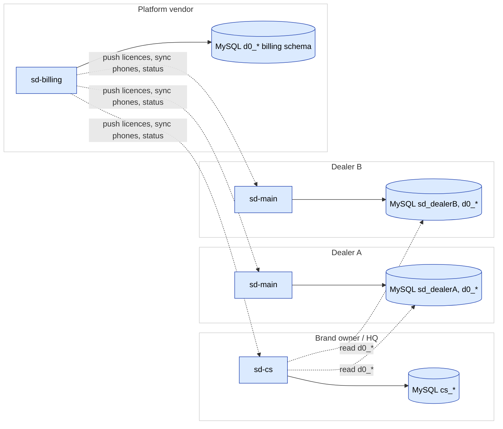
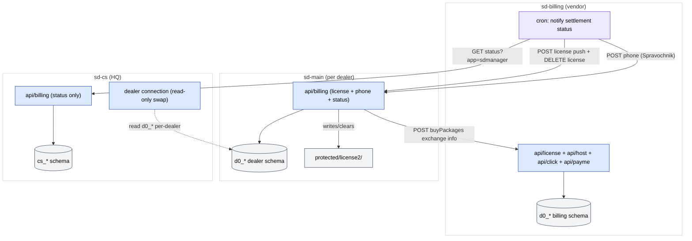

# The SalesDoctor ecosystem

There are **three sibling projects** that together form the SalesDoctor
platform — they live under `~/projects/salesdoctor/`:

```
sd-cs   ─►   sd-main   ─►   sd-billing
HQ            Dealer CRM       Subscriptions / licensing
```

| Project | Role | Audience |
|---------|------|----------|
| **[`sd-cs`](#sd-cs)** | Head office / "Country Sales 3" | The brand owner consolidating across many dealers |
| **[`sd-main`](#sd-main)** | Dealer CRM | Each dealer's day-to-day operational system |
| **[`sd-billing`](#sd-billing)** | Subscriptions, licensing, payments | The platform vendor managing dealer accounts |

The arrows above point from **consumer to producer** — i.e. each arrow
means "reads from", not "pushes to". Direction of data flow at runtime
is the opposite of the arrow for licence pushes / status pings, which
is why the Mermaid diagram below renders both relationships
explicitly:

- **`sd-cs`** is at HQ. It opens **read** connections into many
  `sd-main` databases to produce consolidated reports.
- **`sd-main`** is the system of record for a dealer's daily operations.
  Each dealer has their own `sd-main` instance, with their own MySQL
  schema (prefix `d0_`).
- **`sd-billing`** is upstream of every `sd-main` and `sd-cs`. It pushes
  licence files, syncs phone directories, pings status, and bills the
  dealer for the subscription. `sd-main` and `sd-cs` only read from
  Billing for licence checks.

See the **Ecosystem** diagram in the
[FigJam board](./architecture/diagrams.md).



## Inter-project integration map

Concrete endpoints, DB connections, licence-file paths, and cron-driven
pushes that wire the three projects together. This is the "how do they
talk?" view — start here when changing any cross-project boundary.



See [sd-billing integration](./sd-billing/integration.md) and
[sd-cs ↔ sd-main integration](./sd-cs/sd-main-integration.md) for the
detailed protocol per endpoint.

## Key feature catalog by project

The major capability areas of each project. Use this as a 30-second
intro for stakeholders; drill into module pages for depth.

```mermaid
flowchart TB
  subgraph SDMain["sd-main · Dealer CRM"]
    direction TB
    M_ORD["Orders (web + mobile + B2B online)"]
    M_AGT["Agents · routes · KPI · vehicles"]
    M_CLI["Clients · contracts · segments · debt"]
    M_WHS["Warehouse · stock · inventory · transfers"]
    M_PAY["Payments · cashier approval · cashbox"]
    M_AUD["Audits · facing · photo reports"]
    M_GPS["GPS tracking · geofence · trip playback"]
    M_INT["Integrations 1C · Didox · Faktura.uz · Smartup"]
    M_RPT["80+ reports · Excel export · pivots"]
    M_OO["B2B online store · Telegram bot · WebApp"]
  end

  subgraph SDCs["sd-cs · HQ Country Sales"]
    direction TB
    CS_RPT["Consolidated reports across all dealers"]
    CS_PIV["Pivots · RFM · SKU · expeditor"]
    CS_DIR["HQ directory · brands · segments · plans"]
    CS_MDB["Multi-DB read of dealer DBs (read-only)"]
  end

  subgraph SDBilling["sd-billing · Subscriptions and licensing"]
    direction TB
    B_SUB["Subscriptions · packages · tariffs · bonus"]
    B_LIC["Licence files · feature gating per system"]
    B_PAY["Click · Payme · Paynet · MBANK · P2P · cash"]
    B_SET["Daily settlement distributor / dealer"]
    B_NOT["Telegram + SMS notifications · expiry reminders"]
    B_PRT["Partner portal · self-service"]
  end

  classDef action fill:#dbeafe,stroke:#1e40af,color:#000
  class M_ORD,M_AGT,M_CLI,M_WHS,M_PAY,M_AUD,M_GPS,M_INT,M_RPT,M_OO action
  class CS_RPT,CS_PIV,CS_DIR,CS_MDB action
  class B_SUB,B_LIC,B_PAY,B_SET,B_NOT,B_PRT action

  style SDMain fill:#ffffff,stroke:#cccccc
  style SDCs fill:#ffffff,stroke:#cccccc
  style SDBilling fill:#ffffff,stroke:#cccccc
```



## sd-cs {#sd-cs}

The **Country Sales 3** application — Yii 1.x, two MySQL connections
(its own `cs_*` schema + a swappable `dealer` connection into each
dealer's `d0_*` DB), focused on consolidated reporting and pivots.

See [sd-cs section](./sd-cs/overview.md).

## sd-main {#sd-main}

The dealer CRM — the bulk of this site is about sd-main. See
[Architecture](./architecture/overview.md), the
[Module reference](./modules/overview.md), and the
[API reference](./api/overview.md).

## sd-billing {#sd-billing}

The platform-vendor's subscription billing system — Yii 1.1.15, MySQL,
Docker, 13 modules covering distributors, dealers, packages,
subscriptions, payments (Click / Payme / Paynet / MBANK / P2P),
settlement, dunning. See [sd-billing section](./sd-billing/overview.md).

## Other folders

`sd-components/` (a Vue + Vuetify UI library) and `manager-ai/` (an
empty AI-assistant scaffold) sit alongside the three core projects.
They aren't peer products — treat them as internal libraries / future
work. See [sd-components notes](./sd-cs/sd-components.md).
