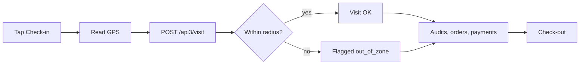

# `agents` module

Sales agents (the field force) + their plans, KPIs, limits and assigned
vehicles.

## Key entities

| Entity | Model |
|--------|-------|
| Agent | `Agent` |
| Agent settings | `AgentSettings` |
| Agent plan | `AgentPlan` (target volumes / counts) |
| Agent paket | `AgentPaket` (product bundles) |
| Car | `Car` (vehicle assigned to the agent) |
| KPI | various `Kpi*` models |

## Controllers

`AgentController`, `KpiController`, `KpiNewController`, `LimitController`,
`CarController`.

## Plans & KPI

Agent plans are managed monthly. The `KpiController` reports actual vs.
plan numbers. `KpiNewController` is the v2 rewrite — newer projects should
prefer it.

## Limits

`LimitController` enforces credit and discount limits per agent. Limits are
checked at order creation and at approval.

## Key feature flow — Visit & GPS

See **Feature — Visit & GPS Geofence** in the
[FigJam board](../architecture/diagrams.md).

## Mobile

The agent mobile app calls **api3**. See:
- [api3 LoginController](../api/api-v3-mobile.md#login)
- [Visit endpoints](../api/api-v3-mobile.md#visits)
