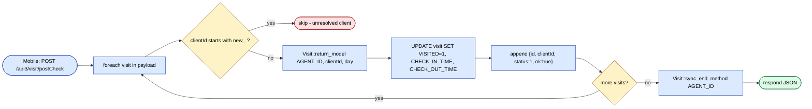
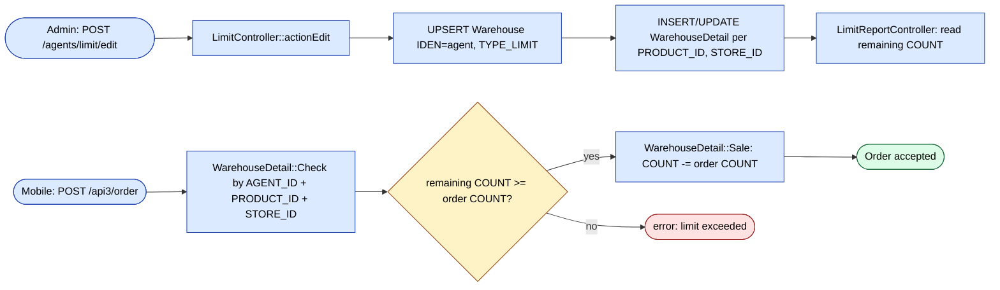
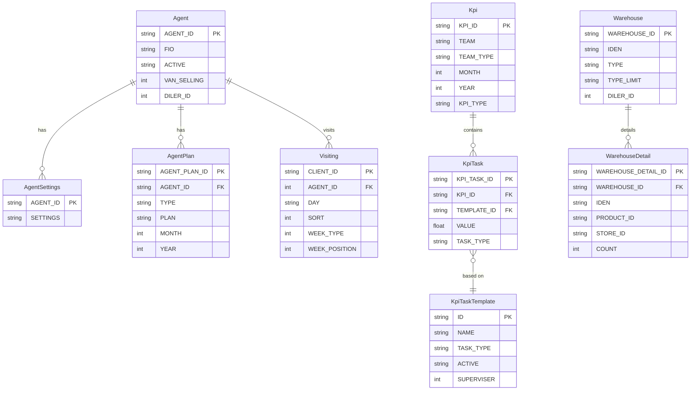
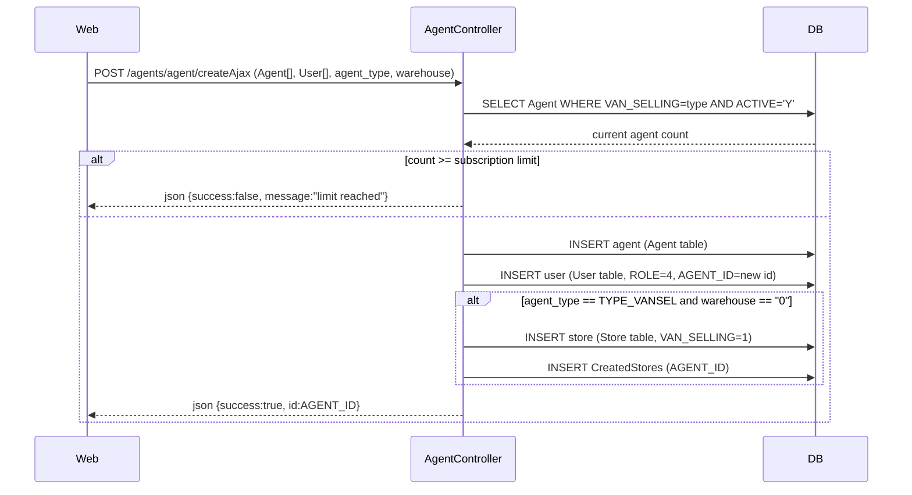
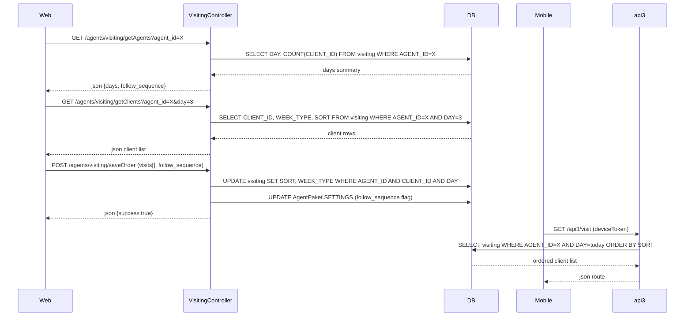
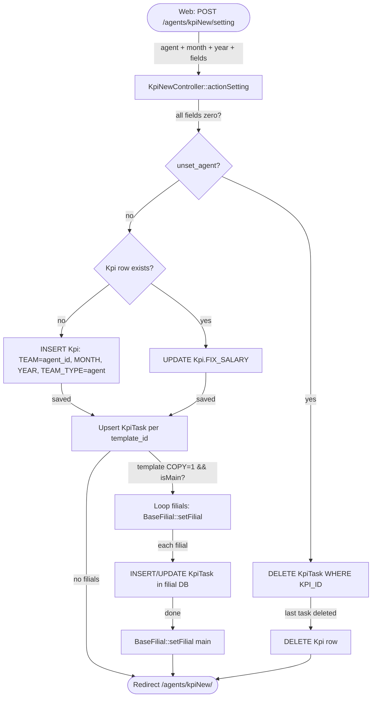
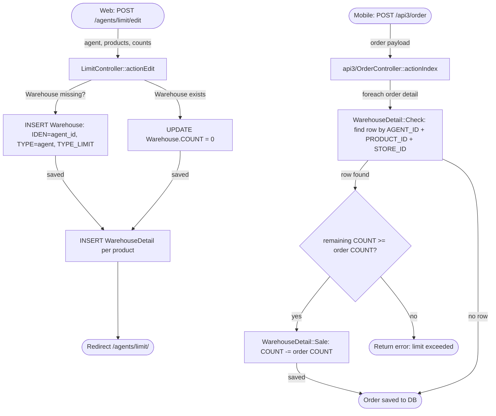

# `agents` module

Sales agents (the field force) plus their plans, KPIs, vehicles, and
limits. The web admin controls how the field force is structured;
agents themselves work from the mobile app via api3.

## Key features

| Feature | What it does | Owner role(s) |
|---------|--------------|---------------|
| Agent CRUD | Create / edit / deactivate agents | 1 / 2 / 9 |
| Agent settings | Per-agent toggles (cash collection, discount caps, etc.) | 1 / 9 |
| Monthly plan | Target volumes / counts per period | 1 / 9 |
| KPI v1 / v2 | Plan-vs-actual reports per agent | 8 / 9 |
| Credit limit | Max debt the agent can accept on an order | 1 / 9 |
| Discount limit | Max discount the agent can apply | 1 / 9 |
| Vehicle assignment | Each agent links to a `Car` | 1 / 9 |
| Paket / bundles | Pre-defined product bundles agents can sell | 1 / 9 |
| Route assignment | Day-of-week routes mapped to clients | 8 / 9 |

## Folder

```
protected/modules/agents/
├── controllers/
│   ├── AgentController.php
│   ├── CarController.php
│   ├── KpiController.php
│   ├── KpiNewController.php   # v2 — prefer for new screens
│   └── LimitController.php
└── views/
```

## Key entities

| Entity | Model |
|--------|-------|
| Agent | `Agent` |
| Agent settings | `AgentSettings` |
| Agent plan | `AgentPlan` |
| Agent paket | `AgentPaket` |
| Car | `Car` |
| KPI | various `Kpi*` models |

## Plans & KPI

Agent plans are managed monthly. `KpiController` reports actual vs.
plan numbers; `KpiNewController` is the rewrite — new projects should
prefer it.

## Limits

`LimitController` enforces credit and discount limits. Limits are
checked **at order creation** and **at approval**. An agent that
exceeds either limit forces the order into manager-approval state.

## Mobile (api3)

The agent mobile app calls api3:

- [`POST /api3/login/index`](../api/api-v3-mobile/index.md#login)
- [`POST /api3/visit/index`](../api/api-v3-mobile/index.md#visits)
- `GET /api3/agent/route` — today's clients
- `GET /api3/kpi/index` — agent's own KPI tile

## Key feature flow — Visit & GPS

See **Feature · Visit & GPS geofence** in
[FigJam · sd-main · Feature Flows](https://www.figma.com/board/MyvyaeEluqvHofH4E2qIoU).


## Visit post-check (server-side recheck of synced visits)

After the mobile app uploads visits via `api3/VisitController::actionPost`,
it follows up with `actionPostCheck`
(`protected/modules/api3/controllers/VisitController.php:97`). The
endpoint re-fetches the canonical `Visit` row by
`(AGENT_ID, CLIENT_ID, day)`, applies the device-side `startTime` /
`endTime` to `CHECK_IN_TIME` / `CHECK_OUT_TIME`, sets `VISITED=1`,
and calls `Visit::sync_end_method` to close the agent's session.
Synthetic `new_*` client IDs are skipped (those are agent-created
clients still pending approval).



## Limit enforcement (agent product / credit caps)

`LimitController::actionEdit`
(`protected/modules/agents/controllers/LimitController.php`)
defines per-agent product quantity caps stored in
`Warehouse` + `WarehouseDetail`. `LimitReportController` surfaces
remaining counts; the actual enforcement happens at order-save time
when `api3/OrderController` triggers `WarehouseDetail::Sale` to
decrement `COUNT` per `(AGENT_ID, PRODUCT_ID, STORE_ID)`. A would-be
negative count blocks the sale.



## Permissions

| Action | Roles |
|--------|-------|
| Create / edit | 1 / 2 / 9 |
| View KPI | 1 / 2 / 8 / 9 (own only for 4) |
| Set limits | 1 / 2 / 9 |

## Workflows

### Entry points

| Trigger | Controller / Action / Job | Notes |
|---|---|---|
| Web (admin) | `AgentController::actionCreateAjax` | Creates `Agent` + linked `User` (role 4); enforces subscription limits |
| Web (admin) | `AgentController::actionUpdateAjax` | Updates agent profile and `User` credentials |
| Web (admin) | `LimitController::actionEdit` | Saves per-product quantity limits into `Warehouse` / `WarehouseDetail` |
| Web (admin) | `LimitController::actionChangeType` | Switches a limit's `TYPE_LIMIT` (daily / monthly / 30-day) |
| Web (admin) | `VisitingController::actionSaveOrder` | Persists day-of-week route order for an agent into `Visiting` |
| Web (admin) | `KpiNewController::actionSetting` | Creates or updates `Kpi` + `KpiTask` records for a period |
| Web (admin) | `KpiNewController::actionTemplate` | Creates or updates `KpiTaskTemplate` (optionally replicated to filials) |
| Mobile (api3) | `api3/KpiController::actionIndex` | Returns this month's KPI tile data to the mobile app |
| Mobile (api3) | `api3/VisitController` | Returns today's client route via `Visiting` rows |

---

### Domain entities



---

### Workflow 1.1 — Agent creation with subscription check

When an admin creates a new agent, `AgentController::actionCreateAjax` verifies the tenant's subscription cap for the agent type (field, van-selling, or seller) before persisting the `Agent` and its linked `User` account. Van-selling agents also get a dedicated warehouse created or attached at this point.



---

### Workflow 1.2 — Day-of-week route assignment

An admin assigns clients to an agent's weekday route via `VisitingController`. The controller reads existing `Visiting` rows grouped by day, allows drag-and-drop re-ordering, and flushes the `SORT` and `WEEK_TYPE` values back to the database. The mobile app subsequently reads today's clients through the `api3/VisitController`.



---

### Workflow 1.3 — KPI v2 monthly plan assignment

Each month an admin selects agents, a period (month/year), and target values per `KpiTaskTemplate`. `KpiNewController::actionSetting` creates one `Kpi` row per agent-period (or reuses the existing one) and upserts child `KpiTask` rows. If the account has filials and a template is flagged for cross-filial copy, the controller iterates over each filial prefix and saves a mirrored record before returning to the main database.



---

### Workflow 1.4 — Product-quantity limit enforcement at order time

An admin defines how many units of each product an agent may sell in a given period via `LimitController`. The limit type (daily `"1"`, monthly `"2"`, or rolling-30-day `"3"`) is stored in `Warehouse.TYPE_LIMIT`. When the mobile app syncs an order, `api3/OrderController` triggers `WarehouseDetail::Sale`, which decrements the remaining count for the matching `(AGENT_ID, PRODUCT_ID, STORE_ID)` row. If the count would go negative the sale is blocked.



---

### Cross-module touchpoints

- Reads: `planning.Planning` (agent monthly totals consumed by `api3/KpiController::version2`)
- Reads: `orders.Order` / `orders.OrderDetail` (actual vs. plan comparison in KPI calculation)
- Writes: `warehouse.Warehouse` / `warehouse.WarehouseDetail` (limit buckets written by `LimitController`)
- Writes: `users.User` (role-4 user record created/updated alongside every `Agent` save in `AgentController`)
- APIs: `api3/kpi/index` — agent's own monthly KPI tile
- APIs: `api3/visit/*` — today's ordered client route built from `Visiting` rows

---

### Gotchas

- `AgentController::actionIndex` immediately redirects to `/staff/view/agent`; the agent list is rendered by the `staff` module, not here.
- `KpiNewController` stores the team as a plain comma-separated string in `Kpi.TEAM`, not a foreign-key join table, so bulk deletes require string-matching logic.
- `Warehouse.TYPE_LIMIT` values `"1"`, `"2"`, `"3"` are reset display labels ("За день", "За месяц", "За 30 дней") with no enum guard; passing an unknown value silently stores it without error.
- `AgentPaket.SETTINGS` is a large JSON blob (up to 100 000 chars per rules) that contains both route `follow_sequence` config and other app-level toggles; edits from multiple screens clobber each other unless the full blob is read-modify-written.
- `KpiTaskTemplate` soft-deletes by setting `ACTIVE = "N"` (`KpiNewController::actionDelete`); hard-delete code is commented out, so orphan `KpiTask` rows can accumulate.
