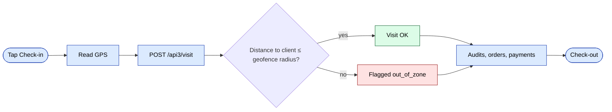

# `agents` module

Sales agents (the field force) plus their plans, KPIs, vehicles, and
limits. The web admin controls how the field force is structured;
agents themselves work from the mobile app via api3.

## Key features

| Feature | What it does | Owner role(s) |
|---------|--------------|---------------|
| Agent CRUD | Create / edit / deactivate agents | 1 / 2 / 9 |
| Agent settings | Per-agent toggles (cash collection, discount caps, etc.) | 1 / 9 |
| Monthly plan | Target volumes / counts per period | 1 / 9 |
| KPI v1 / v2 | Plan-vs-actual reports per agent | 8 / 9 |
| Credit limit | Max debt the agent can accept on an order | 1 / 9 |
| Discount limit | Max discount the agent can apply | 1 / 9 |
| Vehicle assignment | Each agent links to a `Car` | 1 / 9 |
| Paket / bundles | Pre-defined product bundles agents can sell | 1 / 9 |
| Route assignment | Day-of-week routes mapped to clients | 8 / 9 |

## Folder

```
protected/modules/agents/
├── controllers/
│   ├── AgentController.php
│   ├── CarController.php
│   ├── KpiController.php
│   ├── KpiNewController.php   # v2 — prefer for new screens
│   └── LimitController.php
└── views/
```

## Key entities

| Entity | Model |
|--------|-------|
| Agent | `Agent` |
| Agent settings | `AgentSettings` |
| Agent plan | `AgentPlan` |
| Agent paket | `AgentPaket` |
| Car | `Car` |
| KPI | various `Kpi*` models |

## Plans & KPI

Agent plans are managed monthly. `KpiController` reports actual vs.
plan numbers; `KpiNewController` is the rewrite — new projects should
prefer it.

## Limits

`LimitController` enforces credit and discount limits. Limits are
checked **at order creation** and **at approval**. An agent that
exceeds either limit forces the order into manager-approval state.

## Mobile (api3)

The agent mobile app calls api3:

- [`POST /api3/login/index`](../api/api-v3-mobile.md#login)
- [`POST /api3/visit/index`](../api/api-v3-mobile.md#visits)
- `GET /api3/agent/route` — today's clients
- `GET /api3/kpi/index` — agent's own KPI tile

## Key feature flow — Visit & GPS

See **Feature · Visit & GPS geofence** in
[FigJam · sd-main · Feature Flows](https://www.figma.com/board/MyvyaeEluqvHofH4E2qIoU).



## Permissions

| Action | Roles |
|--------|-------|
| Create / edit | 1 / 2 / 9 |
| View KPI | 1 / 2 / 8 / 9 (own only for 4) |
| Set limits | 1 / 2 / 9 |
