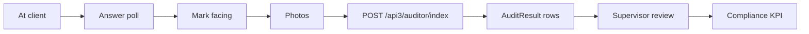

# `audit` and `adt` modules

Merchandising and trade marketing. Agents and dedicated auditors run
structured surveys at outlets:

| Module | Purpose |
|--------|---------|
| `audit` | Standard audits, polls, photo reports, facing |
| `adt` | Advanced audit toolkit (configurable surveys, brand/segment) |

## Audit module controllers

`AuditController`, `AuditorController`, `AuditsController`,
`DashboardController`, `FacingController`, `PhotoReportController`,
`PollController`, `PollResultController`.

## Audit data model

| Entity | Model |
|--------|-------|
| Audit | `Audit` |
| Audit result | `AuditResult` |
| Poll question | `AuditPollQuestion` |
| Poll variant | `AuditPollVariant` |
| Poll result | `AuditPollResult`, `AuditPollResultData` |
| Facing | `AFacing` |
| Photo report | `PhotoReport` |

## ADT (advanced)

`adt` supports configurable polls (`AdtPoll`, `AdtPollQuestion`,
`AdtPollResult`), property dimensions (`AdtProperty1`, `AdtProperty2`),
brand and segment grouping, and parametrised reports (`AdtReports`).

The mobile app's "audit" tab calls api3 endpoints that proxy into these
models.

## Key feature flow — Audit submission

See **Feature — Audit Submission** in the
[FigJam board](../architecture/diagrams.md).

