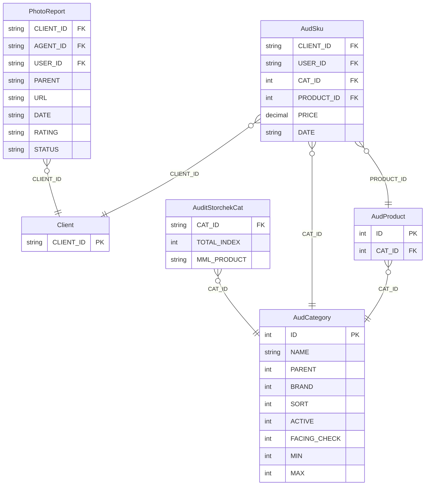
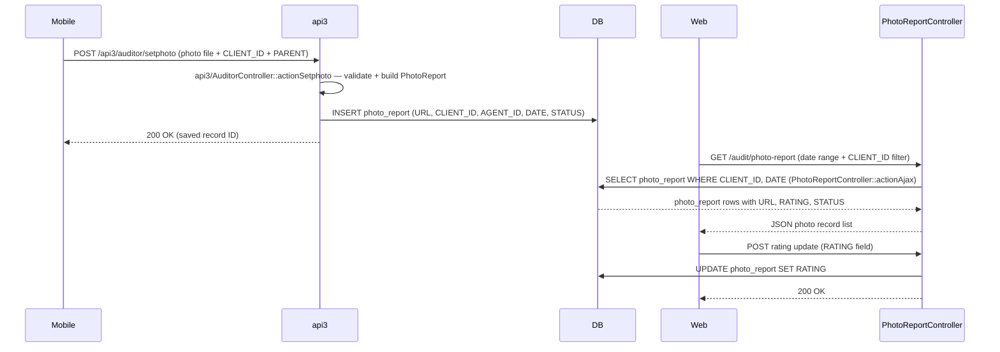
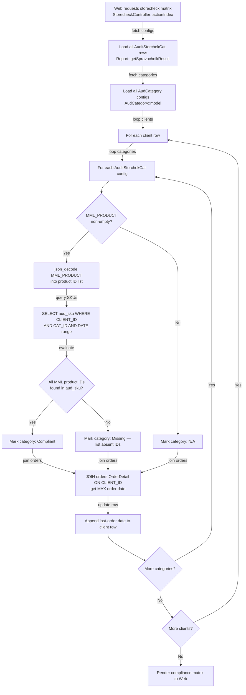

# `audit` and `adt` modules

Merchandising and trade marketing. Agents and dedicated auditors run
structured surveys at client outlets.

| Module | Purpose |
|--------|---------|
| `audit` | Standard audits, polls, photo reports, facing |
| `adt` | Advanced audit toolkit (configurable surveys, brand / segment) |

## Key features

| Feature | What it does | Owner role(s) |
|---------|--------------|---------------|
| Define audit form | Build a poll: questions, variants, products to face | 1 / 9 |
| Assign to outlets / segments | Target the audit to specific clients | 1 / 9 |
| Run audit (mobile) | Agent answers poll, marks facing, takes photos | Agent |
| Photo report | Photo-only audit (lighter than full poll) | Agent |
| Facing per SKU | Track shelf placement for each SKU | Agent |
| Compliance scoring | Auto-score per outlet from poll answers | system |
| Supervisor review | Dashboard surfaces low-compliance outlets | Supervisor / Manager |
| ADT — properties / brands / segments | Multi-dimensional analytics on audit data | 1 / 9 |
| ADT — configurable reports | Parametrised report library on top of audit data | 1 / 9 |

## Audit module controllers

`AuditController`, `AuditorController`, `AuditsController`,
`DashboardController`, `FacingController`, `PhotoReportController`,
`PollController`, `PollResultController`.

## Audit data model

| Entity | Model |
|--------|-------|
| Audit | `Audit` |
| Audit result | `AuditResult` |
| Poll question | `AuditPollQuestion` |
| Poll variant | `AuditPollVariant` |
| Poll result | `AuditPollResult`, `AuditPollResultData` |
| Facing | `AFacing` |
| Photo report | `PhotoReport` |

## ADT (advanced)

`adt` supports configurable polls (`AdtPoll`, `AdtPollQuestion`,
`AdtPollResult`), property dimensions (`AdtProperty1`, `AdtProperty2`),
brand and segment grouping, and parametrised reports (`AdtReports`).

The mobile app's "audit" tab calls api3 endpoints that proxy into
these models.

## Key feature flow — Submission

See **Feature · Audit submission** in
[FigJam · sd-main · Feature Flows](https://www.figma.com/board/MyvyaeEluqvHofH4E2qIoU).

```mermaid
flowchart LR
  V(["At client"]) --> Q["Answer poll"]
  Q --> F["Mark facing"]
  F --> P["Photos"]
  P --> SUB["POST /api3/auditor/index"]
  SUB --> AR["AuditResult rows"]
  AR --> RV["Supervisor review"]
  RV --> KPI(["Compliance KPI"])

  classDef action   fill:#dbeafe,stroke:#1e40af,color:#000
  classDef approval fill:#fef3c7,stroke:#92400e,color:#000
  classDef success  fill:#dcfce7,stroke:#166534,color:#000
  classDef reject   fill:#fee2e2,stroke:#991b1b,color:#000
  classDef external fill:#f3f4f6,stroke:#374151,color:#000
  classDef cron     fill:#ede9fe,stroke:#6d28d9,color:#000

  class V,Q,F,P,SUB,AR action
  class RV approval
  class KPI success
```

<!-- TODO: missing reject/error branch — see workflow-design.md principle #9 -->

## Permissions

| Action | Roles |
|--------|-------|
| Configure audit | 1 / 9 |
| Run audit | 4 (agent) / dedicated auditors |
| Review | 8 / 9 |

## Workflows

### Entry points

| Trigger | Controller / Action / Job | Notes |
|---|---|---|
| Web — planned visit list | `AuditController::actionPlannedVisits` | JSON: visits scheduled but not yet completed |
| Web — not-visited list | `AuditController::actionNotVisited` | JSON: scheduled visits with no recorded outcome |
| Web — visit history grid | `AuditController::actionVisits` | JSON: completed visit records |
| Web — rejection reasons | `AuditController::actionAjaxRejects` | JSON: visits rejected with reason |
| Web — photo report (modern) | `AuditController::actionPhotoReport` | JSON: photo records per client/agent |
| Web — auditor CRUD index | `AuditorController::actionIndex` | Renders auditor management grid |
| Web — auditor create | `AuditorController::actionCreateAjax` | Creates `Auditor` + paired `User` (role 11) |
| Web — auditor update | `AuditorController::actionUpdateAjax` | Updates `Auditor` record |
| Web — visit summary grid | `AuditsController::actionIndex` | Aggregated visit grid |
| Web — visit detail | `AuditsController::actionViewDetail` | Single visit breakdown |
| Web — daily dashboard | `DashboardController::actionDaily` | Per-auditor visit counts and aggregations |
| Web — shelf-share report | `FacingController::actionIndex` | Shelf-share % by brand/category |
| Web — photo report view | `PhotoReportController::actionIndex` | Modern photo report page |
| Web — photo report JSON (by client/agent) | `PhotoReportController::actionAjax` | JSON: photo records filtered by client/agent |
| Web — photo report JSON (by user) | `PhotoReportController::actionAjax2` | JSON: photo records filtered by USER_ID |
| Web — photo URL list | `PhotoReportController::actionAjax3` | JSON: raw photo URLs |
| Web — poll management | `PollController::actionIndex` | Poll/question/variant CRUD |
| Web — poll results aggregated | `PollResultController::actionIndex` | Aggregated poll result grid |
| Web — poll result detail | `PollResultController::actionDetail` | Per-poll-question breakdown |
| Web — price report | `PriceController::actionIndex` | Price min/max/avg report |
| Web — price JSON | `PriceController::actionAjaxPrice` | JSON: price data per client/product |
| Web — price client detail | `PriceController::actionDetailClients` | Per-client price drill-down |
| Web — settings config | `SettingsController::actionIndex` | `AudBrands`/`AudCategory`/`AudProduct`/`AudPlaceType` CRUD |
| Web — storecheck matrix | `StorecheckController::actionIndex` | MML compliance matrix per client/category |
| Web — storecheck settings save | `StorecheckController::actionSetting` | Saves per-category MML product list to `audit_storchek_cat` |
| Web — SKU presence report | `SkuController::actionIndex` | SKU presence report per client/category |
| Mobile POST | `api3/AuditorController::actionSetphoto` | Writes new `PhotoReport` record during client visit |

### Domain entities

### Workflow 1.1 — Photo-report capture and review

A mobile auditor uploads photos of client shelf state during a visit via the `api3` endpoint; a web reviewer later loads the photo report grid and rates each photo. The audit module's web controllers are purely read-side — they never write to `photo_report` directly.

### Workflow 1.2 — Storecheck (MML) compliance check

An admin configures a minimum must-have product list (MML) per category via `StorecheckController::actionSetting`, which persists the list as a JSON array in `audit_storchek_cat.MML_PRODUCT`. When the storecheck report loads, `StorecheckController::actionIndex` evaluates each client against each category's MML and joins `orders.OrderDetail` to surface the last-order date alongside the compliance result.

### Cross-module touchpoints

- Reads: `clients.Client` (CLIENT_ID lookup in photo report, SKU, and facing queries), `agents.Agent` / `staff.User` (USER_ID and AGENT_ID joins for auditor identity), `orders.OrderDetail` (last-order date JOIN in `StorecheckController::actionIndex`).
- Writes: `photo_report` from `api3/AuditorController::actionSetphoto`. NO writes from the audit module's own controllers — the audit module is read-only over the data tables; only `SettingsController` writes to `AudBrands`/`AudCategory`/`AudProduct`/`AudPlaceType`, and `StorecheckController::actionSetting` writes to `audit_storchek_cat`.
- APIs: `POST /api3/auditor/setphoto` → `photo_report` insert. (The `actionAudit`, `actionAuditResult`, and `actionPollResult` endpoints in `api3/AuditorController` belong to the `adt` module's data flow — out of scope here.)

### Gotchas

- The audit module's web reports read `aud_sku`, `aud_facing`, and `poll_result`, but the modern mobile (`api3`) write path writes to `AdtAuditResult` / `AdtPollResult` (in the `adt` module). The actual writer of `aud_sku` / `aud_facing` is **not the api3 AuditorController** — verify before assuming an end-to-end pipeline.
- `AuditStorchekCat.MML_PRODUCT` is stored as a JSON array of product IDs (varchar/text column). It is decoded inline in `StorecheckController::actionIndex` via `json_decode` — not through a typed accessor. Schema changes here will break the compliance report silently.
- `Auditor` rows pair 1:1 with a `User` row of role 11 (created in `AuditorController::actionCreateAjax`). Deactivating only the `Auditor` record without deactivating the paired `User` leaves a stale login.
- No background jobs touch this module — all data is request-driven.
