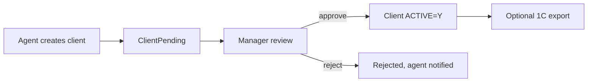

# `clients` module

Manages the customer database (B2B outlets, retailers, HoReCa, etc.) plus
supporting domain objects: contracts, segments, debt, geo location, route
membership.

## Folder

```
protected/modules/clients/
├── controllers/
│   ├── ClientController.php
│   ├── ApiController.php
│   ├── ApprovalController.php
│   ├── AgentRouteController.php
│   ├── ComputationController.php
│   └── …
└── views/
```

## Key entities

| Entity | Model | Notes |
|--------|-------|-------|
| Client | `Client` | The outlet/customer record |
| Client category | `ClientCategory` | Pricing tier / segmentation |
| Contract | `ContractClient` | Optional commercial contract |
| Route | `Route`, `RouteClient` | Sales agent routes |
| Debt snapshot | `ClientDebt` | Computed receivables aging |
| Tax / INN | columns on `Client` | Used for Faktura.uz / Didox EDI |

## Approval workflow

New clients created in the field by agents go through approval before they
become orderable. `ApprovalController` lists pending records; an
admin/manager approves, edits, or rejects.

## Geo

Clients can store latitude/longitude. The `gps` module uses these to
verify that an agent's check-in is within a configurable radius.

## Key feature flow — Client approval

See **Feature — Client Approval** in the
[FigJam board](../architecture/diagrams.md).



## API

| Endpoint | Purpose |
|----------|---------|
| `GET /api3/client/list` | Sync route clients to mobile |
| `POST /api3/client/create` | Field-created clients (pending) |
| `GET /api4/client/list` | B2B portal listing |
