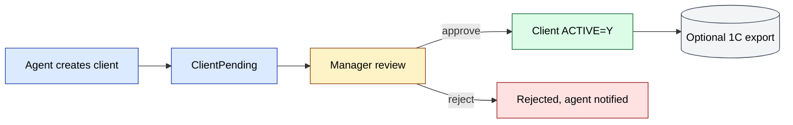

# `clients` module

Manages the **customer database** in sd-main: B2B outlets, retailers,
HoReCa, plus supporting domain objects — contracts, segments, debt,
geo location, and route membership.

## Key features

| Feature | What it does | Owner role(s) |
|---------|--------------|---------------|
| Client CRUD | Create / edit / archive client records | 1 / 2 / 5 / 9 |
| Field-created clients (mobile) | Agent submits new client during a visit; record goes to *Pending* | 4 |
| Client approval | Manager reviews pending records; approve / edit / reject | 1 / 2 / 9 |
| Categories & segments | Tier clients by sales segment; affects price type and discount | 1 / 9 |
| Contracts | Optional commercial contracts per client (terms, payment days) | 1 / 9 |
| Geo coordinates | `LAT` / `LNG` on every client; used by `gps` for geofencing | 1 / 4 |
| Route membership | Clients are grouped into routes assigned to agents | 8 / 9 |
| Debt snapshot | Computed receivables aging surfaced in reports | 6 / 9 |
| Bulk import | CSV / Excel import for migration | 1 |
| 1C / Faktura.uz round-trip | `XML_ID` + `INN` for outbound EDI | system |

## Folder

```
protected/modules/clients/
├── controllers/
│   ├── ClientController.php
│   ├── ApiController.php
│   ├── ApprovalController.php
│   ├── AgentRouteController.php
│   ├── ComputationController.php
│   └── …
└── views/
```

## Key entities

| Entity | Model | Notes |
|--------|-------|-------|
| Client | `Client` | Active outlets/customers |
| Pending client | `ClientPending` | Field-created, awaiting approval |
| Client category | `ClientCategory` | Pricing tier / segmentation |
| Contract | `ContractClient` | Commercial contract |
| Route | `Route`, `RouteClient` | Agent routes |
| Debt snapshot | `ClientDebt` | Computed aging |

## Approval workflow

See **Feature · Client Approval** in
[FigJam · sd-main · Feature Flows](https://www.figma.com/board/MyvyaeEluqvHofH4E2qIoU).



## API

| Endpoint | Purpose |
|----------|---------|
| `GET /api3/client/list` | Sync route clients to mobile |
| `POST /api3/client/create` | Field-created clients (pending) |
| `GET /api4/client/list` | B2B portal listing |

## Permissions

| Action | Roles |
|--------|-------|
| Create | 1 / 2 / 4 (pending only) / 5 |
| Approve | 1 / 2 / 9 |
| Edit | 1 / 2 / 5 / 9 |
| Archive | 1 / 2 |

## See also

- [`agents`](./agents.md) (route assignment)
- [`gps`](./gps.md) (geofencing)
- [`orders`](./orders.md) (clients are buyers)
