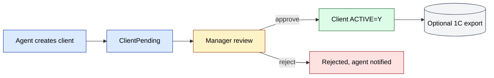
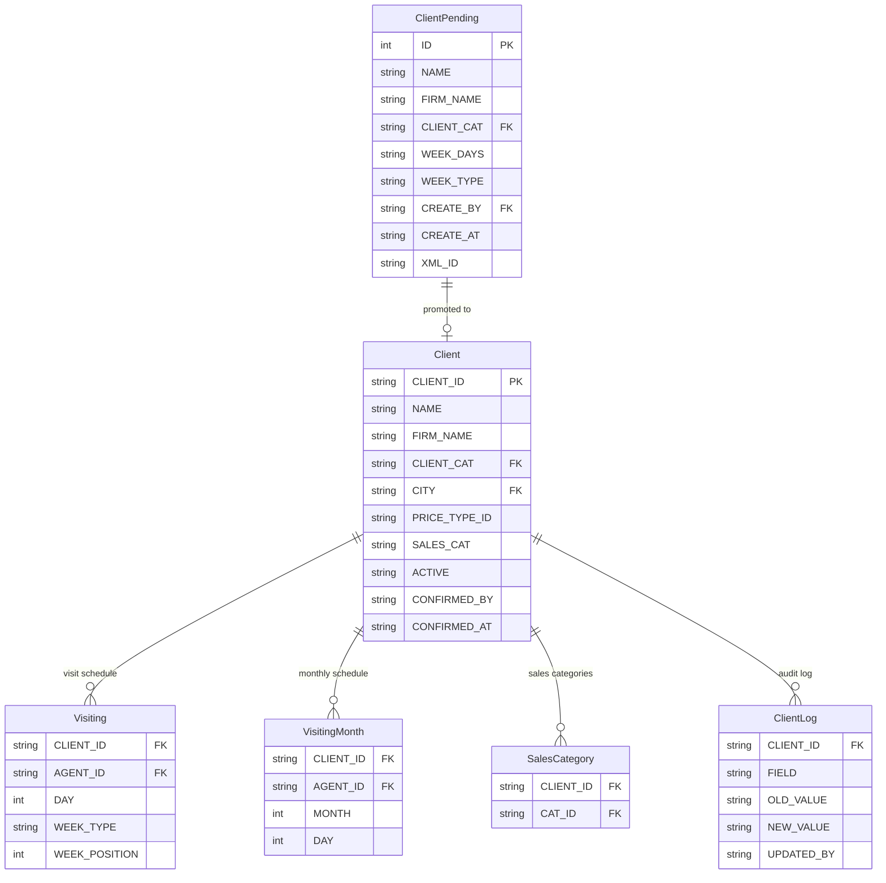
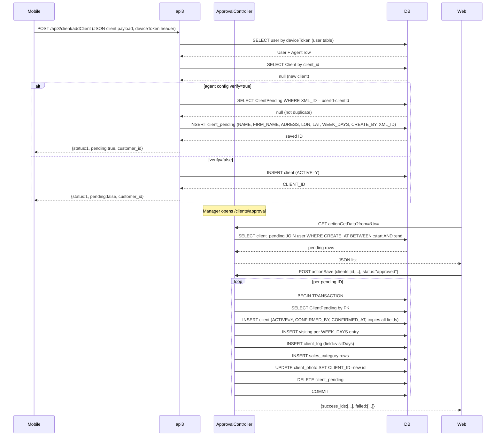
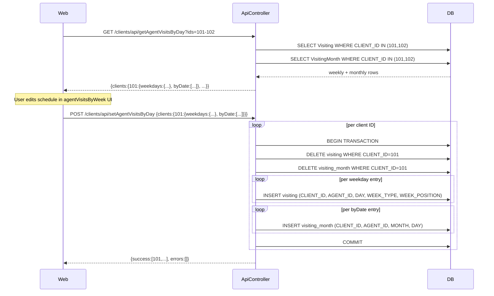
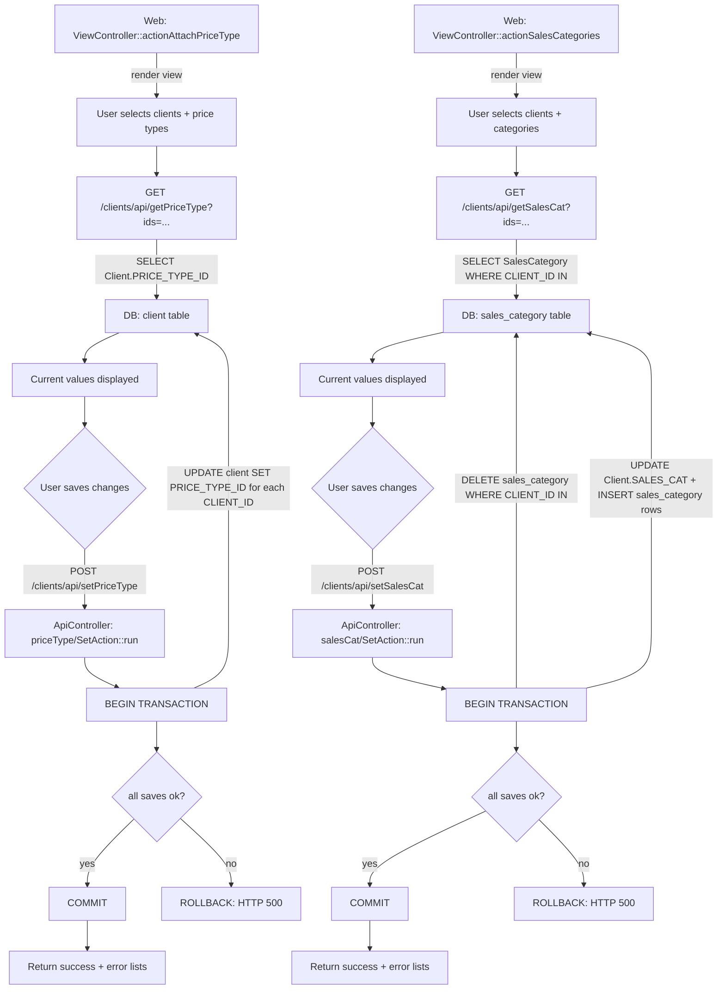

# `clients` module

Manages the **customer database** in sd-main: B2B outlets, retailers,
HoReCa, plus supporting domain objects — contracts, segments, debt,
geo location, and route membership.

## Key features

| Feature | What it does | Owner role(s) |
|---------|--------------|---------------|
| Client CRUD | Create / edit / archive client records | 1 / 2 / 5 / 9 |
| Field-created clients (mobile) | Agent submits new client during a visit; record goes to *Pending* | 4 |
| Client approval | Manager reviews pending records; approve / edit / reject | 1 / 2 / 9 |
| Categories & segments | Tier clients by sales segment; affects price type and discount | 1 / 9 |
| Contracts | Optional commercial contracts per client (terms, payment days) | 1 / 9 |
| Geo coordinates | `LAT` / `LNG` on every client; used by `gps` for geofencing | 1 / 4 |
| Route membership | Clients are grouped into routes assigned to agents | 8 / 9 |
| Debt snapshot | Computed receivables aging surfaced in reports | 6 / 9 |
| Bulk import | CSV / Excel import for migration | 1 |
| 1C / Faktura.uz round-trip | `XML_ID` + `INN` for outbound EDI | system |

## Folder

```
protected/modules/clients/
├── controllers/
│   ├── ClientController.php
│   ├── ApiController.php
│   ├── ApprovalController.php
│   ├── AgentRouteController.php
│   ├── ComputationController.php
│   └── …
└── views/
```

## Key entities

| Entity | Model | Notes |
|--------|-------|-------|
| Client | `Client` | Active outlets/customers |
| Pending client | `ClientPending` | Field-created, awaiting approval |
| Client category | `ClientCategory` | Pricing tier / segmentation |
| Contract | `ContractClient` | Commercial contract |
| Route | `Route`, `RouteClient` | Agent routes |
| Debt snapshot | `ClientDebt` | Computed aging |

## Approval workflow

See **Feature · Client Approval** in
[FigJam · sd-main · Feature Flows](https://www.figma.com/board/MyvyaeEluqvHofH4E2qIoU).



## API

| Endpoint | Purpose |
|----------|---------|
| `GET /api3/client/list` | Sync route clients to mobile |
| `POST /api3/client/create` | Field-created clients (pending) |
| `GET /api4/client/list` | B2B portal listing |

## Permissions

| Action | Roles |
|--------|-------|
| Create | 1 / 2 / 4 (pending only) / 5 |
| Approve | 1 / 2 / 9 |
| Edit | 1 / 2 / 5 / 9 |
| Archive | 1 / 2 |

## See also

- [`agents`](./agents.md) (route assignment)
- [`gps`](./gps.md) (geofencing)
- [`orders`](./orders.md) (clients are buyers)

## Workflows

### Entry points

| Trigger | Controller / Action / Job | Notes |
|---|---|---|
| Web | `ApprovalController::actionIndex` | Manager opens pending-client review list |
| Web | `ApprovalController::actionGetData` | Fetches `client_pending` rows for date range |
| Web | `ApprovalController::actionSave` | Bulk-approves pending clients, creates `Client` records |
| Web | `ApprovalController::actionDelete` | Rejects (deletes) pending clients |
| Web | `ViewController::actionAgentVisitsByWeek` | UI for agent attachment / detachment schedule |
| Web | `ViewController::actionAttachPriceType` | UI for price-type assignment to clients |
| Web | `ViewController::actionSalesCategories` | UI for sales-category assignment |
| Web API | `ApiController::getAgentVisitsByDay` | Reads `Visiting` + `VisitingMonth` for selected clients |
| Web API | `ApiController::setAgentVisitsByDay` | Replaces `Visiting` + `VisitingMonth` records in a transaction |
| Web API | `ApiController::getPriceType` | Reads `Client.PRICE_TYPE_ID` for selected clients |
| Web API | `ApiController::setPriceType` | Writes `Client.PRICE_TYPE_ID` for selected clients |
| Web API | `ApiController::getSalesCat` | Reads `SalesCategory` rows for selected clients |
| Web API | `ApiController::setSalesCat` | Replaces `SalesCategory` rows for selected clients |
| Mobile (`api3`) | `api3/ClientController::actionAddClient` | Agent submits new client; saved as `ClientPending` when `verify=true` |
| Mobile (`api3`) | `api3/ClientController::actionPending` | Agent polls own pending submissions |

### Domain entities



### Workflow 1.1 — Field-created client pending review

An agent creates a new client on mobile. If the distributor config has `client.verify = true`, the record is held in `ClientPending` until a manager approves or rejects it from the web back-office.



### Workflow 1.2 — Agent visit-schedule attachment / detachment

A manager assigns or removes agent-client visit slots (weekly by day-of-week or monthly by date). The operation is a full replace: existing `Visiting` and `VisitingMonth` rows for the client are deleted then re-inserted inside a transaction.



### Workflow 1.3 — Price-type and sales-category assignment

A manager bulk-assigns price types or sales categories to one or more clients. Both operations follow the same pattern through `ApiController` actions: fetch current values, edit in the UI, then persist with a single transactional write.



### Cross-module touchpoints

- Reads: `agents.Agent` (resolve AGENT_ID from User on approval; filter visiting schedule by agent)
- Reads: `agents.Visiting` / `VisitingMonth` (schedule display in `AgentRouteController::actionGetClients`)
- Writes: `agents.Visiting` / `VisitingMonth` (replaced on each `setAgentVisitsByDay` call)
- Writes: `clients.SalesCategory` (replaced on each `setSalesCat` call; also written during approval)
- Writes: `clients.ClientLog` (audit entry for `visitDays` field written during `ApprovalController::actionSave`)
- APIs: `api3/client/addClient` (mobile client creation → `ClientPending`)
- APIs: `api3/client/pending` (mobile agent polls own pending submissions)
- APIs: `api4/client/sales-category-list` (B2B portal reads sales categories)

### Gotchas

- `ApprovalController::actionSave` copies field values from `ClientPending` to `Client` using a hard-coded attribute list. Any new `ClientPending` column added in the future must also be added to the `$attributes` array in that method, otherwise it is silently dropped on approval.
- `agentVisitsByDay/SetAction` does a full delete-then-reinsert. Calling it with an empty `weekdays` and empty `byDate` for a client removes all visit assignments for that client with no confirmation prompt.
- `Client.PRICE_TYPE_ID` and `Client.SALES_CAT` are stored as comma-separated strings on the `client` row in addition to the normalised `sales_category` table. The two can drift out of sync if the `sales_category` table is written without also updating `Client.SALES_CAT`. `salesCat/SetAction` updates both; direct DB edits may not.
- The `api3/ClientController::actionAddClient` path splits into two code versions (`addClientVersion1` / `addClientVersion2`) based on `$_REQUEST['u'] === 'merch'`. Only version 1 writes to `ClientPending`; the merch variant (`addClientVersion2`) has its own flow.
- `ApprovalController::actionDelete` requires `operation.clients.approval.delete` permission, which is distinct from the approval permission (`operation.clients.approval`). Misconfigured roles that have approval but not delete cannot reject records.
