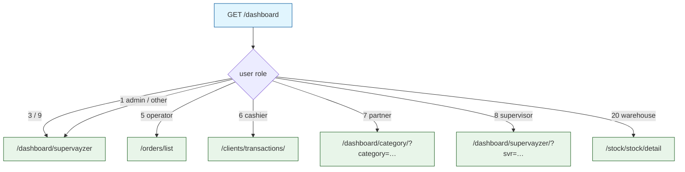
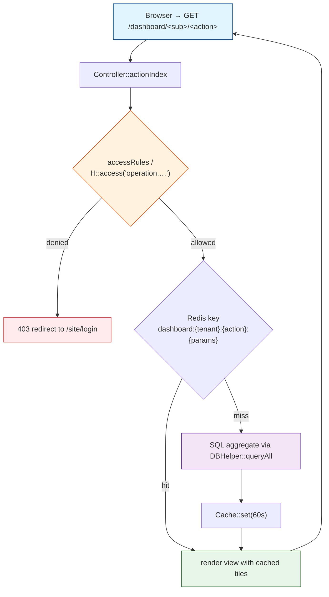
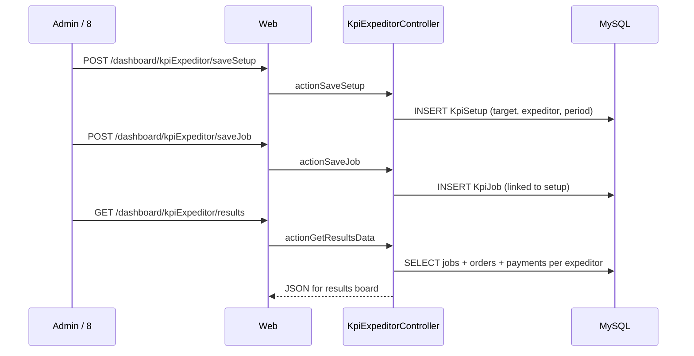

# `dashboard` module

KPI dashboards for super-admin / admin / manager / supervisor / cashier /
expeditor. Heavy on aggregates — cache aggressively (60s TTL is typical).
17 controllers, 65 routes — the largest "read-only" module in sd-main.

The default landing page is decided in `DefaultController::actionIndex`
(line 31) based on `Yii::app()->user->getRole()`. Role 3 / 9 (manager /
warehouse-admin) and the demo / admin user (role 1) end up on
`/dashboard/supervayzer` — that is also the URL harvested by the live
crawler.

## Key features

| Feature | What it does | Owner role(s) |
|---------|--------------|---------------|
| **Supervisor dashboard** | Daily overview: visit count, sold, photo report, license status, top territories | 1 / 3 / 5 / 8 / 9 |
| **Sales KPI**            | Per-agent monthly KPI plan vs. actual; plan editor with bulk select | 1 / 8 |
| **Expeditor KPI**        | 20-action engine: job setup, per-day targets, results, Excel import | 1 / 4 / 8 / 9 |
| **Cashier dashboard**    | Money-in / money-out summary for the kassa user | 6 |
| **KassaIncome views**    | Closed-shift income totals (3 variants: `closed`, `closed1`, `closed3`) | 1 (`operation.clients.kassaIncome`) |
| **Finance dashboard**    | Sales / debt / cash totals on one page | 1 (`operation.dashboard.finans`) |
| **Debt dashboard**       | Client-level debt aging, drillable by route | 1 / 2 |
| **Customer service**     | Daily complaints / call volume | 1 |
| **Billing**              | License balance, invoice creation, distributor reconciliation, SMS billing | 1 (`operation.billing.*`) |
| **Notifications panel**  | In-app message list with mark-as-read | all (`operation.notification.list`) |
| **Category dashboard**   | Product category sales for partner role | 7 |
| **Doctor dashboard**     | AKB / strike-rate visualization for the `doctor` module | 1 |

## Folder

```
protected/modules/dashboard/
├── controllers/
│   ├── DefaultController.php         ← role-router / landing
│   ├── SupervayzerController.php     ← /dashboard/supervayzer (admin lands here)
│   ├── KpiController.php             ← daily / monthly agent KPI
│   ├── Kpi2Controller.php            ← KPI v2 view
│   ├── KpiExpeditorController.php    ← 20 actions, expeditor KPI engine
│   ├── KassirController.php
│   ├── KassaIncomeController.php
│   ├── FinansController.php
│   ├── DolgController.php            ← debt drill-down
│   ├── SalesController.php
│   ├── CsController.php              ← customer service
│   ├── BillingController.php
│   ├── CategoryController.php
│   ├── DoctorController.php
│   ├── GmController.php
│   ├── NotificationController.php
│   └── AlisherController.php         ← legacy named dashboard
└── views/
```

## Role-based landing routing



Source: `DefaultController::actionIndex` (lines 31–60).

## Key entities

The dashboard module is read-only — it owns no tables. It reads from
every operational module:

| Entity | Model | Read from | Used for |
|--------|-------|-----------|----------|
| Order | `Order` (orders) | `d0_order` | KPI numerator / supervayzer summary |
| OrderDetail | `OrderDetail` (orders) | `d0_order_detail` | sales-by-product drilldowns |
| Visit | `Visit` (visit / agents) | `d0_visit` | KPI denominator (visit count) |
| PhotoReport | `PhotoReport` (audit) | `d0_photo_report` | supervayzer photo log |
| ClientTransaction | `ClientTransaction` (finans) | `d0_client_transaction` | finans / dolg / kassaIncome tiles |
| KpiResult | `KpiResult` (kpi) | `d0_kpi_result` | KPI plan vs. actual |
| Notification | (notification module) | `d0_notification` | bell-icon counter |
| License / billing | `Distr::getLicense()` (remote API) | billing service | balance, package list |

## Controllers

| Controller | Purpose | Actions |
|-----------|---------|---------|
| `DefaultController` | Role-based landing redirector + about page | `index`, `about` |
| `SupervayzerController` | Per-day supervisor view: visit grid, photo report, license, report-menu config | `index`, `license`, `photoReport`, `setReportMenu` |
| `KpiController` | Monthly agent KPI plan & actual, AJAX drilldowns | `index`, `daily`, `new`, `newSvr`, `ajaxOrderDetails`, `ajaxSuccessVisitOrders` |
| `Kpi2Controller` | v2 KPI view (newer UI) | `index`, `new2` |
| `KpiExpeditorController` | **Expeditor KPI engine** — biggest controller, 20 actions for setup / jobs / results | `index`, `setup`, `saveSetup`, `editSetup`, `deleteSetup`, `setupFromExcel`, `getSetup`, `getInstalled`, `newJob`, `saveJob`, `editJob`, `deleteJob`, `toggleJobStatus`, `getJob`, `getJobs`, `listJobs`, `results`, `getResultsData`, `getOrders`, `updateTotalKpiFraction` |
| `KassirController` | Cashier landing | `index` |
| `KassaIncomeController` | Closed-shift income (3 variants) | `index`, `closed`, `closed1`, `closed3` |
| `FinansController` | Finance summary v1 + v2 | `index`, `index2`, `about` |
| `DolgController` | Debt aging, drill by client / route | `index`, `detail`, `detailRoute` |
| `SalesController` | Per-territory sales chart | `index` |
| `CsController` | Customer-service KPIs | `index`, `auth`, `about` |
| `BillingController` | License balance, invoice, distributor revise, SMS billing | `index`, `pay`, `setInvoice`, `distrRevise`, `sms` |
| `CategoryController` | Partner category drilldown | `index` |
| `DoctorController` | AKB / strike-rate for doctor module | `index`, `akb`, `strikeRate` |
| `GmController` | GM (general manager) summary | `index`, `test`, `about` |
| `NotificationController` | In-app bell list | `list`, `markAsRead`, `unreadMessages` |
| `AlisherController` | Legacy named dashboard preserved for one tenant | `setOrderHistory` |

## Tile rendering flow

A typical dashboard endpoint reads from `redis_app` first, then falls
back to a SQL aggregate when the cache key is missing or expired.
The general shape is below — written without `;`-only lines so the
diagram renders in dark mode.



## Expeditor KPI flow

The `KpiExpeditorController` is the only "write" path in this module —
it stores **setup** (per-day targets) and **jobs** (assignments) in
the `kpi` module's tables and renders a results board.



## Live pages (harvested via Playwright)

| URL | Title | What's on screen |
|-----|-------|------------------|
| `/dashboard/supervayzer` | Дашборд | Filters (categories / territory / client cat), 7-col grid, photo-report viewer |
| `/dashboard/kpi` | KPI | Monthly plan editor, supervisor / agent picker, month + year picker, plan-installer modal |
| `/dashboard/kpiExpeditor` | KPI Экспедитора | 7-col results grid, tabs for Setup / Excel / Jobs / Results / Settings |
| `/dashboard/kpiExpeditor/results` | KPI Результаты | 8-field results page with break-out per-job KPIs |

See per-page references in `docs/ui/pages/` for the full field /
column / action atom listings.

## Permissions

| Action | RBAC operation | Default roles |
|--------|----------------|--------------|
| `/dashboard/supervayzer/index` | `operation.dashboard.supervayzer` | 1, 3, 5, 8, 9 |
| `/dashboard/kpi/*` | `operation.kpi.result` | 1, 8 |
| `/dashboard/finans/index` / `index2` | `operation.dashboard.finans` | 1 |
| `/dashboard/sales/index` | `operation.dashboard.sales` | 1 |
| `/dashboard/kassaIncome/*` | `operation.clients.kassaIncome` | 1, 6 |
| `/dashboard/billing/index` | `operation.billing.index` | 1 |
| `/dashboard/billing/distrRevise` | `operation.billing.distr` | 1 |
| `/dashboard/billing/sms` | `operation.billing.sms` | 1 |
| `/dashboard/notification/list` | `operation.notification.list` | all |

Routes with `rbac: null` (most of `kpiExpeditor`, `dolg`, `cs`, `gm`,
`doctor`) fall back to the controller-level `accessRules`. For
`SupervayzerController` (line 45) that is roles `3, 5, 8, 9`; for
`KpiExpeditorController` (line 35) it is `3, 8, 9, 4`.

## Cross-module touchpoints

- **Reads `orders.Order`** — every sales / supervayzer / KPI tile
  sums or counts orders by date / agent / status. The denormalised
  `Order.CLIENT_CAT` and `Order.CITY` make the typical KPI query
  index-friendly.
- **Reads `audit.PhotoReport`** — `SupervayzerController::actionPhotoReport`
  (line 67) joins photo report rows with date / city / client / category
  spravochniks to power the photo viewer in the live page.
- **Reads `finans.ClientTransaction`** — `FinansController` and
  `DolgController` sum `TRANS_TYPE=1` and `TRANS_TYPE=3` rows per day
  to draw the debt-vs-cash chart.
- **Reads `agents.Agent` and `agents.Visit`** — KPI denominator uses
  `Visit.SUCCESS=1` count.
- **Writes via `KpiExpeditorController::saveSetup` / `saveJob`** —
  the only "write" controller in the module. Persists to the
  underlying `kpi` module tables; the rest of the module is read-only.
- **Calls `Distr::billingDomain()`** — `BillingController::index`
  fetches license balance + SMS pack list from the central billing
  service.

## Gotchas

- **`DefaultController::accessRules` allows role 7, 8, 20** before the
  redirect logic runs. If a partner / supervisor / warehouse user has
  no entries in `Report::getSpravochnik(...)`, the controller falls
  through and redirects to `/dashboard/supervayzer/` even though the
  role would normally not see that page. Verify the spravochnik is
  seeded for those roles.
- **`KpiExpeditorController::accessRules` (line 35) is wide-open.**
  Roles `3, 8, 9, 4` are listed in the `allow` block AND there is a
  second `allow` block with `users => '*'`. Effectively, any
  authenticated user can hit `kpiExpeditor` endpoints unless an
  upstream filter blocks them. Tighten with a `H::access` call before
  shipping new tenants.
- **Tile cache key must include the tenant.** Building a Redis key
  without `DILER_ID` will leak data between tenants. The convention
  is `dashboard:{DILER_ID}:{controller}:{action}:{params-hash}`.
- **`Kpi2Controller` is the v2 path, `KpiController` is v1.** Both
  are live. Front-end picks based on a feature flag; do not delete
  `KpiController` until the flag is fully removed.
- **`AlisherController` is tenant-named.** It exists for one specific
  customer ("Alisher") and is kept alongside the generic dashboards.
  Don't add new logic there.

## See also

- [`orders`](./orders.md) — read for the KPI numerator (success-visit-orders)
- [`finans`](./finans.md) — debt + transactions feed the finans dashboard
- [`agents`](./agents.md) — KPI plan is per agent
- [`audit-adt`](./audit-adt.md) — supervayzer photo report
- [`settings-access-staff`](./settings-access-staff.md) — RBAC operations referenced above
