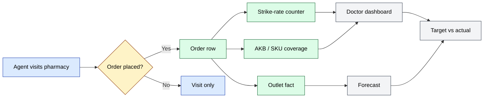
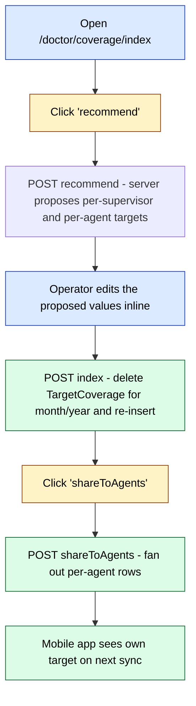
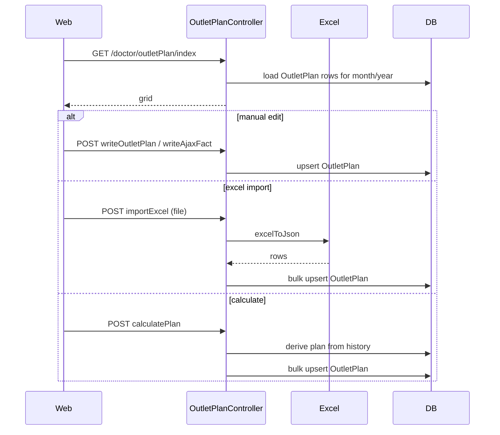

# `doctor` module

The `doctor` module is the pharmaceutical-vertical layer of sd-main. It does
**not** replace the core `clients` / `orders` / `agents` modules — instead it
layers a doctor-coverage and pharma-KPI workflow on top of them. Every action
here is scoped to a `Diler` (distributor partner) and ultimately reads the same
`Order` and `OrderDetail` rows produced by the standard order pipeline. The
output is a set of role-based reports (per agent, per supervisor, per region,
per product category) that the pharma sales team uses to track market
penetration against monthly targets.

> **Naming caveat.** The `/adt/*` URLs (Audit Doctor Team) belong to the
> `audit` module, not this one. This module is reached at `/doctor/*` and is
> sometimes referred to in the codebase as the *medreport* layer.

## Key features

| Feature | What it does | Owner role(s) |
|---------|--------------|---------------|
| **Doctor / clinic mapping** | Maps `Client` rows flagged as pharmacies / clinics to the agents who serve them | 2, 5 |
| **AKB targets** | Active Customer Base — sets and tracks monthly AKB targets per supervisor / category | 5, 9 |
| **SKU targets** | Per-SKU coverage targets (how many pharmacies must carry the SKU) | 5, 9 |
| **Strike rate** | Conversion rate: visited pharmacies that placed an order in the period | 3, 5, 9 |
| **Coverage targets** | Total client / pharmacy coverage targets per supervisor / region | 3, 5, 9 |
| **Target volume** | Monetary target volume per agent / supervisor / region with recommend / share-to-agents flow | 3, 5, 9 |
| **Outlet plans** | Per-outlet (per-pharmacy) monthly plans — manual entry, calculated, or Excel-imported | 3, 5, 9 |
| **Outlet facts** | Captured per-outlet monthly sales facts for variance vs plan | 3, 5, 9 |
| **Forecast** | Sales forecast (per category, per outlet) for the upcoming period | 3, 5, 9 |
| **Personal dashboard** | Role-aware personal KPI dashboard for pharma agents and supervisors | 4, 5 |
| **SMS to doctors** | Bulk SMS campaign tool with templates, scheduled send, packages, archive | 1, 2 |
| **Doctor2** | Newer dashboard variant exposing AKB / SKU / Strike rate side-by-side | 5 |
| **Volume KPI** | Volume KPI with `recommend` + `overwrite` (re-publishing) workflow | 5, 9 |
| **GetDb cron** | Cron job — fetches plans from external sd-cs / writes consolidated rows | system |

## Folder

```
protected/modules/doctor/
├── controllers/
│   ├── DefaultController.php
│   ├── DoctorController.php          # main dashboard (Akb / Sku / StrikeRate)
│   ├── Doctor2Controller.php         # newer dashboard variant
│   ├── AkbController.php             # AKB targets
│   ├── SkuController.php             # SKU targets
│   ├── StrikeController.php          # strike-rate targets
│   ├── CoverageController.php        # coverage targets
│   ├── TargetVolumeController.php    # monetary volume targets
│   ├── VolumeController.php          # volume KPI + recommend
│   ├── ForecastController.php        # forecast
│   ├── OutletPlanController.php      # per-outlet plan entry / Excel import
│   ├── OutletFactController.php      # per-outlet fact capture
│   ├── PersonalController.php        # personal pharma dashboard
│   ├── SmsController.php             # doctor SMS broadcast
│   └── GetDbController.php           # cron / external plan ingestion
├── models/
└── views/
```

## Key entities

| Entity | Model | Notes |
|--------|-------|-------|
| AKB target | `TargetAkb` | One row per (USER_ID, CATEGORY, MONTH, YEAR) — set in `AkbController` |
| SKU target | `TargetSku` | Active-SKU target per supervisor / category |
| Coverage target | `TargetCoverage` | Coverage target rows; recommend + share workflow |
| Strike target | `TargetStrike` | Strike-rate target rows; mirrors `TargetAkb` shape |
| Doctor strike | `DoctorStrike` | Per-doctor / clinic strike-rate snapshot |
| Doctor volume | `DoctorVolume` | Per-agent volume KPI snapshot |
| AKB category | `AkbCategory` | Pharma-specific product category grouping |
| AKB category product | `AkbCategoryProduct` | Join — products belonging to an AKB category |
| AKB filter | `AkbFilter` | Stored filter presets for AKB views |
| Outlet plan | `OutletPlan` | Per-outlet, per-month plan row |
| Outlet fact | `OutletFact` | Per-outlet, per-month captured fact |
| AgentPlan | `AgentPlan` | Monthly per-agent plan total |
| Diler | `Diler` | Distributor partner — every controller resolves the current user's `DILER_ID` in `init()` |

`Client` (from the `clients` module) is the underlying entity for both
pharmacies and doctors — typically partitioned by `CLIENT_CAT` (pharmacy vs
clinic vs other channel).

## Controllers

| Controller | Purpose | # actions |
|------------|---------|-----------|
| `DefaultController` | Module landing page | 1 |
| `DoctorController` | Main dashboard — index, akb, sku, strikeRate | 4 |
| `Doctor2Controller` | Newer side-by-side variant — adds dashboard + delete | 6 |
| `AkbController` | AKB target CRUD and AJAX views | 5 |
| `SkuController` | SKU target CRUD and AJAX views | 5 |
| `StrikeController` | Strike-rate target CRUD and AJAX views | 5 |
| `CoverageController` | Coverage targets + recommend + share to agents | 7 |
| `TargetVolumeController` | Monetary volume targets + recommend + share | 7 |
| `VolumeController` | Volume KPI with overwrite (republish) flow | 9 |
| `ForecastController` | Forecast index, detail, AJAX, volume-by-category | 6 |
| `OutletPlanController` | Per-outlet plan CRUD + Excel import + calc | 8 |
| `OutletFactController` | Per-outlet fact CRUD + Excel + cron refresh | 11 |
| `PersonalController` | Personal pharma dashboard | 1 |
| `SmsController` | Bulk SMS to doctors — buy / send / templates / archive | 13 |
| `GetDbController` | Cron — `getDbAndWrite`, `getPlan` | 2 |

Top routes:

| Route | Render | Purpose |
|-------|--------|---------|
| `/doctor/default/index` | `index` | Module landing |
| `/doctor/doctor/index` | view | Main pharma dashboard |
| `/doctor/doctor2/dashboard` | view | Side-by-side dashboard variant |
| `/doctor/akb/index` | `index` | AKB target setup |
| `/doctor/sku/index` | `index` | SKU target setup |
| `/doctor/strike/index` | `index` | Strike-rate setup |
| `/doctor/coverage/index` | `index` | Coverage target setup |
| `/doctor/coverage/recommend` | – | Recommend coverage targets |
| `/doctor/coverage/shareToAgents` | – | Push targets down to agents |
| `/doctor/targetVolume/index` | `index` | Volume target setup |
| `/doctor/volume/index` | `index` | Volume KPI dashboard |
| `/doctor/volume/owerwrite` | – | Re-publish KPI snapshot (sic — typo in source) |
| `/doctor/forecast/index` | `index` | Forecast |
| `/doctor/forecast/volumeCategory` | – | Forecast by product category |
| `/doctor/outletPlan/index` | `index` | Per-outlet plan grid |
| `/doctor/outletPlan/importExcel` | – | Excel bulk upload |
| `/doctor/outletFact/index` | `index` | Per-outlet fact grid |
| `/doctor/outletFact/forCron` | – | Cron entry point |
| `/doctor/sms/index` | – | Doctor SMS console |
| `/doctor/sms/sendSms` | – | Send / queue an SMS |

## Visit → order → KPI flow



## Target setup → recommend → share-to-agents

The Coverage / TargetVolume controllers expose a three-step workflow used by
the pharma planning team each month:



The same pattern is used by `TargetVolumeController` and `VolumeController` —
the latter calls its publish action `owerwrite` (the typo is in the source).

## Outlet-plan workflow



`OutletFactController` mirrors this same shape, plus a `forCron` action that
the scheduler calls each month to refresh facts from raw orders, and a
`refreshLastMonth` action used after late-arriving orders.

## SMS broadcast

`SmsController` exposes a self-contained SMS console for doctor / pharmacy
outreach. It is conceptually similar to the global `sms` module but
specialised for the pharma doctor list — recipients are pulled from the
doctor / clinic `Client` segment, and the controller tracks package balances
separately under the `Diler` umbrella.

Key actions: `index`, `sendSms`, `sendSmsLater`, `sendingSms`, `saveTemplate`,
`returnAjaxForm`, `archive`, `buy`, `boughtPackages`, `clearDontPhone`,
`deleteAjax`, `deleteSelected`, `updateAjax`.

## Permissions

The `doctor` module's controllers gate access by hard-coded user role lists in
each controller's `accessRules` rather than via RBAC operation strings (none
of the routes in `routes.json` have a populated `rbac` field). Typical
allowlists pulled from controller source:

| Controller | Allowed roles |
|------------|---------------|
| `DoctorController` | 3 (operator), 8 (auditor), 9 (warehouse) |
| `AkbController`, `SkuController`, `StrikeController` | 3, 9 |
| `CoverageController`, `TargetVolumeController`, `VolumeController` | 3, 9 |
| `OutletPlanController` | 3, 5 (supervisor), 9 |
| `ForecastController` | 3, 8, 9 |

Note: role 8 (auditor) in the audit module is **not** the same as the pharma
"medical representative" — that is role 4 (agent) acting on pharma clients.

## Gotchas

- **Every controller does `Diler::model()->findByPk($userModel->DILER_ID)` in
  `init()`.** Users without `DILER_ID` set will fail silently — the
  controller's `regionId` ends up null and queries return empty. Always seed
  `User.DILER_ID` when on-boarding a pharma user.
- **`Doctor2Controller` is the newer dashboard.** When wiring new KPI tiles,
  add them to `Doctor2Controller` first and gate the older `DoctorController`
  on a tenant flag rather than duplicating logic.
- **`Volume::actionOwerwrite` typo.** Do not "fix" the typo in code — the
  mobile app and external integrations call the URL `/doctor/volume/owerwrite`
  verbatim.
- **AKB / SKU / Strike share a 5-action shape** (`index`, `view`,
  `returnAjax`, `returnAjaxPageLoad`, `returnAjaxView`). They diverge only in
  the target model they write to. Consider extracting a shared base
  controller before adding a fourth variant.
- **OutletFact has both `forCron` and `refreshLastMonth`.** The former is the
  routine monthly recompute; the latter is the corrective rerun after
  late-arriving orders. Running `forCron` for an old month overwrites
  `OutletFact` rows — use `refreshLastMonth` instead.

## See also

- [`clients`](./clients.md) — pharmacy / clinic master data
- [`orders`](./orders.md) — order rows aggregated into doctor KPIs
- [`agents`](./agents.md) — the field force, including pharma medreps
- [`report`](./report.md) — read-only pivot views over the same data
- [`sms`](./sms.md) — generic SMS module (the doctor SMS console is a
  pharma-scoped fork of the same infrastructure)
