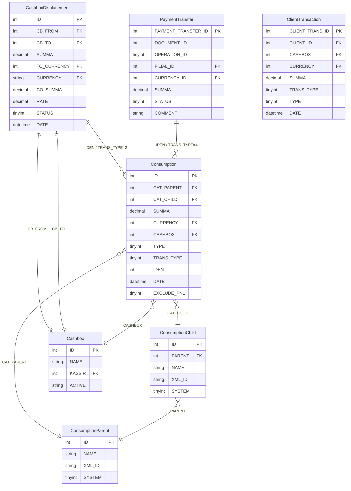
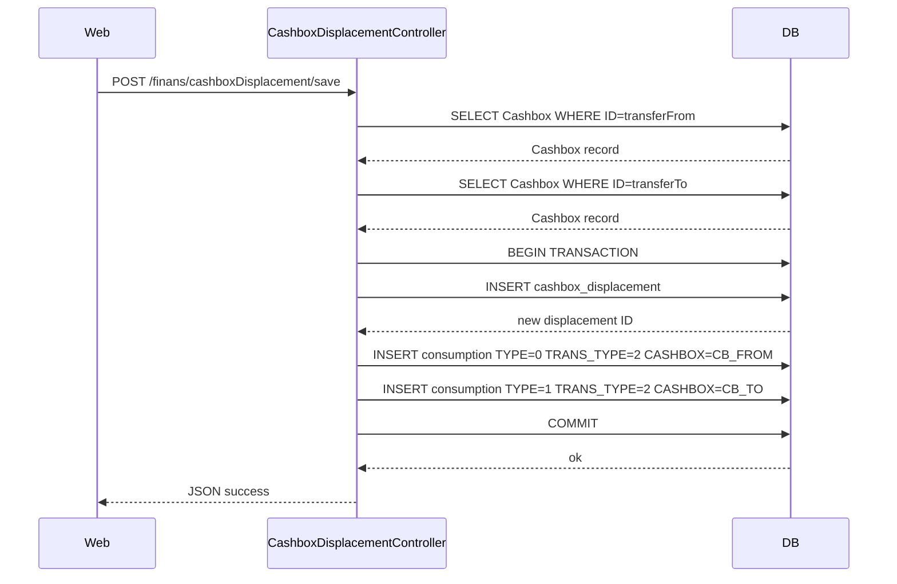
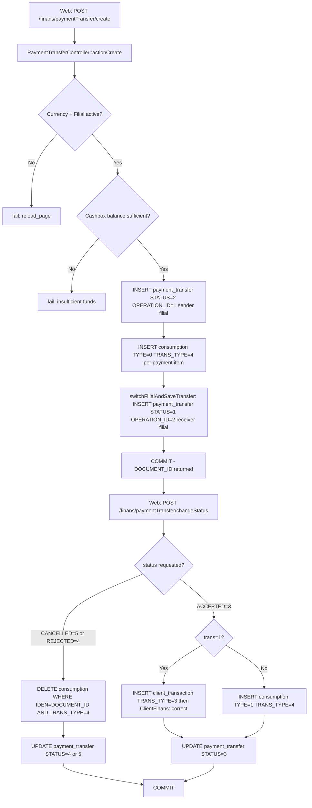
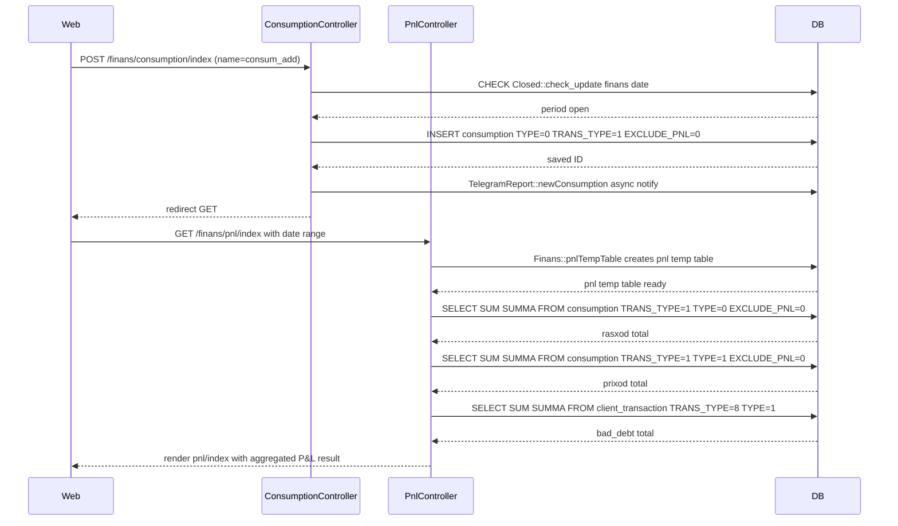
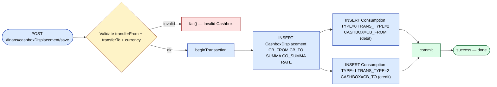
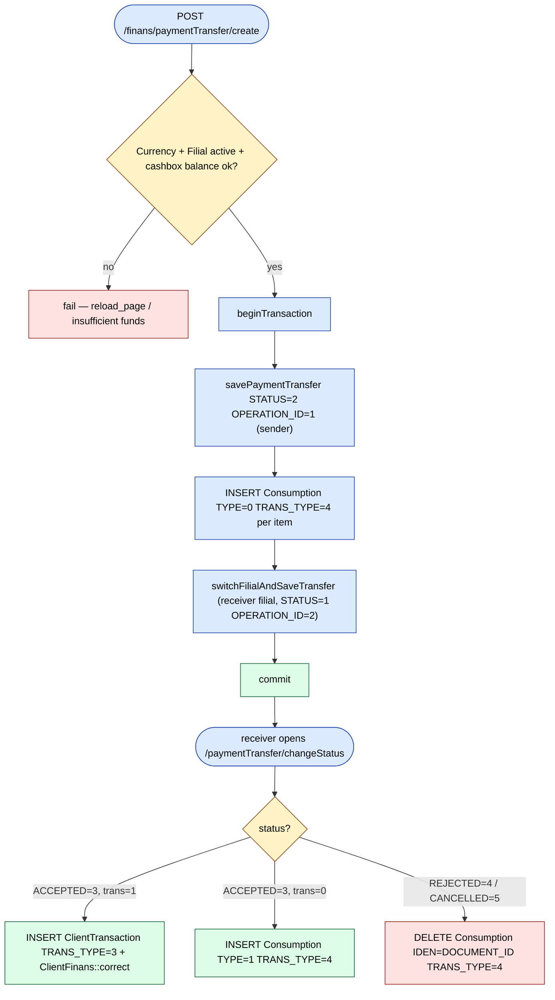

# `finans` module

Financial accounting layer for sd-main. Aggregates the money side of
the business: P&L, agent P&L, cashbox movements, expenses.

## Key features

| Feature | What it does | Owner role(s) |
|---------|--------------|---------------|
| P&L by period | Income / expense / margin per period | 1 / 9 / Finance |
| Pivot P&L | Slice-and-dice P&L | 1 / 9 / Finance |
| Agent P&L | Per-agent profitability | 1 / 8 / 9 |
| Cashbox displacement | Move money between cashboxes (e.g. agent → main) | 6 / Finance |
| Payment transfer | Reassign a payment to a different cashbox / order | 1 / 6 |
| Consumption / expense tracking | Operational expenses against budget | 1 / Finance |

## Folder

```
protected/modules/finans/
└── controllers/
    ├── PnlController.php
    ├── PivotPnlController.php
    ├── AgentPnlController.php
    ├── CashboxDisplacementController.php
    ├── PaymentTransferController.php
    └── ConsumptionController.php
```

## See also

- [`pay`](./payment.md) — payment recording
- [`payment`](./payment.md) — payment approval workflow

## Workflows

### Entry points

| Trigger | Controller / Action / Job | Notes |
|---|---|---|
| Web — agent P&L grid | `AgentPnlController::actionIndex` | Per-agent P&L view, separate from filial-wide PnL |
| Web | `CashboxDisplacementController::actionIndex` | Renders cashbox-displacement list view |
| Web (GET) | `CashboxDisplacementController::actionGetDisplacement` | Returns filtered displacement records as JSON |
| Web (POST) | `CashboxDisplacementController::actionSave` | Creates a new cashbox displacement + paired Consumption rows |
| Web (GET) | `CashboxDisplacementController::actionCancelDisplacement` | Sets `STATUS=2`, deletes paired Consumption rows |
| Web (POST) | `PaymentTransferController::actionCreate` | Creates inter-filial payment transfer document + debit Consumption |
| Web (POST) | `PaymentTransferController::actionChangeStatus` | Advances PaymentTransfer status; on ACCEPTED writes ClientTransaction or Consumption |
| Web — pivot P&L grid | `PivotPnlController::actionIndex` | Cross-tab P&L pivot view |
| Web (POST) | `ConsumptionController::actionIndex` (POST branch) | Adds, edits, or deletes a Consumption expense row |
| Web (POST) | `ConsumptionController::actionCredit` (POST branch) | Adds, edits, or deletes a credit (income) Consumption row |
| Web | `PnlController::actionIndex` | Builds `pnl` temp table via `Finans::pnlTempTable`, aggregates into P&L view |

---

### Domain entities



---

### Workflow 1.1 — Cashbox displacement (internal transfer between cashboxes)

A cashier or finance manager moves funds from one cashbox to another within the same filial. The controller writes a `cashbox_displacement` record and two paired `consumption` rows — a debit (TYPE=0) from the source cashbox and a credit (TYPE=1) into the destination cashbox — inside a single DB transaction. Cancellation deletes both consumption rows and marks the displacement STATUS=2.



---

### Workflow 1.2 — Inter-filial payment transfer (send → receive lifecycle)

A sender filial initiates a payment transfer to another filial. The document travels through statuses (PENDING=2 → ACCEPTED=3 or REJECTED=4 / CANCELLED=5). On creation the sender's cashbox balances are debited via `consumption` (TRANS_TYPE=4, TYPE=0). On acceptance by the receiver, funds are credited either as a `ClientTransaction` (TRANS_TYPE=3, when `trans=1`) or as a `consumption` (TYPE=1, TRANS_TYPE=4). Rejection or cancellation deletes the debit consumption rows.



---

### Workflow 1.3 — Expense / income recording and P&L inclusion

Finance staff record operational expenses (TYPE=0) or cashbox income (TYPE=1) directly through `ConsumptionController`. Each row is tagged with a fund (`ConsumptionParent`) and category (`ConsumptionChild`). `PnlController::actionIndex` reads `consumption` WHERE `TRANS_TYPE=1 AND EXCLUDE_PNL=0` to add operating expenses and other income into the P&L totals after `Finans::pnlTempTable` populates the `pnl` temp table from sales data.



---

### Cross-module touchpoints

- Reads: `pay.ClientTransaction` (TRANS_TYPE IN(3,4,5) — used for cashbox balance calculation in `CashboxDisplacementController::getCashboxBalance` and `PaymentTransferController::getCashboxBalance`)
- Writes: `pay.ClientTransaction` (INSERT TRANS_TYPE=3, TYPE=1 when payment transfer is accepted with `trans=1` flag — via `PaymentTransferController::savePaymentAsTransaction`)
- Writes: `pay.ClientFinans` (`ClientFinans::correct` called after writing ClientTransaction on transfer acceptance)
- Reads: `settings.Closed` (period-lock check via `Closed::model()->check_update('finans', date)` before any expense write in `ConsumptionController`)
- Reads: `warehouse.LotDistribution` / `orders.Order` (used by `Finans::pnlTempTable` when `ServerSettings::enableLotManagement()` is true)

---

### Gotchas

- `CashboxDisplacement` and `PaymentTransfer` both extend `BaseFilial`, so their table names are filial-prefixed at runtime. Cross-filial queries in `PaymentTransferController::actionChangeStatus` switch the active filial context via `BaseFilial::setFilial($prefix)` before querying the receiver's `payment_transfer` table — failure to switch back can corrupt the session filial context.
- `Consumption.TRANS_TYPE` is load-bearing for P&L: only rows with `TRANS_TYPE=1` flow into `PnlController`. Rows written by displacement (`TRANS_TYPE=2`) and payment-transfer (`TRANS_TYPE=4`) are silently excluded from P&L aggregation.
- `Consumption.EXCLUDE_PNL=1` is a manual override that removes a row from P&L even if `TRANS_TYPE=1`. It can be set on both add and edit paths in `ConsumptionController`.
- `PaymentTransferController::actionChangeStatus` writes to both the sender and receiver filial DB contexts in the same HTTP request. The DB transaction (`$safeTrans`) only covers the current filial connection; the remote-filial insert in `switchFilialAndSaveTransfer` is outside the transaction and not rolled back on failure.
- `ConsumptionController::actionCredit` (cashbox income, TYPE=1) does **not** call `TelegramReport::newConsumption`; only expense entries (TYPE=0 in `actionIndex`) trigger the Telegram notification.
- P&L computation has two code paths gated by `ServerSettings::enableLotManagement()`. When enabled, `Finans::pnlTempTable` uses the `LotDistribution`-based SQL; when disabled, it falls back to the legacy `Finans::pnlSql`. Both populate the same `pnl` temp table but produce **different P&L numbers** on the same data. Verify which mode the target instance runs before trusting historical comparisons.
- `PaymentTransferController::actionChangeStatus` runs `allowedStatus` twice — once in the sender's filial context (lines ~229–231), once in the receiver's after `BaseFilial::setFilial` (lines ~293–297). The STATUS update and Consumption deletes between them (lines ~237–247) execute **before** the second guard, so a partial mutation can land if the receiver-side check fails. Treat the two halves as non-atomic.

## Cashbox displacement (move money)

`CashboxDisplacementController::actionSave` (line 296) opens a single
DB transaction, validates source/destination cashboxes and currencies,
inserts one `CashboxDisplacement` row with `CB_FROM`/`CB_TO`/`SUMMA`/
`CO_SUMMA`/`RATE`, then writes two paired `Consumption` rows via
`createConsumption` — debit on the source cashbox, credit on the
destination — both tagged `TRANS_TYPE=2`. Any failure rolls back the
whole displacement.



## Payment transfer (reassign across filial)

`PaymentTransferController::actionCreate` (line 371) opens
`$safeTrans`, calls `savePaymentTransfer(..., STATUS='2')` to insert
the sender-side `payment_transfer` row, then writes a `Consumption
TRANS_TYPE=4 TYPE=0` per item against the source cashbox.
`switchFilialAndSaveTransfer` then crosses into the receiver filial
context and saves the mirror `payment_transfer` row with
`STATUS=1 OPERATION_ID=2`. The receiver later runs
`actionChangeStatus` (line 203) to transition `STATUS` to ACCEPTED=3,
REJECTED=4, or CANCELLED=5 — the rejected/cancelled paths delete the
debit consumption rows.


