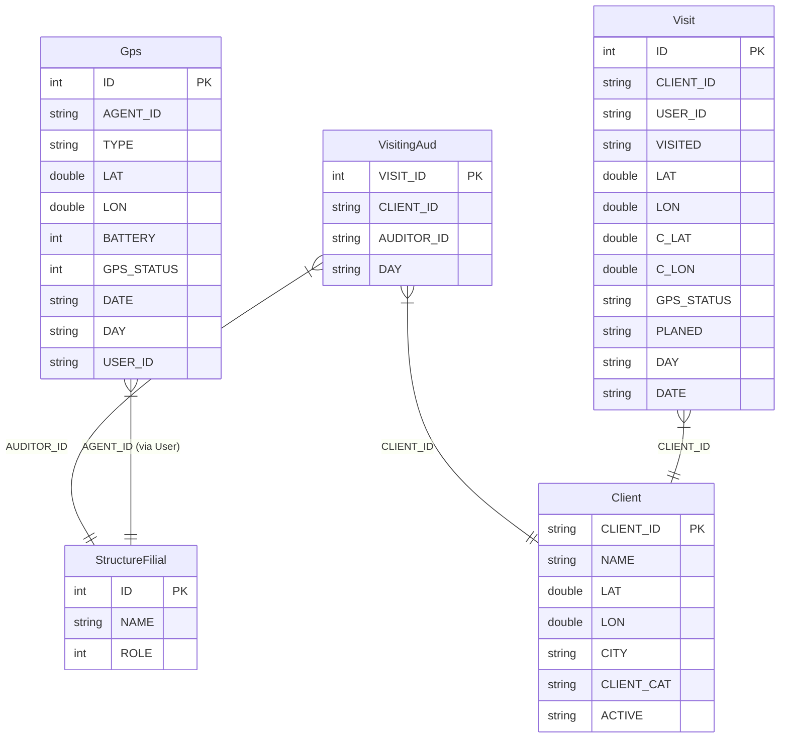
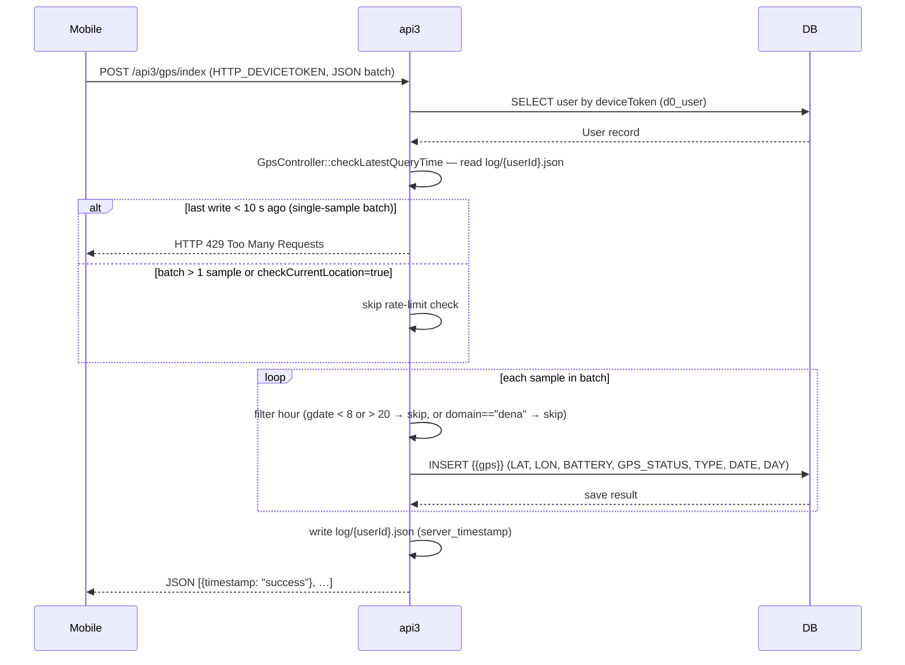
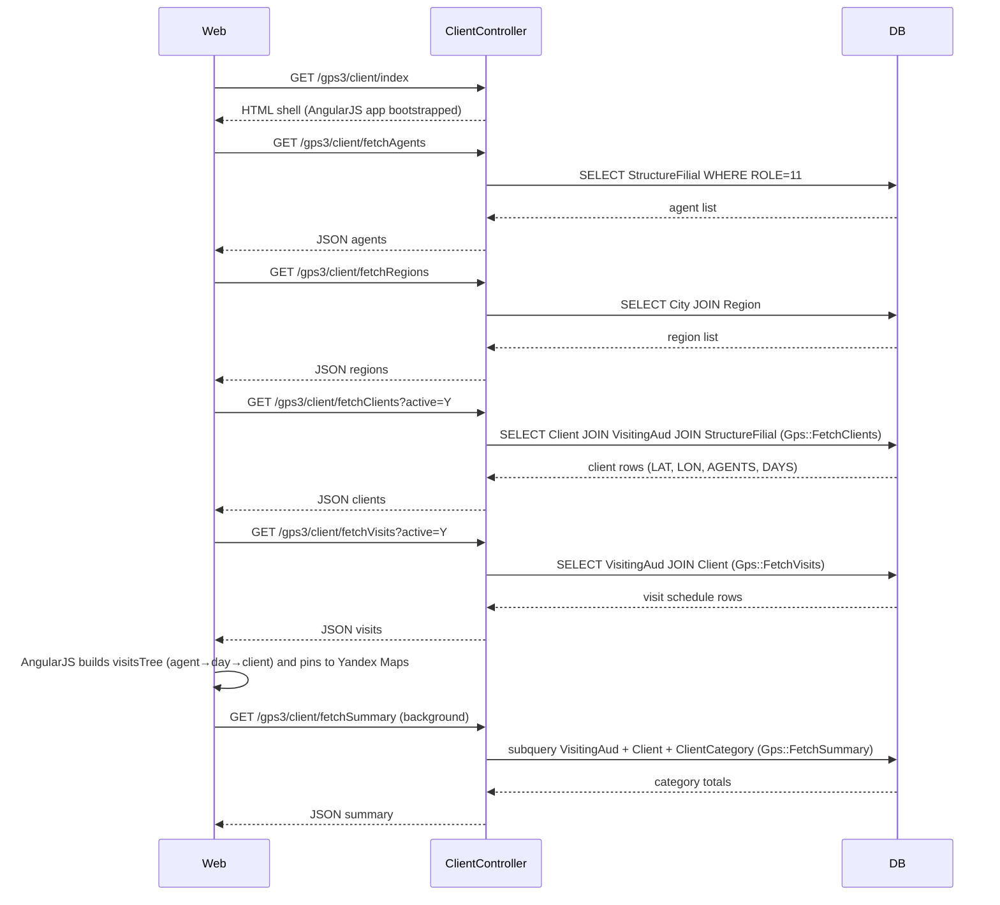
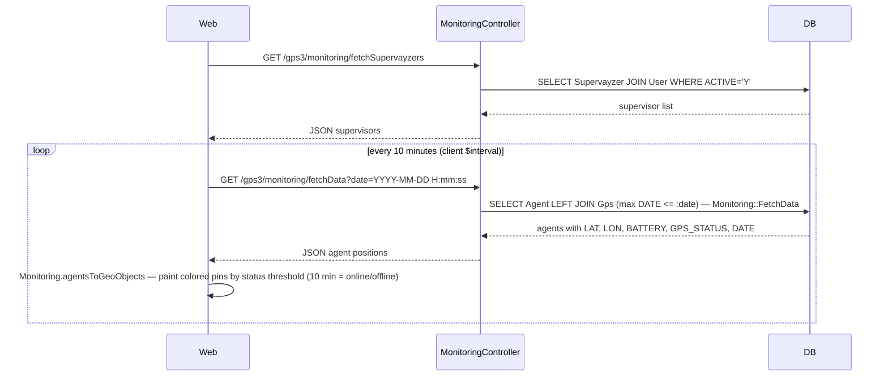
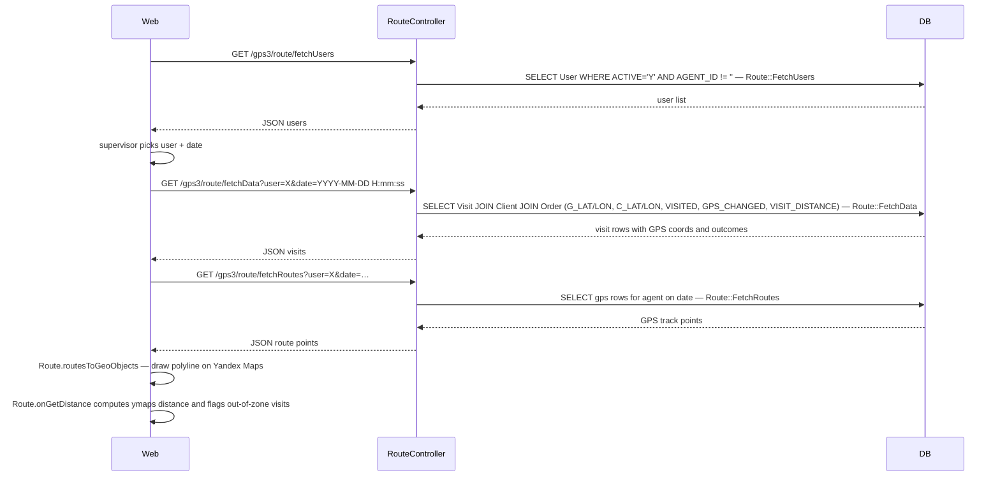
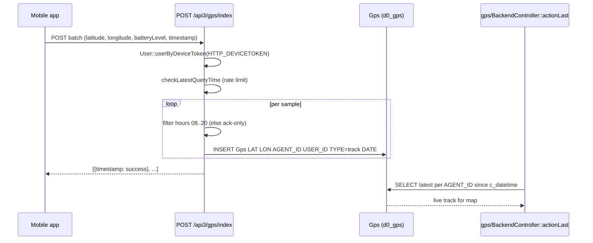
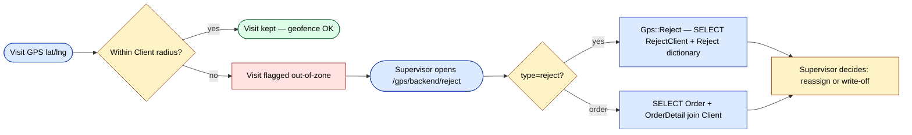

# `gps`, `gps2`, `gps3` modules

GPS tracking. Three generations exist; new development should target
the latest (`gps3`).

| Module | Status | Notes |
|--------|--------|-------|
| `gps` | Maintenance | First-gen; used by older clients |
| `gps2` | Frozen | Legacy |
| `gps3` | **Current** | New features go here |

## Key features

| Feature | What it does | Owner role(s) |
|---------|--------------|---------------|
| Live monitoring | Real-time map of all agents in a filial | 8 / 9 |
| Trip playback | Replay an agent's day on the map | 8 / 9 |
| Geofence per visit | Validate agent's check-in is inside the client's radius | system |
| GPS ingest from mobile | Mobile app posts samples every ~30 s | system |
| External provider ingest | Generic JSON / Wialon-style endpoints | system |
| Out-of-zone flag | Visits outside radius are flagged for review | 8 / 9 |
| KPI: GPS coverage | What % of plan visits had a real GPS check-in | 8 / 9 |

## Capabilities

- Live agent tracking on a map (`MonitoringController`)
- Per-visit geofence verification (`OrdersGpsController`)
- Trip playback (`TrackingController`)
- Background ingest from mobile clients (`BackendController`,
  `GetController`)
- Dashboard for supervisors (`FrontendController`)

## Angular module

A modern map UI lives in `ng-modules/gps/` — a stand-alone Angular
module loaded into a Yii view. Build it separately and copy `dist/`
into `ng-modules/gps/`.

## Key feature flow — Visit & GPS

See **Feature · Visit & GPS geofence** in
[FigJam · sd-main · Feature Flows](https://www.figma.com/board/MyvyaeEluqvHofH4E2qIoU).

## Workflows

### Entry points

| Trigger | Controller / Action / Job | Notes |
|---|---|---|
| Mobile HTTP POST `POST /api3/gps/index` | `GpsController::actionIndex` | Batch of GPS samples from the mobile app; auth via `HTTP_DEVICETOKEN` header |
| Mobile HTTP POST `POST /api3/gps/offline` | `GpsController::actionOffline` | Offline-buffer drain endpoint (stub — no DB write yet) |
| Web page load `GET /gps3/client/index` | `ClientController::actionIndex` | Renders the AngularJS "Clients on map" SPA shell |
| Web AJAX `GET /gps3/client/fetchClients` | `ClientController::actionFetchClients` | JSON list of clients with LAT/LON for Yandex Maps pins |
| Web AJAX `GET /gps3/client/fetchVisits` | `ClientController::actionFetchVisits` | Agent × weekday visit schedule for the sidebar tree |
| Web AJAX `GET /gps3/client/fetchSummary` | `ClientController::actionFetchSummary` | Per-category visit totals for the stats panel |
| Web AJAX `GET /gps3/client/fetchAgents` | `ClientController::actionFetchAgents` | Dropdown list of merchandisers (ROLE = 11) |
| Web AJAX `GET /gps3/client/fetchRegions` | `ClientController::actionFetchRegions` | Dropdown list of cities/regions |
| Web AJAX `GET /gps3/client/fetchCategories` | `ClientController::actionFetchCategories` | Dropdown list of client categories |
| Web print `GET /gps3/client/print` | `ClientController::actionPrint` | Printable list of clients that have coordinates |
| Web AJAX `GET /gps3/monitoring/fetchData` | `MonitoringController::actionFetchData` (gps2) | Agent last-known positions for live map; controller lives in `gps2` module |
| Web AJAX `GET /gps3/monitoring/fetchSupervayzers` | `MonitoringController::actionFetchSupervayzers` (gps2) | Supervisor filter list for monitoring view |
| Web AJAX `GET /gps3/route/fetchData` | `RouteController::actionFetchData` (gps2) | Per-agent visit list with GPS coords for trip-playback map |
| Web AJAX `GET /gps3/route/fetchRoutes` | `RouteController::actionFetchRoutes` (gps2) | Ordered GPS track for the route polyline |
| Web AJAX `GET /gps3/route/fetchReport` | `RouteController::actionFetchReport` (gps2) | Daily visit summary table |
| Web AJAX `GET /gps3/route/fetchUsers` | `RouteController::actionFetchUsers` (gps2) | User picker for the route view |
| Angular UI | `ng-modules/gps/` AngularJS app (controllers: `Client`, `Monitoring`, `Route`) | Active browser-side UI; loaded into the Yii view shell via asset registration in `Gps3Module::registerAssets` |

---

### Domain entities

---

### Workflow 1.1 — Mobile GPS sample ingest

The mobile app posts a JSON batch of GPS samples to `api3/gps/index`. Each
sample is authenticated by device token, rate-limited to one write per 10 s,
and persisted to `{{gps}}` only during business hours (08:00–20:00).

---

### Workflow 1.2 — Client map load and filter

When a supervisor opens `/gps3/client/index`, the AngularJS `Client`
controller bootstraps by fetching reference data and then the full client +
visit schedule; subsequent filter changes requery only the affected endpoints.

---

### Workflow 1.3 — Live agent monitoring

A supervisor opens the monitoring tab; the AngularJS `Monitoring` controller
polls agent last-known positions through `gps2`'s `MonitoringController`, then
auto-advances the timestamp on a 10-minute interval to keep the map live.

---

### Workflow 1.4 — Trip playback (route view)

A supervisor selects an agent and a date; the AngularJS `Route` controller
loads all visit checkpoints and the GPS track polyline so the supervisor can
replay the agent's day, verify geofence distances, and review order/reject
outcomes.

---

### Cross-module touchpoints

- Reads: `application.Gps` (`{{gps}}` table) — shared AR model used by `api3/GpsController` for ingest and by `gps2/Monitoring::FetchData` for monitoring queries
- Reads: `application.VisitingAud` (`{{visiting_aud}}`) — visit schedule consumed by `gps3/Gps::FetchClients`, `FetchVisits`, `FetchSummary`
- Reads: `application.Visit` (`{{visit}}`) — per-visit GPS checkpoint rows consumed by `gps2/Route::FetchData` and `FetchRoutes`
- Reads: `application.Client` (`{{client}}`) — client coordinates (LAT/LON) cross-checked against visit GPS in `Route::FetchData`
- Reads: `application.ServerSettings::visitDistance` — configurable geofence radius (default ~100 m) injected as `VISIT_DISTANCE` in route data SQL
- Writes: `application.Gps` (`{{gps}}`) — written by `api3/GpsController::actionIndex` on each inbound mobile sample
- APIs: `api3/gps/index` — sole mobile ingest endpoint; `api3/gps/offline` — offline-drain stub

---

### Gotchas

- **MonitoringController and RouteController are not in gps3.** The AngularJS `config.js` routes `/gps3/monitoring/*` and `/gps3/route/*`, but those PHP controllers live in the `gps2` module. Yii's URL routing must be mapping these paths to `gps2`; adding new monitoring/route actions must be done in `protected/modules/gps2/controllers/`, not `gps3/`.
- **Rate-limiting is file-based.** `GpsController::checkLatestQueryTime` writes per-user JSON files to `webroot/log/gps/{userId}.json`. This directory must be writable and is not cleaned up automatically; disk usage grows unbounded on large installations.
- **Business-hours filter silently discards samples.** Any GPS sample with a device timestamp outside 08:00–20:00 is acknowledged as `"success"` but never written to the DB. This is intentional but invisible to the mobile client — debugging missing tracks requires checking server logs, not the API response.
- **`actionOffline` is a stub.** It writes a raw text file (`Gps_Offline-<time>.txt`) to the working directory and returns no data — it is not a functional offline buffer.
- **`GPS_CHANGED` flag affects geofence verdict.** If a client's LAT/LON was edited on the same day as a visit (`ClientLog` records a LON/LAT change), `Route::FetchData` sets `GPS_CHANGED=1` and `onGetDistance` reports the visit as "unknown" regardless of the computed distance. Supervisors should be aware that coordinate corrections invalidate same-day verdicts.
- **Legacy gps/gps2 modules.** Do not add new features to `gps` or `gps2`. Both remain live for existing clients; breaking changes there are high-risk.

## GPS sample ingest

Mobile clients post batches of samples to `POST /api3/gps/index`
(`api3/GpsController::actionIndex`, line 7). The endpoint authenticates
via the `HTTP_DEVICETOKEN` header, then loops the JSON array — for each
sample it instantiates a `Gps` AR model, copies
`BATTERY`/`PROVIDER`/`SIGNAL`/`LAT`/`LON`/`MOB_TIMESTAMP`, tags
`TYPE='track'` (or `'current'` if `checkCurrentLocation` is set), and
calls `$model->save()` per row. Samples whose device-hour falls
outside 08–20 are acked as `success` but never written. The web
`gps/BackendController::actionLast` reads the latest rows for live
monitoring.

## Out-of-zone reject flow

`gps/BackendController::actionReject` (line 54) is the supervisor
review endpoint for visits flagged as out-of-zone. It delegates to
`Gps::Reject($rejectId, $type, $clientId, $date)` in
`gps/models/Gps.php` (line 331). For `type='reject'` it pulls the
`RejectClient` rows for the day and joins the `Reject` dictionary to
produce a human-readable list of rejection reasons; otherwise it
pulls the matching `Order` + `OrderDetail` rows so the supervisor can
inspect what the visit was about before deciding.

