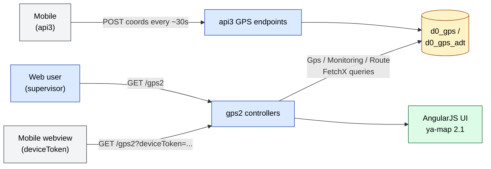
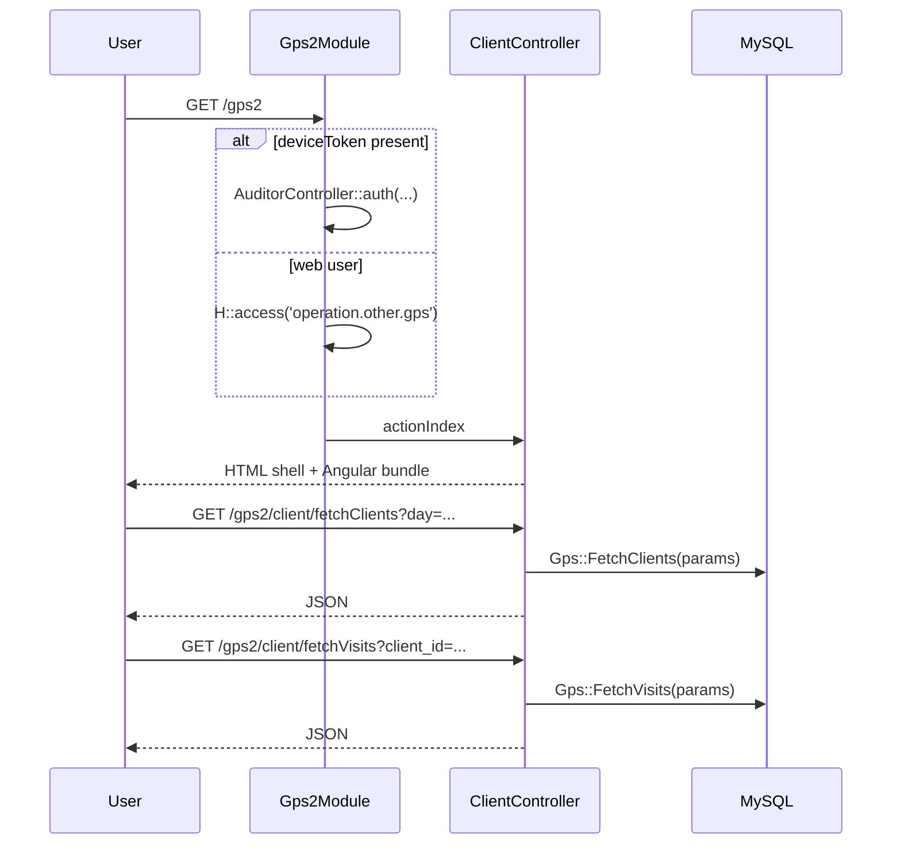
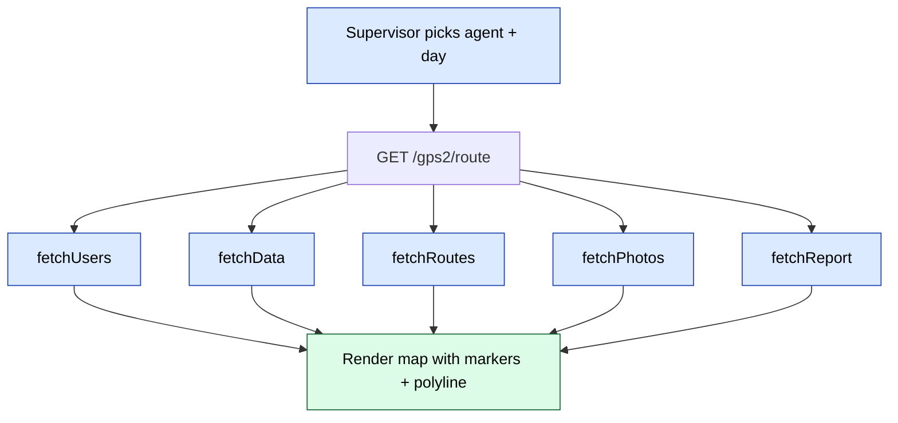

# `gps2` module

`gps2` is the **second generation** GPS tracking front-end for
sd-main. It renders the agent map, route playback and per-client
visit history on top of the shared `d0_gps` table, but with a more
modern AngularJS UI than the original [`gps`](./gps.md) module.

It sits between two siblings:

| Generation | Status | Notes |
|------------|--------|-------|
| [`gps`](./gps.md) | Maintenance | First-gen; used by some older tenants |
| **`gps2`** | Active | This module — current default for many tenants |
| [`gps3`](./gps3.md) | Newest | Reduced surface; new tenants ship on this |

All three modules **read the same `d0_gps` and `d0_gps_adt` tables** —
generation differs only in the UI layer, the assets bundle, and the
controller-action shape. There is no schema migration between
generations.

## Key features

| Feature | What it does | Owner role(s) |
|---------|--------------|---------------|
| **Client map** | Geographic view of all clients with visit overlays | 2 / 5 / 8 |
| **Agent / route playback** | Per-agent trip replay with photos and report points | 2 / 5 / 8 |
| **Supervisor monitoring** | Live view of supervayzer territories and their agents | 2 / 5 / 8 |
| **Region / category filters** | Filter map by region, client tag, client type, agent | 2 / 5 / 8 |
| **Visit + photo fetch** | Drill into a single client's visits with attached photos | 2 / 5 / 8 |
| **Printable map** | Render a static / print-ready map for the current selection | 2 / 5 / 8 |
| **Mobile preview** | `deviceToken` query param re-authenticates as a mobile user so the same map renders inside the app webview | system |

## Folder

```
protected/modules/gps2/
├── Gps2Module.php             # defaultController = client; registers assets
├── assets/                    # AngularJS app — angular.min, lodash, ng-table,
│                              # rzslider, ya-map-2.1, plus app/*.js
├── controllers/
│   ├── ClientController.php       # /gps2/client — the map page (default)
│   ├── DirectiveController.php    # /gps2/directive — Angular partials
│   ├── MonitoringController.php   # /gps2/monitoring — supervayzer view
│   └── RouteController.php        # /gps2/route — single-user route playback
├── models/
│   ├── Gps.php                # data layer — same d0_gps table as gps module
│   ├── Helper.php
│   ├── Monitoring.php
│   └── Route.php
└── views/                     # Yii views that bootstrap the Angular shells
```

## Key entities

| Entity | Model | Notes |
|--------|-------|-------|
| GPS sample (agent) | `Gps` (`d0_gps`) | Per-fix row: `AGENT_ID`, `ORDER_ID`, `CLIENT_ID`, `LAT`, `LON`, `BATTERY`, `PROVIDER`, `SIGNAL`, `MODE`, `INTERNET_STATUS`, `GPS_STATUS`, `TIMESTAMP_X`, `DATE`, `DAY`, `DEVICE`, `USER_ID`. |
| GPS sample (auditor) | `GpsAdt` (`d0_gps_adt`) | Audit-team fixes: `VISIT_ID`, `POSITION_ID`, `ROLE`, `USER_ID`, `CLIENT_ID`, `LAT`, `LON`, `BATTERY`, `PROVIDER`, `SIGNAL`, `MODE`, `INTERNET_STATUS`, `GPS_STATUS`, `CREATE_AT`, `DATE`, `DEVICE`. |

These models are also read by `gps` and `gps3`. Writes come from the
[`api3`](../api/api-v3-mobile/index.md) mobile endpoints, not from this
module.

## Controllers

| Controller | Actions (n) | Purpose |
|------------|-------------|---------|
| `ClientController` | 11 | Map shell + JSON feeds (clients, agents, regions, categories, tags, types, stocks, visits, summary, print, index) |
| `MonitoringController` | 3 | Supervayzer view (`index`, `fetchData`, `fetchSupervayzers`) |
| `RouteController` | 6 | Single-user route playback (`index`, `fetchUsers`, `fetchData`, `fetchRoutes`, `fetchPhotos`, `fetchReport`) |
| `DirectiveController` | 2 | Angular template fetch (`directiveModal`, `directivePreloader`) |

### Actions table

| Route | Returns | Notes |
|-------|---------|-------|
| `GET /gps2/client/index` | HTML | Map page shell |
| `GET /gps2/client/fetchClients` | JSON | Filtered client list with coords |
| `GET /gps2/client/fetchClientStocks` | JSON | Stock per client |
| `GET /gps2/client/fetchClientTag` | JSON | Tag lookup |
| `GET /gps2/client/fetchClientType` | JSON | Type lookup |
| `GET /gps2/client/fetchAgents` | JSON | Agent lookup for the filter |
| `GET /gps2/client/fetchRegions` | JSON | Region lookup |
| `GET /gps2/client/fetchCategories` | JSON | Category lookup |
| `GET /gps2/client/fetchSummary` | JSON | Aggregate counters |
| `GET /gps2/client/fetchVisits` | JSON | Visit list for selected client |
| `POST /gps2/client/print` | HTML | Printable map fragment |
| `GET /gps2/monitoring/index` | HTML | Supervayzer overview shell |
| `GET /gps2/monitoring/fetchSupervayzers` | JSON | Supervayzer list |
| `GET /gps2/monitoring/fetchData` | JSON | Data per role — `Monitoring::FetchDataAdt` if `role` param, else `Monitoring::FetchData` |
| `GET /gps2/route/index?user=...` | HTML | Single-agent route playback shell |
| `GET /gps2/route/fetchUsers` | JSON | User lookup |
| `GET /gps2/route/fetchData` | JSON | GPS samples for the day |
| `GET /gps2/route/fetchRoutes` | JSON | Visited / planned routes |
| `GET /gps2/route/fetchPhotos` | JSON | Photo attachments along the route |
| `GET /gps2/route/fetchReport` | JSON | Report points along the route |
| `GET /gps2/directive/directiveModal` | HTML | Angular template — modal |
| `GET /gps2/directive/directivePreloader` | HTML | Angular template — preloader |

All inputs come through `Helper::ParseGet()` /
`Helper::ParsePost()` (module-local helpers) — there is **no Yii
filter chain** on these endpoints.

## Harvested admin URLs

| URL | Title | Source |
|-----|-------|--------|
| `/gps2` | Sales Doctor – Client (defaultController = `client`) | `ClientController::actionIndex` |

See [`/gps2` page atom](../ui/pages/gps2/gps2_root.md) for the rendered UI structure.

## Architecture diagram



## Permissions

The module enforces a **single, module-wide** access gate in
`Gps2Module::init()`:

```php
H::access('operation.other.gps');
```

If the request carries a `deviceToken` query parameter, the gate is
**bypassed** and the request is re-authenticated through
`api3.controllers.AuditorController::auth()`. This is how the
mobile webview opens the same map inside the agent app.

| Action | Roles |
|--------|-------|
| Open `/gps2` and all sub-routes | Any role with `operation.other.gps` (typically 1 / 2 / 5 / 8) |
| Mobile webview access | Authenticated mobile session with `deviceToken` |

No per-action RBAC. Every JSON feed is reachable by any user who
passed the module gate. (See landmines below.)

## See also

- [`gps`](./gps.md) — first generation, shared `d0_gps` table
- [`gps3`](./gps3.md) — next generation, slimmer surface
- [`integrations/gps`](../integrations/gps.md) — ingest contract
- [`agents`](./agents.md) — agent ↔ supervayzer hierarchy that the map view groups by
- [`audit-adt`](./audit-adt.md) — `d0_gps_adt` is written by the audit team app

## Workflows

### Entry points

| Trigger | Controller / Action | Notes |
|---|---|---|
| Web — open map | `ClientController::actionIndex` | Default route `/gps2` |
| Web — supervayzer view | `MonitoringController::actionIndex` | `/gps2/monitoring` |
| Web — route playback | `RouteController::actionIndex($user)` | `/gps2/route?user=USER_ID` |
| Mobile webview | Same URLs + `?deviceToken=...` | `Gps2Module::init` re-authenticates |
| Mobile — write coords | `api3` GPS endpoints (not this module) | Writes `d0_gps` / `d0_gps_adt` |

---

### Workflow GPS2.1 — Load the map



---

### Workflow GPS2.2 — Route playback

When a supervisor clicks a single agent, the app navigates to
`/gps2/route?user=<USER_ID>`. The page calls `fetchData` for raw
fixes, `fetchRoutes` for the planned/visited polyline, `fetchPhotos`
for camera evidence at each stop, and `fetchReport` for any audit
points logged en-route.



---

### Cross-module touchpoints

- Reads: `clients.Client` (positions, tags, types — via `Gps::FetchClients`)
- Reads: `agents.Agent` and supervisor hierarchy (`Monitoring::FetchSupervayzers`)
- Reads: `audit.AuditResult` / `audit-adt.GpsAdt` for the auditor variant of `fetchData`
- Reads: `orders.Order` + `OrderPhoto` (route playback photo overlay)
- Writes: **none** (this module is read-only — writes are owned by `api3`)
- Assets: ya-map-2.1 (Yandex Maps SDK), AngularJS, ng-table, rzslider

---

### Gotchas

- **AngularJS, not modern Angular.** This module ships AngularJS 1.x
  in `assets/js/dependencies/angular.min.js`. New work should target
  [`gps3`](./gps3.md) — or, better, a stand-alone modern Angular
  module like the one used by [`gps`](./gps.md).
- **Module gate is the only RBAC.** Every JSON feed under `/gps2/*`
  is reachable as soon as the user has `operation.other.gps`. If a
  tenant needs role-scoped visibility (e.g. "agent sees only own
  routes"), filter inside the model query — there is no controller
  gate to add.
- **`deviceToken` mints a mobile session inside a web module.** The
  init code imports `api3.controllers.AuditorController` and calls
  `auth()` directly. Any change to that auth path silently affects
  this module too. Cross-reference [`security/auth-and-roles`](../security/auth-and-roles.md).
- **Three modules, one table.** `gps`, `gps2` and `gps3` all read
  the same `d0_gps` rows. Adding a column requires updating all
  three model classes (and the api3 writer).
- **`Helper::ParseGet` is module-local, not the global `H::`.** The
  `gps2/models/Helper.php` class is a thin GET/POST parser and does
  **not** apply the global request-sanitisation rules. Treat
  incoming params as untrusted in any new code.
- **Assets are versioned by integer in `Gps2Module::registerAssets`.**
  The `$update = 5092029` constant must be bumped when JS changes,
  or browsers will serve stale Angular bundles.
