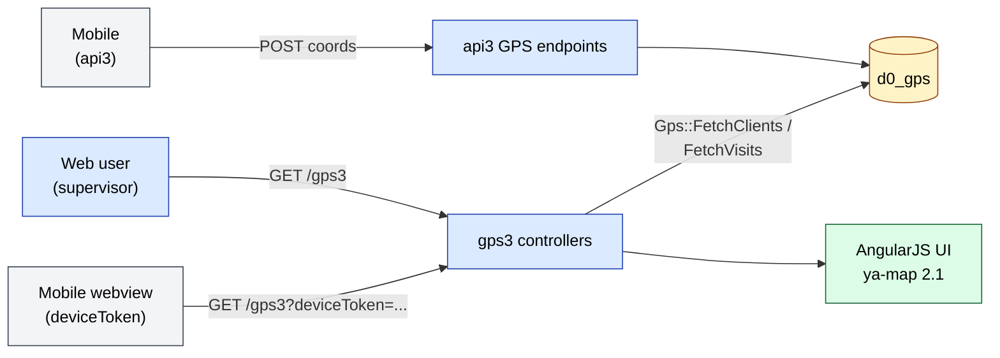
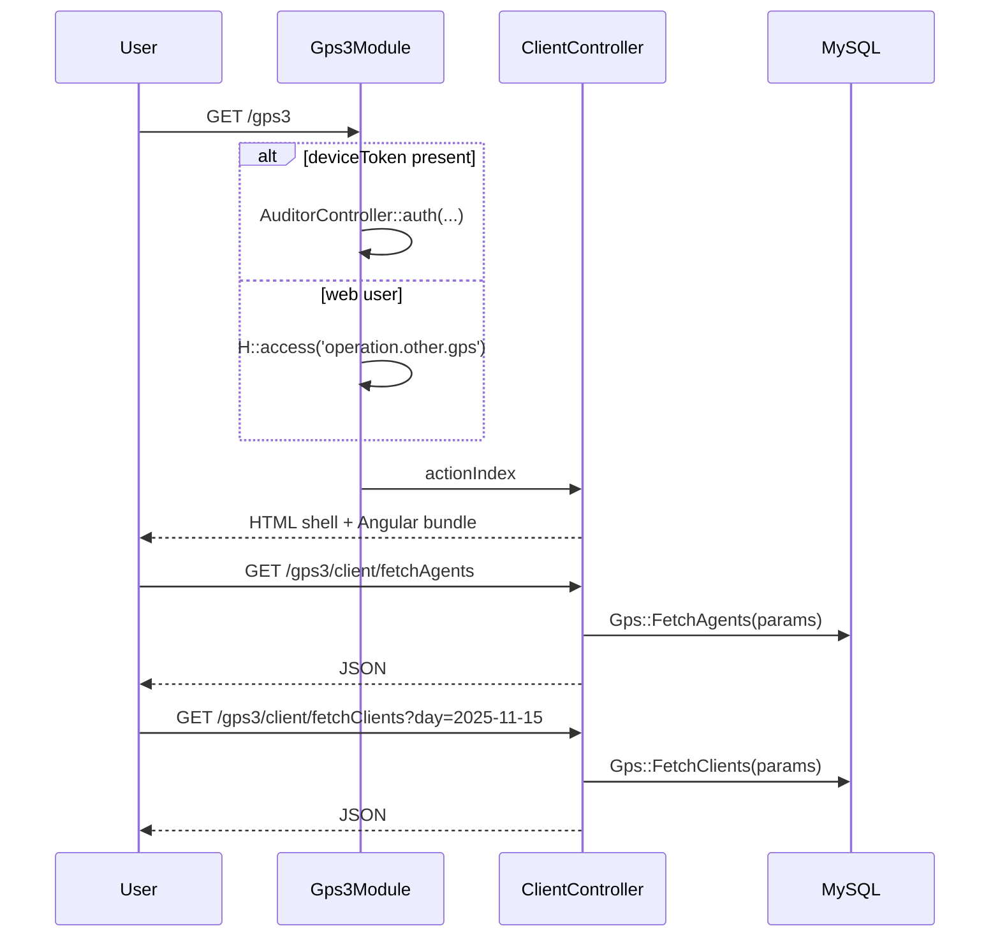

# `gps3` module

`gps3` is the **newest generation** of the GPS map UI. It deliberately
ships a **smaller surface** than [`gps2`](./gps2.md): only the
**client map** and the Angular **directive** templates — no
monitoring view, no route-playback controller (yet).

The three generations all read the same `d0_gps` table — they differ
only in UI bundle, controller shape, and action count.

| Generation | Controllers | Routes | Status |
|------------|-------------|--------|--------|
| [`gps`](./gps.md) | many | many | Maintenance |
| [`gps2`](./gps2.md) | 4 | 22 | Active (most tenants) |
| **`gps3`** | **2** | **10** | Newest — opt-in |

## Key features

| Feature | What it does | Owner role(s) |
|---------|--------------|---------------|
| **Client map** | Filterable map of all clients with visit summary | 2 / 5 / 8 |
| **Filters** | Agent, region, category, day, summary counters | 2 / 5 / 8 |
| **Per-client visit drill** | Visit list with photo + report references | 2 / 5 / 8 |
| **Printable map** | Renders a static print fragment | 2 / 5 / 8 |
| **Mobile webview** | `deviceToken` re-auth (same pattern as `gps2`) | system |

The intentional **non-features** vs `gps2`:

- No `MonitoringController` (supervayzer overview)
- No `RouteController` (single-agent trip playback)
- No tag / type / client-stock JSON feeds

If you need those, point users at `/gps2` for now.

## Folder

```
protected/modules/gps3/
├── Gps3Module.php          # defaultController = client; same init() as gps2
├── assets/                 # AngularJS bundle — slightly slimmer than gps2's
├── controllers/
│   ├── ClientController.php       # /gps3/client — map page
│   └── DirectiveController.php    # /gps3/directive — Angular partials
├── models/
│   ├── Gps.php             # reads d0_gps — same schema as gps / gps2
│   └── Helper.php
└── views/
```

## Key entities

| Entity | Model | Notes |
|--------|-------|-------|
| GPS sample | `Gps` (`d0_gps`) | Shared with `gps` and `gps2`. Cols: `AGENT_ID`, `ORDER_ID`, `CLIENT_ID`, `LAT`, `LON`, `BATTERY`, `PROVIDER`, `SIGNAL`, `MODE`, `INTERNET_STATUS`, `GPS_STATUS`, `TIMESTAMP_X`, `DATE`, `DAY`, `DEVICE`, `USER_ID`. |

This module **does not** read `d0_gps_adt` — the auditor variant is
only exposed through `gps2`. Writes still flow through `api3`, not
this module.

## Controllers

| Controller | Actions (n) | Purpose |
|------------|-------------|---------|
| `ClientController` | 8 | Map shell + 7 JSON feeds (`index`, `print`, `fetchAgents`, `fetchRegions`, `fetchCategories`, `fetchSummary`, `fetchClients`, `fetchVisits`) |
| `DirectiveController` | 2 | Angular template fetch (`directiveModal`, `directivePreloader`) |

### Actions table

| Route | Returns | Notes |
|-------|---------|-------|
| `GET /gps3/client/index` | HTML | Map page (default) |
| `GET /gps3/client/fetchClients` | JSON | Filtered client list with coords (`withCoords=true`) |
| `GET /gps3/client/fetchAgents` | JSON | Agent lookup |
| `GET /gps3/client/fetchRegions` | JSON | Region lookup |
| `GET /gps3/client/fetchCategories` | JSON | Category lookup |
| `GET /gps3/client/fetchSummary` | JSON | Aggregate counters |
| `GET /gps3/client/fetchVisits` | JSON | Visit list for selected client |
| `POST /gps3/client/print` | HTML | Printable map fragment |
| `GET /gps3/directive/directiveModal` | HTML | Angular modal template |
| `GET /gps3/directive/directivePreloader` | HTML | Angular preloader template |

All inputs flow through `Helper::ParseGet()` — same module-local
parser pattern as `gps2`.

## API contract

The module exposes only **GET** JSON feeds (plus one POST `print`).
All feeds follow a consistent shape:

```http
GET /gps3/client/fetchClients?day=2025-11-15&agent=USR123&region=R1
Accept: application/json

200 OK
{ "items": [ ... ], "total": 42 }
```

Filter params accepted by `Gps::FetchClients` (per
`ClientController::actionPrint`):

| Param | Type | Purpose |
|-------|------|---------|
| `day` | `YYYY-MM-DD` | Day filter for visit overlay |
| `agent` | string | Single agent filter |
| `region` | string | Region filter |
| `category` | string | Client category filter |
| `clientType` | string | Client type filter |
| `client_id` / `client_ids` | string / CSV | Drill to specific clients |
| `center` | `lat,lon` | Map centre for print |
| `zoom` | int | Map zoom for print |
| `withCoords` | bool | Force coord projection (set on print) |

## Architecture diagram



## Permissions

Same single module gate as `gps2`:

```php
H::access('operation.other.gps');
```

| Action | Roles |
|--------|-------|
| Open `/gps3` | Any role with `operation.other.gps` (typically 1 / 2 / 5 / 8) |
| Mobile webview access | Authenticated mobile session with `deviceToken` |

No per-action RBAC. Same caveat as `gps2`: if a tenant needs
role-scoped visibility, filter inside the query.

## Migration from `gps2`

For tenants moving from `gps2` to `gps3`:

| Capability | `gps2` | `gps3` |
|------------|--------|--------|
| Client map | Yes | Yes |
| Per-client visit drill | Yes | Yes |
| Region / category / agent filter | Yes | Yes |
| Print fragment | Yes | Yes |
| Supervayzer monitoring | Yes (`/gps2/monitoring`) | **No** — keep `/gps2/monitoring` mounted |
| Per-agent route playback | Yes (`/gps2/route`) | **No** — keep `/gps2/route` mounted |
| Client stock / tag / type feeds | Yes | **No** — `fetchClientStocks` / `fetchClientTag` / `fetchClientType` not implemented |

In practice tenants on `gps3` keep `gps2` enabled in parallel and
only switch the default link in the main menu. Both modules read
the same `d0_gps` rows, so there is no data-migration cost.

[TBD — confirm timing of full `gps3` parity with `gps2` route
playback in the roadmap.]

## See also

- [`gps`](./gps.md) — first generation
- [`gps2`](./gps2.md) — current default; superset of `gps3` features
- [`integrations/gps`](../integrations/gps.md) — ingest contract
- [`api/api-v3-mobile`](../api/api-v3-mobile/index.md) — mobile coord upload

## Workflows

### Entry points

| Trigger | Controller / Action | Notes |
|---|---|---|
| Web — open map | `ClientController::actionIndex` | `/gps3` |
| Web — print fragment | `ClientController::actionPrint` | POST; renders `_print` view |
| Mobile webview | Same URLs + `?deviceToken=...` | `Gps3Module::init` re-auth path |

---

### Workflow GPS3.1 — Load the map



---

### Cross-module touchpoints

- Reads: `clients.Client` — same `Gps::FetchClients` path as `gps2`
- Reads: `agents.Agent` — agent lookup
- Writes: **none**
- Assets: AngularJS, ya-map 2.1, lodash, nya-bootstrap-select, ng-table

---

### Gotchas

- **Same module gate, no per-action RBAC.** Identical risk profile
  to `gps2` — once a user has `operation.other.gps`, every JSON
  feed is reachable.
- **No monitoring or route controllers — yet.** A supervisor who
  bookmarks `/gps3/monitoring` will 404. Direct them to
  `/gps2/monitoring` until parity ships.
- **Same `d0_gps` table.** Schema changes ripple to `gps` and
  `gps2`. There is no `gps3`-only column.
- **`deviceToken` re-auth path is identical to `gps2`.** Any audit
  / security change to `api3.controllers.AuditorController::auth`
  affects both modules at once.
- **`Helper.php` is module-local.** Do not assume it sanitises
  input the way the global `H::` helpers do.
- **Assets bundle version is older than `gps2`.** `Gps3Module::registerAssets`
  uses `$update = 31072018`. Bump it when changing JS, or
  CDN-cached bundles will be stale.
