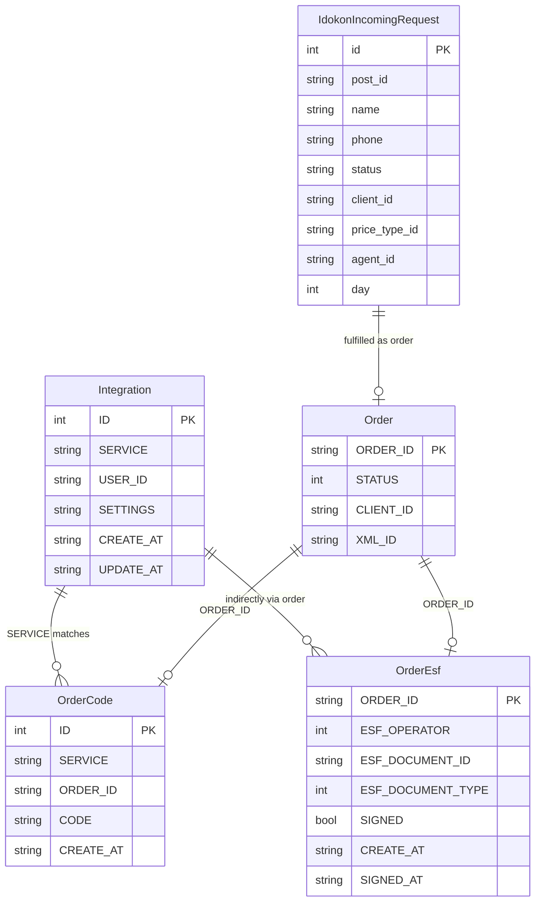
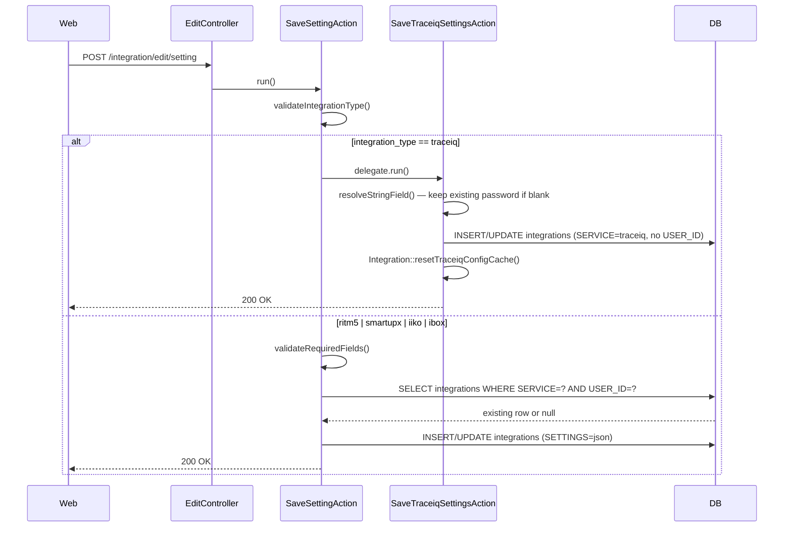
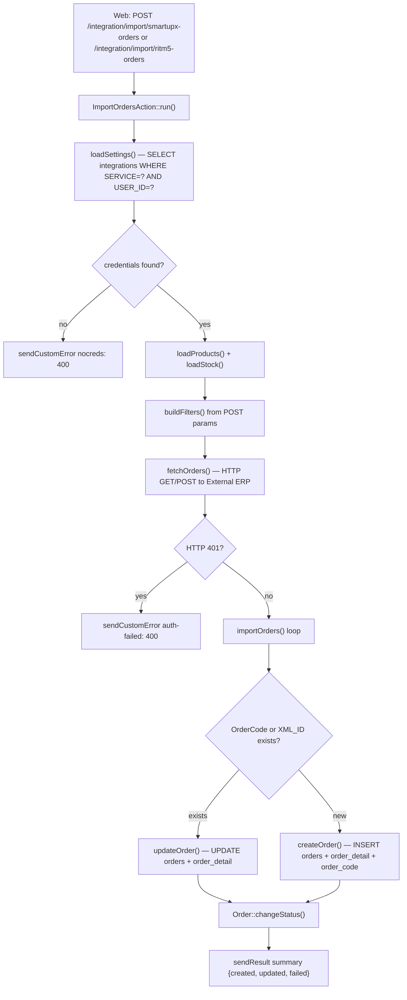
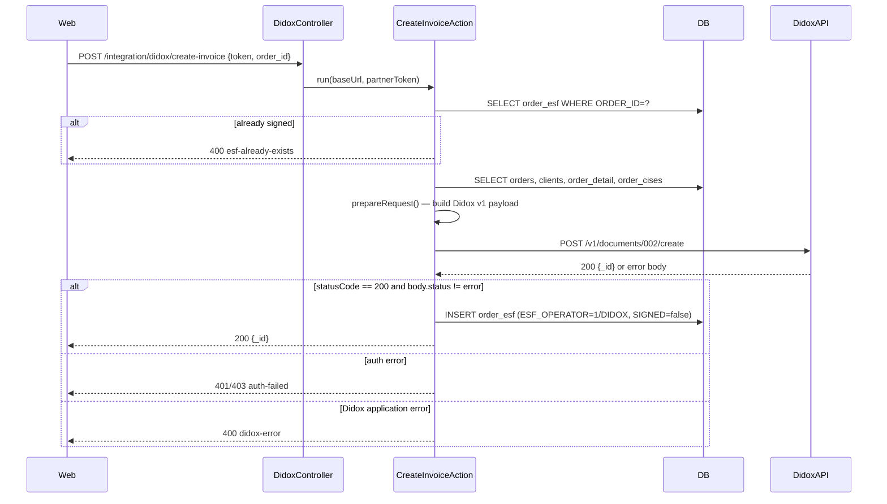
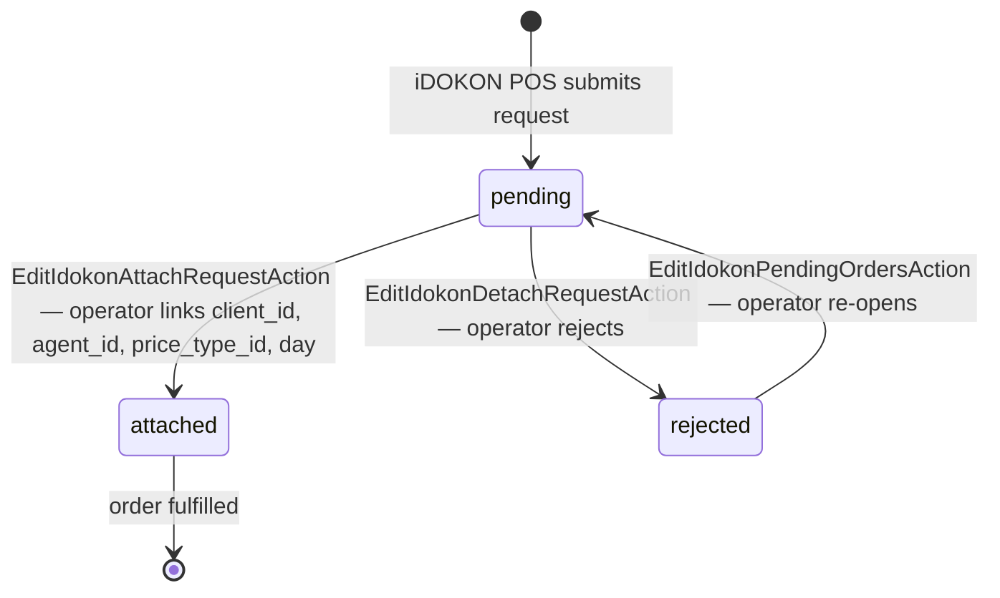
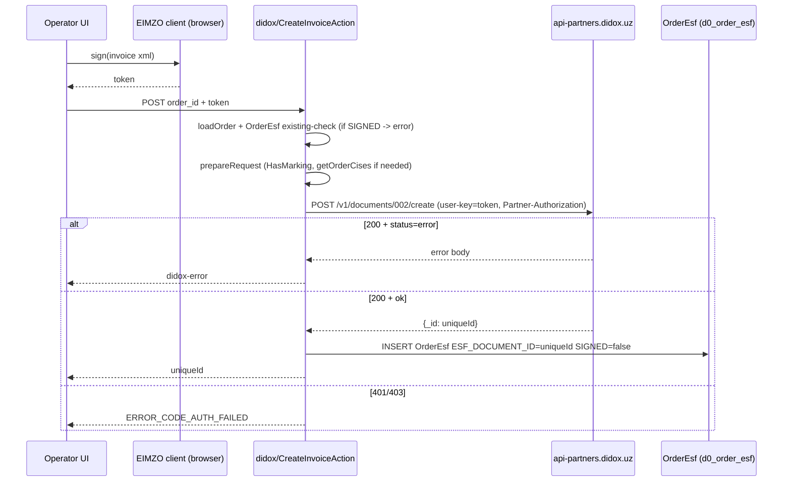
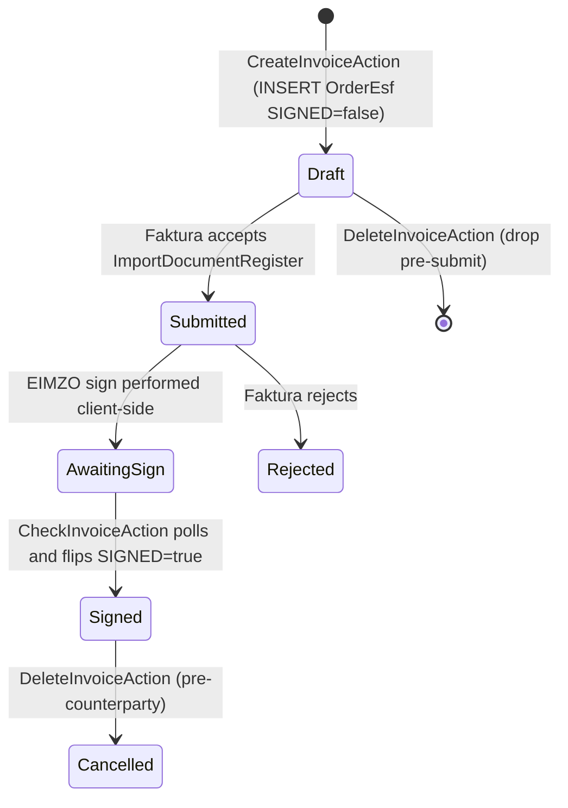
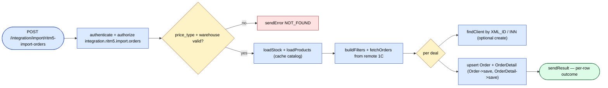

# `integration` module

Hub for outbound + inbound integrations with external systems. Each
integration has its own controller; shared logic sits in
`protected/components/`.

## Key features

| Feature | What it does | Owner role(s) |
|---------|--------------|---------------|
| 1C order export | Push every order header + lines to 1C | system |
| 1C catalog import | Pull product / category / price changes from 1C | system |
| Didox e-invoice | Submit signed e-invoices on order Loaded / Delivered | system |
| Faktura.uz | State-mandated VAT e-invoices | system |
| Smartup import | Inbound orders from Smartup ERP | system |
| TraceIQ | Inbound trace events | system |
| Generic CSV / XML import / export | Ad-hoc transfer | 1 / Ops |
| Integration log UI | Browse / filter / re-trigger failed jobs | 1 / Ops |
| Per-tenant config | Each tenant configures its own credentials | 1 |

## Controllers

| Controller | External system |
|------------|-----------------|
| `DidoxController` | Didox (EDI) |
| `FakturaController` | Faktura.uz (e-faktura, EIMZO) |
| `TraceiqController` | Trace IQ |
| `ImportController` / `ExportController` | Generic 1C / CSV / XML |
| `ListController`, `EditController`, `GetController` | Admin UI for integration jobs |

## How it works

- **Outbound**: a job is enqueued (e.g. `ExportInvoiceJob`) when an
  order reaches a status that triggers EDI submission. The job calls
  the external API, updates the local document with response data,
  and writes to `IntegrationLog`.
- **Inbound**: scheduled poll jobs pull updates (e.g. price catalogs
  from 1C) and upsert into local tables.

## Key feature flow — Order export

See **Feature · Order Export to 1C / Faktura.uz** in
[FigJam · sd-main · Feature Flows](https://www.figma.com/board/MyvyaeEluqvHofH4E2qIoU).

## Failure handling

- Per-job retry with exponential backoff (max 6 retries).
- After 6 failures, alert is dispatched to `adminEmail`.
- `IntegrationLog` row stays `ERROR` until manually re-triggered.

## Detailed protocol-level docs

- [1C / Esale](../integrations/1c-esale.md)
- [Didox](../integrations/didox.md)
- [Faktura.uz](../integrations/faktura-uz.md)
- [Smartup](../integrations/smartup.md)

## Workflows

### Entry points

| Trigger | Controller / Action / Job | Notes |
|---|---|---|
| Web (POST) | `EditController::setting` → `SaveSettingAction` | Save per-user credentials for ritm5 / smartupx / iiko / ibox |
| Web (GET) | `GetController::setting` → `GetSettingAction` | Read credentials; delegates to `GetTraceiqSettingsAction` for TraceIQ (admin-only) |
| Web (POST) | `EditController::setting` → `SaveSettingAction` → `SaveTraceiqSettingsAction` | Save filial-wide TraceIQ config (admin-only) |
| Web (POST) | `ImportController::smartupx-orders` → `ImportOrdersAction` (smartupx) | Operator-triggered pull of orders from Smartup |
| Web (POST) | `ImportController::ritm5-orders` → `ImportOrdersAction` (ritm5) | Operator-triggered pull of orders from Ritm 5 |
| Web (POST) | `TraceiqController::export-orders` → `TraceiqExportOrdersAction` | Push selected order IDs to TraceIQ |
| Web (POST) | `DidoxController::create-invoice` → `CreateInvoiceAction` | Create e-invoice on Didox for an order |
| Web (GET/POST) | `TraceiqController::actionGetPurchases` | Proxy poll: fetch arrivals from TraceIQ |
| Web (POST) | `EditController::idokon-attach-request` → `EditIdokonAttachRequestAction` | Attach iDOKON incoming request to a local client |
| Web (GET) | `ListController::idokon-incoming-requests` → `ListIdokonIncomingRequestsAction` | List pending iDOKON POS registration requests |

---

### Domain entities

---

### Workflow 1.1 — Integration credential configuration (per-user and filial-wide)

Operators configure credentials once per vendor. Per-user records cover ritm5, smartupx, iiko, and ibox; TraceIQ uses a single filial-wide row and is admin-restricted. Reading settings at runtime delegates to the same `Integration::getTraceiqConfig()` helper, which merges DB values over legacy `params['traceiq']` fallbacks.

---

### Workflow 1.2 — Inbound order pull from external ERP (Smartup / Ritm 5)

An operator triggers a date-range pull against a third-party ERP. The action loads stored credentials from `integrations`, calls the external API, then upserts `Order` + `OrderDetail` rows using `XML_ID` (Ritm 5) or `OrderCode` (Smartup) as idempotency keys. Per-vendor auth and endpoint URLs differ; the generic upsert logic is the same.

---

### Workflow 1.3 — Outbound e-invoice push to Didox

A user initiates e-invoice creation for a delivered order. `CreateInvoiceAction` builds the full Didox v1 document payload from `orders`, `order_detail`, `order_cises`, and `diler` (seller) data, posts it to the Didox partner API, and persists the returned document ID in `order_esf`. Signing happens in a subsequent step covered in [Didox](../integrations/didox.md).

---

### Workflow 1.4 — Inbound POS registration request lifecycle (iDOKON)

iDOKON POS terminals submit new-client registration requests that land in `idokon_incoming_request` with `status=pending`. An operator reviews the list, attaches a local `Client` + `Agent` + `PriceType`, and the request moves to `attached`. If the operator rejects it, status becomes `rejected`.

---

### Cross-module touchpoints

- Reads: `orders.Order` (find by PK / XML_ID / OrderCode when importing or exporting)
- Reads: `orders.OrderDetail`, `orders.BonusOrderDetail` (line items for TraceIQ and Didox payloads)
- Reads: `orders.OrderCises` (marking codes for Didox e-invoice)
- Writes: `orders.Order`, `orders.OrderDetail` (upsert during Ritm 5 / Smartup import)
- Writes: `orders.OrderCode` (idempotency key linking external deal ID to local order)
- Writes: `orders.OrderEsf` (Didox / Faktura document ID after push)
- Reads: `clients.Client`, `agents.Agent`, `warehouse.Store` (resolved during inbound order import)
- Reads: `diler` (seller TIN / bank fields used in every e-invoice payload)
- APIs: none exposed outward; all calls are client-to-server or server-to-external

### Gotchas

- **`Integration` is scoped to `BaseFilial`**: the `integrations` table is per-filial. `USER_ID` further narrows most rows to a single operator. TraceIQ is the exception — it has no `USER_ID` and uses `getTraceiqConfig()` which merges from DB _and_ `params['traceiq']` (legacy fallback). After saving TraceIQ settings always call `Integration::resetTraceiqConfigCache()` or the in-request cache returns stale data.
- **`OrderCode` vs `XML_ID` for Smartup**: the Smartup import originally stored the external deal key in `Order.XML_ID`. This was replaced by the `order_code` join table. Both lookup paths are still live for backward compatibility — see the `@deprecated` comment in `ImportOrdersAction` (smartupx).
- **TraceIQ password is write-only**: `GetTraceiqSettingsAction` never returns the password to the browser — it returns only `password_set: true/false`. Front-end forms must leave the password field blank on re-open; `SaveTraceiqSettingsAction::resolveStringField()` treats a blank incoming password as "keep existing".
- **Didox `baseUrl` flips in production**: `DidoxController::init()` switches from `stage.goodsign.biz` to `api-partners.didox.uz` only when `ServerSettings::countryCode() === 'UZ'` _and_ the host ends in `.salesdoc.io`. Dev/staging environments always hit the stage endpoint.
- **No async retry queue in this module**: the `IntegrationLog` referenced in the module overview page does not correspond to a model class in this directory. The integration module makes synchronous HTTP calls and returns errors directly to the caller. Retry on failure is the responsibility of the UI (user re-triggers). The Didox/Faktura `check-invoice` and `sync-incoming-invoices` actions are polled manually, not by a cron job — see [Didox](../integrations/didox.md) and [Faktura.uz](../integrations/faktura-uz.md) for protocol-level detail.
- **Smartup `create_clients` / `create_products` flags**: when enabled in saved settings, `ImportOrdersAction` (smartupx) will auto-create `Client` or `Product` rows on first import. This can silently seed your catalog with Smartup records if misconfigured — verify `category_id` and `city_id` before enabling.

## Didox e-invoice submit

`DidoxController` (in
`protected/modules/integration/controllers/DidoxController.php`) wires
sub-actions to `application.modules.integration.actions.didox.*` and
flips `baseUrl` to `https://api-partners.didox.uz` in UZ-prod only.
The signing flow lives in `CreateInvoiceAction::run` (line 12), which
calls `Http::sendPostRequest` against
`{baseUrl}/v1/documents/002/create` with the EIMZO-signed `token` in
the `user-key` header, then persists the resulting `_id` in
`OrderEsf` (`ESF_OPERATOR=ESF_OPEATOR_DIDOX`, `SIGNED=false`).

## Faktura.uz e-VAT submit

`FakturaController` mirrors the Didox controller and wires sub-actions
to `application.modules.integration.actions.faktura.*`. The submit
path (`CreateInvoiceAction::run`, line 13) calls
`Http::sendPostRequest` against
`{apiUrl}/Api/Document/ImportDocumentRegister`, then persists an
`OrderEsf` row with `ESF_OPERATOR=ESF_OPERATOR_FAKTURA`. The
downstream signed-state of the invoice is tracked through
`CheckInvoiceAction` polling, which flips `OrderEsf.SIGNED` as the
document moves through the e-VAT state machine.

## Generic 1C catalog import

`ImportController` (in
`protected/modules/integration/controllers/ImportController.php`)
wires three POST sub-actions:
`application.modules.integration.actions.ritm5.ImportOrdersAction`,
`ritm5.ImportReturnsAction`, and `smartupx.ImportOrdersAction`. The
ritm5 path (`ImportOrdersAction::run`, line 26) authenticates,
validates `price_type_id` + `warehouse_id`, loads `Stock` and
`Product` caches, then fetches remote orders and upserts each `Order`
+ `OrderDetail` row.

