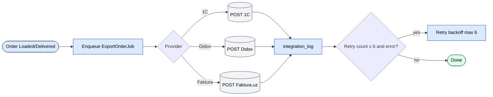

# `integration` module

Hub for outbound + inbound integrations with external systems. Each
integration has its own controller; shared logic sits in
`protected/components/`.

## Key features

| Feature | What it does | Owner role(s) |
|---------|--------------|---------------|
| 1C order export | Push every order header + lines to 1C | system |
| 1C catalog import | Pull product / category / price changes from 1C | system |
| Didox e-invoice | Submit signed e-invoices on order Loaded / Delivered | system |
| Faktura.uz | State-mandated VAT e-invoices | system |
| Smartup import | Inbound orders from Smartup ERP | system |
| TraceIQ | Inbound trace events | system |
| Generic CSV / XML import / export | Ad-hoc transfer | 1 / Ops |
| Integration log UI | Browse / filter / re-trigger failed jobs | 1 / Ops |
| Per-tenant config | Each tenant configures its own credentials | 1 |

## Controllers

| Controller | External system |
|------------|-----------------|
| `DidoxController` | Didox (EDI) |
| `FakturaController` | Faktura.uz (e-faktura, EIMZO) |
| `TraceiqController` | Trace IQ |
| `ImportController` / `ExportController` | Generic 1C / CSV / XML |
| `ListController`, `EditController`, `GetController` | Admin UI for integration jobs |

## How it works

- **Outbound**: a job is enqueued (e.g. `ExportInvoiceJob`) when an
  order reaches a status that triggers EDI submission. The job calls
  the external API, updates the local document with response data,
  and writes to `IntegrationLog`.
- **Inbound**: scheduled poll jobs pull updates (e.g. price catalogs
  from 1C) and upsert into local tables.

## Key feature flow — Order export

See **Feature · Order Export to 1C / Faktura.uz** in
[FigJam · sd-main · Feature Flows](https://www.figma.com/board/MyvyaeEluqvHofH4E2qIoU).

## Failure handling

- Per-job retry with exponential backoff (max 6 retries).
- After 6 failures, alert is dispatched to `adminEmail`.
- `IntegrationLog` row stays `ERROR` until manually re-triggered.

## Detailed protocol-level docs

- [1C / Esale](../integrations/1c-esale.md)
- [Didox](../integrations/didox.md)
- [Faktura.uz](../integrations/faktura-uz.md)
- [Smartup](../integrations/smartup.md)
