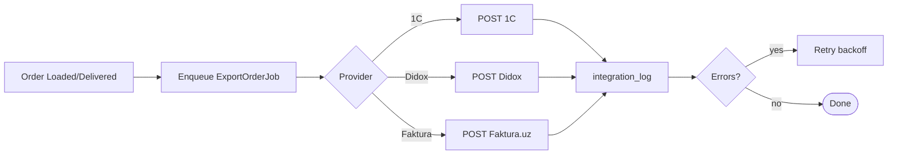

# `integration` module

A hub for outbound + inbound integrations with external systems. Each
integration has its own controller; shared logic sits in
`protected/components/`.

## Controllers

| Controller | External system |
|------------|-----------------|
| `DidoxController` | Didox (EDI) |
| `FakturaController` | Faktura.uz (e-faktura, EIMZO) |
| `TraceiqController` | Trace IQ |
| `ImportController` / `ExportController` | Generic 1C / CSV / XML |
| `ListController`, `EditController`, `GetController` | Admin UI for integration jobs |

## How it works

- Outbound: a job is enqueued (e.g. `ExportInvoiceJob`) when an order
  reaches a status that triggers EDI submission. The job calls the
  external API, updates the local document with response data, and writes
  to `IntegrationLog`.
- Inbound: scheduled poll jobs pull updates (e.g. price catalogs from 1C)
  and upsert into local tables.

## Key feature flow — Order export

See **Feature — Order Export to 1C / Faktura.uz** and
**Feature — Catalog & Price Sync** in the
[FigJam board](../architecture/diagrams.md).

Detailed protocol-level docs:
- [1C / Esale](../integrations/1c-esale.md)
- [Didox](../integrations/didox.md)
- [Faktura.uz](../integrations/faktura-uz.md)
- [Smartup](../integrations/smartup.md)
