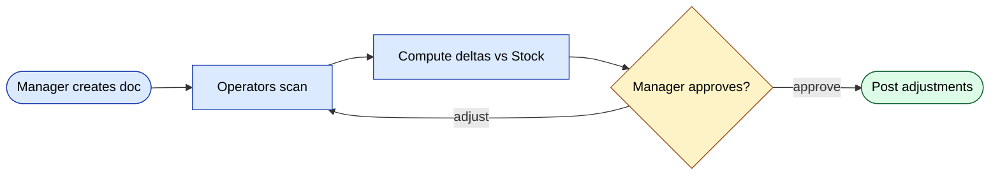
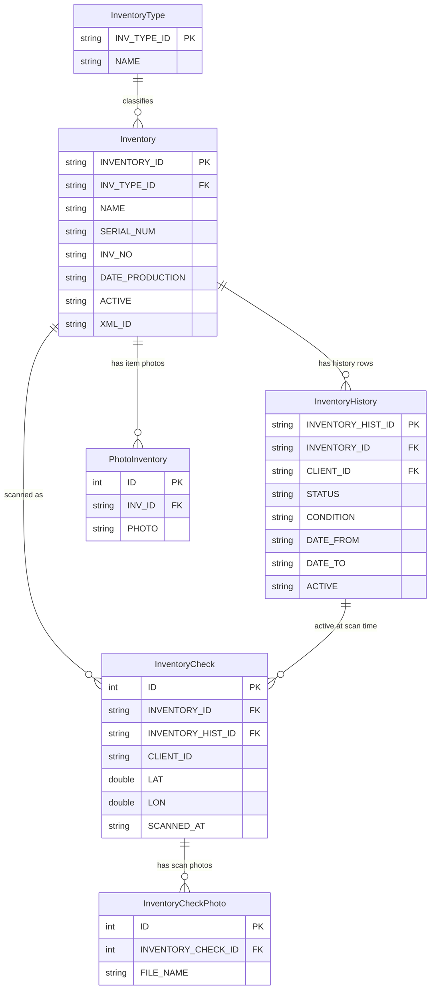
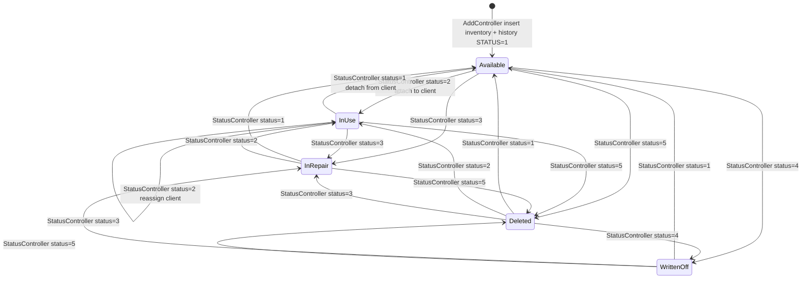
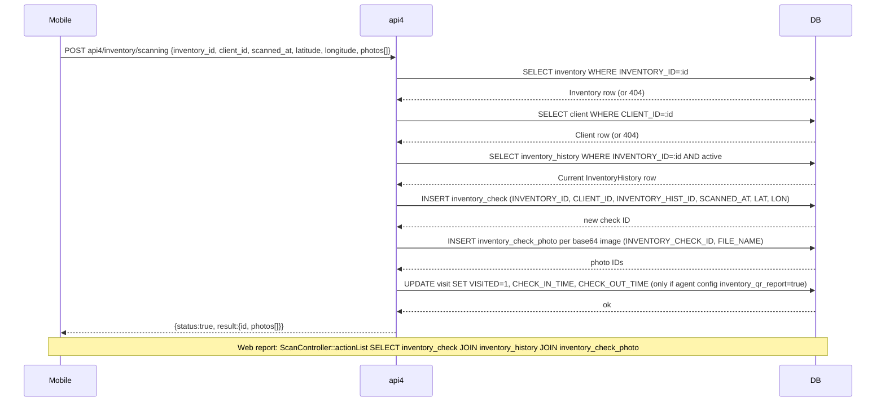

# `inventory` module

Physical inventory counts (stocktakes), with mobile barcode scanning
and reconciliation against the system stock.

## Key features

| Feature | What it does | Owner role(s) |
|---------|--------------|---------------|
| Create inventory doc | Start a new stocktake; choose `inventory_type` | 1 / 2 / 9 |
| Scope by client / warehouse | Limit the doc to a specific outlet or warehouse | 1 / 9 |
| Mobile scanning | Operators scan barcodes one-by-one via api3 | 4 / warehouse staff |
| Photo evidence | Attach photos of damaged or short items | 4 |
| Reconciliation | Compute deltas vs current `Stock` | system |
| Adjustments | On approval, post deltas back to stock | 1 / 9 |
| History | Per-doc history of edits and approvals | system |

## Folder

```
protected/modules/inventory/
├── controllers/
│   ├── AddController.php
│   ├── EditController.php
│   ├── DeleteController.php
│   ├── ListController.php
│   ├── HistoryController.php
│   ├── PhotoController.php
│   ├── ScanController.php
│   └── StatusController.php
└── views/
```

## Workflow

1. Manager creates an inventory document (`AddController`).
2. Operators scan products in the warehouse via `ScanController`
   (mobile, api3).
3. System computes deltas vs current stock.
4. Manager approves; deltas post to `stock` as adjustments.

## Key feature flow — Stocktake



## Photos

`PhotoController` attaches per-row photo evidence (e.g. damaged
goods). Stored under `upload/inventory/<doc_id>/`.

## Permissions

| Action | Roles |
|--------|-------|
| Create | 1 / 2 / 9 |
| Scan (mobile) | 4 / warehouse staff |
| Approve | 1 / 2 / 9 |

## Workflows

### Entry points

| Trigger | Controller / Action / Job | Notes |
|---|---|---|
| Web (manager) | `AddController::actionIndex` | Create a single inventory item; validates `InventoryType` and optional `Client` |
| Web (manager, batch) | `AddController::actionBatch` | Bulk-create items from an imported list |
| Web (manager) | `EditController::actionInventory` | Edit item metadata (name, serial, type) |
| Web (manager) | `EditController::actionHistory` | Re-attach / re-assign item to a different client; closes old `InventoryHistory` row |
| Web (manager) | `StatusController::actionEdit` | Single-item status transition; guards allowed transitions via `InventoryService::CAN_CHANGE_STATUS_TO` |
| Web (manager, bulk) | `StatusController::actionBulkEdit` | Bulk status change across a set of item IDs |
| Web (manager) | `PhotoController::actionAdd` | Attach evidence photo to an item (max 3, max 5 MB) |
| Mobile (agent) | `api4/InventoryController::actionScanning` | Record a barcode/QR scan event for an item at a client site |
| Mobile (agent) | `api4/InventoryController::actionScanningPhoto` | Upload a scan-event photo (`InventoryCheckPhoto`) |
| Web (report) | `ScanController::actionList` | Pull the scan-event log (joins `inventory_check` + `inventory_history` + `inventory_check_photo`) |
| Web (report) | `HistoryController::actionData` | Pull full assignment history across all items |

### Domain entities



### Workflow 1.1 — Inventory item lifecycle (creation and status transitions)

A manager registers a physical asset via `AddController::actionIndex`, which atomically inserts an `Inventory` row and an initial `InventoryHistory` row. From that point the item moves through a controlled set of statuses. All transitions are validated against `InventoryService::CAN_CHANGE_STATUS_TO`; illegal jumps are rejected before any DB write.



### Workflow 1.2 — Mobile scan event (agent scans QR/barcode at client site)

An agent in the field opens `api4/InventoryController::actionScanning`. The endpoint validates the item and client, resolves the current `InventoryHistory` row, saves an `InventoryCheck` record (with GPS coords), saves any attached photos as `InventoryCheckPhoto` rows, and — if the agent's config has `visiting.inventory_qr_report` enabled — marks the corresponding `Visit` as visited. The Web `ScanController::actionList` later joins `inventory_check`, `inventory_history`, and `inventory_check_photo` to produce the scan-event report.



### Cross-module touchpoints

- Reads: `client.Client` (validate target client on `AddController::actionIndex`, `EditController::actionHistory`, `api4/InventoryController::actionScanning`)
- Reads: `visiting.Visiting` (resolve agent's client list in `api4/InventoryController::actionList`)
- Writes: `visiting.Visit` (mark visit as `VISITED=1` when `inventory_qr_report` agent config is enabled, inside `api4/InventoryController::actionScanning`)
- APIs: `api4/inventory/scanning`, `api4/inventory/scanningPhoto`, `api4/inventory/add`, `api4/inventory/edit`, `api4/inventory/list`

### Gotchas

- `InventoryHistory` uses a **soft-close** pattern: when a status changes, the previous active row is set `ACTIVE='N'` and `DATE_TO=now` in a separate `UPDATE`, then a brand-new row is inserted — there is no in-place update of the status column. Queries that forget the `ACTIVE='Y'` filter will see duplicate current states.
- `StatusController::actionEdit` checks `InventoryService::CAN_CHANGE_STATUS_TO` for single-item transitions, but `StatusController::actionBulkEdit` falls back to `InventoryHistory::model()->statuses` (the older instance-property array, which does not include status `5`). The two guards are not in sync.
- Soft-delete (`ACTIVE='N'` on the `Inventory` row) is gated behind `ServerSettings::enableInventoryDeletion()`. If the flag is off, status `5` can still be written to `InventoryHistory` but the item stays visible in `ListController::actionData`.
- `api3/InventoryController::actionSet` is an older mobile endpoint that creates `Inventory` + `InventoryHistory` without the `InventoryService` factory; it always hard-codes `STATUS=2` and `DILER_ID='d0_1'`. Prefer `api4` for any new work.
