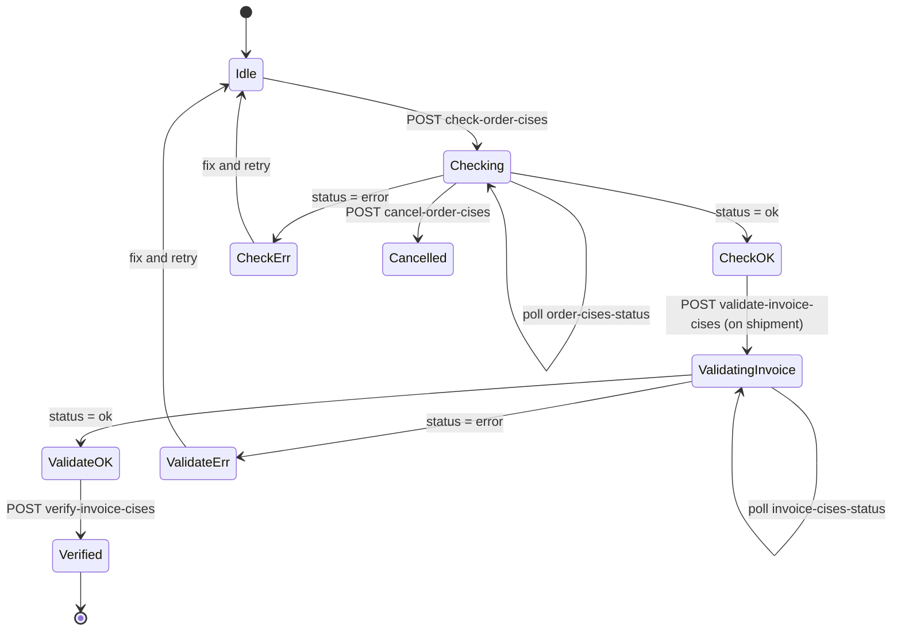

# `markirovka` module

`markirovka` is the Uzbekistan **CIS** (digital product marking, locally also
known as *Asl Belgisi* / *Chestniy Znak*) integration. It connects sd-main to
the two upstream systems that move marked goods: the CRPT-equivalent national
marking registry and the ESF (electronic invoice / *Elektron Schyot-Faktura*)
roaming pipeline. Marked products (medicines, water, dairy, footwear, etc.)
carry per-unit CIS codes that must be:

1. **Received** alongside an incoming invoice from a supplier.
2. **Tracked** while in stock.
3. **Bound** to the buyer when an outgoing order is shipped — and reported back to the registry.

The module exposes two web pages (incoming, outgoing) plus a 22-action AJAX
API consumed by the Vue 3 admin UI.

## Key features

| Feature | What it does | Owner role(s) |
|---------|--------------|---------------|
| **Incoming ESF list** | Lists incoming ESF documents pulled from the ESF operator | 1, 9 |
| **Incoming ESF details** | Per-document detail view with CIS codes per line | 1, 9 |
| **CIS scanning on receipt** | Scan / paste CIS codes to confirm received goods | 9 |
| **Acceptance status** | Mark an incoming invoice as "waiting acceptance" before booking to stock | 9 |
| **Outgoing ESF list** | Lists outgoing ESF documents tied to orders | 1, 9 |
| **Outgoing ESF details** | Per-order CIS attach + ESF document number | 1, 9 |
| **CIS code list** | Searchable list of all CIS codes ever seen by the tenant | 1 |
| **Order CIS check** | Validates an order's attached CIS codes against the registry | system |
| **Invoice CIS validation** | Validates an outgoing invoice's CIS payload before send | system |
| **CIS cancel / delete** | Cancels in-flight CIS check, deletes erroneous CIS attach | 1, 9 |
| **API key management** | Multi-tenant API keys for the CRPT / ESF integration | 1 |
| **Operator switch** | Pick ESF roaming operator (Didox, Faktura.uz, etc.) | 1 |

## Folder

```
protected/modules/markirovka/
├── controllers/
│   ├── ViewController.php   # 5 web-page actions
│   └── ApiController.php    # 22 AJAX endpoints (Yii action map)
├── actions/                 # one PHP file per API action
├── components/
│   ├── XTrace.php           # CRPT / XTrace HTTP client
│   ├── Aslbelgisi.php       # Uzbekistan CIS registry client
│   └── TrueAPI.php          # CRPT TrueAPI client
├── views/
│   ├── incoming-invoices/
│   ├── incoming-invoice-details/
│   ├── outgoing-invoices/
│   ├── outgoing-invoice-details/
│   └── cises/
└── MarkirovkaModule.php
```

## Key entities

| Entity | Model | Notes |
|--------|-------|-------|
| Incoming invoice | `IncomingInvoice` | One row per ESF document received from a supplier |
| Incoming invoice detail | `IncomingInvoiceDetail` | Per-line detail of an incoming invoice |
| Incoming invoice scanned CIS | `IncomingInvoiceScannedCis` | Each CIS code scanned against a line |
| CIS info | `CisesInfo` | Reverse-lookup table — CIS code → product / batch metadata |
| Order CIS | `OrderCises` | Per-order CIS attach (one row per code shipped) |
| Order CIS log | `OrderCisesLog` | Append-only audit log of CIS check / validate calls |
| Order ESF | `OrderEsf` | Outgoing ESF document number bound to an order |

## Controllers

| Controller | Purpose | # actions |
|------------|---------|-----------|
| `ViewController` | Vue 3 page hosts — incoming / outgoing / details / cises | 5 |
| `ApiController` | 22-action map for AJAX — CRPT auth, CIS attach, validate, cancel | 22 |

`ApiController` does not use `actionFoo` methods. Instead it returns an
`actions()` map that points each AJAX endpoint to a separate
`actions/*Action.php` class. The full list:

| API endpoint | Action class | Purpose |
|--------------|--------------|---------|
| `crpt-auth-key` | `CRPTGetAuthKeyAction` | Fetch CRPT auth challenge |
| `crpt-sign-in` | `CRPTSignInAction` | Sign the challenge and exchange for a token |
| `save-api-key` | `SaveApiKeyAction` | Persist a CRPT / ESF API key |
| `get-api-keys` | `GetApiKeysAction` | List saved keys |
| `set-primary-api-key` | `SetPrimaryApiKeyAction` | Select active key |
| `delete-api-key` | `DeleteApiKeyAction` | Remove a key |
| `save-esf-operator` | `SaveEsfOperatorAction` | Persist chosen ESF roaming operator |
| `incoming-invoices` | `GetIncomingInvoicesAction` | List ESF documents inbound |
| `incoming-invoice-details` | `GetIncomingInvoiceDetailsAction` | Detail for one ESF |
| `outgoing-invoices` | `GetOutgoingInvociesAction` | List ESF documents outbound (sic — typo in class name) |
| `get-outgoing-invoice-details` | `GetOutgoingInvoiceDetailsAction` | Detail for one outgoing ESF |
| `cises` | `GetCisesAction` | Searchable CIS code list |
| `check-order-cises` | `CheckOrderCises` | Begin a check of an order's CIS codes |
| `order-cises-status` | `GetOrderCisesStatusAction` | Poll the check status |
| `cancel-order-cises` | `CancelOrderCisesCheck` | Abort an in-flight check |
| `delete-order-cises` | `DeleteOrderCises` | Drop wrongly-attached CIS codes |
| `validate-invoice-cises` | `ValidateInvoiceCises` | Validate outgoing invoice CIS payload |
| `invoice-cises-status` | `GetInvoiceCisesStatusAction` | Poll the validate status |
| `cancel-invoice-cises` | `CancelInvoiceCisesValidation` | Abort an in-flight validation |
| `verify-invoice-cises` | `VerifyInvoiceCises` | Final verify before send |
| `set-waiting-acceptance-status` | `SetWaitingAcceptStatusAction` | Flag invoice as waiting acceptance |

Web routes:

| Route | RBAC | Render | Purpose |
|-------|------|--------|---------|
| `/markirovka/view/incomingInvoices` | `operation.marking.incoming` | `/incoming-invoices/index` | Vue page · incoming list |
| `/markirovka/view/incomingInvoiceDetails` | – | `/incoming-invoice-details/index` | Vue page · incoming detail |
| `/markirovka/view/outgoingInvoices` | `operation.marking.outgoing` | `/outgoing-invoices/index` | Vue page · outgoing list |
| `/markirovka/view/outgoingInvoiceDetails` | – | `/outgoing-invoice-details/index` | Vue page · outgoing detail |
| `/markirovka/view/cises` | – | `/cises/index` | Vue page · CIS code list |

## Incoming invoice → stock → outgoing invoice flow

```mermaid
flowchart LR
  S[Supplier ESF document] --> A[Incoming invoices list]
  A --> B[Open detail]
  B --> SCAN[Scan CIS codes]
  SCAN --> ACC[Set waiting acceptance]
  ACC --> BK[Book to stock]
  BK --> O[Order created in orders module]
  O --> OUT[Outgoing ESF for order]
  OUT --> VAL[Validate CIS payload]
  VAL --> VERIFY[Verify and send to ESF operator]
  VERIFY --> REG[CRPT / Asl Belgisi registry]

  classDef action   fill:#dbeafe,stroke:#1e40af,color:#000
  classDef approval fill:#fef3c7,stroke:#92400e,color:#000
  classDef success  fill:#dcfce7,stroke:#166534,color:#000
  classDef external fill:#f3f4f6,stroke:#374151,color:#000

  class A,B,SCAN,O,OUT action
  class ACC,VAL,VERIFY approval
  class BK success
  class S,REG external
```



## CIS check & validate state machine

CIS checks and validations are long-running calls — the controller submits a
batch and the front-end polls the status endpoint until done.



## Harvested pages

### `/markirovka/view/incomingInvoices`

13 grid columns captured (translated):

| Column |
|--------|
| # |
| Roaming document ID |
| Roaming corrected-document ID |
| Invoice number |
| Invoice date |
| Contract number |
| Contract date |
| Document status |
| CIS state |
| Acceptance state |
| Sender |
| Sender INN |
| Sum |

11 toolbar actions captured.

### `/markirovka/view/outgoingInvoices`

14 columns captured:

| Column |
|--------|
| Order |
| Application date |
| Shipment date |
| Order status |
| ESF status |
| CIS status |
| Client |
| Client INN |
| Client phone |
| Expeditor |
| Expeditor phone |
| ESF document |
| ESF operator |
| Sum |

10 toolbar actions captured. 7 filter fields surfaced.

## Components

`markirovka/components/` holds three HTTP clients that wrap the upstream
systems:

- **`XTrace.php`** — XTrace / CRPT HTTP client used by `CheckOrderCisesJob`
  in the `orders` module (see `orders.md` — "Cron / Queue — CIS code check").
- **`Aslbelgisi.php`** — Uzbekistan Asl Belgisi registry client.
- **`TrueAPI.php`** — CRPT TrueAPI client (Russian-side CRPT, kept for
  cross-border compatibility).

The actions in `actions/` call into these clients rather than embedding HTTP
logic inline.

## Cross-module touchpoints

- **`orders` module.** `orders/services/CheckOrderCisesJob` validates CIS
  codes via `XTrace` — see `orders.md` for the cron entry point. Every
  outgoing ESF is keyed by `ORDER_ID`.
- **`integration` module.** Didox + Faktura.uz integrations live in
  `integration` — markirovka uses them as ESF transport operators.
- **`stock` module.** CIS codes are bound to incoming invoice details
  (`IncomingInvoiceDetail`) which book onto warehouse stock.
- **`quality/markirovka/`** in the QA section — see
  [Markirovka QA workflows](../quality/markirovka/incoming-invoices.md).

## Permissions

| Action | RBAC operation |
|--------|----------------|
| Open incoming list | `operation.marking.incoming` |
| Open outgoing list | `operation.marking.outgoing` |
| API actions | gated by parent page access — no per-action RBAC string in routes |

Typical role mapping: 1 (admin) for API-key management, 9 (warehouse) for
scanning and acceptance on incoming, 1 / 9 for outgoing verification.

## Gotchas

- **Class-name typo `GetOutgoingInvociesAction`.** The action class file is
  `GetOutgoingInvociesAction.php` (note `Invocies`, not `Invoices`). Keep the
  spelling — the API map references the misspelt class.
- **`ApiController` extends `CController`, not `Controller`.** Unlike every
  other module's API controller, this one skips the project's `Controller`
  base — there is no `accessControl` filter. Gate at the upstream Vue page
  via the View controller's `H::access()` calls.
- **Vue 3 host views.** `ViewController::$vue3 = true` — the layout template
  swaps to the Vue 3 shell. Pages here will not work in the Vue 2 layout.
- **Long-running operations require polling.** Every `check-*` / `validate-*`
  action returns immediately and you must poll the matching `*-status`
  endpoint. The cancel endpoints exist because polling can drift if the
  user closes the page mid-flight.
- **`CRPTSignIn` is a two-step.** Auth first calls `crpt-auth-key` to get a
  challenge string, then `crpt-sign-in` to exchange it for a token. Do not
  cache the challenge — it is single-use.
- **Optional module.** Tenants outside Uzbekistan / CIS-marking jurisdictions
  do not enable this module; the menu entries are hidden via tenant flag.

## See also

- [`orders`](./orders.md) — CIS codes attach to order lines; the cron
  validates them via `XTrace`
- [`integration`](./integration.md) — Didox + Faktura.uz transport for ESF
- [Markirovka QA workflows](../quality/markirovka/incoming-invoices.md)
- [Didox integration](../integrations/didox.md)
- [Faktura.uz integration](../integrations/faktura-uz.md)
