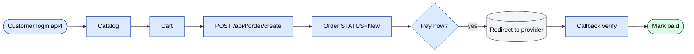

# `onlineOrder` module

The B2B online store + Telegram bot ordering channel. Customers (or
their operators) place orders without an agent visit.

## Key features

| Feature | What it does | Owner role(s) |
|---------|--------------|---------------|
| Public catalog browsing | Customer browses products with category / brand / stock filters | end customer |
| Cart + order placement | Customer submits via api4 | end customer |
| Online payment redirect | Hand off to Click / Payme / Paynet for payment | end customer |
| Pay-later flow | For customers with credit; goes through standard order pipeline | end customer |
| Order history | Customer sees past orders + statuses + downloadable invoices | end customer |
| Contact form | Reach the operator team from the portal | end customer |
| Reports | Customer's own consumption reports | end customer |
| Scheduled reports | Periodic emailed report digests | end customer |
| Telegram bot | `/start`, `/catalog`, `/order`, `/orders`, `/help` | end customer |
| Telegram WebApp | Embedded SPA inside Telegram for full ordering | end customer |

## Controllers

| Controller | Purpose |
|------------|---------|
| `CatalogController` | Public catalog browsing |
| `ContactController` | Contact form / messaging |
| `OrderController` | Order placement & history |
| `PaymentController` | Online payment redirect |
| `ReportController` | Customer's own reports |
| `ScheduledReportController` | Periodic emailed reports |
| `TelegramController` | Telegram bot webhook |
| `WebAppController` | Telegram WebApp host |

## Auth

Online users authenticate against the same `User` table but with a
different `ROLE`. Sessions still go through Redis db0 with
`HTTP_HOST` prefix.

## Key feature flow — Online order

See **Feature · Online order + Defect/Return** in
[FigJam · sd-main · Feature Flows](https://www.figma.com/board/MyvyaeEluqvHofH4E2qIoU).

