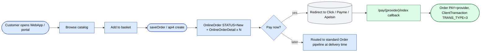
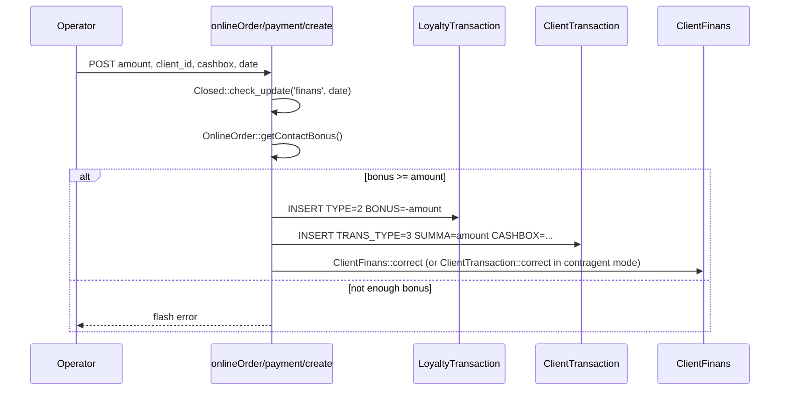
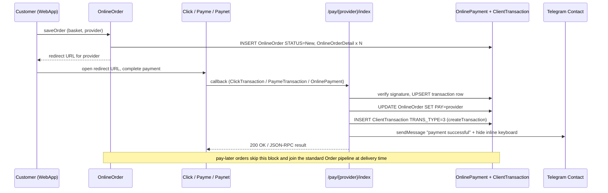
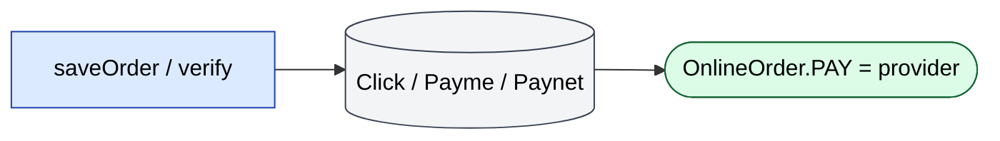

# `onlineOrder` module

The B2B online store + Telegram bot ordering channel. Customers (or
their operators) place orders without an agent visit. Spans three
front-ends — operator-side catalog management, a public B2B portal,
and a Telegram WebApp embedded inside the operator's Telegram bot.

## Key features

| Feature | What it does | Owner role(s) |
|---------|--------------|---------------|
| Catalog management | Operator builds the public catalog: sections, products, photos, prices | 1 / 2 |
| Public catalog browsing | Customer browses by category / brand / stock | end customer |
| Cart + order placement | Customer submits via Telegram WebApp or api4 | end customer |
| Online payment redirect | Hand off to Click / Payme / Apelsin and credit back via `/pay/*` callbacks | end customer |
| Pay-later flow | For customers with credit; routed through the standard `Order` pipeline | end customer |
| Loyalty / bonus payment | Customer can pay off a debt using accumulated `LoyaltyTransaction` bonus | end customer |
| Order history | Customer sees past orders, statuses, downloadable invoices | end customer |
| Contact / messaging | Bulk + per-contact Telegram messaging from the operator dashboard | 1 / 2 |
| Customer reports | Customer's own consumption / order-status reports | end customer |
| Scheduled reports | Periodic emailed / Telegram-pushed report digests | end customer |
| Telegram bot | `/start`, `/catalog`, `/order`, `/orders`, `/help` plus inout-report integration | end customer |
| Telegram WebApp | Embedded SPA inside Telegram for full ordering — basket, languages, product detail | end customer |

## Folder

```
protected/modules/onlineOrder/
├── OnlineOrderModule.php
├── controllers/
│   ├── CatalogController.php          # 17 actions — sections + products + photos
│   ├── ContactController.php          # 14 actions — bulk messaging
│   ├── OrderController.php            # 7 actions — order list + link to client
│   ├── PaymentController.php          # 1 action — bonus / loyalty payment
│   ├── ReportController.php           # 2 actions — customer-side report add + bonus
│   ├── ScheduledReportController.php  # 1 action — periodic digest hook
│   ├── TelegramController.php         # 6 actions — bot webhook dispatcher
│   ├── WebAppController.php           # 21 actions — Telegram WebApp host
│   └── WebappBotController.php        # 15 actions — internal API the WebApp calls
└── views/
```

## Key entities

| Entity | Model | Notes |
|--------|-------|-------|
| Online order header | `OnlineOrder` (`d0_online_order`) | Cols: `ID`, `CONTACT_ID`, `CLIENT_ID`, `ORDER_ID` (link to `Order`), `SUMMA`, `DATE`, `DATE_LOAD`, `STATUS`, `COMMENT`, `PAYMENT_TYPE`, `LOCATION`, `ADDRESS`, `PAY` (provider name once paid). |
| Online order line | `OnlineOrderDetail` (`d0_online_order_detail`) | Cols: `ID`, `ONLINE_ORDER_ID`, `PRODUCT`, `COUNT`, `PRICE`, `SUMMA`. |
| Telegram contact | `Contact` | Telegram-user end of the conversation. `CHAT_ID`, `LAST_MESSAGE_ID` used by callbacks to hide inline keyboards after payment. |
| Contact ⇄ client link | `ContactClient` | Maps a Telegram contact to one or many CRM `Client` rows — a single contact can order on behalf of several clients. |
| Online payment | `OnlinePayment` (`d0_online_payments`) | Provider-callback envelope. `TRANSACTION_ID`, `SERVICE_TYPE`, `AMOUNT`, `ORDER_ID`, `CLIENT_ID`. |
| Loyalty transaction | `LoyaltyTransaction` (in `settings`) | Customer-side bonus ledger. `TYPE=2` = debit (spend), `TYPE=1` = credit. `PaymentController::actionCreate` writes a `TYPE=2` row when a contact pays a debt out of accumulated bonus. |
| Client transaction | `ClientTransaction` (in `finans`) | The `PaymentController` writes a `TRANS_TYPE=3` payment row when bonus is spent against a client debt. |

## Controllers

| Controller | Purpose | # actions |
|------------|---------|-----------|
| `CatalogController` | Operator-side catalog CRUD: sections, products, photos, bulk import | 17 |
| `ContactController` | Bulk and per-contact Telegram messaging from the dashboard, including packaged broadcasts | 14 |
| `OrderController` | Operator-side list of online orders (`/onlineOrder/order`, title "Онлайн заявки"); attach a client to an unbound order; fetch detail | 7 |
| `PaymentController` | One action: `create` — pay off a client debt out of `LoyaltyTransaction` bonus balance | 1 |
| `ReportController` | Two operator-side hooks: `add` (manual report row) and `bonus` (bonus snapshot) | 2 |
| `ScheduledReportController` | Cron entry point `handleUpdates` that fans out scheduled report digests via `ScheduledReportHelper` | 1 |
| `TelegramController` | Bot webhook dispatcher — routes incoming Telegram updates to `WebApp`, `InoutReport`, or `SupplierInoutReport` handlers | 6 |
| `WebAppController` | The 21-action HTTP host the Telegram WebApp SPA talks to — basket state, product detail, language, order submit | 21 |
| `WebappBotController` | Internal API the WebApp uses for bot-side concerns: token issuance, licence check, MML lookup, in-stock filter | 15 |

### Selected `WebAppController` actions

| Action | Purpose |
|--------|---------|
| `start` | Initial WebApp landing — resolves contact, language, returns initial HTML. |
| `index` | Catalog SPA root. |
| `getHtml` | Server-rendered partials for the SPA. |
| `getLang` / `getLabels` | i18n labels for the active language. |
| `showProducts` / `productAmounts` / `getProductAmount` / `getProductDescription` | Product list + per-product current price + qty + description. |
| `availabilities` | Stock-availability lookup before adding to basket. |
| `addToBasket` / `removeFromBasket` / `setInBasket` / `isBasketEmpty` / `showBasket` | Basket-state CRUD. |
| `getPlusButton` | Renders the qty-stepper button HTML. |
| `validateQuantities` | Pre-submit validation against current stock + minimum order size. |
| `showOrderPage` | Checkout / order-confirmation screen. |
| `saveOrder` | Submits the order. Inserts `OnlineOrder` + `OnlineOrderDetail`, then optionally creates a matching `Order` if pay-later or after payment confirmation. |
| `sendOrderDetails` | Sends the order summary back to the Telegram chat. |
| `getPrevPage` / `getUpdatedPrevPageVar` | Back-button state machine for the SPA. |

### `WebappBotController` actions

`catalog`, `group`, `checkIfClient`, `hasLicence`, `inStock`,
`labels`, `mmlProducts`, `order`, `partNumbers`, `prices`,
`refreshChat`, `settings`, `token`, `validateData`, `webapp`. These
endpoints are the bridge between the WebApp SPA and the bot — for
example `token` issues the session token the WebApp uses, `prices`
returns the current price list for the bound contact, `mmlProducts`
returns the "must-have list" promoted to the top of the catalog.

### Telegram bot webhook (`TelegramController`)

| Action | Purpose |
|--------|---------|
| `index` | Main webhook entry — generic bot updates. |
| `webApp` | Bridge to the WebApp launcher. |
| `handleWebappBotUpdates` | Webhook for the dedicated WebApp bot. |
| `handleInoutReportBotUpdates` | Webhook for the inout-report bot (delivery confirmations). |
| `handleSupplierInoutReport` | Webhook for the supplier-side inout-report bot. |
| `sendMessage` | Outbound sendMessage proxy used by other modules to push to the bot. |

The webhook URL is configured in BotFather to point at one of these
endpoints; routing is by bot, not by command. Inbound updates are
dispatched to `InoutReportHandler` / `SupplierInoutReportConstant` /
the WebApp launcher depending on the bot identity.

## B2B portal vs Telegram WebApp split

| Surface | Auth | Controllers used | Notes |
|---------|------|------------------|-------|
| Operator dashboard (web) | Standard `User` session (Redis db0, `HTTP_HOST` prefix) | `CatalogController`, `ContactController`, `OrderController`, `PaymentController`, `ReportController` | Internal admin UI for managing the channel. |
| Public B2B portal (web / api4) | `User` with online-customer `ROLE` | api4 endpoints (`api4/order/*`); read-only `CatalogController` views | Browser-facing portal. |
| Telegram WebApp (embedded SPA) | Telegram-issued session token from `WebappBotController::token`, validated against `Contact`+`ContactClient` | `WebAppController` (UI host) + `WebappBotController` (data API) | SPA loaded inside Telegram; no cookie auth. |
| Telegram bot (chat) | Telegram `CHAT_ID` ↔ `Contact` row | `TelegramController` webhook | Plain-text command interface. |

## Online-payment providers

The redirect target is chosen on the WebApp checkout screen. Each
provider is handled by a dedicated controller in the `pay` module
(see [`payment / pay`](./payment.md)):

| Provider | Callback route | Transaction model | Flow |
|----------|---------------|-------------------|------|
| Click | `/pay/click/index` | `ClickTransaction` | Two-step `prepare` → `complete` |
| Payme | `/pay/payme/index` | `ClientPaymeTransaction` | JSON-RPC: `CheckPerformTransaction`, `CreateTransaction`, `PerformTransaction`, `CancelTransaction` |
| Apelsin | `/pay/apelsin/index` | `OnlinePayment` | Single POST: create transaction → mark `OnlineOrder.PAY="apelsin"` → push success message to `Contact.CHAT_ID` |

On a successful callback the `pay/*` controller sets `OnlineOrder.PAY`
to the provider name, calls `OnlineOrder::createTransaction()` to
emit the matching `ClientTransaction TRANS_TYPE=3` row, hides the
Telegram inline keyboard via
`OnlineOrder3Controller::hideMessageReplyMarkup`, and sends a
localised "payment successful" message to the chat.

## Auth

Online customers authenticate against the same `User` table but with
a customer `ROLE`. Sessions still go through Redis db0 with the
`HTTP_HOST` prefix, the same pattern as operator sessions, so a
single session store serves both channels. Telegram-side identity is
keyed by `Contact.CHAT_ID` — multiple `ContactClient` rows can link
one Telegram identity to several CRM `Client` rows.

## Key feature flow — Online order



## Loyalty-bonus payment flow

`PaymentController::actionCreate` lets a customer pay an open client
debt from their `LoyaltyTransaction` balance instead of cash:



## Online payment redirect (Click / Payme / Paynet handoff)

When the customer selects an online provider on the checkout screen,
the WebApp / portal hands the cart off to the gateway via the `pay`
module. The provider then calls back into the matching
`pay/{provider}/index` endpoint; on success the receiver writes the
transaction, sets `OnlineOrder.PAY=provider`, calls
`OnlineOrder::createTransaction()` (which emits a
`ClientTransaction TRANS_TYPE=3` payment row), and notifies the
Telegram contact. See `onlineOrder/PaymentController::actionCreate`
for the bonus-balance variant.



Color legend (sequenceDiagram does not render `classDef` styling, so
the success / external roles are conveyed by the participant names):



## API endpoints

| Endpoint | Module | Purpose |
|----------|--------|---------|
| `POST /api4/order/create` | api4 | Customer-side order create (B2B portal) |
| `GET /api4/catalog/...` | api4 | Catalog browsing from the portal |
| `POST /onlineOrder/webApp/saveOrder` | onlineOrder | WebApp checkout submit |
| `POST /onlineOrder/webappBot/token` | onlineOrder | Issue WebApp session token to Telegram contact |
| `POST /onlineOrder/telegram/*` | onlineOrder | Telegram webhook receivers (4 bots) |
| `POST /onlineOrder/payment/create` | onlineOrder | Pay off debt using bonus |
| `POST /pay/click/index` | pay | Click provider callback |
| `POST /pay/payme/index` | pay | Payme JSON-RPC callback |
| `POST /pay/apelsin/index` | pay | Apelsin callback |

See [API v4 reference](../api/api-v4-online/index.md) for full payloads.

## Permissions

| Action | Roles |
|--------|-------|
| Catalog edit | 1 / 2 |
| Online-order list | 1 / 2 / 5 (operation gated) |
| Bonus payment (`onlineOrder/payment/create`) | `operation.clients.finansCreate` — 1 / 2 / 6; fallback roles 3 / 5 / 9 if RBAC operation undefined |
| Telegram bulk messaging | 1 / 2 |
| Provider callbacks | Public (provider signature) |
| WebApp data API | Telegram session token only |

## Gotchas

- **Two `OnlineOrder` lifecycles.** Pay-now creates an `OnlineOrder`
  that is paid before a matching `Order` is minted. Pay-later inserts
  an `OnlineOrder` row that the operator later promotes into a real
  `Order` via the operator dashboard. The `ORDER_ID` field on
  `OnlineOrder` is empty until that promotion happens.
- **`OnlineOrder.PAY` is a free-text marker, not a status.** It holds
  the provider name (`"apelsin"`, etc.) once the callback succeeds.
  Click does not write to this column; you must read
  `ClickTransaction.STATUS` for Click attribution.
- **WebApp session ≠ HTTP session.** WebApp tokens are issued by
  `WebappBotController::token` from the Telegram `init_data`
  signature. No cookies, no Redis session. Token validation lives in
  `validateData`.
- **Four Telegram bots, one module.** `TelegramController` routes
  webhooks for the main bot, the WebApp bot, the inout-report bot,
  and the supplier inout-report bot. BotFather webhook URLs must
  match the right `handle*` action — easy to misconfigure.
- **Apelsin requires `Contact.LAST_MESSAGE_ID` to be live.** The
  success path tries to hide the inline keyboard on the original
  message; if `LAST_MESSAGE_ID` is stale the hide-keyboard call
  fails silently but the payment still posts.

## See also

- [`payment / pay`](./payment.md) — the `/pay/*` callback receivers
  for Click, Payme, Apelsin.
- [`orders`](./orders.md) — the canonical `Order` pipeline that
  promoted `OnlineOrder` rows flow into.
- [`finans`](./finans.md) — `ClientTransaction` and `ClientFinans`
  reconciliation.
- [API v4 reference](../api/api-v4-online/index.md) — wire formats for the
  B2B portal endpoints.
