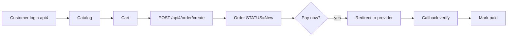

# `onlineOrder` module

The B2B online store + Telegram bot ordering channel. Customers (or their
operators) place orders without an agent visit.

## Controllers

| Controller | Purpose |
|------------|---------|
| `CatalogController` | Public catalog browsing |
| `ContactController` | Contact form / messaging |
| `OrderController` | Order placement & history |
| `PaymentController` | Online payment redirect |
| `ReportController` | Customer's own reports |
| `ScheduledReportController` | Periodic emailed reports |
| `TelegramController` | Telegram bot webhook |
| `WebAppController` | Telegram WebApp host |

## Auth

Online users authenticate against the same `User` table but with a
different `ROLE`. Sessions still go through Redis db0 with `HTTP_HOST`
prefix.

## Key feature flow — Online order

See **Feature — Online Order (B2B / WebApp)** in the
[FigJam board](../architecture/diagrams.md).

