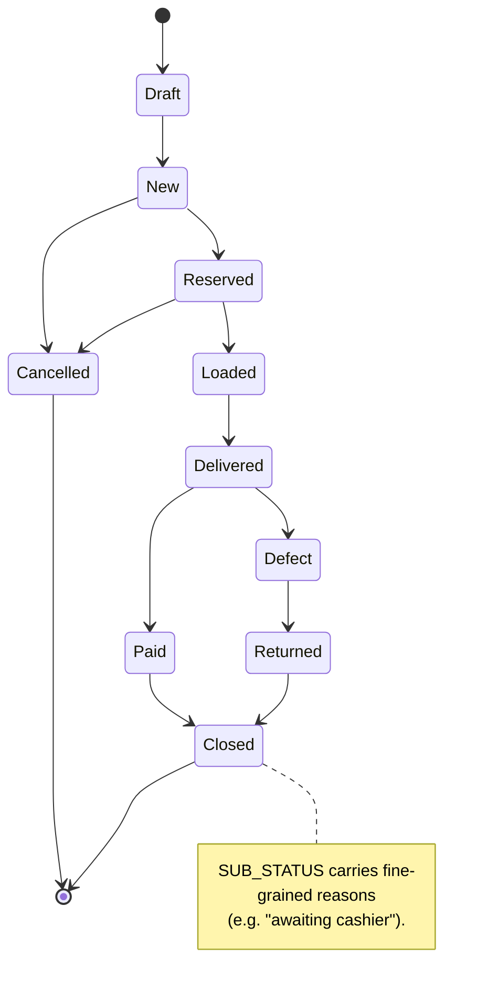
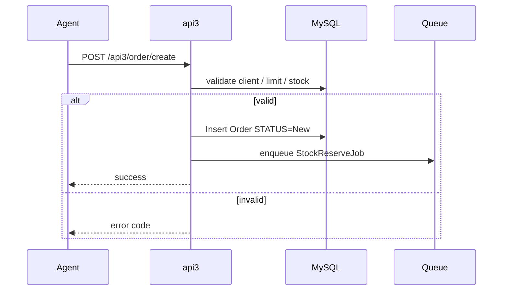
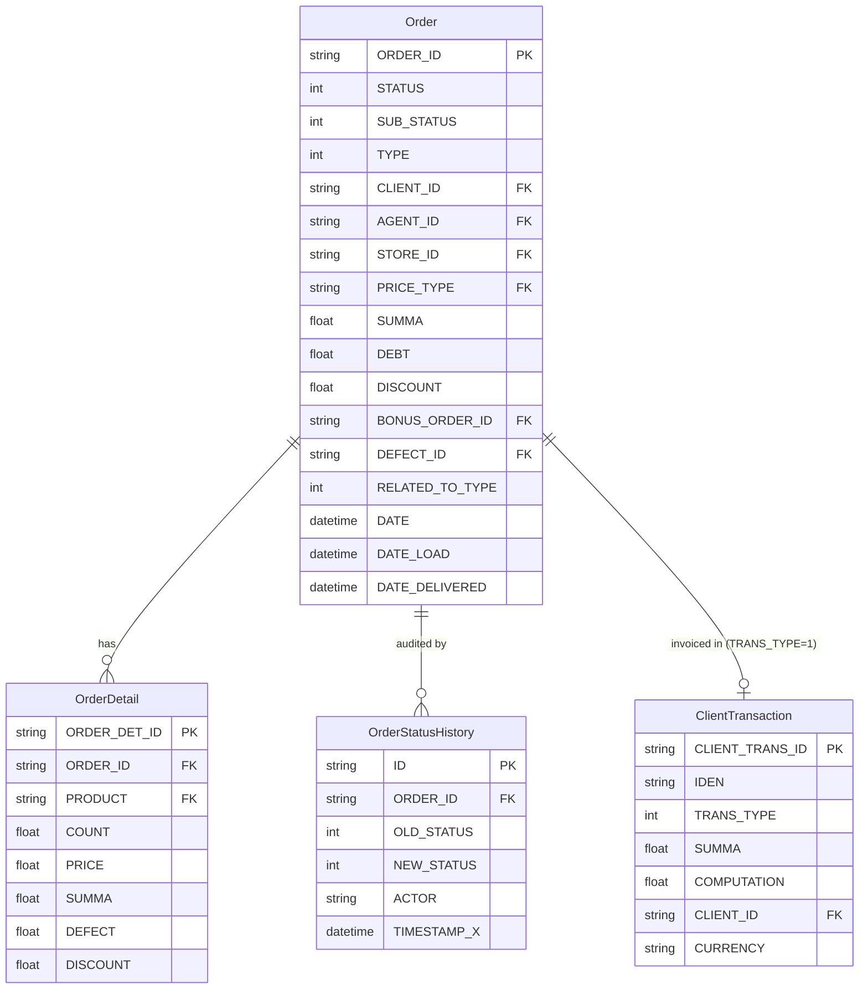
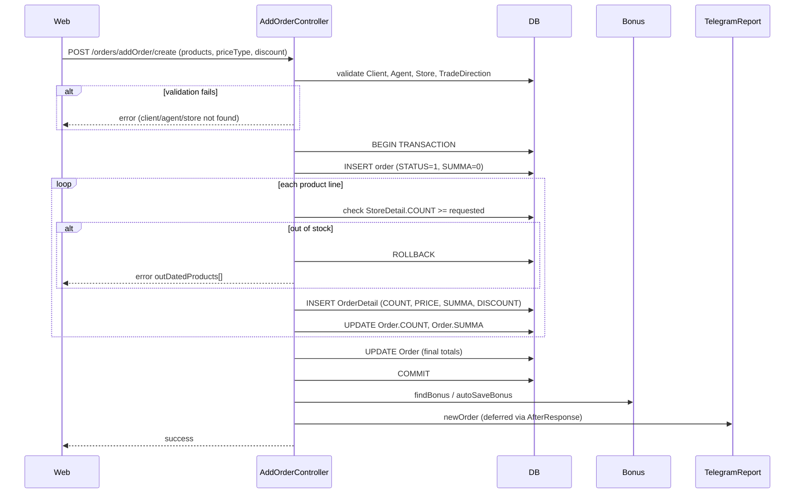
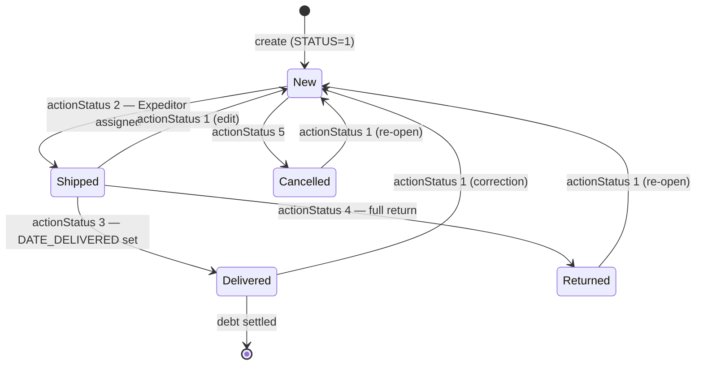
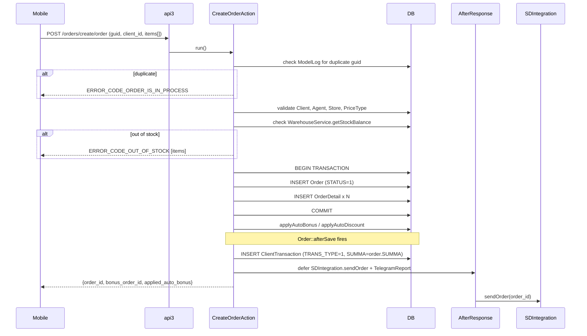
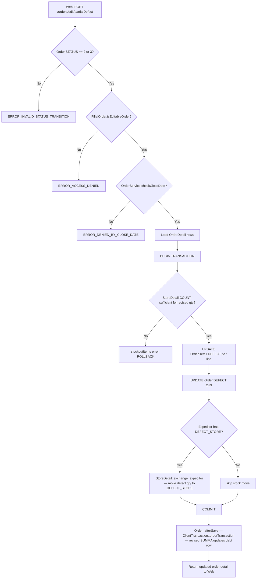

# `orders` module

The heart of sd-main. Captures, prices, validates and tracks orders
through their full lifecycle.

## Key features

| Feature | What it does | Owner role(s) |
|---------|--------------|---------------|
| **Order capture (web)** | Operator/manager builds an order line-by-line in the admin UI | 1 / 2 / 3 / 5 / 9 |
| **Order capture (mobile)** | Field agent submits orders during a visit via api3 | 4 |
| **Order capture (online / B2B)** | Customer self-service via api4 / WebApp / Telegram | end customer |
| **Pricing & price types** | Active price list per order; per-product markup if `enableMarkupPerProduct` | – |
| **Discounts** | Per-line discounts + header-level discount; line wins for reports | 4 / 9 |
| **Bonuses** | Promo bonus orders linked back via `BONUS_ORDER_ID` | 1 / 9 |
| **Approval workflow** | Manager/admin approval before stock reservation (configurable) | 1 / 2 / 9 |
| **Status transitions** | Draft → New → Reserved → Loaded → Delivered → Paid → Closed (+ Cancelled / Defect / Returned) | system |
| **Defect / reject on delivery** | Per-line defect with photo evidence; auto return-to-stock | 10 / 9 |
| **Excel imports** | CSV / Excel batch order creation if `enableImportOrders` | 1 / 5 |
| **1C / Faktura.uz / Didox export** | Outbound to accounting / EDI on status change | system |
| **Push + SMS notifications** | Status changes notify the customer and the agent | system |
| **Print templates** | Custom invoice / waybill print layouts per tenant | 1 |
| **Audit trail** | `OrderStatusHistory` row per transition with actor + timestamp | system |

## Folder

```
protected/modules/orders/
├── controllers/
│   ├── AddOrderController.php
│   ├── ApiController.php
│   ├── CleanOrdersController.php
│   ├── CreateController.php
│   ├── ListController.php
│   ├── EditController.php
│   ├── DeleteController.php
│   ├── ApproveController.php
│   ├── DeliveryController.php
│   └── ImportController.php
├── models/
└── views/
```

## Key entities

| Entity | Model | Owned by module | Notes |
|--------|-------|-----------------|-------|
| Order | `Order` | `orders` | Header (~50 cols) |
| Order line | `OrderProduct` | `orders` | Per-product line with price, count |
| Order status history | `OrderStatusHistory` | `orders` | Audit trail |
| **Defect** | `Defect` | **`orders`** | Per-line defect declarations on a delivered order. **Not** related to the `audit` module's `AFacing` / `AuditResult` (those record merchandising surveys, not delivery defects). |
| **Reject** | handled inline on `Order` | **`orders`** | Whole-order rejection at delivery time. Distinct from per-line defect: a reject sends the entire order back to stock. |
| Bonus | `Bonus*` | `orders` | Promo bonus orders linked via `BONUS_ORDER_ID` |

## Status machine

See the diagram **sd-main · Order state machine** in
[FigJam · sd-main · System Design](https://www.figma.com/board/tw0B3eE1bKNbvmmny8TVvx).



## Key feature flow — Create order

See **Feature · Create Order (mobile / api3)** in
[FigJam · sd-main · Feature Flows](https://www.figma.com/board/MyvyaeEluqvHofH4E2qIoU).



## API endpoints

| Endpoint | Module | Purpose |
|----------|--------|---------|
| `POST /api3/order/create` | api3 | Mobile agent order creation |
| `POST /api4/order/create` | api4 | B2B / online creation |
| `GET /api3/order/list` | api3 | Agent's own orders |
| `POST /orders/approve` | orders | Web approval |

See [API v3 reference](../api/api-v3-mobile.md) for full payloads.

## Permissions

| Action | Roles |
|--------|-------|
| Create | 1, 2, 3, 4, 5, 9 |
| Approve | 1, 2, 9 |
| Cancel | 1, 2 |
| Delete | 1 (only with `enableDeleteOrders`) |

## See also

- [`clients`](./clients.md) · [`agents`](./agents.md) ·
  [`stock`](./stock.md) · [`payment`](./payment.md)

## Workflows

### Entry points

| Trigger | Controller / Action / Job | Notes |
|---|---|---|
| Web – operator builds order | `AddOrderController::actionCreate` (line 432) | Full web order creation with detail rows, discount, bonus |
| Web – operator updates order | `AddOrderController::actionUpdate` (line 744) | Same validation path as create |
| Mobile – agent submits order | `CreateController` → `CreateOrderAction::run` (line 16) | api3 endpoint `/orders/create/order` |
| Mobile – agent fetches order | `GetController` → `GetOrderAction::run` | api3 endpoint `/orders/get/order` |
| Mobile – expeditor records payment | `PaymentController` → `SetAction::run` (line 5) | api3 endpoint `/orders/payment/set`; writes `ClientTransaction` |
| Web – status change (single or batch) | `EditController::actionStatus` (line 1029) | Validates via `VALID_STATUS_TRANSITIONS`; triggers `Order::afterSave` |
| Web – batch status change | `EditController::actionStatusBatch` (line 1331) | Sets `BULK_STATUS_CHANGE = true` to suppress per-order Telegram noise |
| Web – partial defect declaration | `EditController::actionPartialDefect` (line 689) | Only allowed on STATUS 2 or 3 |
| Web – order list view | `ListController::actionOrders` (line 33) | Paginated JSON for the orders grid |
| Web – order detail view | `OrdersController::actionView` (line 1369) | Renders order view page |
| Web – sub-status change | `EditController::actionSubstatus` (line 1754) | Fine-grained sub-status stored in `SUB_STATUS` field |
| Web – supplier receipt | `SupplierController::actionReceipt` (line 5) | `operation.orders.supplier.receipt` gate |
| Cron / Queue – CIS code check | `CheckOrderCisesJob::handle` | Validates product CIS codes via XTrace API |

---

### Domain entities



---

### Workflow 1.1 — Web order creation

An operator opens `/orders/addOrder`, fills in client / products / discount, and submits.
`AddOrderController::actionCreate` runs a DB transaction: saves the `Order` header at STATUS=1 (New), then inserts one `OrderDetail` row per product.
Bonus and discount rules are applied after the transaction commits.



---

### Workflow 1.2 — Order lifecycle (status transitions)

The `Order` entity moves between five numeric statuses. Transitions are validated by `EditController::VALID_STATUS_TRANSITIONS` (line 21). Every save goes through `Order::afterSave` (line 383), which fires `ClientTransaction::orderTransaction` to keep the debt ledger in sync.



---

### Workflow 1.3 — Mobile order creation via api3 and debt accumulation

A field agent submits an order from the mobile app. `CreateOrderAction` (api3) saves the order and defers SDIntegration and Telegram calls via `AfterResponse`. On the same `Order::afterSave` hook, `ClientTransaction::orderTransaction` inserts a `TRANS_TYPE=1` invoice row in `client_transaction`, creating the debt record.



---

### Workflow 1.4 — Partial defect declaration and stock return

When an expeditor delivers an order with damaged goods, an operator calls `EditController::actionPartialDefect` (line 689). The defect count is written per `OrderDetail.DEFECT`, the `Order.DEFECT` total is updated, and stock is moved back to the defect store via `StoreDetail::exchange_expeditor` if the expeditor has a `DEFECT_STORE` configured.



---

### Cross-module touchpoints

- Reads: `clients.Client` (validate CLIENT_ID, derive CLIENT_CAT, CITY, EXPEDITOR)
- Reads: `stock.Store` / `stock.StoreDetail` (stock balance checks, warehouse selection)
- Reads: `agents.Agent` (VAN_SELLING type determines expeditor and warehouse eligibility)
- Reads: `price.PriceType` / `price.OldPrice` (line prices per price type)
- Reads: `discount.SkidkaManual` (manual discount validation per product / agent)
- Writes: `finans.ClientTransaction` (TRANS_TYPE=1 invoice on STATUS change via `Order::afterSave`)
- Writes: `finans.ClientFinans` (debt balance correction via `ClientFinans::correct`)
- Writes: `bonus.BonusOrder` / `bonus.BonusOrderDetail` (auto-bonus and retro-bonus on create)
- Writes: `stock.StoreLog` (DATE_LOAD sync on every status change)
- APIs: `api3/orders/create/order` (mobile order creation)
- APIs: `api3/orders/get/order` (mobile order fetch)
- APIs: `api3/orders/payment/set` (mobile payment recording)
- External: `SDIntegration::sendOrder` fires deferred via `AfterResponse` after any order save

---

### Gotchas

- **STATUS integers, not constants.** `Order` uses bare integers 1–5 (and 7 for the "edit" label alias). There are no named `STATUS_*` constants in the `Order` model — only in `OrderIdokon`. When reading code, cross-reference `EditController::STATUS_NAMES` (line 29).
- **`BULK_STATUS_CHANGE` flag.** Batch status calls set `$order->BULK_STATUS_CHANGE = true` before saving to suppress the per-order `notifyInoutReporter` call inside `Order::afterSave`. Omitting this flag causes N Telegram messages on bulk updates.
- **Debt is written in `afterSave`, not by the controller.** `ClientTransaction::orderTransaction` runs inside `Order::afterSave` every time the order is saved, not just on status transitions. Re-saves triggered by discount or bonus updates also recalculate the debt row — be cautious when calling `$order->save()` in utility scripts.
- **`debtNewOrder` vs default finans path.** If `Yii::app()->params['debtNewOrder']` is true and the agent is VAN_SELLING or SELLER, `newOrderTransaction` is called instead of `orderTransaction`. These two methods create different transaction shapes — mixing them causes reconciliation mismatches.
- **Partial defect only allowed at STATUS 2 or 3.** The full-return path (STATUS → 4) is a separate status transition, not via `actionPartialDefect`. Do not confuse `Order.DEFECT` (partial defect count) with `Order.TYPE=2` (whole-order shelf return).
- **`Create2Controller`, `Create3Controller`, `CreateOrder2Controller`, `CreateOrder3Controller` are `.obsolete`.** The active web creation path is `AddOrderController`. The active api3 path is `CreateController` + `CreateOrderAction`.
- **`SetAction` (payment) writes `ClientTransaction.TRANS_TYPE=3`.** This is a payment receipt, distinct from the invoice row (`TRANS_TYPE=1`) written by `orderTransaction`. Both reference the same `ORDER_ID` via the `IDEN` field. The `payment` module reads these same rows — the `orders` module only writes the order-side receipt.
