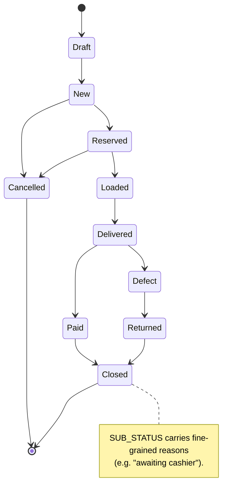
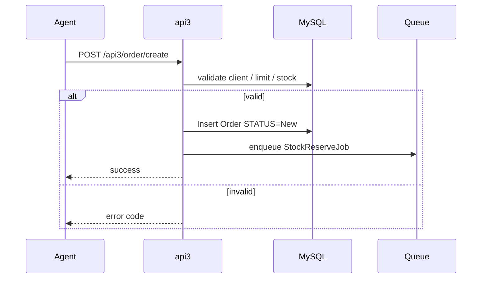

# `orders` module

The heart of sd-main. Captures, prices, validates and tracks orders
through their full lifecycle.

## Key features

| Feature | What it does | Owner role(s) |
|---------|--------------|---------------|
| **Order capture (web)** | Operator/manager builds an order line-by-line in the admin UI | 1 / 2 / 3 / 5 / 9 |
| **Order capture (mobile)** | Field agent submits orders during a visit via api3 | 4 |
| **Order capture (online / B2B)** | Customer self-service via api4 / WebApp / Telegram | end customer |
| **Pricing & price types** | Active price list per order; per-product markup if `enableMarkupPerProduct` | – |
| **Discounts** | Per-line discounts + header-level discount; line wins for reports | 4 / 9 |
| **Bonuses** | Promo bonus orders linked back via `BONUS_ORDER_ID` | 1 / 9 |
| **Approval workflow** | Manager/admin approval before stock reservation (configurable) | 1 / 2 / 9 |
| **Status transitions** | Draft → New → Reserved → Loaded → Delivered → Paid → Closed (+ Cancelled / Defect / Returned) | system |
| **Defect / reject on delivery** | Per-line defect with photo evidence; auto return-to-stock | 10 / 9 |
| **Excel imports** | CSV / Excel batch order creation if `enableImportOrders` | 1 / 5 |
| **1C / Faktura.uz / Didox export** | Outbound to accounting / EDI on status change | system |
| **Push + SMS notifications** | Status changes notify the customer and the agent | system |
| **Print templates** | Custom invoice / waybill print layouts per tenant | 1 |
| **Audit trail** | `OrderStatusHistory` row per transition with actor + timestamp | system |

## Folder

```
protected/modules/orders/
├── controllers/
│   ├── AddOrderController.php
│   ├── ApiController.php
│   ├── CleanOrdersController.php
│   ├── CreateController.php
│   ├── ListController.php
│   ├── EditController.php
│   ├── DeleteController.php
│   ├── ApproveController.php
│   ├── DeliveryController.php
│   └── ImportController.php
├── models/
└── views/
```

## Key entities

| Entity | Model | Owned by module | Notes |
|--------|-------|-----------------|-------|
| Order | `Order` | `orders` | Header (~50 cols) |
| Order line | `OrderProduct` | `orders` | Per-product line with price, count |
| Order status history | `OrderStatusHistory` | `orders` | Audit trail |
| **Defect** | `Defect` | **`orders`** | Per-line defect declarations on a delivered order. **Not** related to the `audit` module's `AFacing` / `AuditResult` (those record merchandising surveys, not delivery defects). |
| **Reject** | handled inline on `Order` | **`orders`** | Whole-order rejection at delivery time. Distinct from per-line defect: a reject sends the entire order back to stock. |
| Bonus | `Bonus*` | `orders` | Promo bonus orders linked via `BONUS_ORDER_ID` |

## Status machine

See the diagram **sd-main · Order state machine** in
[FigJam · sd-main · System Design](https://www.figma.com/board/tw0B3eE1bKNbvmmny8TVvx).



## Key feature flow — Create order

See **Feature · Create Order (mobile / api3)** in
[FigJam · sd-main · Feature Flows](https://www.figma.com/board/MyvyaeEluqvHofH4E2qIoU).



## API endpoints

| Endpoint | Module | Purpose |
|----------|--------|---------|
| `POST /api3/order/create` | api3 | Mobile agent order creation |
| `POST /api4/order/create` | api4 | B2B / online creation |
| `GET /api3/order/list` | api3 | Agent's own orders |
| `POST /orders/approve` | orders | Web approval |

See [API v3 reference](../api/api-v3-mobile.md) for full payloads.

## Permissions

| Action | Roles |
|--------|-------|
| Create | 1, 2, 3, 4, 5, 9 |
| Approve | 1, 2, 9 |
| Cancel | 1, 2 |
| Delete | 1 (only with `enableDeleteOrders`) |

## See also

- [`clients`](./clients.md) · [`agents`](./agents.md) ·
  [`stock`](./stock.md) · [`payment`](./payment.md)
