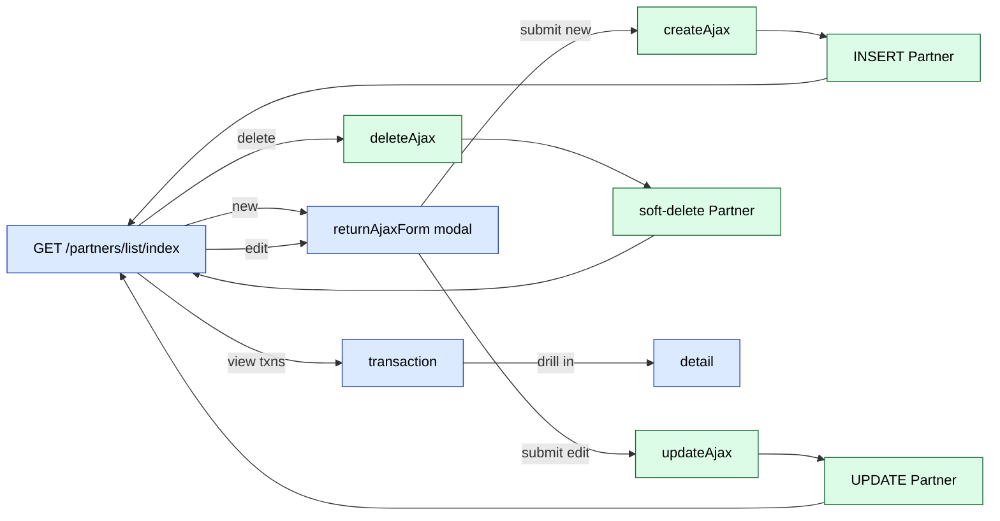

# `partners` module

`partners` is the smallest workflow module in sd-main. It is a single
controller (`ListController`) exposing seven routes that manage the
**`Partner`** entity — a "distributor partner" (a.k.a. *diler*) record that
some multi-tenant deployments use to model sub-distributors, dealer networks,
or downstream resellers under one master tenant.

If your deployment is single-distributor, you can ignore this module entirely
— `Partner` rows are optional, and most controllers in the codebase work fine
when `Partner` is empty. If your deployment **is** a dealer network, this
module is the operator's primary entry point for adding new dealers and
auditing their transaction history.

## When do I use this?

You touch this module when:

1. **Onboarding a new dealer** to a multi-tenant master deployment.
2. **Linking a `User` row to a `Diler`** so that user-scoped queries filter
   by dealer.
3. **Auditing dealer transactions** — the `transaction` action lists the
   per-dealer financial transactions captured by the rest of the CRM.
4. **Deactivating a dealer** (soft-delete via the AJAX delete action).

You do **not** use it for:

- Day-to-day order flow (use [`orders`](./orders.md)).
- Dealer-level reports (use [`report`](./report.md)).
- Per-dealer KPI dashboards (use [`dashboard`](./dashboard.md)).
- Internal back-office user management (use [`settings-access-staff`](./settings-access-staff.md)).

## Key features

| Feature | What it does | Owner role(s) |
|---------|--------------|---------------|
| **Partner list** | Paginated grid of all `Partner` rows in the tenant | 1, 3 |
| **Create partner** | AJAX form — registers a new dealer record | 1 |
| **Update partner** | AJAX inline edit | 1 |
| **Delete partner** | AJAX soft-delete | 1 |
| **Transaction list** | Per-partner transaction grid | 1, 3 |
| **Transaction detail** | Per-transaction view | 1, 3 |

## Folder

```
protected/modules/partners/
├── controllers/
│   └── ListController.php
├── models/
└── views/
    ├── admingrid_diler.php
    ├── transaction_list.php
    └── transaction_detail.php
```

The folder is a single-controller module — there is no Module class file
beyond the registration in `protected/config/main.php`.

## Key entities

| Entity | Model | Notes |
|--------|-------|-------|
| Partner | `Partner` | The dealer record itself — table `d0_partner` |
| Diler | `Diler` | The legacy "distributor" entity used elsewhere in the codebase; the controller resolves it via `User::DILER_ID` |
| Reject diler | `RejectDiler` | Soft-rejected dealer rows (denied applications) — table `d0_reject_diler` |
| Partner transaction | _no dedicated model_ | The `transaction` action queries existing client / financial transaction tables, scoped by partner |

A `User` row may carry a `DILER_ID` pointing at a `Diler` record. The
`partners` module uses `Partner` (with its own table) while the rest of the
codebase (notably `doctor`, `report`, `rating`) keys queries by `DILER_ID`.
The two concepts overlap — treat `Partner` as the canonical dealer master
and `Diler` as the legacy distributor record carried on `User`.

## Controllers

| Controller | Purpose | # actions |
|------------|---------|-----------|
| `ListController` | All seven actions: list, AJAX CRUD, transactions | 7 |

The controller uses the shared `AjaxCrudBehavior` with:

| Property | Value |
|----------|-------|
| `modelClassName` | `Partner` |
| `form_alias_path` | `_form` |
| `view_alias_path` | `_view` |
| `pagination` | `10` |
| `url_controll` | `/partners/list/` |

`init()` calls `$this->ajaxCrudBehavior->register_Js_Css()` to register the
modal-form JS and CSS bundles.

## Routes

| Route | RBAC | Render | Purpose |
|-------|------|--------|---------|
| `/partners/list/index` | `operation.settings.partners` | `admingrid_diler` | Partner list grid |
| `/partners/list/createAjax` | – | – | AJAX create |
| `/partners/list/updateAjax` | – | – | AJAX update |
| `/partners/list/deleteAjax` | – | – | AJAX delete |
| `/partners/list/returnAjaxForm` | – | – | Return form HTML for modal |
| `/partners/list/transaction` | – | `transaction_list` | Per-partner transactions |
| `/partners/list/detail` | – | `transaction_detail` | Per-transaction detail |

Only the `index` route carries an explicit RBAC operation
(`operation.settings.partners`). The other routes are gated by the
controller-level `accessRules` (role `3` — operator — by default).

## Partner CRUD flow



## Common operations

### Onboarding a new dealer

1. Open `/partners/list/index`.
2. Click **Add** (the toolbar button rendered by `AjaxCrudBehavior`).
3. Fill the modal form — at minimum: name, INN, region, primary user.
4. Submit — the modal POSTs to `/partners/list/createAjax`.
5. On the User record, set `DILER_ID` to the new partner's PK so that the
   user inherits the dealer scope.

### Auditing dealer activity

1. Open `/partners/list/index`.
2. Click the **Transaction** action on the row.
3. The `transaction` action renders `transaction_list.php`, listing the
   dealer's financial transactions (sourced from `client_transaction` and
   adjacent tables).
4. Click a row to drill into `transaction_detail`.

### Deactivating a dealer

The module exposes only AJAX-delete — there is no explicit "block" or
"deactivate" button. Deletion is soft (`AjaxCrudBehavior` sets an active
flag rather than removing the row). Re-enabling a dealer requires database
intervention or a manual flag flip via SQL — there is no UI re-enable path.

## Cross-module touchpoints

- **`User.DILER_ID`.** Many other modules (`doctor`, `rating`, `report`)
  filter their queries by the current user's `DILER_ID`. The `partners`
  module is where that ID is created.
- **`Diler` model.** Used across the codebase for region scoping. See e.g.
  `doctor` module controllers' `init()` — every one of them does
  `Diler::model()->findByPk($userModel->DILER_ID)`.
- **`RejectDiler`.** Soft-rejected applications (declined dealer onboarding)
  land in `d0_reject_diler` — the partners module does not currently
  surface this table in its UI; rejections are written elsewhere.

## Permissions

| Action | RBAC operation |
|--------|----------------|
| Open list | `operation.settings.partners` |
| AJAX CRUD + transactions | role `3` via `accessRules` |

Effective roles: admin (1) and operator (3) typically have the operation
flag; everyone else is denied at the index level.

## FAQ

**Why is this module so small?**
The `Partner` entity is a master-data row, not a workflow object. CRUD is the
whole story — there is no status machine, no scheduling, no integrations.

**Is there a mobile / api3 entry point?**
No. Partners are admin-only.

**How does it relate to the `Diler` model used elsewhere?**
`Diler` is the legacy distributor entity carried on `User.DILER_ID`. The
`Partner` table is its modern replacement for new tenants. They co-exist —
the `partners` module manages `Partner`, while the rest of the codebase
keys off `DILER_ID`.

**Can I delete a partner safely?**
Soft-delete is fine. Hard-delete is not — many other tables carry
`DILER_ID` foreign keys and will orphan if the `Partner` row vanishes.

**What if my tenant has only one distributor?**
Leave this module empty. Most flows work fine when `Partner` is empty.

## Gotchas

- **`ListController::actionIndex` calls `H::access('operation.settings.partners')` explicitly** — duplicate of the route-level RBAC. Both must be granted for the page to load.
- **Soft-delete only.** There is no UI to fully purge a `Partner` row;
  `deleteAjax` flips an active flag, leaving the row present for FK
  integrity.
- **`url_controll = '/partners/list/'`.** AjaxCrudBehavior hardcodes this
  prefix; renaming the controller will break the modal AJAX endpoints.
- **No bulk import.** Unlike `clients` or `agents`, there is no Excel
  upload — every dealer is added one at a time via the modal.

## See also

- [`settings-access-staff`](./settings-access-staff.md) — back-office
  user / RBAC management
- [`doctor`](./doctor.md) — every doctor-module controller resolves
  `Diler::model()->findByPk($DILER_ID)` set here
- [`report`](./report.md) — dealer-scoped pivots
- [`dashboard`](./dashboard.md) — dealer-aware KPI tiles
