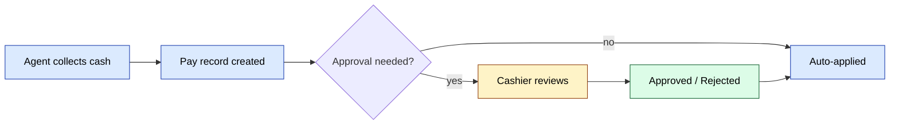

# `payment` and `pay` modules

Two related modules:

- **`pay`** — low-level payment recording (entries against orders).
- **`payment`** — approval workflow on top of `pay`.

## Key features

| Feature | What it does | Owner role(s) |
|---------|--------------|---------------|
| Record payment | Create a `Payment` row tied to an order | Agent / Operator |
| Approve payment | Cashier confirms the payment is real | Cashier |
| Reject payment | Cashier rejects with a reason | Cashier |
| Apply against debt | On approval, applies to client's debt + cashbox | system |
| Reassign to other order | Operator can re-route a misplaced payment | 1 / 6 |
| Notification | Agent + customer notified on outcome | system |

## Approval flow

See **Feature · Payment Collection & Approval** in
[FigJam · sd-main · Feature Flows](https://www.figma.com/board/MyvyaeEluqvHofH4E2qIoU).

<!-- TODO: missing reject/error branch — see workflow-design.md principle #9 -->

`payment/ApprovalController` is the cashier's review screen.

## Workflow audit

See [Workflow design standards](../team/workflow-design.md) — this
flow is rated against 12 design principles. Open action items: add an
auto-approve threshold, capture rejection reason, add an SLA timer.

## Permissions

| Action | Roles |
|--------|-------|
| Create | 4 / 5 / 6 |
| Approve / reject | 6 (cashier) / 1 / 2 |
| Reassign | 1 / 6 |
