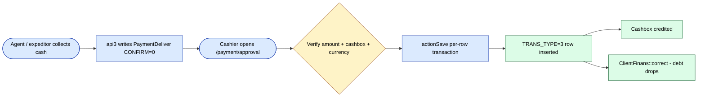
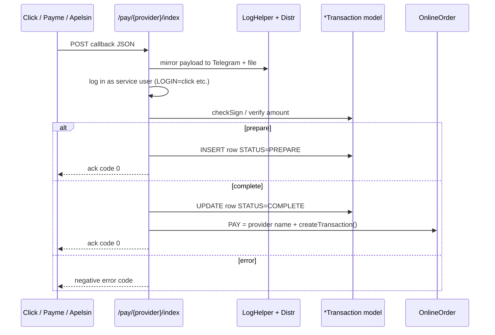
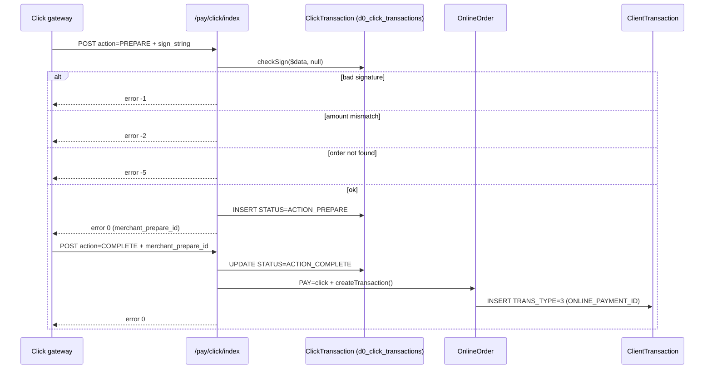
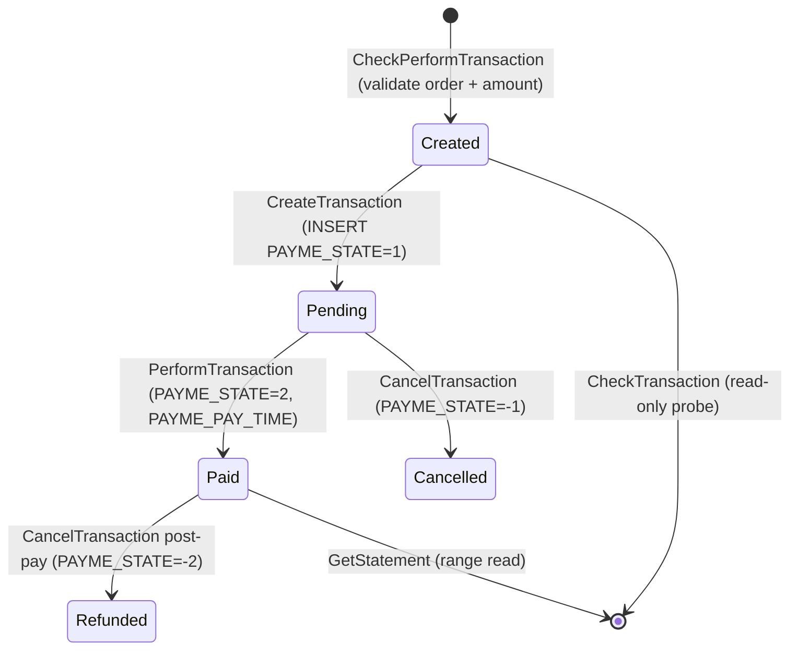
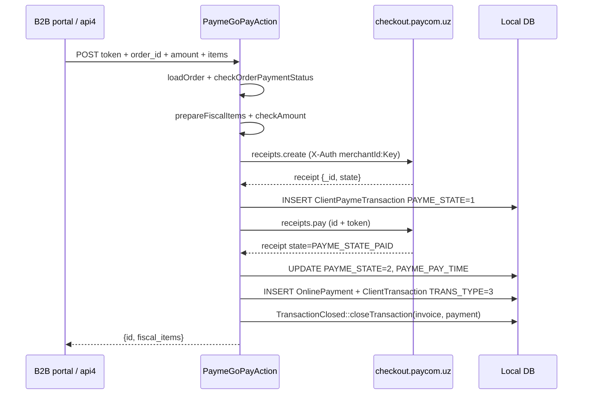

# `payment` and `pay` modules

Two related modules:

- **`pay`** — payment-gateway callback receivers for the three Uzbek
  online-payment providers (Click, Payme, Apelsin). Each controller has
  exactly one action: `index`, which is the callback endpoint the
  provider POSTs to.
- **`payment`** — cashier-side approval workflow. A single
  `ApprovalController` lets a cashier list pending `PaymentDeliver`
  records (collected by agents / expeditors in the field) and either
  confirm them — minting `ClientTransaction` rows that reduce client
  debt and credit a `Cashbox` — or reject them.

## Key features

| Feature | What it does | Owner role(s) |
|---------|--------------|---------------|
| Record payment (field) | `PaymentDeliver` row created by agent / expeditor at delivery time via api3 | 4 / 10 |
| List pending payments | Cashier opens `/payment/approval` and sees all `CONFIRM=0` rows in a date range | 6 |
| Approve payment | Cashier sets `CONFIRM=1`, creates `ClientTransaction TRANS_TYPE=3` against the order, credits a `Cashbox` | 6 / 1 / 2 |
| Edit payment (pre-approval) | Update `SUMMA`, `CURRENCY`, `COMMENT` while still pending (`editPaymentDeliver` param gate) | 6 / 1 |
| Reject / delete payment | Soft-delete a pending payment; rejection reason in `COMMENT` | 6 / 1 |
| Unlink from order | Remove the link to a wrongly-attached order without dropping the payment | 6 |
| Online-payment callbacks | Receive provider POSTs and credit the related `OnlineOrder` | system |
| Cashbox crediting | Approved payment increments the chosen `Cashbox.SUMMA` in the payment currency | system |
| Multi-currency FX | `USD_RATE` captured at approval; report and ledger run in original currency | system |
| Debt reconciliation | `ClientFinans::correct` updates `client_finans` after every approved row | system |

## Folder

```
protected/modules/payment/
└── controllers/
    └── ApprovalController.php      # 8 actions, cashier review screen

protected/modules/pay/
├── PayModule.php
├── components/                     # ClickTransaction, PaymeHelper, ApelsinHelper
├── controllers/
│   ├── ApelsinController.php       # 1 action — Apelsin callback
│   ├── ClickController.php         # 1 action — Click prepare/complete callback
│   └── PaymeController.php         # 1 action — Payme JSON-RPC endpoint
└── models/
```

## Key entities

| Entity | Model | Notes |
|--------|-------|-------|
| Cashbox | `Cashbox` (`d0_cashbox`) | Per-tenant cash register. Columns: `ID`, `NAME`, `CURRENCY`, `ACTIVE`, `KASSIR`, `SORT`, `XML_ID`. Each tenant typically has several — per store, per currency. |
| Cashbox displacement | `CashboxDisplacement` (`d0_cashbox_displacement`) | Inter-cashbox transfer (`CB_FROM` → `CB_TO`, `SUMMA`, `CURRENCY`, `STATUS`). |
| Payment record | `PaymentDeliver` (`d0_payment_deliver`) | Pending field-collected payment. PK `ID`. Key cols: `CLIENT_ID`, `ORDER_ID`, `SUMMA`, `CURRENCY`, `DATE`, `USER_ID`, `AGENT_ID`, `TRADE_ID`, `TERM`, `CONFIRM` (0/1), `COMMENT`, `APPROVED_BY`, `TYPE`. |
| Client ledger row | `ClientTransaction` (in `finans`) | Approval writes a `TRANS_TYPE=3` payment row; the matching `TRANS_TYPE=1` invoice row (written earlier by `Order::afterSave`) is updated with `COMPUTATION`. |
| Client balance | `ClientFinans` (in `finans`) | Snapshot debit/credit balance recomputed via `ClientFinans::correct` after each approved row. |
| Payment displacement | `PaymentDisplacement` | Operator-initiated move of a confirmed payment from one client to another (mis-attribution fix). |
| Payment transfer | `PaymentTransfer` | Bulk-transfer record (header). |
| Online-payment record | `OnlinePayment` (`d0_online_payments`) | Provider-callback envelope: `TRANSACTION_ID`, `SERVICE_TYPE`, `AMOUNT`, `ORDER_ID`, `CLIENT_ID`. |
| Payme transaction | `ClientPaymeTransaction` (`d0_client_payme_transactions`) | Payme JSON-RPC state machine row: `PAYME_STATE`, `PAYME_TYPE`, `PAYME_AMOUNT`, `PAYME_CREATE_TIME`, `PAYME_PAY_TIME`, `PAYME_CANCEL_TIME`. |
| Click transaction | `ClickTransaction` | Click prepare/complete state. Constants: `ACTION_PREPARE`, `ACTION_COMPLETE`, `ACTION_CANCELLED`. |

`PaymentDeliver::TYPE` constants: `TYPE_EXPEDITOR=1`, `TYPE_VANSEL=2`,
`TYPE_SELLER=3`, `TYPE_AGENT=4` — identifies which kind of field user
collected the cash.

## Controllers

| Controller | Purpose | # actions |
|------------|---------|-----------|
| `payment/ApprovalController` | Cashier approval screen — list, edit, confirm, delete, unlink | 8 |
| `pay/ApelsinController` | Apelsin payment-provider callback | 1 |
| `pay/ClickController` | Click payment-provider callback (prepare + complete) | 1 |
| `pay/PaymeController` | Payme JSON-RPC endpoint | 1 |

### `payment/ApprovalController` actions

| Action | Route | RBAC | Purpose |
|--------|-------|------|---------|
| `index` | `/payment/approval/index` | `operation.clients.paymentApproval` | Renders the cashier review page (title: "Подтверждение оплаты"). |
| `getData` | `/payment/approval/getData` | – | Returns the pending `PaymentDeliver` rows in a date range (`from`/`to`, default current month). Direct SQL against `d0_payment_deliver`. |
| `getOrders` | `/payment/approval/getOrders` | – | Given a list of payment IDs, returns the matched `ClientTransaction TRANS_TYPE=1` invoice rows so the cashier can see the original debt. |
| `getAccesses` | `/payment/approval/getAccesses` | `operation.clients.finansDelete` | Returns the per-user button-visibility flags (`delete`, `update`, `list`, `editPaymentDeliver`). |
| `updatePaymentDeliver` | `/payment/approval/updatePaymentDeliver` | – | Edits a still-pending payment's `SUMMA`, `CURRENCY`, `COMMENT`. Gated by `params.editPaymentDeliver`. |
| `save` | `/payment/approval/save` | `operation.clients.finansCreate` | The actual approval. Runs inside a DB transaction per payment: sets `CONFIRM=1`, refreshes the `TRANS_TYPE=1` invoice row, inserts a `TRANS_TYPE=3` payment row, runs `ClientFinans::correct`. |
| `delete` | `/payment/approval/delete` | `operation.clients.finansDelete` | Soft-deletes a pending payment. |
| `unlinkOrder` | `/payment/approval/unlinkOrder` | – | Clears `ORDER_ID` so the payment can be re-routed to a different order. |

`actionSave` (line 156) is the core. For each posted payment ID, it:

1. Opens a DB transaction.
2. Re-reads the `PaymentDeliver` row guarded on `CONFIRM=0` to prevent
   double-confirmation under concurrent cashier clicks.
3. Loads the matched `ClientTransaction TRANS_TYPE=1` row by
   `IDEN=ORDER_ID`. If present, calls `updateOldTransaction` to bump
   `COMPUTATION` by the new payment and, if the date crosses a closed
   period, writes a `TransactionClosed` adjustment.
4. Calls `buildTransaction` to insert a new `TRANS_TYPE=3` row with the
   same `IDEN`, the chosen `CASHBOX`, `USD_RATE`, `FIRM_ID`, and
   `CONFIRM_ID = payment_id` (uniqueness-guarded — re-runs fail at the
   `CONFIRM_ID` check).
5. Updates `client_finans` via the contragent-aware
   `ClientTransaction::correct` or the default `ClientFinans::correct`.
6. Commits, or rolls back the whole payment on any error and adds it to
   the `$failed` list returned to the UI.

## Approval flow



## Online-payment callback flow (`pay` module)

Customers paying online from the B2B portal or Telegram WebApp are
redirected to the provider. The provider then POSTs to `/pay/click`,
`/pay/payme`, or `/pay/apelsin`. Each callback shares the same shape:



Per-provider notes:

- **Click** (`ClickController::actionIndex`, line 10) implements
  Click's two-step `prepare` / `complete` handshake. Constants on
  `ClickTransaction`: `ACTION_PREPARE`, `ACTION_COMPLETE`,
  `ACTION_CANCELLED`. Signature check via
  `ClickTransaction::checkSign`. The OnlineOrder is keyed by
  `merchant_trans_id`. Negative error codes returned to Click: `-1`
  bad signature, `-2` amount mismatch, `-5` order not found, `-6`
  prepare row missing, `-9` already cancelled.
- **Payme** speaks JSON-RPC. The thin controller delegates to
  `PaymeHelper::run()` which dispatches `CheckPerformTransaction`,
  `CreateTransaction`, `PerformTransaction`, `CancelTransaction`,
  `CheckTransaction`, `GetStatement` against
  `ClientPaymeTransaction`.
- **Apelsin** is the simplest — a single POST creates a transaction
  via `ApelsinHelper::createTransaction`, marks `OnlineOrder.PAY =
  "apelsin"`, hides the Telegram inline keyboard via
  `OnlineOrder3Controller::hideMessageReplyMarkup`, and calls
  `OnlineOrder::createTransaction()` to insert the `OnlinePayment`
  row and the matching `ClientTransaction`.

## Multi-currency note

Order currency, payment currency, and Cashbox currency can all differ.
`actionSave` captures the cashier-entered `usd_rate` on the
`TRANS_TYPE=3` row at the moment of approval — that is the rate used by
downstream debt reports. Once approved, the rate is frozen on the
ledger row; later FX changes do not retro-actively re-value past
payments.

## API endpoints

| Endpoint | Module | Purpose |
|----------|--------|---------|
| `POST /api3/payment/set` | api3 (orders module) | Field agent / expeditor creates a `PaymentDeliver` row at delivery time. |
| `GET /payment/approval/getData` | payment | Cashier-side list of pending payments. |
| `POST /payment/approval/save` | payment | Cashier approval batch. |
| `POST /payment/approval/updatePaymentDeliver` | payment | Cashier edits a pending payment. |
| `POST /payment/approval/delete` | payment | Cashier rejects a pending payment. |
| `POST /pay/click/index` | pay | Click provider callback. |
| `POST /pay/payme/index` | pay | Payme JSON-RPC. |
| `POST /pay/apelsin/index` | pay | Apelsin provider callback. |

## Click web-pay flow

Customers paying online land on Click, which then POSTs to
`/pay/click/index` (controller `pay/ClickController::actionIndex`,
line 10). The action implements Click's two-step `prepare` /
`complete` handshake, verifies the HMAC signature via
`ClickTransaction::checkSign`, looks up the `OnlineOrder` by
`merchant_trans_id`, and inserts a row into `ClickTransaction`. The
final `complete` step stamps `OnlineOrder.PAY` and creates a matching
`ClientTransaction`.



## Payme web-pay flow

`pay/PaymeController::actionIndex` (line 10) is a thin adapter — it
constructs a `PaymeHelper` (under `pay/components/PaymeHelper.php`) and
calls `run()`, which switch-dispatches on `$this->request->method`
across six JSON-RPC methods. State lives on
`ClientPaymeTransaction` (`d0_client_payme_transactions`), keyed by
`PAYME_TRANSACTION_ID`.



## api4 online-payment flow

The B2B portal uses `api4/OnlinePaymentController` (in
`protected/modules/api4/controllers/OnlinePaymentController.php`),
which delegates to per-provider actions
(`PaymeGoPayAction`, `OdengiPayAction`, `OptimaPayAction`,
`KaspiPayAction`). The Payme-Go path inside `PaymeGoPayAction::run`
calls the Paycom `receipts.create` + `receipts.pay` endpoints, then in
`postprocessPayment()` inserts the `OnlinePayment`,
`ClientTransaction TRANS_TYPE=3`, and runs
`TransactionClosed::closeTransaction` against the invoice row.



## Permissions

| Action | Route | Roles (via RBAC operation) |
|--------|-------|----------------------------|
| Open approval screen | `payment/approval/index` | `operation.clients.paymentApproval` — typically 1 / 2 / 6 |
| Approve / save | `payment/approval/save` | `operation.clients.finansCreate` — 1 / 2 / 6 |
| Edit pending | `payment/approval/updatePaymentDeliver` | `editPaymentDeliver` param + role 1 / 6 |
| Delete pending | `payment/approval/delete` | `operation.clients.finansDelete` — 1 / 6 |
| Unlink order | `payment/approval/unlinkOrder` | Bundled with finans-create — 1 / 6 |
| Provider callbacks | `/pay/*/index` | Public — gateways authenticate via signed payload, not RBAC |

## Gotchas

- **`CONFIRM_ID` uniqueness on `ClientTransaction`.** `actionSave`
  asserts no existing `ClientTransaction.CONFIRM_ID = payment_id`
  before inserting. Double-clicking the approve button is harmless;
  re-running a script against the same payment fails fast.
- **Closed-period gate.** Both `actionSave` and the onlineOrder
  `PaymentController::actionCreate` run `Closed::check_update('finans',
  $date)` first. Approval against a closed accounting period redirects
  to `/settings/closed/error` instead of silently failing.
- **Cashbox is required for cash, optional for non-cash.** The cashbox
  ID is posted with the approval payload; without it, the
  `ClientTransaction.CASHBOX` is empty and the row will not appear in
  cashbox reports.
- **`pay/*` controllers authenticate as a service user.** Click logs
  in as `LOGIN=click`. The username is hard-wired; rotating it
  requires both a DB row update and a Click-side config change.
- **No RBAC on `pay/*` callbacks.** Security is the provider
  signature (`ClickTransaction::checkSign`) plus IP allowlisting at
  the nginx layer.
- **`OnlineOrder.PAY` is a free-text marker.** Apelsin writes
  `"apelsin"`; Click writes nothing on this column (state lives on
  `ClickTransaction`). Do not rely on `OnlineOrder.PAY` alone for
  provider attribution.

## See also

- [`orders`](./orders.md) — writes the matching `TRANS_TYPE=1` invoice
  row in `Order::afterSave` that this approval reconciles against.
- [`finans`](./finans.md) — the canonical client ledger that
  `ClientFinans::correct` maintains.
- [`onlineOrder`](./onlineOrder.md) — the source of `OnlineOrder` rows
  the `pay/*` callbacks target.
- [`settings-access-staff`](./settings-access-staff.md) — the
  `closed` table that gates approvals into prior accounting periods.
- [Workflow design standards](../team/workflow-design.md) — open
  improvement items: auto-approve threshold, structured rejection
  reasons, SLA timer.
