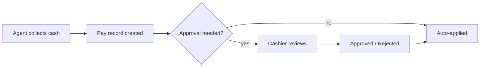
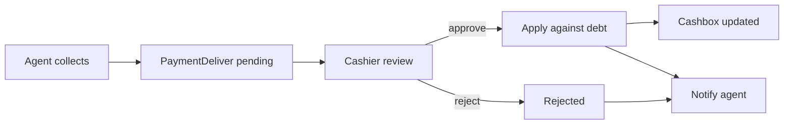

# `payment` and `pay` modules

Two related modules:

- **`pay`** — low-level payment recording (entries against orders).
- **`payment`** — approval workflow on top of `pay`.

## Approval flow

Field-collected payments need approval to apply against debt:

`payment/ApprovalController` is the cashier's review screen.

## Key feature flow — Payment collection & approval

See **Feature — Payment Collection & Approval** in the
[FigJam board](../architecture/diagrams.md).

