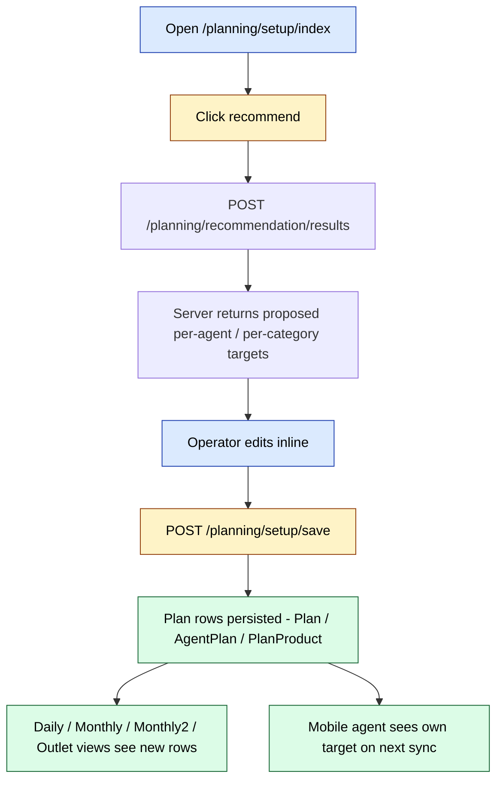
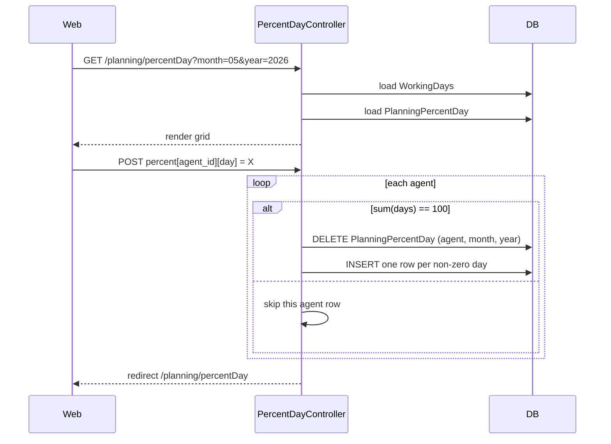

# `planning` module

`planning` owns the planning side of the CRM — the place where supervisors and
sales managers set monthly sales targets for the field force and where the
system slices those targets down to the day, outlet and product-category
level. The module is read-mostly: most of its 51 routes return JSON aggregates
that the front-end charts and tables consume.

It pairs with two siblings:

- **`stock` module · `planProduct` view** — per-product plan tracking (stock
  side).
- **`doctor` module · `outletPlan` / `outletFact`** — the pharma-vertical
  outlet planning workflow.

`planning` itself is vertical-neutral and is used by every sd-main tenant.

## Key features

| Feature | What it does | Owner role(s) |
|---------|--------------|---------------|
| **Plan setup** | Operator enters monthly per-agent or per-supervisor totals (manual or imported) | 5, 9 |
| **Monthly plan** | Read-only views of the monthly plan totals, per agent / per category | 3, 5, 9 |
| **Monthly2 plan** | Newer monthly variant with pulse savings and diagram view | 3, 5, 9 |
| **Daily plan** | Daily breakdown of the monthly plan + working-days configuration | 3, 5, 9 |
| **Outlet plan** | Per-outlet plans (with akb-total, per-category, per-agent variants) | 3, 5, 9 |
| **Percent-day** | Per-agent % distribution across working days (must sum to 100) | 5, 9 |
| **Directive** | Recommendation modal — server suggests plans based on history | 5 |
| **Recommendation API** | POST endpoint that returns recommended targets given history + categories | 5 |
| **Excel import** | Bulk plan upload via `SetupController::actionImport` | 1, 5 |

## Folder

```
protected/modules/planning/
├── controllers/
│   ├── SetupController.php          # plan creation / import / save
│   ├── MonthlyController.php        # monthly read views
│   ├── Monthly2Controller.php       # newer monthly variant
│   ├── DailyController.php          # daily read views
│   ├── OutletController.php         # per-outlet plan + facts
│   ├── PercentDayController.php     # per-agent % per working day
│   ├── DirectiveController.php      # directive recommendation partials
│   ├── RecommendationController.php # recommendation JSON API
│   ├── ApiController.php.obsolete
│   └── StoreController.php.obsolete
├── models/
└── views/
```

## Key entities

| Entity | Model | Notes |
|--------|-------|-------|
| Plan | `Plan` | Monthly per-agent plan row |
| Plan product | `PlanProduct` | Per-product plan row (consumed by `stock/planProduct`) |
| Agent plan | `AgentPlan` | Monthly per-agent plan total |
| Outlet plan | `OutletPlan` | Per-outlet, per-month plan row |
| Outlet fact | `OutletFact` | Per-outlet, per-month captured fact |
| PercentDay | `PlanningPercentDay` | Per-agent % share by working day |
| WorkingDays | `WorkingDays` | Configurable working-day list per (month, year) |
| AKB / SKU / Coverage targets | `TargetAkb`, `TargetSku`, `TargetCoverage` | Cross-read from the `doctor` module's setup |

## Controllers

| Controller | Purpose | # actions |
|------------|---------|-----------|
| `SetupController` | Plan setup — index / agent / agentCategory / total / save / import | 6 |
| `MonthlyController` | Monthly read views — index, agent, total, workingDays | 6 |
| `Monthly2Controller` | Newer monthly — adds diagram, productCategory, pulse | 9 |
| `DailyController` | Daily read views — adds percent action | 7 |
| `OutletController` | Outlet plan + setup — 13 actions, the biggest controller in the module | 13 |
| `PercentDayController` | % per working day per agent | 1 |
| `DirectiveController` | Renders 6 directive partial views | 6 |
| `RecommendationController` | POST recommendations + product categories + history | 3 |

Top routes:

| Route | RBAC | Render | Purpose |
|-------|------|--------|---------|
| `/planning/setup/index` | `operation.planning.setup` | `index` | Plan setup grid |
| `/planning/setup/save` | – | – | Persist a draft plan |
| `/planning/setup/import` | – | – | Excel import |
| `/planning/setup/agent` | – | json | Per-agent plan rows |
| `/planning/setup/total` | – | json | Plan totals |
| `/planning/monthly/index` | – | `index` | Monthly plan dashboard |
| `/planning/monthly/agent` | – | json | Per-agent monthly aggregate |
| `/planning/monthly2/index` | – | `index` | Newer monthly dashboard |
| `/planning/monthly2/diagram` | – | json | Charting data |
| `/planning/monthly2/pulseSave` | – | – | Save pulse modification |
| `/planning/daily/index` | – | `index` | Daily plan dashboard |
| `/planning/daily/agent` | – | json | Per-agent daily aggregate |
| `/planning/daily/workingDays` | – | json | Working-day flags |
| `/planning/outlet/index` | `operation.planning.outlet` | `index` | Outlet plan grid |
| `/planning/outlet/setup` | `operation.planning.outlet` | `setup` | Outlet plan setup |
| `/planning/outlet/save` | – | – | Persist outlet plan |
| `/planning/outlet/data` | – | json | Outlet plan / fact rows |
| `/planning/percentDay/index` | – | `index` | % per working day editor |
| `/planning/directive/directiveModal` | – | partial | Directive modal |
| `/planning/recommendation/results` | – | json | Recommend (POST) |

## Plan setup → recommend → publish



## Percent-day editor

`PercentDayController::actionIndex` is the only action in its controller and
handles both GET (renders the editor) and POST (saves). The validation rule
is strict: each agent's day percentages must sum to 100, otherwise the entire
agent row is skipped.



## Outlet plan / fact

`OutletController` is the largest controller — it covers outlet planning,
fact capture, and the AKB-total breakdown for both. It overlaps with the
`doctor.outletPlan` / `doctor.outletFact` controllers; the planning-module
copy is the vertical-neutral one used by FMCG tenants.

```mermaid
flowchart LR
  SETUP[POST /planning/outlet/setup] --> SAVE[POST /planning/outlet/save]
  SAVE --> OP[(OutletPlan)]
  OP --> DATA[/planning/outlet/data: JSON for grid]
  DATA --> AGENT[/planning/outlet/agent: per-agent slice]
  DATA --> CAT[/planning/outlet/agentCategory: per-category slice]
  DATA --> TOTAL[/planning/outlet/total: total slice]
  AKB[/planning/outlet/agentAkbTotal] --> DATA

  classDef action   fill:#dbeafe,stroke:#1e40af,color:#000
  classDef success  fill:#dcfce7,stroke:#166534,color:#000

  class SETUP,SAVE action
  class OP,DATA,AGENT,CAT,TOTAL,AKB success
```

## Directive / Recommendation

The `directive` family is a UI-side composition of partial views — the
client opens a modal that calls each `actionDirective*` to fetch a fragment
(filters, store, clients, preloader, recommendation, modal). The actual
recommendation lives in `RecommendationController::actionResults`.

`actionResults` is POST-only and requires `year`, `month`, `history` and
`categories` in the body. It returns 405 / 400 on bad input. The
recommendation logic is implemented by the `Recommendation` model class
(outside this module).

## Cross-module touchpoints

- **Reads:** `clients.Client` (outlet list), `agents.Agent`, `stock.PlanProduct`.
- **Writes:** `Plan`, `AgentPlan`, `OutletPlan`, `OutletFact`, `PlanningPercentDay`.
- **Reads from doctor module:** target tables (`TargetAkb`, `TargetSku`,
  `TargetCoverage`) — pharma tenants use the doctor-side setup screens but
  the planning views render the resulting numbers.
- **Reads by report module:** plan-vs-fact pivots in `report` consume these
  same rows.
- **Reads by mobile:** `api3` exposes the agent's own plan via the sync
  endpoints — see [`sync`](./sync.md).

## Permissions

| Route | RBAC operation |
|-------|----------------|
| `/planning/setup/index` | `operation.planning.setup` |
| `/planning/outlet/index` | `operation.planning.outlet` |
| `/planning/outlet/setup` | `operation.planning.outlet` |
| _everything else_ | inherited from the controller's `accessRules` — typically roles 3 (operator), 5 (supervisor) and 9 (warehouse) |

`RecommendationController::actionResults` is POST-only and returns 405 /
400 / 200 with raw JSON; it does not gate on RBAC explicitly (the gate
happens at the upstream page render).

## Harvested pages

| URL | Notes |
|-----|-------|
| `/planning` | Module landing (redirects to a default action) |
| `/planning/monthly2` | Newer monthly dashboard — 25 toolbar buttons captured |
| `/planning/outlet` | Outlet plan grid — 18 buttons including setup, save, recommend |

Each harvested page captured a non-trivial action bar (15+ buttons each),
indicating the planning module's UI surface is button-heavy and dashboard-
centric rather than form-heavy.

## Gotchas

- **`ApiController.php.obsolete` and `StoreController.php.obsolete`.** The
  `.obsolete` suffix removes the file from Yii's class autoloader. Do not
  rename these back without auditing — both expose stale plan-write
  endpoints.
- **`Monthly2Controller` is the active monthly.** `MonthlyController` is
  kept for tenants on the legacy theme; new features should land in
  `Monthly2Controller`.
- **PercentDay rejects partial rows silently.** If an operator's day
  percentages don't sum to 100, the controller skips the agent's row
  without surfacing an error. UI must validate client-side before posting.
- **Outlet plan exists in two places.** `planning/outlet` is the FMCG
  variant; `doctor/outletPlan` is the pharma variant. They write to the
  same `OutletPlan` table — tenants should pick one as the canonical
  entry point.
- **`Helper::ParseGet` / `Helper::ParsePost` everywhere.** Most read actions
  feed `Helper::ParseGet()` straight into model scopes. Be careful when
  adding a new GET parameter — it will be passed to SQL builders.

## See also

- [`stock`](./stock.md) — `planProduct` view sits on the product side
- [`doctor`](./doctor.md) — pharma-vertical plan setup + facts
- [`report`](./report.md) — plan-vs-fact pivots
- [`sync`](./sync.md) — agent's own plan is served via api3
- [`agents`](./agents.md) — agent master data drives every plan row
