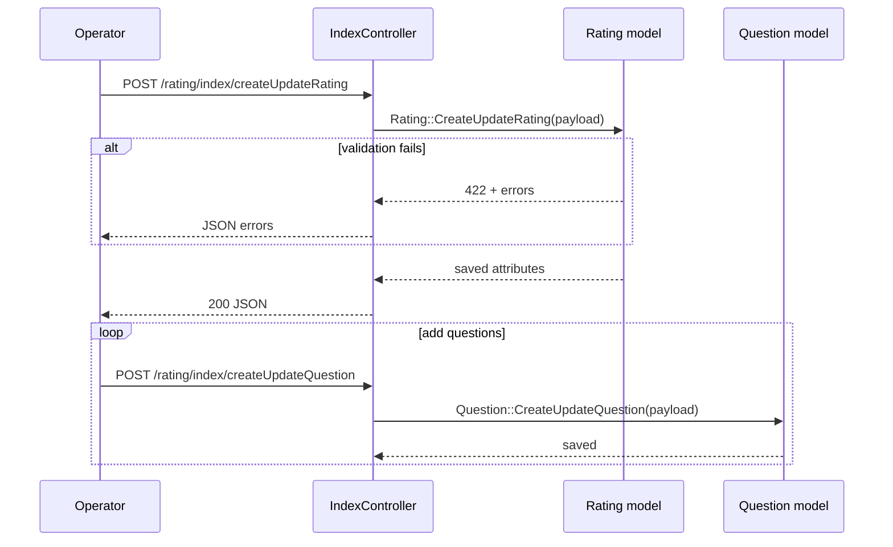
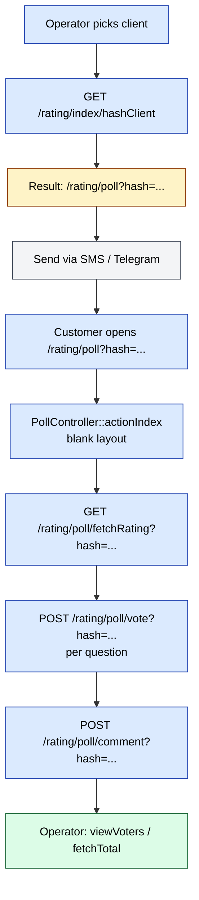

# `rating` module

`rating` lets the back office build a **questionnaire** of one or more
questions, generate a **hashed public-poll URL** per client, collect
**votes + comments** through that URL, and view **per-client** and
**aggregate** results.

In practice it is used as a lightweight in-house **NPS / CSAT** tool
on top of the existing client base — the marketing operator selects a
client, copies the hashed `/rating/poll?hash=…` link, sends it to the
end customer (SMS / Telegram), and watches results stream in.

## Key features

| Feature | What it does | Owner role(s) |
|---------|--------------|---------------|
| **Rating questionnaire CRUD** | Create / update / delete rating questionnaires | 1 / 2 |
| **Question CRUD** | Add / edit / delete questions inside a questionnaire | 1 / 2 |
| **Per-client hashing** | Mint a per-client hashed URL so each respondent is identifiable but the URL is not guessable | 1 / 2 |
| **Public poll page** | `/rating/poll?hash=…` — vote + comment without a login | end-customer (no auth) |
| **Vote** | Record a per-question answer per hashed client | system |
| **Comment** | Free-text comment alongside the vote | end-customer |
| **Client list** | Drill into the per-client rating sheet | 1 / 2 / 8 |
| **Aggregate views** | `fetchRating`, `fetchRatingAll`, `fetchTotal` cross-cut by client | 1 / 2 / 8 |
| **Voter list** | View who voted for a given rating | 1 / 2 / 8 |

## Folder

```
protected/modules/rating/
├── RatingModule.php          # defaultController = index; registers ng-table assets
├── assets/                   # AngularJS app — angular, lodash, ng-table,
│                             # nya-bootstrap-select, controller.* + factory.*
├── controllers/
│   ├── IndexController.php       # /rating — back-office shell + 11 actions
│   ├── PollController.php        # /rating/poll — public hashed-link voting
│   ├── ClientController.php      # /rating/client — per-client drilldown
│   └── DirectiveController.php   # /rating/directive — Angular partials
├── models/
│   ├── Rating.php            # AR — d0_rating (questionnaire header)
│   ├── Question.php          # questionnaire question
│   ├── Clients.php           # rating × client join
│   ├── Result.php            # voter / result records
│   ├── Comment.php           # free-text comments
│   └── Helper.php            # module-local GET/POST parser
└── views/
```

## Key entities

| Entity | Model | Notes |
|--------|-------|-------|
| Rating (questionnaire header) | `Rating` (`{{rating}}`) | Cols: `ID`, `NAME`, `CONTENT`, `CREATED_AT`, `UPDATED_AT`, `CREATED_BY`, `UPDATED_BY`. |
| Question | `Question` | Belongs to a Rating. Owns answer variants. |
| Question (legacy / shared) | `Questions` (`d0_questions`) | Older table — `QUESTION_ID`, `QUESTION`, `QUESTION_TYPE`, `ANSWER_TYPE`, `MULTIPLE`, etc. May be referenced by `rating` flows. |
| Question variant | `QuestionVariants` (`d0_question_variants`) | Multiple-choice options. |
| Question result | `QuestionResult` (`d0_question_result`) | One row per submitted answer — `QUESTION_ID`, `ANSWER_ID`, `RESULT`, `USER_ID`, `AGENT_ID`. |
| Rating × client | `Clients` (module model) | Pivot — which clients are scoped into a rating. |
| Voter / result | `Result` | Joined voter list view. |
| Comment | `Comment` | Free-text comments attached to a vote. |

[TBD — confirm physical table names for `Question`, `Clients`,
`Result`, `Comment` (the module's AR classes shadow the more common
`PollQuestion` / `PollResult` tables in `schema-extract.json`).]

## Controllers

| Controller | Actions (n) | Purpose |
|------------|-------------|---------|
| `IndexController` | 11 | Back-office shell + questionnaire / question CRUD + client hashing + voter view |
| `PollController` | 4 | Public hashed-link poll (`index`, `fetchRating`, `vote`, `comment`) — uses blank layout |
| `ClientController` | 5 | Per-client drilldown (`index`, `fetchClient`, `fetchRating`, `fetchRatingAll`, `fetchTotal`) |
| `DirectiveController` | 3 | Angular template fetch (`directiveModal`, `directivePreloader`, `directiveRating`) |

### Actions table

| Route | Method | Returns | Notes |
|-------|--------|---------|-------|
| `GET /rating/index/index` | GET | HTML | Back-office shell |
| `POST /rating/index/createUpdateRating` | POST | JSON | Upsert questionnaire |
| `POST /rating/index/deleteRating` | POST | JSON | Delete questionnaire |
| `POST /rating/index/createUpdateQuestion` | POST | JSON | Upsert question |
| `POST /rating/index/deleteQuestion` | POST | JSON | Delete question |
| `GET /rating/index/data` | GET | JSON | Returns `[]` — placeholder feed |
| `GET /rating/index/fetchRating` | GET | JSON | List questionnaires |
| `GET /rating/index/fetchClient` | GET | JSON | List clients for a questionnaire |
| `GET /rating/index/hashClient` | GET | URL | Mint hashed poll URL for one client |
| `GET /rating/index/unHashClient` | GET | JSON | Reverse-lookup a hash to a client |
| `GET /rating/index/viewVoters` | GET | JSON | Voter list for a rating |
| `GET /rating/poll/index?hash=…` | GET | HTML | **Public** poll page (blank layout) |
| `GET /rating/poll/fetchRating?hash=…` | GET | JSON | Single-rating fetch for the public page |
| `POST /rating/poll/vote?hash=…` | POST | JSON | Submit a vote |
| `POST /rating/poll/comment?hash=…` | POST | JSON | Submit a comment |
| `GET /rating/client/index` | GET | HTML | Per-client drilldown shell |
| `GET /rating/client/fetchClient` | GET | JSON | Paged client list (`items`, `total`) |
| `GET /rating/client/fetchRating` | GET | JSON | Per-client rating sheet |
| `GET /rating/client/fetchRatingAll` | GET | JSON | All ratings, cross-client |
| `GET /rating/client/fetchTotal` | GET | JSON | Aggregate counters |
| `GET /rating/directive/directiveModal` | GET | HTML | Angular template — modal |
| `GET /rating/directive/directivePreloader` | GET | HTML | Angular template — preloader |
| `GET /rating/directive/directiveRating` | GET | HTML | Angular template — rating widget |

## Rating publish & vote flow

```mermaid
flowchart LR
  OP[Marketing operator]:::action
  R[Create/update rating<br/>+ questions]:::action
  HC[Mint hashed URL<br/>per client]:::approval
  SMS["Send link via<br/>SMS / Telegram"]:::external
  EC[End customer]:::external
  POLL["/rating/poll?hash=..."]:::action
  V[Vote + comment]:::action
  AGG[Aggregate views<br/>fetchRating / fetchTotal]:::success

  OP --> R --> HC --> SMS --> EC --> POLL --> V --> AGG

  classDef action   fill:#dbeafe,stroke:#1e40af,color:#000
  classDef approval fill:#fef3c7,stroke:#92400e,color:#000
  classDef success  fill:#dcfce7,stroke:#166534,color:#000
  classDef reject   fill:#fee2e2,stroke:#991b1b,color:#000
  classDef external fill:#f3f4f6,stroke:#374151,color:#000
  classDef cron     fill:#ede9fe,stroke:#6d28d9,color:#000
```



## API endpoints

This module's "API" is its own JSON endpoints — there is **no
`api3` mobile mirror**. The public poll URL is the only un-authed
surface.

| Endpoint | Auth | Purpose |
|----------|------|---------|
| `GET /rating/index/hashClient?CLIENT_ID=…&RATING_ID=…` | Yes | Returns a normalised URL `/rating/poll?hash=…` |
| `GET /rating/poll/index?hash=…` | **No** | Public poll page |
| `POST /rating/poll/vote?hash=…` | **No** | Submit vote |
| `POST /rating/poll/comment?hash=…` | **No** | Submit comment |

Both `vote` and `comment` short-circuit (`return false`) if `hash`
is missing — see `PollController` source.

## Permissions

The harvested routes carry **no `rbac` field** — none of the
controllers in this module set `H::access(...)` explicitly. Effective
gating today is:

| Surface | Gate |
|---------|------|
| `/rating` back-office (Index / Client / Directive) | App-wide login session — extends `Controller`, so the usual login redirect applies |
| `/rating/poll` (public) | **None** — extends `CController`, blank layout, no auth |

| Role | Likely access | Notes |
|------|---------------|-------|
| 1 (admin) | Full | Configure ratings, hash clients, view voters |
| 2 (manager) | Full | Same |
| 4 (agent) | Read-only via back-office | TBD — confirm with `access` module |
| End customer | Public poll only | Unauthenticated hashed link |

[TBD — recommend an `operation.rating.*` permission set if this
module is to be exposed selectively; today, anyone with a session
can mutate ratings via `IndexController`.]

## See also

- [`clients`](./clients.md) — the client list this module rates
- [`audit-adt`](./audit-adt.md) — a separate poll/question family for
  in-field merchandising audits (do not confuse `Question` /
  `Result` here with `AdtPollQuestion` / `AdtPollResult`)
- [`sms`](./sms.md) — used to deliver the hashed poll URL
- [`integrations/telegram`](../integrations/telegram.md) — alternate
  delivery channel for the hashed URL

## Workflows

### Entry points

| Trigger | Controller / Action | Notes |
|---|---|---|
| Web — open rating admin | `IndexController::actionIndex` | `/rating` (default) |
| Web — create / update rating | `IndexController::actionCreateUpdateRating` | POST JSON; routes through `Rating::CreateUpdateRating` |
| Web — create / update question | `IndexController::actionCreateUpdateQuestion` | POST JSON; `Question::CreateUpdateQuestion` |
| Web — mint hashed URL | `IndexController::actionHashClient` | Returns normalised `/rating/poll?hash=…` |
| Web — voter list | `IndexController::actionViewVoters` | JSON of `Result::ViewVoters` |
| Web — client drilldown | `ClientController::actionIndex` and 4 fetch actions | `/rating/client` |
| Public — open poll | `PollController::actionIndex` | Blank layout; `/rating/poll?hash=…` |
| Public — vote | `PollController::actionVote` | Requires `hash` in GET |
| Public — comment | `PollController::actionComment` | Requires `hash` in GET |

---

### Workflow RATING.1 — Build a rating



---

### Workflow RATING.2 — Publish hashed URL and collect votes



---

### Cross-module touchpoints

- Reads: `clients.Client` (client list, hashing target)
- Writes: `{{rating}}` (Rating header)
- Writes: `Question` / `QuestionVariants` / `QuestionResult` (or
  module-local equivalents — see TBD above)
- Writes: `Comment` (free-text comments)
- Outbound: SMS or Telegram delivery of the hashed URL — happens
  outside this module (`sms`, `integrations/telegram`)

---

### Gotchas

- **`/rating/poll` is public.** `PollController` extends `CController`
  (not the app `Controller`), uses `//layouts/blank`, and is **not
  behind login**. The only guard is the hash. Treat the hash as a
  credential — do not log it, do not include it in error pages.
- **`vote` and `comment` `return false` silently.** When `hash` is
  missing, the action returns `false` without an HTTP error code.
  External tooling that pings these URLs as a health-check will see
  a 200 with an empty body.
- **No `H::access` gates on back-office actions.** Anyone with a
  valid app session can call `createUpdateRating` /
  `deleteRating` / `createUpdateQuestion` / `deleteQuestion`.
  Wrap behind RBAC if multi-tenant exposure is a concern.
- **`Question` vs `Questions` vs `AdtPollQuestion`.** Three
  similarly-named tables exist across modules. `rating` uses its own
  `Question` AR; `audit-adt` uses `AdtPollQuestion`; older code uses
  `Questions` (plural). Always trace via the model class, not the
  column name.
- **`actionData` returns `[]`.** `IndexController::actionData` is a
  placeholder (`echo json_encode([])`). Do not rely on it.
- **Helper is module-local.** `rating/models/Helper.php` is the
  GET/POST parser for this module — not the global `H::`.
