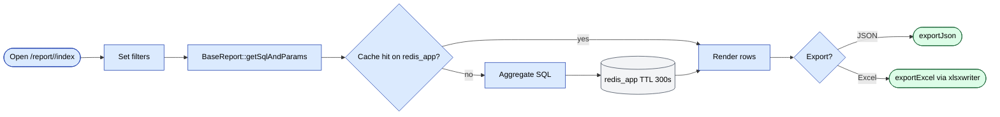

# `report` module

The single largest module — **187 routes across 40 active
controllers**. Each report is its own controller returning HTML +
Excel + JSON, with shared aggregation patterns provided by
`BaseReport` (`protected/components/BaseReport.php`).

## Key features

| Feature | What it does | Owner role(s) |
|---------|--------------|---------------|
| 40+ named reports | Sales, debt, defects, KPI, audits, GPS, bonuses, RFM, photo audits, visits, etc. | 1 / 2 / 8 / 9 |
| Pivot / template reports | `ReportBuilder`, `RfmController`, `SaleDetailNew`, `DiscountDetail` save user-defined pivots | 1 / 9 |
| Saved templates | Save filter combinations and pivot configurations as named templates per user | 1 / 9 |
| Excel export | Stream large datasets via `xlsxwriter` (preferred) or PHPExcel with consistent number formats | 1 / 2 / 9 |
| JSON export | Paginated + non-paginated JSON for embedding in other dashboards | 1 / 9 |
| Per-report RBAC | Each report controlled by an `operation.reports.*` RBAC node | 1 |
| Drill-down | Click a row → detail report on the same entity (e.g. `clientList` → `monthly`) | 1 / 9 |
| Scheduled digests | Telegram-pushed periodic digests via the `inout-report` bot family | system |

## Folder

```
protected/modules/report/
└── controllers/
    ├── AgentController.php                 # Agent / salesperson rollups (12 actions)
    ├── AnalyzeController.php               # Cross-cutting analyses (2)
    ├── BonusController.php                 # Promotional bonus reports (2)
    ├── BonusAccumulationController.php     # Bonus retro / accrual (1)
    ├── BonusReportController.php           # Bonus distribution view (2)
    ├── ClientController.php                # Client classification (3)
    ├── CustomerController.php              # Sales-by-customer (16) — largest family
    ├── DefectController.php                # Defects & quality (9)
    ├── DiscountDetailController.php        # Discount detail pivot (5)
    ├── ExpeditorController.php             # Expeditor overview (1)
    ├── ExpeditorDailyReportController.php  # Daily expeditor log (9)
    ├── ExpeditorDebtController.php         # Expeditor cash-in-hand (2)
    ├── ExpeditorDefectController.php       # Expeditor defect rate (5)
    ├── ExpeditorReportController.php       # Expeditor productivity (6)
    ├── ExportController.php                # Generic Excel/JSON export (17)
    ├── FeedbackReportController.php        # Telegram feedback survey (6)
    ├── OrdersReportController.php          # Order summary (2)
    ├── ParentPhotoReportController.php     # Parent-product photo audit (1)
    ├── PhotoReportController.php           # Photo-audit results (6)
    ├── PlanExpeditorController.php         # Expeditor plan execution (3)
    ├── PriceController.php                 # Price-list compliance (2)
    ├── ProductPriceMarkupController.php    # Per-product markup (3)
    ├── RealBonusController.php             # Actual paid bonus (1)
    ├── RejectController.php                # Order rejection analysis (7)
    ├── ReportBuilderController.php         # Generic pivot builder (5)
    ├── ReportController.php                # Default catch-all (4)
    ├── ReportVisitController.php           # Auditor-reviewed visits (2)
    ├── RfmController.php                   # RFM segmentation (5)
    ├── RlpReportController.php             # RLP coverage (2)
    ├── SaleDetailController.php            # Sale detail v1 (6)
    ├── SaleDetailNewController.php         # Sale detail v2 — pivot (9)
    ├── TasksController.php                 # Agent tasks (3)
    ├── TasksReportController.php           # Agent tasks rollup (4)
    ├── TelegramController.php              # Telegram-pushed reports (2)
    ├── VanselDailyReportController.php     # Van-sales daily log (7)
    ├── VisitController.php                 # Visit history (6)
    ├── VisitingHistoryController.php       # Visit edits audit (2)
    ├── VolumeReportController.php          # Volumetric sales (5)
    └── WorkingTimeController.php           # Visit duration / time-on-route (2)
```

Plus ~14 `.obsolete` controllers (`AgentExcel`, `AllProducts`,
`SaleController`, `Discount`, `Strike`, `Neakb`, `StockExp`,
`DefaultController`, etc.) that should not be referenced from new
code — kept on disk for archive lookups only.

## Report families

| Family | Representative controllers | What they answer |
|--------|---------------------------|------------------|
| **Customer / sales** | `CustomerController`, `SaleDetailController`, `SaleDetailNewController`, `VolumeReportController`, `OrdersReportController` | "Who bought what, for how much, when?" — by client / by product / by month, with AKB and minimum-order pivots. |
| **Agent KPI** | `AgentController`, `WorkingTimeController`, `PlanExpeditorController`, `TasksReportController` | Agent salary, plan attainment, visit duration, task completion. |
| **Expeditor (delivery)** | `ExpeditorController`, `ExpeditorDailyReportController`, `ExpeditorReportController`, `VanselDailyReportController` | Delivery success rate, daily van-sales log, productivity. |
| **Debt** | `ExpeditorDebtController`, `RealBonusController` | Cash-in-hand and outstanding-debt rollups by expeditor. |
| **Defect / quality** | `DefectController`, `ExpeditorDefectController`, `RejectController` | Partial-defect rate, full-rejection reasons, expeditor defect attribution. |
| **Audit / visit** | `VisitController`, `VisitingHistoryController`, `ReportVisitController`, `PhotoReportController`, `ParentPhotoReportController` | Visit-result audit, photo merchandising survey, visit-edit forensics. |
| **Classification / segmentation** | `ClientController` (classification), `RfmController`, `RlpReportController` | Client tier, RFM segments, route-line-plan coverage. |
| **Bonus / loyalty** | `BonusController`, `BonusAccumulationController`, `BonusReportController` | Promo bonus distribution, accrual ledger, payout verification. |
| **Pricing** | `PriceController`, `ProductPriceMarkupController`, `DiscountDetailController` | Price compliance vs price-type list, per-product markup, discount detail pivot. |
| **Telegram / feedback** | `TelegramController`, `FeedbackReportController` | Telegram digest configuration, survey results. |
| **Generic** | `ExportController`, `ReportBuilderController`, `AnalyzeController` | Cross-cutting Excel/JSON export, pivot builder, ad-hoc analyses. |

### Selected report routes

| Route | Title (`pageTitle`) | RBAC |
|-------|---------------------|------|
| `/report/agent/index` | "Отчет: Заказы по агентам" | `operation.reports.agent` |
| `/report/agent/salary` | "Отчет: Заказы по агентам" | `operation.reports.agent` |
| `/report/agent/prodGroup` | "Отчет: по группа товаров" | `operation.reports.agent` |
| `/report/customer/index` | "Отчет: Продажи по клиентам" | `operation.reports.customer` |
| `/report/customer/clientList` | "Отчет: Продажи по клиентам" | `operation.reports.customer` |
| `/report/customer/minimum` | "Отчет: Продажи по клиентам" | `operation.reports.minimum` |
| `/report/customer/monthly` | "Отчет: Продажи по клиентам" | `operation.reports.customer` |
| `/report/client/classification` | "Отчет: Классификация торговых точек" | `operation.reports.classification` |
| `/report/rfm/index` | – | `operation.reports.classificationRFM` |
| `/report/expeditorDebt/index` | "Долги по экспедиторам" | `operation.reports.expeditorDebt` |
| `/report/workingTime/index` | "Отчет: Итоги визитов" | `operation.reports.workingTime` |
| `/report/visitingHistory/getData` | "История изменения визитов" | – |
| `/report/photoReport/index` | – | `operation.reports.photoReport` |
| `/report/reportVisit/auditor` | – (harvested live) | `operation.reports.reportVisit` |
| `/report/defect/index` | – | `operation.reports.report` |
| `/report/reject/index` | – | `operation.reports.report` |
| `/report/discountDetail/index` | – | `operation.reports.discountDetail` |
| `/report/volumeReport/index` | – | `operation.reports.volumeReport` |
| `/report/expeditorReport/index` | – | `operation.reports.expeditorReport` |
| `/report/bonusAccumulation/index` | – | `operation.reports.bonusAccumulation` |
| `/report/bonusReport/index` | – | `operation.reports.bonusReport` |
| `/report/rlpReport/index` | – | `operation.reports.rlpReport` |

## Common parameters

Almost every report accepts the same filter envelope (read from
`$_GET` / `$_POST`):

| Param | Default | Notes |
|-------|---------|-------|
| `dateFrom` / `dateTo` | first-of-month / today | Inclusive date range. `BaseReport` callers normalise to `YYYY-MM-DD HH:MM:SS`. |
| `agent` / `agent_id` | – | Filter to one agent (`Agent.AGENT_ID`). |
| `territory` / `region` | – | Trade-direction or geo filter. |
| `client` / `client_id` | – | Filter to a single client. |
| `store` / `store_id` | – | Filter by warehouse / outlet store. |
| `priceType` | – | Restrict to one price list. |
| `productCat` / `product` | – | Category / SKU filter. |
| `sort` | – | Column name from `getColumns()`. |
| `order` | `DESC` | `ASC` or `DESC`; only `ASC` is honoured, anything else is treated as `DESC`. |
| `page` / `limit` | 1 / 20 | Pagination for `exportJsonPaginated`. |
| `format` | `html` | One of `html`, `json`, `excel`. |

## Authoring a report — `BaseReport` pattern

Every new report subclasses `BaseReport`
(`protected/components/BaseReport.php`) and implements two abstract
methods:

```php
abstract protected function getSqlAndParams($params); // returns [sql, binds]
abstract protected function getColumns();             // returns name => label map
```

`BaseReport` provides three public entry points the controller
delegates to:

- `exportJson($params)` — runs the SQL once, applies user-chosen
  sort, returns `{status, count, data}`.
- `exportJsonPaginated($params)` — wraps the same SQL in
  `SELECT COUNT(*) FROM (...) as count_table`, paginates with
  `LIMIT/OFFSET`, returns `{meta:{current_page, per_page,
  total_count, page_count}, data}`.
- `exportExcel($params, $filename)` — streams via the
  `application.vendors.xlsxwriter.class.php` library (preferred over
  PHPExcel for memory-bounded streaming).
  `set_time_limit(0)` and `ini_set('memory_limit', '512M')` are set
  before opening the workbook.

Sort safety: `applySorting()` only honours sort columns whose key
appears in `getColumns()`, blocking SQL-injection through the `sort`
param.

To wire a new report in:

1. Create a controller `protected/modules/report/controllers/<Name>Controller.php`.
2. Add `actionIndex` for the HTML view and call `H::access('operation.reports.<key>')`.
3. Add `actionData` (or similar) that instantiates a `BaseReport`
   subclass and calls `exportJson()`.
4. Add `actionExcel` calling `exportExcel()`.
5. Register an `operation.reports.<key>` RBAC node and add a sidebar
   entry in the report nav config.

## Excel export pipeline

Two libraries coexist:

- **`xlsxwriter`** (preferred, used by `BaseReport::exportExcel`) —
  streaming writer, low memory footprint, fastest path for the
  largest reports. Number formats per column are set via
  `xlsxwriter`'s native format strings.
- **PHPExcel** (legacy, still used by some controllers like
  `BuyController::actionExportExcel`) — full DOM workbook, only
  suitable for smaller exports.

Convention for number formatting lives in `params.excelFormat`:

```php
'excelFormat' => [
    'count'  => 1, // formatted with thin space
    'volume' => 0, // raw float
    'summa'  => 2, // currency style ("$1,234.00")
],
```

The `StyleExcel` component in `protected/components/StyleExcel.php`
centralises header / total-row styles when PHPExcel is in use.

## Key feature flow — Report run

See **Feature · Report Run & Excel Export** in
[FigJam · sd-main · Feature Flows](https://www.figma.com/board/MyvyaeEluqvHofH4E2qIoU).



## Permissions

RBAC nodes are bound to operations of shape `operation.reports.<key>`.
Mapped to default roles:

| Operation | Roles |
|-----------|-------|
| `operation.reports.agent` | 1 / 2 / 5 |
| `operation.reports.customer` | 1 / 2 / 5 / 9 |
| `operation.reports.minimum` | 1 / 2 |
| `operation.reports.classification` | 1 / 2 |
| `operation.reports.classificationRFM` | 1 / 2 |
| `operation.reports.expeditor` / `expeditorReport` / `expeditorDebt` / `expeditorDefect` | 1 / 2 / 10 |
| `operation.reports.workingTime` | 1 / 2 / 5 |
| `operation.reports.photoReport` | 1 / 2 / 8 |
| `operation.reports.report` (generic) | 1 / 2 |
| `operation.reports.bonusReport` / `bonusReportDetail` / `bonusAccumulation` | 1 / 2 |
| `operation.reports.discountDetail` / `markupReport` / `price` | 1 / 2 |
| `operation.reports.reportVisit` | 1 / 2 / 8 (auditor) |
| `operation.reports.telegram` | 1 / 2 |
| `operation.reports.volumeReport` / `rlpReport` / `analyze` / `planExpeditor` / `tg.feedbackReport` | 1 / 2 / 5 |

Each operation is granted per role in the RBAC seed; see
[`settings-access-staff`](./settings-access-staff.md) for the canonical
mapping table.

## Gotchas

- **Sort whitelist comes from `getColumns()`.** A column the SQL
  selects but is not in `getColumns()` cannot be a `sort` target.
  Missing entries cause silent fall-back to default order — confusing
  when QA "tests sort by X" and nothing changes.
- **`exportJsonPaginated` re-runs the SQL twice.** Once wrapped in
  `COUNT(*)`, once with `LIMIT/OFFSET`. Reports with heavy joins
  benefit from pushing aggregation into a temp table; do not
  paginate raw `SELECT *` against a billion-row table.
- **`xlsxwriter` vs `PHPExcel` choice is per-controller.** New
  reports should use `xlsxwriter`. The legacy `PHPExcel` path can
  OOM on >50k-row exports.
- **`.obsolete` files still parse but should not be edited.** They
  are excluded from RBAC seeding; routes pointing at them 404.
- **`H::access('operation.reports.<key>')` in `actionIndex` only.**
  Some controllers forget the gate on `actionData` / `actionExcel`.
  Verify each export endpoint independently — the URL is otherwise
  unprotected.

## See also

- [`settings-access-staff`](./settings-access-staff.md) — RBAC node
  mapping for every `operation.reports.*` key.
- [`orders`](./orders.md) — most sales reports aggregate over
  `Order` + `OrderDetail`.
- [`finans`](./finans.md) — debt reports aggregate
  `ClientTransaction` / `ClientFinans`.
- [`audit-adt`](./audit-adt.md) — photo-audit and `AFacing` data feeds the
  photo / merchandising reports.
- [`gps`](./gps.md) — coverage and route reports read GPS tracks.
