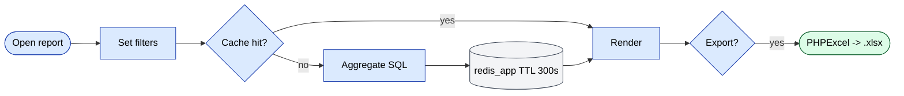

# `report` module

The single largest module (80+ reports). Each report is its own
controller returning HTML + Excel.

## Key features

| Feature | What it does | Owner role(s) |
|---------|--------------|---------------|
| 80+ named reports | Sales, debt, defects, KPI, audits, GPS, bonuses, etc. | 1 / 2 / 8 / 9 |
| Saved filter presets | Save filter combinations as named presets | 1 / 9 |
| Excel export | Stream large datasets via PHPExcel with consistent number formats | 1 / 2 / 9 |
| Cached aggregates | Heavy SQL cached in `redis_app` 5 min | system |
| Sub-report drill-down | Click a row → detail report on the same entity | 1 / 9 |
| Per-report permissions | Each report controlled by RBAC | 1 |

## Controllers (selected)

`AgentController`, `AnalyzeController`, `BonusController`,
`BonusAccumulationController`, plus dozens more for sales, debt,
returns, defects, audits, GPS, KPI, etc.

## Authoring a report

1. Create a controller under
   `protected/modules/report/controllers/`.
2. Subclass `BaseReport`
   (`protected/components/BaseReport.php`).
3. Define `dataProvider()`, `columns()`, and `excel()` overrides.
4. Add a sidebar entry in the report nav config.

## Excel export

Powered by `phpexcel`. Conventions for number formatting are
governed by `params.excelFormat`:

```php
'excelFormat' => [
    'count'  => 1, // formatted with thin space
    'volume' => 0, // raw float
    'summa'  => 2, // currency style ("$1,234.00")
],
```

## Key feature flow — Report run

See **Feature · Report Run & Excel Export** in
[FigJam · sd-main · Feature Flows](https://www.figma.com/board/MyvyaeEluqvHofH4E2qIoU).

<!-- TODO: missing reject/error branch — see workflow-design.md principle #9 -->

