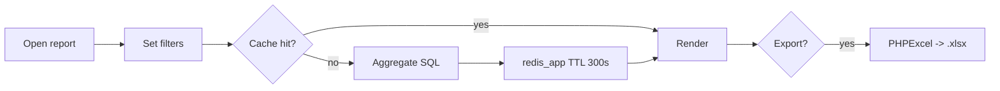

# `report` module

The single largest module (80+ reports). Each report is its own controller
returning HTML + Excel.

## Controllers (selected)

`AgentController`, `AnalyzeController`, `BonusController`,
`BonusAccumulationController`, plus dozens more for sales, debt, returns,
defects, audits, GPS, KPI, etc.

## Authoring a report

1. Create a controller under `protected/modules/report/controllers/`.
2. Subclass `BaseReport` (`protected/components/BaseReport.php`).
3. Define `dataProvider()`, `columns()`, and `excel()` overrides.
4. Add a sidebar entry in the report nav config.

## Key feature flow — Report run

See **Feature — Report Run & Excel Export** in the
[FigJam board](../architecture/diagrams.md).



## Excel export

Powered by `phpexcel`. Conventions for number formatting are governed by
the `params.excelFormat` config:

```php
'excelFormat' => [
    'count'  => 1, // formatted with thin space
    'volume' => 0, // raw float
    'summa'  => 2, // currency style ("$1,234.00")
],
```
