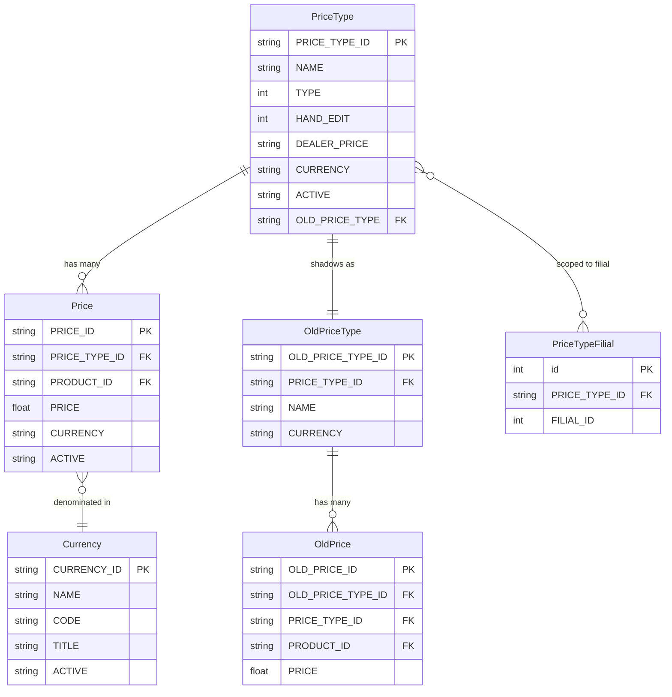
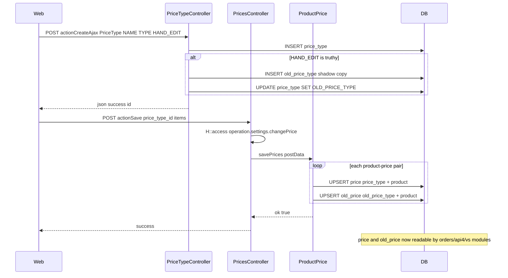
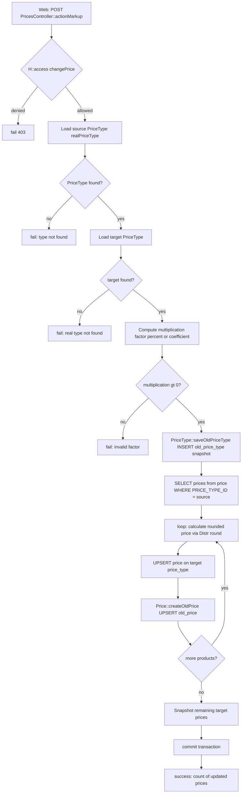
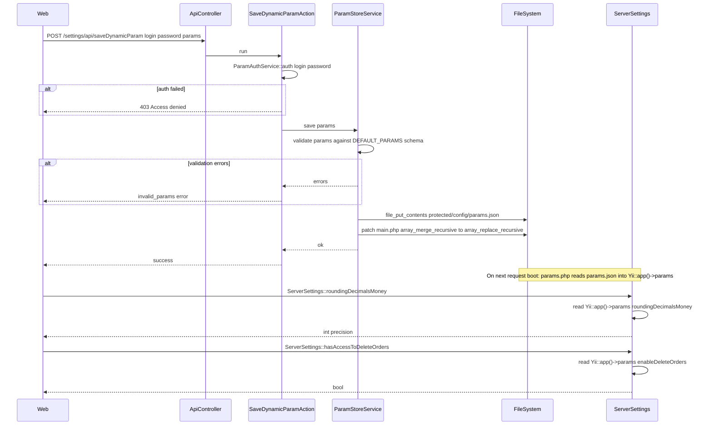

# `settings`, `access`, `staff` modules

Admin-side platform configuration.

## Key features

### `settings`

| Feature | What it does | Owner role(s) |
|---------|--------------|---------------|
| Number formats | Thousand separators, decimal places, currency symbols | 1 |
| Currencies | Supported currencies + exchange rates | 1 / Finance |
| Print templates | Invoice / waybill / order print layouts | 1 |
| Invoice templates | Per-tenant invoice formatting | 1 |
| Feature flags | Toggle experimental features per tenant | 1 |
| System log viewer | Browse runtime logs | 1 |

### `access`

| Feature | What it does | Owner role(s) |
|---------|--------------|---------------|
| Role assignment | Assign users to roles | 1 / 2 |
| Permission grid | Edit per-role permissions on operations | 1 |
| Filial visibility | Restrict users to a subset of filials | 1 / 2 |
| Cache bump | Force re-load of authitem hierarchy | 1 |

The role hierarchy itself lives in `protected/config/auth.php`.

### `staff`

| Feature | What it does | Owner role(s) |
|---------|--------------|---------------|
| User CRUD | Create / edit / deactivate internal employees | 1 / 2 |
| Role assignment | Assign internal staff to roles like manager, supervisor, expeditor | 1 / 2 |
| View user history | Audit trail per user | 1 |

`CreateController`, `EditController`, `DeleteController`,
`ListController`, `ViewController`.

## Workflows

> Note: `access` and `staff` sub-modules share the same sidebar page but are out of scope here (Phase 2). This section covers the `settings` module only.

> **Phase 1 scope:** This Workflows section documents the price-, param-, and settings-config flows. The settings module also owns ~50 other controllers (products, brands, categories, units, regions, currencies, integrations, etc.) — those are deferred to Phase 2 and not listed in the entry points below.

### Entry points

| Trigger | Controller / Action / Job | Notes |
|---|---|---|
| Web (admin) | `PriceTypeController::actionIndex` | List / create / update price types; guarded by `operation.settings.priceType` |
| Web (admin) | `PriceTypeController::actionCreateAjax` | Create a new `PriceType` record; also bootstraps an `OldPriceType` shadow when `HAND_EDIT=1` |
| Web (admin) | `PriceTypeController::actionUpdateAjax` | Update an existing `PriceType`; filial-only guard via `FilialComponent::isOnlyFilial()` |
| Web (admin) | `PricesController::actionIndex` | Render per-product price grid for a given price type |
| Web (admin) | `PricesController::actionSave` | Save a single product-price batch; calls `ProductPrice::savePrices`; guarded by `operation.settings.changePrice` |
| Web (admin) | `PricesController::actionMultiSave` | Bulk-save prices for all dealer price types assigned to the current filial |
| Web (admin) | `PricesController::actionSaveWithout` | Manual per-item price override on a non-HAND\_EDIT price type; writes `price` + `old_price` rows |
| Web (admin) | `PricesController::actionMarkup` | Compute and apply a percentage or coefficient markup across a category; guarded by `operation.settings.changePrice` |
| Web (admin) | `PricesController::actionImportExcel` | Upload an Excel file to bulk-import prices (`Price::ImportExcel`) |
| Web (admin) | `CurrencyController::actionIndex` | List / create / update currency records |
| Web (admin) | `CurrencyController::actionUpdateAjax` | Update a `Currency` record in-place |
| Web (admin) | `ParamsController::actionIndex` | Render the dynamic params configuration UI |
| API (authenticated) | `ApiController` → `SaveDynamicParamAction` | POST: validate and persist dynamic params to `protected/config/params.json`; also patches `main.php` `array_merge_recursive` → `array_replace_recursive` |
| API (authenticated) | `ApiController` → `GetDynamicParamAction` | POST: return current dynamic params + default schema |
| API (authenticated) | `ApiController` → `GetSubstatusesAction` | POST: return current order sub-status configuration |
| Web — save substatus | `ApiController` → `SaveDynamicParamAction` (substatus branch) | Sub-status saving handled by a branch inside `SaveDynamicParamAction::run()` (lines 27–43) — no separate action class |
| Web (admin) | `SettingsController::actionSaveSettings` | Persist per-user datatable column/filter preferences to `tableControl` |
| Web (admin) | `SettingsController::actionSaveHeaderOrders` | Persist per-user datatable column order to `tableControl` |
| Web (admin) | `SettingsController::actionTruncateCache` | Truncate the `cache` table and redirect |

### Domain entities

### Workflow 1.1 — Price type and per-product price setup

An admin defines a price type (e.g., "Retail", "Dealer"), then sets the selling price for each product under that type. The saved prices are immediately visible to order creation and the mobile agent stock view.

### Workflow 1.2 — Bulk markup recalculation

An admin applies a percentage or coefficient markup to a source price type, writing computed prices into a target price type. All affected products get both a `price` row and an `old_price` snapshot for historical diffing.

### Workflow 1.3 — Dynamic params configuration

An admin (or an inter-server automation) writes a validated JSON bag of tenant-wide feature flags and numeric settings to `params.json`. The file is merged into `Yii::app()->params` at boot time and consumed everywhere via `ServerSettings` helper methods.

### Cross-module touchpoints

- Reads: `settings.PriceType` — consumed by `orders.CreateOrderController`, `orders.ImportOrderController`, `vs.CreateOrderController` (order line pricing)
- Reads: `settings.Price` — consumed by `api4.CreateVsReturnAction`, `api4.CreateReplaceAction`, `api4.CreateDefectAction`, `PriceService::getPrices` (mobile agent stock price lookup)
- Reads: `settings.OldPrice` — consumed by `vs.CreateOrderController` (historical price diff), `clients.FinansController` (debt calculation at delivery)
- Reads: `settings.PriceType` + `settings.OldPriceType` — consumed by `orders.RecoveryOrderController` (order recovery pricing)
- Reads: `settings.Currency` — consumed by `PricesController::actionConfig` (format block), `PriceTypeController::actionCreateAjax` (currency assignment)
- Reads: `settings.PriceTypeFilial` — consumed by `PricesController::actionMultiSave` (filter price types to current filial's dealer types)
- Writes: `Yii::app()->params` (via `params.json`) — consumed by `models.Order` (`debtNewOrder` flag), `models.ServerSettings` (`roundingDecimalsMoney`, `visitDistance`, `enableDeleteOrders`, `hasNotAccessToEditPurchase`, etc.), `components.Formatter` (money/qty rounding throughout the app)
- Writes: `upload/status_config.txt` — consumed by `ServerSettings::substatuses()` (order sub-status labels on order views)
- Writes: `tableControl` — consumed by `SettingsController::actionSaveSettings` / `actionSaveHeaderOrders` (per-user datatable preferences, read back by all datatable pages)

### Gotchas

- `PricesController::actionSaveWithout` only operates on price types where `HAND_EDIT = 0`; if the price type is already in manual-edit mode the method silently no-ops without an error response.
- `PricesController::actionMultiSave` filters to filial-scoped dealer price types via a raw SQL join on `price_type_filial`; if `FilialComponent::isOnlyFilial()` returns false (super-admin context) the filter is skipped and all price types are processed.
- `ParamStoreService::save` also patches `protected/config/main.php` in place (replacing `array_merge_recursive` with `array_replace_recursive`) to ensure dynamic params take precedence over static config. This is a filesystem mutation on the app config and requires write permission on `main.php` at runtime.
- `SaveDynamicParamAction` uses a bespoke `ParamAuthService::auth` credential check on top of the standard Yii session auth; a missing or wrong credential returns 403 even for a logged-in admin.
- Sub-statuses are stored as a plain text JSON file at `upload/status_config.txt` (outside `protected/`). After a save, `ServerSettings::$_substatuses` is cleared via PHP `ReflectionClass` because the static cache is not reset by the normal request lifecycle.
- The `OldPrice` / `OldPriceType` shadow tables exist for price-history diffing in orders. Every bulk markup run calls `PriceType::saveOldPriceType()` first; skipping or partially-completing a markup transaction can leave the shadow in an inconsistent state if the transaction rolls back mid-loop.
- `PriceType` rows with `DEALER_PRICE = 1` are the only ones pushed to the mobile app via `api4`; non-dealer price types are invisible to field agents.
