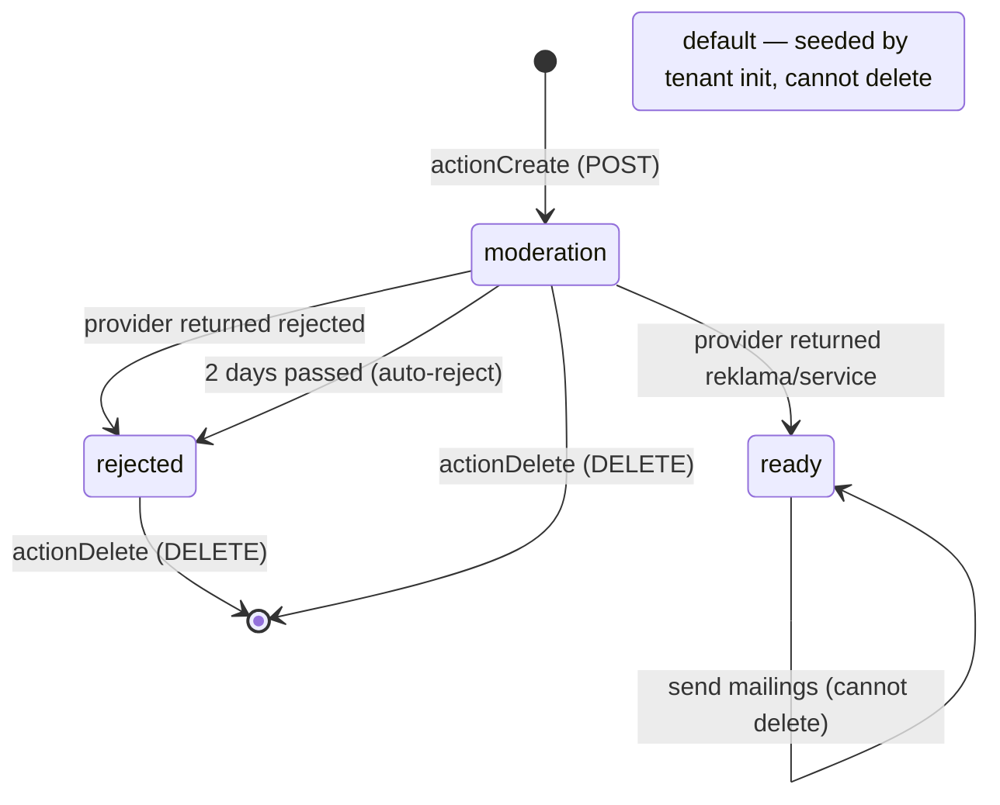
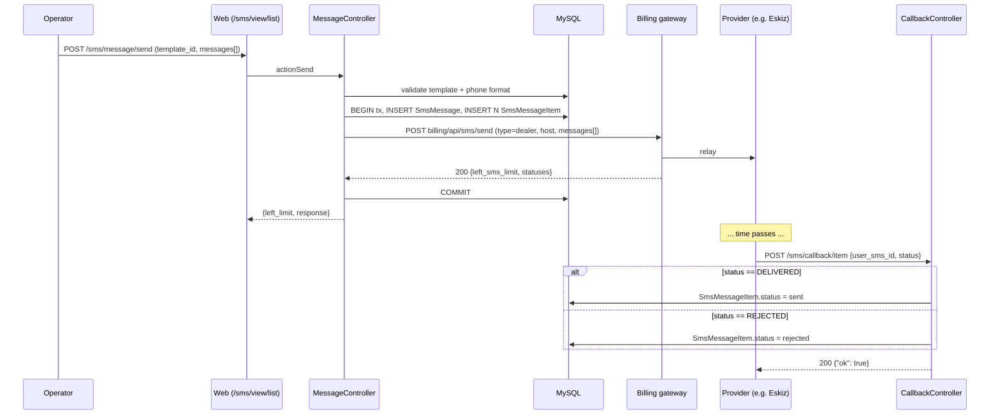
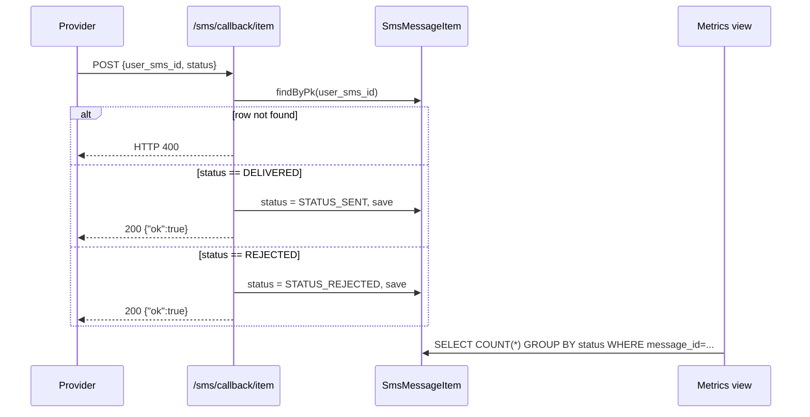
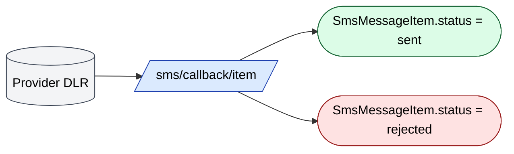

# `sms` module

Outbound SMS via the SalesDoctor central billing-domain gateway
(`Distr::billingDomain() . "/api/sms/..."`). Templates have a
moderation life-cycle, mailings are tracked per-recipient, and the
gateway calls us back with the delivery receipt (DLR). 5 controllers,
15 routes.

The tenant **does not** talk to Eskiz / Playmobile directly. Every
send / template-create / package-buy / template-check call is
proxied through the SalesDoctor billing domain, which in turn talks
to the upstream provider (in production typically Eskiz.uz — see
note in `MessageController` line 257). This keeps provider keys out
of tenant DBs and lets billing meter the messages.

## Key features

| Feature | What it does | Owner role(s) |
|---------|--------------|---------------|
| **Templates with moderation** | Operator creates a template; it is auto-submitted to the provider and starts as `moderation`; daily cron flips to `ready` / `rejected` based on provider response | 1 (`operation.sms.template`) |
| **Three template types** | `debt`, `payment`, `notification` — each requires a different minimum set of placeholder variables | 1 |
| **Placeholder substitution** | 9 variables: `{today_date}`, `{company_name}`, `{debt}`, `{payment}`, `{balance}`, `{client_name}`, `{currency}`, `{consignation_date}`, `{new_line}` | 1 |
| **Ad-hoc mailing** | "Новая рассылка" — pick a template + recipient list, the server validates phones (`/^998\d{9}$/`) and dispatches | 1 (`operation.sms.list`) |
| **Per-recipient tracking** | One `SmsMessage` header + N `SmsMessageItem` rows; status moves `waiting` → `sent` / `rejected` per row | system |
| **Delivery callback (DLR)** | `/sms/callback/item` accepts `{user_sms_id, status}` from the gateway and flips each `SmsMessageItem` | gateway |
| **Polling fallback** | `/sms/template/checking` (PATCH) and `/sms/message/checking` re-poll the gateway for any rows still `waiting`. Templates older than 2 days are auto-rejected | cron |
| **Package purchase** | Buy a bulk SMS package from billing without leaving the admin | 1 (`operation.sms.package.buying`) |
| **Balance & limit** | `/sms/message/balance` shows remaining SMS limit + tenant balance | 1 |
| **Russian char counting** | `SmsTemplate::countSms` counts 70 chars/segment for Cyrillic and 160 for ASCII | system |

## Folder

```
protected/modules/sms/
├── README.md
├── SmsModule.php
├── controllers/
│   ├── CallbackController.php   ← /sms/callback/item — gateway DLR
│   ├── MessageController.php    ← list / one / send / balance / checking
│   ├── PackageController.php    ← buying
│   ├── TemplateController.php   ← list / create / checking / delete
│   └── ViewController.php       ← four Vue/React page renderers
├── models/
│   ├── SmsMessage.php           ← header row (template_id, sms_count, client_count)
│   ├── SmsMessageItem.php       ← per-recipient row (phone, text, status)
│   └── SmsTemplate.php          ← template + moderation status + 9 placeholders
└── views/
    └── view/
        ├── pages/
        │   ├── list/index.php
        │   ├── list-detail/index.php
        │   ├── templates/index.php
        │   └── buying-package/index.php
        ├── components/   (Alert, Navigation)
        └── composable/   (useUserSmsInfo, useMessageTemplate, useCatalog, useSmsMailing)
```

## Key entities

| Entity | Model | Table | Notes |
|--------|-------|-------|-------|
| Mailing header | `SmsMessage` | `{{sms_message}}` | `{id, template_id, sms_count, client_count, status, created_at, created_by}`; statuses: `draft`, `waiting`, `sent` |
| Mailing item | `SmsMessageItem` | `{{sms_message_item}}` | `{id, message_id, client_id, phone, text, status}`; statuses: `waiting`, `sent`, `rejected` |
| Template | `SmsTemplate` | `{{sms_template}}` | `{id, title, type, template, status, template_id (provider id), created_at, created_by}`; statuses: `default`, `moderation`, `ready`, `rejected` |
| Pending queue | `SmsPending` | `d0_sms_pending` (13 cols) | Legacy outbound queue from the older flow — *[TBD — investigate `protected/models/SmsPending.php` callers]* |

`SmsTemplate` and `SmsMessage` both extend `BaseFilial`, so they are
per-tenant (`DILER_ID`-scoped).

## Controllers

| Controller | Purpose | Actions |
|-----------|---------|---------|
| `MessageController` | Mailings API (sd-front consumes JSON) | `list` (GET), `one` (GET), `send` (POST), `balance` (GET), `checking` (GET) |
| `TemplateController` | Templates API | `list` (GET), `create` (POST), `delete` (DELETE), `checking` (PATCH) |
| `PackageController` | Buy SMS pack from billing | `buying` (POST) |
| `ViewController` | Server-renders 4 sd-front pages | `list`, `listDetail`, `templates`, `buyingPackage` |
| `CallbackController` | Gateway DLR endpoint | `item` (POST JSON) |

## Template life-cycle



Source: `TemplateController::actionCreate` (line 39) for the
moderation start; `actionChecking` (line 124) for the cron-polled
state changes including the 2-day auto-reject (line 173).

## Send flow — ad-hoc mailing



Source: `MessageController::actionSend` (line 154);
`CallbackController::actionItem` (line 5).

## SMS delivery callback (DLR) — focused view

The provider (Eskiz / Playmobile, proxied through
`Distr::billingDomain()`) POSTs a delivery receipt to
`/sms/callback/item`. `CallbackController::actionItem`
(`protected/modules/sms/controllers/CallbackController.php:5`) does a
single PK lookup on `SmsMessageItem` by `user_sms_id` and flips its
`status` enum based on the provider's `DELIVERED` / `REJECTED`
payload. The header `SmsMessage` row is unchanged — aggregated
status is derived at read time. There is no signature verification
(TBD).



Class legend for this section:



## Placeholder variables

Returned by `SmsTemplate::getVariableList` (line 85):

| Token | Value at send time |
|-------|--------------------|
| `{today_date}` | current date |
| `{company_name}` | tenant company name from `Diler` |
| `{debt}` | client open debt |
| `{payment}` | last payment amount |
| `{balance}` | tenant SMS-pack balance |
| `{client_name}` | recipient client name |
| `{currency}` | `formalCurrency` param (e.g. сум, UZS) |
| `{consignation_date}` | due date from agreement |
| `{new_line}` | line break for multi-line templates |

`SmsTemplate::requiredMinVariables` enforces these per type:

| Type | Required tokens |
|------|-----------------|
| `debt` | `{today_date}`, `{client_name}`, `{debt}`, `{currency}` |
| `payment` | `{today_date}`, `{payment}`, `{company_name}`, `{currency}` |
| `notification` | `{company_name}`, `{client_name}` |

## SMS-segment cost ledger

`SmsTemplate::countSms($text)` (line 128) returns the **billable
segment count** for a message:

- If `Distr::isRussian($text)` returns true → `ceil(mb_strlen / 70)`
  (UCS-2 / 70 chars per segment).
- Otherwise → `ceil(mb_strlen / 160)` (GSM-7 / 160 chars per segment).

`actionSend` sums `countSms` across all recipients into
`SmsMessage.sms_count`. This is the value billing meters against the
tenant's pack.

## Provider matrix

Code in this module does not reference any specific provider class —
all upstream calls go to `Distr::billingDomain() . "/api/sms/..."`.
The provider selection happens **inside the billing domain**, not in
the tenant DB. The comment on line 257 of `MessageController`
confirms Eskiz is the production provider; Playmobile / NPC / other
fallbacks would be configured there. To list active providers for a
deployment, query the billing domain directly — *[TBD — billing
domain code is outside this repo]*.

## API endpoints

| Route | Method | RBAC | Caller |
|-------|--------|------|--------|
| `/sms/view/list` | GET | `operation.sms.list` | sd-front renderer |
| `/sms/view/listDetail` | GET | `operation.sms.list` | sd-front renderer |
| `/sms/view/templates` | GET | `operation.sms.template` | sd-front renderer |
| `/sms/view/buyingPackage` | GET | `operation.sms.package.buying` | sd-front renderer |
| `/sms/message/list` | GET | `operation.sms.list` | grid |
| `/sms/message/one` | GET | `operation.sms.list` | detail drawer |
| `/sms/message/send` | POST | `operation.sms.list` | new mailing |
| `/sms/message/balance` | GET | `operation.sms.list` | header widget |
| `/sms/message/checking` | GET | `operation.sms.list` | cron poll |
| `/sms/template/list` | GET | `operation.sms.template` | templates page |
| `/sms/template/create` | POST | `operation.sms.template` | template editor |
| `/sms/template/checking` | PATCH | `operation.sms.template` | cron poll |
| `/sms/template/delete` | DELETE | `operation.sms.template` | row action |
| `/sms/package/buying` | POST | `operation.sms.package.buying` | buy pack |
| `/sms/callback/item` | POST | _none — public_ | gateway DLR |

Note: `/sms/callback/item` is intentionally public (called from the
gateway) and does only PK lookup + status flip. There is no signature
verification — *[TBD — add HMAC check at gateway boundary]*.

## Live page

| URL | Title | Notes |
|-----|-------|-------|
| `/sms/view/list` | Рассылки СМС | 6-column grid. Toolbar: "СМС рассылка / Шаблоны сообщений / Новая рассылка / Купить CMC пакет / Перезагрузить / Загрузить" |

## Permissions

| RBAC operation | Used by | Default roles |
|----------------|---------|--------------|
| `operation.sms.list` | mailings (list / send / balance / view) | 1, 2 |
| `operation.sms.template` | template CRUD | 1 |
| `operation.sms.package.buying` | pack purchase | 1 |

## Gotchas

- **Phone format is hard-coded UZ.** `actionSend` rejects anything
  that doesn't match `/^998\d{9}$/`. Multi-country tenants need a
  config-driven regex.
- **`status == "default"` templates cannot be deleted.** They are
  seeded by tenant init and `actionDelete` blocks the call.
- **`ready` templates cannot be deleted either.** Even if no mailings
  reference them — the explicit block is in `actionDelete` (line 216).
  Only `moderation` and `rejected` are removable.
- **2-day auto-reject.** `actionChecking` flips any `moderation`
  template older than 2 days (`+2*86400`) to `rejected`. Cron must
  run this regularly or templates pile up.
- **Re-entrant `actionSend` is unsafe.** There is no idempotency key
  in the request — a double-click can produce two billed mailings.
  Front-end debounces this; do not call `/sms/message/send` from
  scripts without your own dedupe.
- **Sandbox URL is hard-coded for "send template to Telegram".** Line
  248 of `TemplateController` posts every new template to a fixed
  Telegram bot ID for human review. Disable in tests via
  `TelegramReportComponent::check_report()`.
- **`SmsPending` is legacy.** The active flow uses
  `SmsMessage` / `SmsMessageItem`. Touch `SmsPending` only after
  confirming nothing still writes to it.

## See also

- [`finans`](./finans.md) — `{debt}` / `{payment}` placeholder values
- [`clients`](./clients.md) — `{client_name}` source
- [`dashboard`](./dashboard.md) — `BillingController::actionSms` for SMS billing reconciliation
- [`integration`](./integration.md) — Telegram-report companion channel
