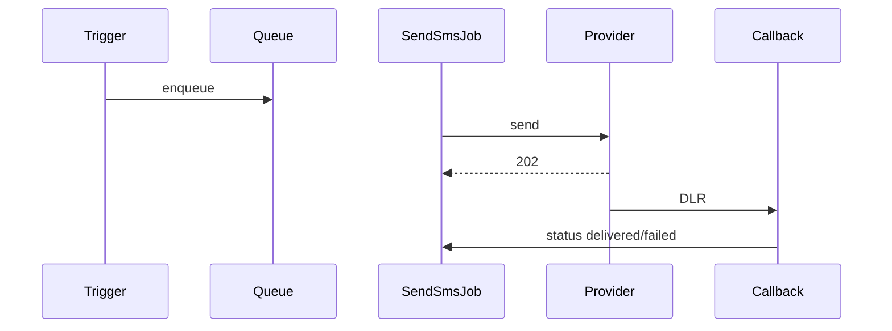

# `sms` module

Outbound SMS via configurable gateway. Templates, packages, scheduled
messages, delivery callbacks.

## Controllers

`MessageController`, `PackageController`, `TemplateController`,
`ViewController`, `CallbackController`.

## Flow

1. Template defined under Settings → SMS → Templates.
2. Trigger event (e.g. order delivered) enqueues a `SendSmsJob`.
3. Job posts to the SMS gateway HTTP API.
4. Gateway calls back `CallbackController` with delivery status.
5. Status persisted to `SmsMessage` and surfaced in reports.

## Key feature flow — SMS dispatch

See **Feature — SMS / Notification Dispatch** in the
[FigJam board](../architecture/diagrams.md).

