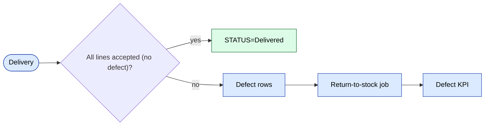

# `stock` module

Quantity-level operations on top of the warehouse layer: returns,
exchanges between stores, write-offs, purchase. Complements
[`warehouse`](./warehouse.md) (which holds the document headers).

## Key features

| Feature | What it does | Owner role(s) |
|---------|--------------|---------------|
| Add return | Record a return-to-stock from a defect / reject | 1 / 9 / warehouse |
| Buy / purchase | Inbound purchase from a supplier | 1 / 9 |
| Exchange between stores | Move stock between retail stores | 1 / 9 |
| Excretion / write-off | Permanent removal (damage, theft) | 1 |
| Financial report | Stock value, ageing, dead stock | 1 / 9 |
| Store report | Per-store stock posture | 1 / 9 |
| Reservation atomic op | `Stock::reserveForOrder()` runs in a transaction | system |

## Folder

```
protected/modules/stock/
├── controllers/
│   ├── AddReturnController.php
│   ├── BuyController.php
│   ├── ExchangeStoresController.php
│   ├── ExcretionController.php
│   ├── FinancialReportController.php
│   └── …
└── views/
```

## Stock services

The shared `StockService` (in `protected/components/`) is the **single
point** that mutates `stock` rows. Avoid hand-rolled SQL — concurrency
bugs lurk there.

## Reservations

When an order moves to `Reserved`, `Stock::reserveForOrder()`
decrements `available` count and increments `reserved` count
**atomically** in one transaction.

## Key feature flow — Defect & Return

See **Feature · Online order + Defect/Return** in
[FigJam · sd-main · Feature Flows](https://www.figma.com/board/MyvyaeEluqvHofH4E2qIoU).



## Permissions

| Action | Roles |
|--------|-------|
| Return / write-off | 1 / 9 |
| Purchase | 1 / 9 |
| Exchange between stores | 1 / 9 |
